# KMY MMD-100 Schaltungsanalyse- und Fehlersuchgerät — Benutzerhandbuch

KMY MMD-100 ermöglicht die Untersuchung stromloser elektronischer Platinen durch Strom-Spannungs-Kennlinien und den Vergleich mit Referenzmessungen. Das Zweikanal-Niederfrequenz-Oszilloskop und die Spannungsmessfunktion vereinen Signaluntersuchung und Spannungsmessung in einem Gerät.

Dieses Handbuch beschreibt die Installation unter Windows und Android, Messeinstellungen, Platinenaufzeichnung und Platinentest, Verbindungsoptionen sowie die Fehlerbehebung.

## Teil A — Übersicht

### 1. Einsatzbereich und Funktionen

KMY MMD-100 untersucht das elektrische Verhalten von Bauteilen und unterstützt die Suche nach auffälligen Prüfpunkten, ohne die Platine mit Betriebsspannung zu versorgen. Kennlinientest, Referenzvergleich und Spannungsmessung erfolgen in getrennten Betriebsarten.

* **Kennlinientest (V-I-Analyse):** Ein schwaches Prüfsignal erzeugt eine Strom-Spannungs-Kennlinie zur Bewertung von Widerständen, Kondensatoren, Spulen, Dioden und Z-Dioden.
* **Platinenaufzeichnung und Platinentest:** Messwerte baugleicher Platinen werden punktweise mit gespeicherten Referenzen einer funktionsfähigen Platine verglichen. Dies unterstützt Wartung, Reparatur und Produktionskontrollen.
* **Oszilloskop und Multimeter:** Signale und Spannungen versorgter Schaltungen lassen sich innerhalb der Eingangsgrenzen untersuchen. Der Kennlinientest setzt dagegen eine stromlose Platine voraus.

### 2. Gerät und Anschlüsse

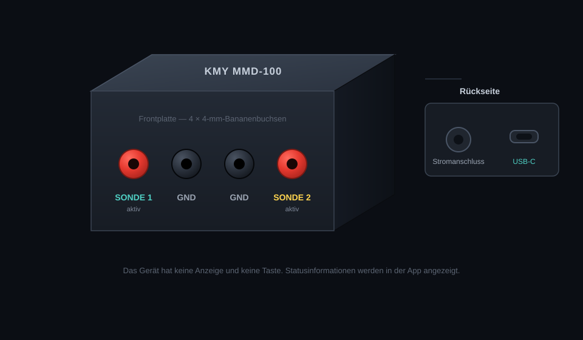

Die Frontseite enthält vier 4-mm-Bananenbuchsen. Die äußeren Buchsen sind die aktiven Anschlüsse **Sonde 1** und **Sonde 2**, die inneren Buchsen sind **Masse (GND)**. Verbinden Sie einen Bauteilanschluss mit einer aktiven Sonde und den anderen mit der benachbarten GND-Buchse.

Der rechte **USB-C**-Anschluss auf der Rückseite dient der Rechnerverbindung, Datenübertragung und Stromversorgung. Der linke **externe Stromanschluss** ist für eine separate Versorgung vorgesehen.

Das Gehäuse besitzt keine Taster oder LEDs. Versorgung, Verbindungsstatus und Betriebsart werden in der Computer- oder Mobilanwendung angezeigt.

### 3. Systemanforderungen und Vorbereitung

Für den Computerbetrieb sind ein USB-Kabel und Windows 10 oder Windows 11 in der 64-Bit-Version erforderlich. Für den Mobilbetrieb benötigen Sie Android 7.0 oder höher und ein Smartphone oder Tablet mit 64-Bit-ARM-Prozessor. Die Windows-Installation erfordert keine Administratorrechte.

> **Trennen Sie vor dem Kennlinientest die Versorgung der Platine und entladen Sie deren Kondensatoren.** In dieser Betriebsart legt das Gerät ein eigenes Prüfsignal an. Eine versorgte Schaltung kann die Messung verfälschen und Platine oder Gerät dauerhaft beschädigen.

## Teil B — Installation und Erstverbindung

### 4. Software installieren

#### Installation unter Windows

1. Öffnen Sie die [aktuelle Versionsseite](https://github.com/kmyelectronicseu-png/kmy-mmd1/releases/latest).
2. Laden Sie **KMY-MMD-100-Kurulum.exe** herunter und führen Sie die Datei aus.
3. Wählen Sie die Installationssprache. Sie gilt nur für den Installationsassistenten; die Anwendungssprache ändern Sie unter **Einstellungen**.
4. Schließen Sie die Installation ab. Die Anwendung wird unter `%LocalAppData%\Programs\KMY MMD-100` installiert.

Die übrigen Dateien auf der Versionsseite verwendet die automatische Aktualisierung der Anwendung; Sie müssen sie nicht herunterladen. Beim Deinstallieren bleiben Platinenprojekte und exportierte Berichte unter **Dokumente** erhalten; Einstellungen wie die Sprache werden zurückgesetzt.

#### Installation unter Android

1. Laden Sie **KMY-MMD-100-Mobil.apk** von derselben Versionsseite herunter und öffnen Sie die Datei.
2. Aktivieren Sie die Installation aus dieser Quelle, wenn Android die Berechtigung anfordert, und schließen Sie die Installation ab.
3. Verwenden Sie Android 7.0 oder höher mit einem 64-Bit-ARM-Prozessor.

Die mobile Anwendung verbindet sich ausschließlich über Wi-Fi. Mess-, Analyse- und Testfunktionen entsprechen der Desktop-Version. Firmware-Updates erfordern einen Computer und eine USB-Verbindung; sie sind vom Smartphone aus nicht möglich.

### 5. Zum ersten Mal verbinden

Verbinden Sie das USB-Kabel und öffnen Sie **KMY MMD-100**. Wählen Sie das Gerät in der Liste am oberen Fensterrand und klicken Sie auf **Verbinden**.

Die Startvorbereitung dauert etwa **13-15 Sekunden**. Testausgang und Betriebsartwahl sind währenddessen gesperrt. Eine grüne Verbindungsanzeige signalisiert die Betriebsbereitschaft.

Schlägt die Verbindung direkt nach dem Einstecken fehl, warten Sie einige Sekunden und versuchen Sie es erneut. Besteht das Problem weiter, schalten Sie das Gerät aus und ein und wenden Sie sich an den Support von KMY Electronics.

### 6. Erste Messung

Verwenden Sie für die erste Messung einen Widerstand mit bekanntem Wert **zwischen 100 Ω und 10 kΩ**.

1. Verbinden Sie einen Anschluss mit **Sonde 1** und den anderen mit der benachbarten **GND**-Buchse.
2. Wählen Sie **Spannung: Niedrig** und **Strombereich: Mittel**.
3. Klicken Sie auf **Ausgang: Aus**, um **Ausgang: An** zu aktivieren.
4. Prüfen Sie die geneigte Gerade und den berechneten Widerstand in der Ergebniskarte unter dem Diagramm.
5. Klicken Sie erneut auf **Ausgang** oder entfernen Sie den Widerstand, um die Messung zu beenden.

Weitere Kennlinien werden in der Galerie der Bauteilsignaturen beschrieben.

## Teil C — Kennlinientest und V-I-Analyse

### 7. Wie der Kennlinientest funktioniert

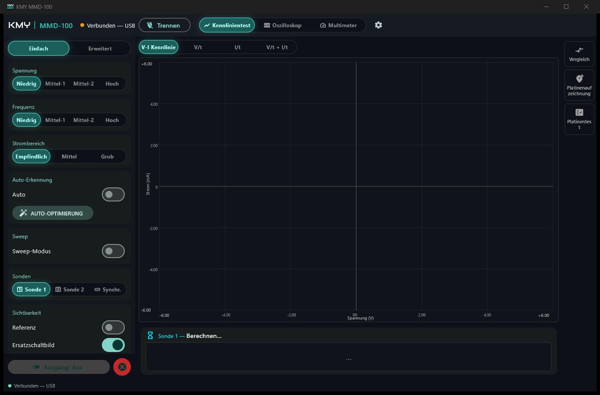

Links befinden sich die Messeinstellungen, in der Mitte das Diagramm und rechts **Vergleich**, Platinenaufzeichnung und Platinentest.

Beim Sinustest legt das Gerät eine Wechselspannung an und misst gleichzeitig den Strom. Die Darstellung des Stroms über der Spannung ergibt die V-I-Kennlinie. Ein Widerstand erzeugt eine geneigte Gerade, ein Kondensator eine Ellipse und eine Diode einen ausgeprägten Übergang in den leitenden Bereich.

Die Kennlinie beschreibt das Verhalten zwischen den beiden gemessenen Anschlüssen. Die unabhängigen Sonden können einzeln oder im Modus **Synchr.** verwendet werden.

### 8. Die wichtigsten Messeinstellungen

Die Ansicht **Einfach** bietet Spannung, Frequenz und Strombereich. Für Spannung und Frequenz stehen **Niedrig, Mittel-1, Mittel-2, Hoch** zur Verfügung.

| Stufe | Spannung (Spitzenwert) | Frequenz |
| :--- | :---: | :---: |
| **Niedrig** | 2,5 V | 10 Hz |
| **Mittel-1** | 5 V | 50 Hz |
| **Mittel-2** | 10 V | 100 Hz |
| **Hoch** | 15 V | 1000 Hz |

* **Spannung:** Bestimmt den Spitzenwert des Prüfsignals. Beginnen Sie bei unbekannten Bauteilen mit der niedrigsten Stufe. Erhöhen Sie schrittweise, wenn die erforderliche Flussspannung eines Halbleiterübergangs nicht erreicht wird.
* **Frequenz:** Unterstützt die Bewertung reaktiver Bauteile. Die Steigung eines idealen Widerstands ist frequenzunabhängig. Ein 100-nF-Kondensator zeigt bei 10 Hz eine schmale Kurve und bei 1000 Hz eine ausgeprägtere Ellipse.
* **Strombereich:** Bestimmt die Empfindlichkeit der Strommessung.

| Bereich | Wofür |
| :--- | :--- |
| **Empfindlich** | Kondensatoren, hochohmige Widerstände und empfindliche Bauteile mit sehr kleinem Stromfluss. |
| **Mittel** | Sicherer Einstieg bei einem unbekannten Bauteil. |
| **Grob** | Niederohmige Widerstände, leitende Dioden und robuste Bauteile mit hohem Strom. |

Bei einer abgeschnittenen Kurve oder einer entsprechenden Warnung reduzieren Sie die Testspannung oder wählen einen gröberen Strombereich. Bauteile mit geringem Strom können im Bereich **Grob** eine waagerechte Linie erzeugen; wiederholen Sie die Messung mit **Empfindlich**. Eine waagerechte Linie allein belegt keinen Defekt.

### 9. Kurven lesen: Galerie der Bauteilsignaturen

Die Ergebniskarte zeigt die aus der Messung abgeleitete Bauteilart, den berechneten Wert und die Erkennungssicherheit. Die folgenden 12 Beispiele unterstützen die Auswertung.

**Erwartete Drift** beschreibt die erwartete Abweichung gegenüber einem Referenzmultimeter unter den aktuellen Messbedingungen, etwa **Erwartete Drift +2,19 %…+3,01 %**. Sie hängt von Strombereich und Bauteilwert ab. Außerhalb des unterstützten Bereichs, bei einem anderen Signal als Sinus/AC, stark unterschiedlichen Sondenlasten oder fehlender Betriebsbereitschaft erscheint eine Erklärung statt eines Zahlenwerts. „Unterhalb der Referenzgrenzen“ bedeutet, dass die Abweichung kleiner als die Toleranzgrenze der Referenzmessung ist.

KMY MMD-100 misst zwischen zwei Anschlüssen. Dreipolige Bauteile werden nicht eigenständig als Transistor oder MOSFET klassifiziert. Der Benutzer muss die gemessenen Anschlüsse bestimmen; das Ergebnis beschreibt nur deren elektrisches Verhalten.

#### Widerstand
Eine geneigte Gerade durch den Mittelpunkt. Mit kleinerem Widerstand steigt die Steigung, mit größerem sinkt sie. Bei einem idealen Widerstand bleibt sie frequenzunabhängig.

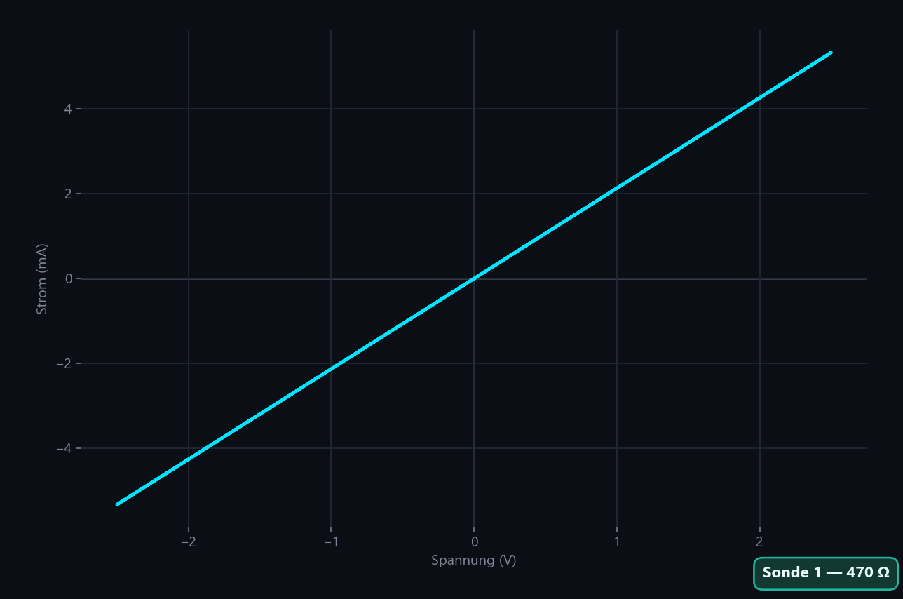

#### Kondensator
Eine Ellipse, die bei steigender Frequenz breiter und bei sinkender Frequenz schmaler wird.

#### Spule
Eine Ellipse, die bei steigender Frequenz schmaler und bei sinkender Frequenz breiter wird, im Gegensatz zum Kondensator.

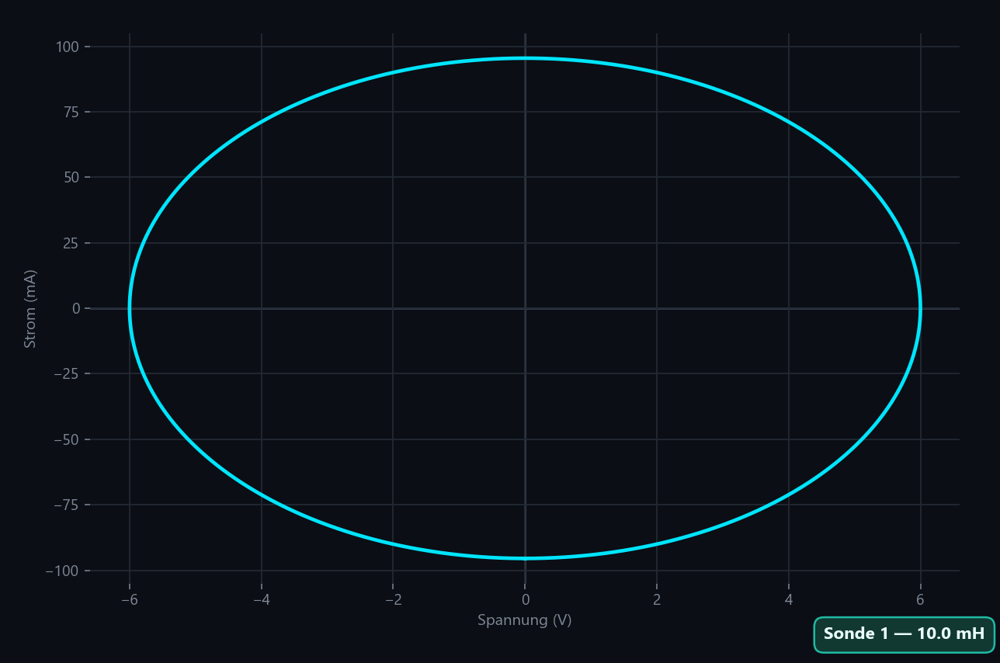

#### Kondensator und ESR
Ein Serienwiderstand neigt die Kondensatorellipse. Kapazität sowie Parallel- und Serienwiderstand werden getrennt angezeigt.

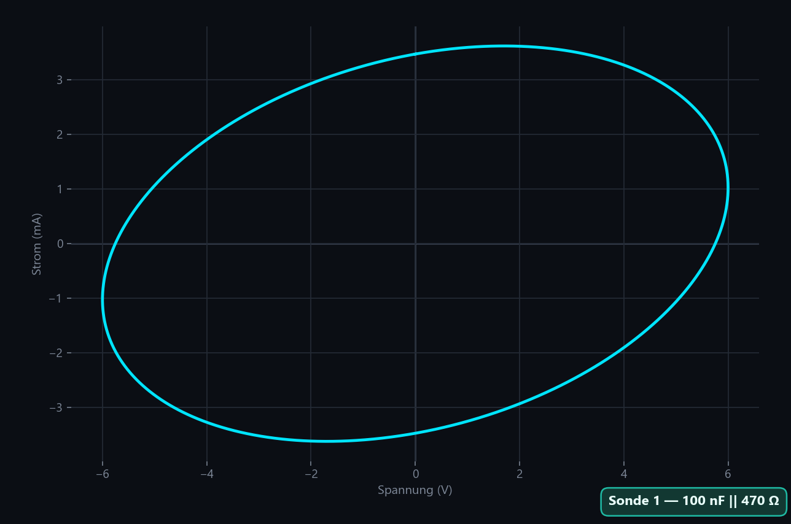

#### Diode
Eine gerade Sperrregion und ein deutlicher Übergang zur Leitung. Bei Siliziumdioden liegt die Flussspannung typischerweise bei 0,6 V - 0,7 V; bei Schottky-Dioden kann sie niedriger und bei LEDs höher sein.

#### Z-Diode
Zeigt Vorwärtsleitung und Durchbruch in Sperrrichtung. Bei maximal 15 V Testspannung lassen sich höhere Durchbruchspannungen nicht darstellen.

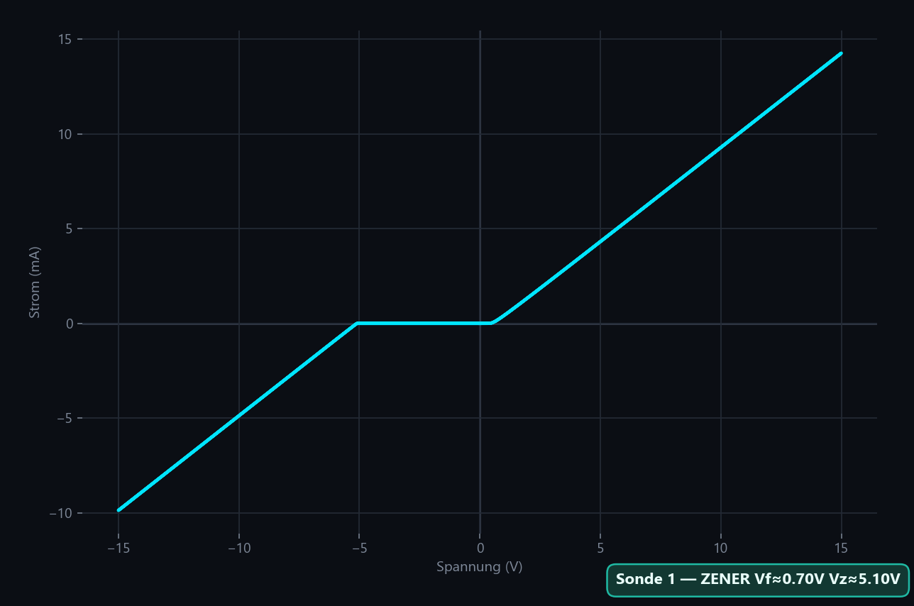

#### TVS-Diode
Eine unidirektionale TVS verhält sich ähnlich wie eine Z-Diode und kann als **ZENER** erscheinen. Eine bidirektionale TVS kann aufgrund ihres symmetrischen Durchbruchs als **|Z|** oder **Unbestimmt** angezeigt werden. Eine eigene TVS-Klasse ist nicht vorhanden.

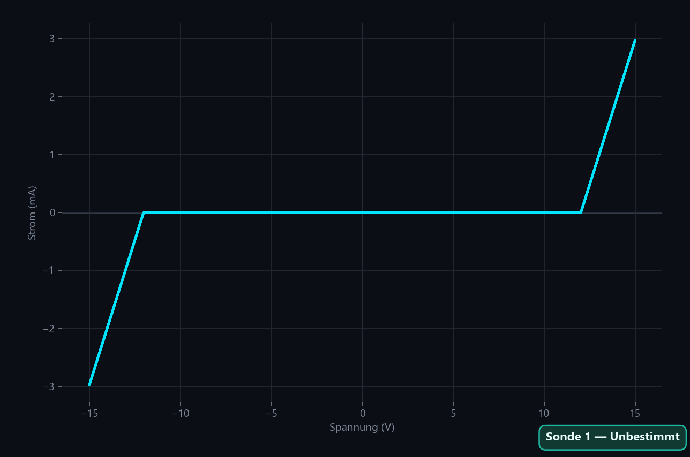

#### MOSFET Gate-Source
Die Gate-Isolation führt zu sehr geringem Strom. Wenige Pikofarad bei Kleinsignal-MOSFETs können unter der Messgrenze liegen und **OFFEN** ergeben. Wenige Nanofarad bei Leistungs-MOSFETs können eine schmale Kondensatorkurve erzeugen. Das Ergebnis „offen“ allein weist nicht auf einen Defekt hin.

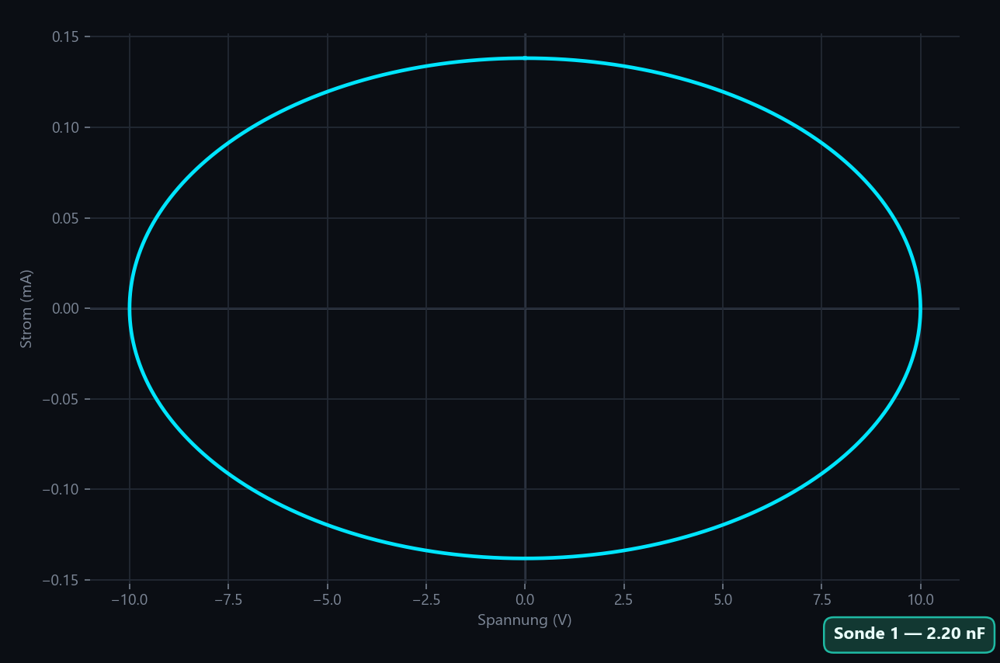

#### MOSFET Drain-Source
Bei mit Source verbundenem oder offenem Gate kann die Body-Diode sichtbar werden. Die Anzeige lautet **DIODE**; die Flussspannung kann etwas höher als bei einer Signaldiode sein.

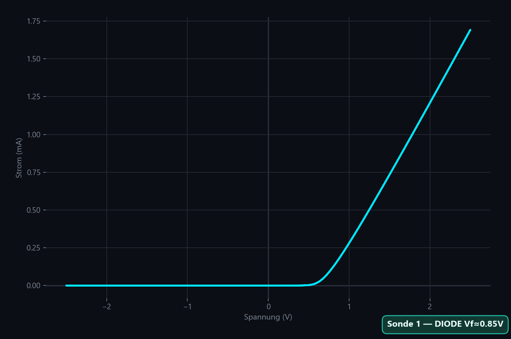

#### Transistor Basis-Emitter
Zeigt einen Diodenübergang mit Anzeige **DIODE**. Die Flussspannung liegt typischerweise bei 0,65 V - 0,70 V.

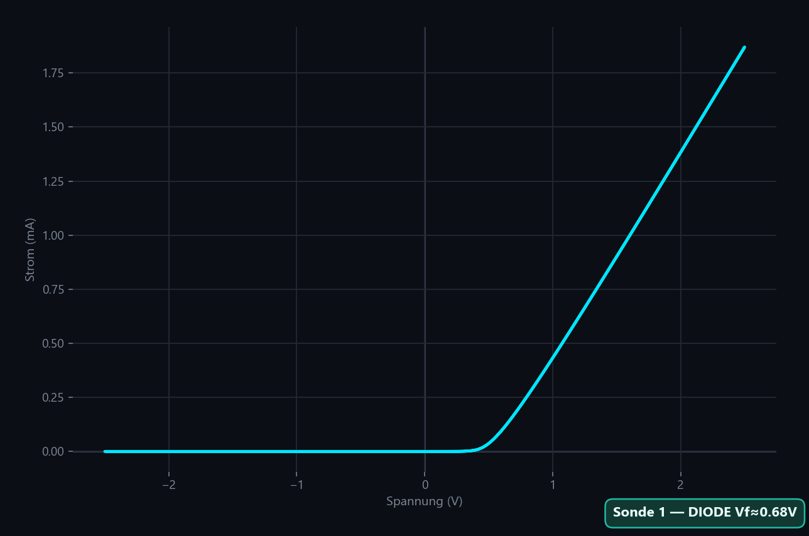

#### Transistor Basis-Kollektor
Zeigt einen Diodenübergang. Die Flussspannung kann etwas niedriger als am Basis-Emitter-Übergang liegen; die Anzeige bleibt **DIODE**.

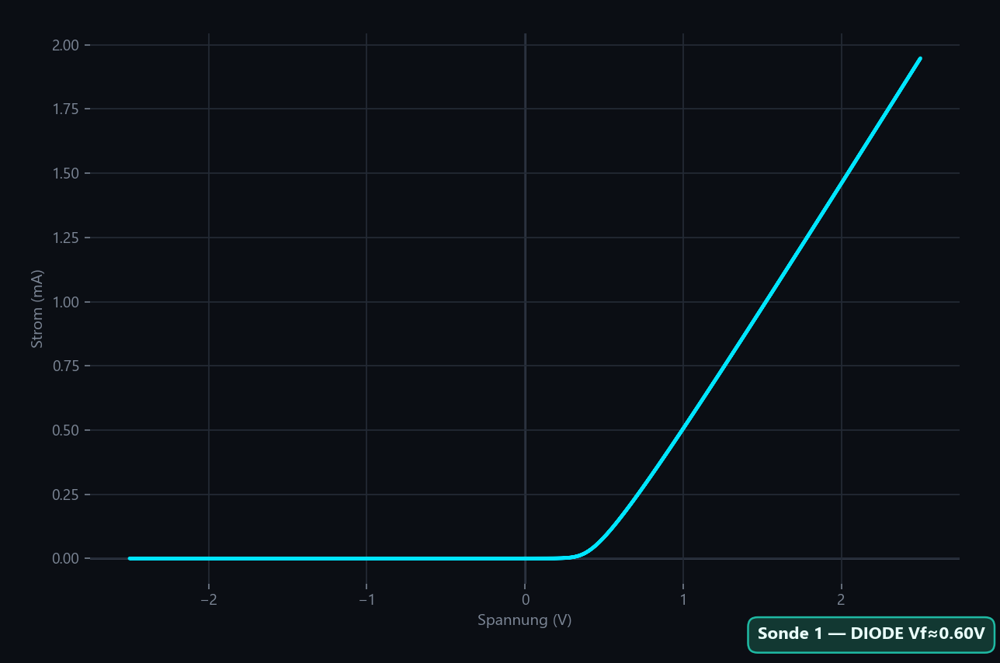

#### Transistor Kollektor-Emitter
Bei offener Basis kann **OFFEN** angezeigt werden. Ohne Basisansteuerung ist dieses Ergebnis allein kein Defektnachweis.

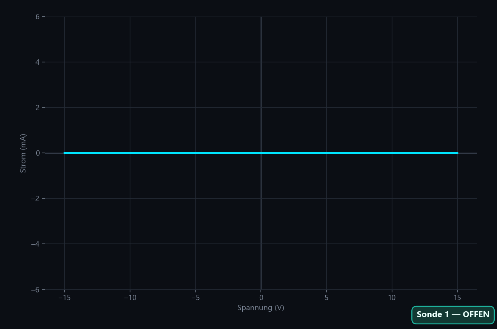

Messungen in der Schaltung enthalten den gemeinsamen Einfluss paralleler Pfade. Bei unklarem Ergebnis trennen Sie einen Bauteilanschluss von der Platine und wiederholen die Messung.

### 10. Erweiterte Messeinstellungen

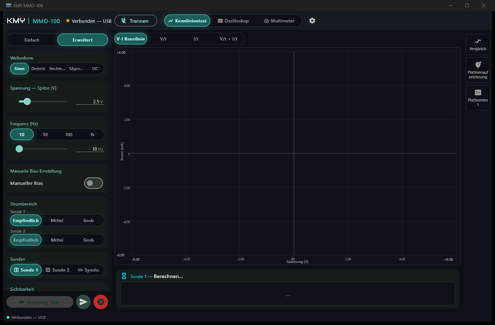

In **Erweitert** lässt sich die Spannung von 0,1 - 15 V und die Frequenz von 1 - 1000 Hz einstellen.

* **Wellenform:** Sinus, Dreieck, Rechteck, Sägezahn oder DC. Die Kennlinienanalyse verwendet Sinus; DC legt eine konstante Spannung an.
* **Manueller Bias:** Verschiebt die Signalmitte über oder unter null. Halten Sie eine Richtungstaste gedrückt und wählen Sie Schritte von 0.010 V, 0.100 V oder 1.000 V. **Zurücksetzen** setzt die Mitte auf null. Die Funktion ist standardmäßig aus und sollte nur für gezielte Tests aktiviert werden.
* **Strombereich:** Für Sonde 1 und Sonde 2 getrennt einstellbar. Verwenden Sie beim Vergleich den gleichen Bereich; unterschiedliche Bereiche beeinflussen die Überlagerung.

Änderungen werden beim Loslassen übertragen. **Übernehmen** sendet die Einstellungen sofort.

* **Auto-Erkennung:** Wählt Spannung, Frequenz und Strombereich anhand der Bauteilerkennung. Vor einer Änderung sind mindestens drei aufeinanderfolgende gleiche Ergebnisse erforderlich.
* **AUTO-OPTIMIERUNG:** Sucht einmalig geeignete Einstellungen und übernimmt sie bei Erfolg; andernfalls bleiben die bestehenden Werte erhalten.
* **Sweep-Modus:** Ändert Spannung, Frequenz oder Strombereich im gewählten Intervall; die anderen beiden bleiben konstant. Frequenzabhängige Kurven unterstützen die Bewertung reaktiven, unveränderte Kurven überwiegend ohmschen Verhaltens.

Unter **Sichtbarkeit** zeigt **Referenz** eine gespeicherte Kurve zusammen mit der Live-Messung. **Ersatzschaltbild** zeichnet die aus der Messung abgeleitete einfache Schaltung. **Einfrieren** hält die Kurve fest.

### 11. Zwei Sonden und der Synchronmodus

**Sonde 1** und **Sonde 2** legen das Prüfsignal an die gewählte einzelne Sonde. **Synchr.** versorgt beide Sonden gleichzeitig aus einer gemeinsamen Quelle.

Bei deutlich unterschiedlichen Lasten erscheint eine gelbe Warnung in der Statusleiste oder im mobilen Benachrichtigungsbereich. Ist eine Sonde offen, kann die andere Messung um etwa **1 %** abweichen. Die Warnung macht das Ergebnis nicht automatisch ungültig; sie weist auf die zu berücksichtigende Lastverteilung hin.

Für genaue Vergleiche schließen Sie die Messung im Einzelsondenmodus **Sonde 1** oder **Sonde 2** ab.

## Teil D — Vergleich und Platinentest

### 12. Vergleichsfunktionen

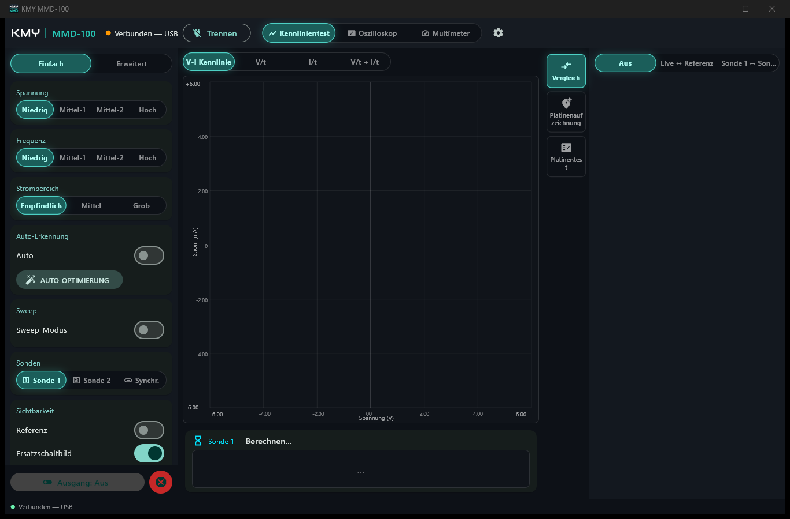

**Vergleich** bietet drei Möglichkeiten:

* **Aus:** Deaktiviert den Vergleich.
* **Live ↔ Referenz:** Vergleicht die aktuelle Kurve mit einer Referenz. **Referenz erfassen** übernimmt die aktuelle Kurve; sie kann als Datei gespeichert und wieder geladen werden.
* **Sonde 1 ↔ Sonde 2:** Vergleicht direkt ein funktionsfähiges mit einem verdächtigen Bauteil. Die gleichzeitige Messung vermindert Einflüsse zeitlicher und äußerer Veränderungen.

Die Ähnlichkeit wird mit dem gewählten Grenzwert verglichen. Oberhalb erscheint **ÜBEREINSTIMMUNG**, unterhalb **KEINE ÜBEREINSTIMMUNG**. Der Standardgrenzwert beträgt **90 %**. **Knickstellen-Empfindlichkeit** bietet Aus, Normal und Hoch zur genaueren Bewertung von Übergangsbereichen.

Ohne messbaren Strom erscheint **KEINE MESSUNG**. Prüfen Sie Kontakt und Strombereich. **Akustische Signal** meldet den Wechsel zwischen Übereinstimmung und Abweichung.

Eine Abweichung kennzeichnet einen Unterschied zur Referenz. Bewerten Sie einen möglichen Defekt zusätzlich anhand der Schaltung und weiterer Messungen.

### 13. Platine aufzeichnen und testen

Die Platinenaufzeichnung erstellt einen Referenzprüfplan für Reparatur und Produktionskontrolle baugleicher Platinen.

#### Platinenreferenz aufzeichnen

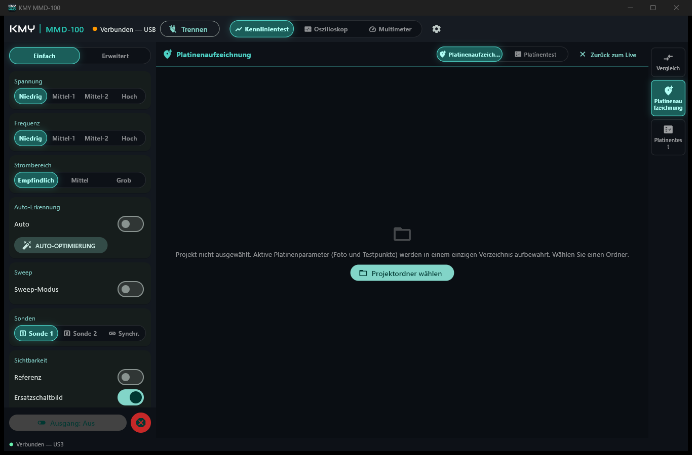

1. **Projektordner anlegen.** Foto und Prüfpunkte werden gemeinsam gespeichert. Der kopierte Ordner kann auf einem anderen Computer geöffnet werden.
2. **Platinenfoto hinzufügen.** Verwenden Sie eine scharfe, schattenfreie Aufnahme von oben.
3. **Punkte festlegen.** Setzen Sie die Sonde am Prüfpunkt an, wählen Sie die entsprechende Position im Foto und vergeben Sie beispielsweise R14, C7 oder U3-1. Klicken Sie auf **Punkt speichern**.
4. **Reihenfolge ordnen.** Ziehen Sie die Punkte in die gewünschte Prüfreihenfolge.

**Mehrstufige Signatur** erfasst jeden Punkt bei 3 oder 4 Spannungs- und Frequenzstufen. Die Aufzeichnung dauert länger und umfasst mehrere Prüfbedingungen.

#### Aufgezeichnete Platine testen

Klicken Sie auf **Test starten** und kontaktieren Sie die Punkte nacheinander. Die Messungen werden mit der Referenz verglichen und als passend oder abweichend markiert. Abweichungen erscheinen als **rote Markierungen** im Foto.

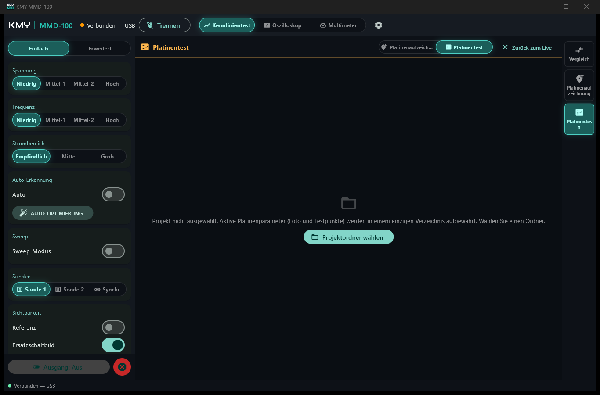

Der Test kann pausiert werden; Punkte lassen sich überspringen. **Verbleibende testen** ergänzt fehlende Messungen. **Automatischer Fortschritt** wechselt nach einer Übereinstimmung zum nächsten Punkt.

Der **Excel-Bericht** enthält drei Arbeitsblätter: Einzelmessungen, Übersichtstabelle und Übereinstimmungs-/Abweichungskarte.

## Teil E — Oszilloskop und Multimeter

### 14. Oszilloskop-Modus

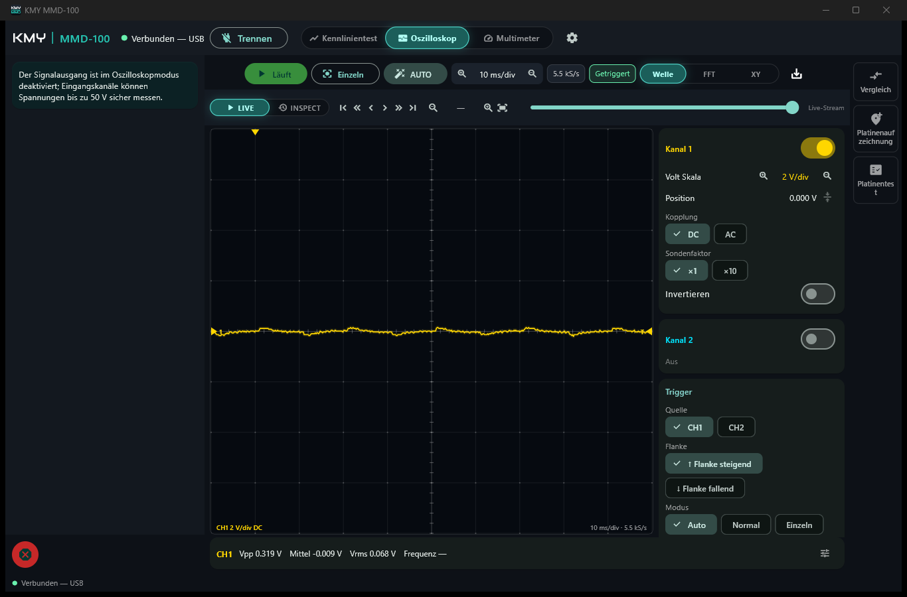

Im Oszilloskop-Modus ist der Prüfsignalgenerator aus; die Sonden messen externe Signale. Die Eingangsgrenze beträgt **50 V**. Kanal 1 ist **gelb**, Kanal 2 **cyan**. Beim Kennlinientest ist Sonde 1 cyan und Sonde 2 gelb.

Die feste Abtastrate beträgt **5,5 kS/s**, also 5500 Messwerte pro Sekunde. Die Zeitbasis ändert nur das dargestellte Zeitfenster. Verwenden Sie das Gerät als **Niederfrequenz-Oszilloskop**; oberhalb 1 kHz ist die Kurvenform nicht zuverlässig. Versorgungsschwankungen und Motortreiberausgänge innerhalb dieser Frequenzgrenzen lassen sich untersuchen.

* **AUTO (automatische Einstellung):** Passt Zeitbasis, Spannungsmaßstab und Triggerpegel an das Signal an. Ohne verwertbares Signal bleiben die Einstellungen erhalten.
* **Auto:** Aktualisiert die Anzeige auch ohne Trigger.
* **Normal:** Aktualisiert nur bei erfüllter Triggerbedingung.
* **Single:** Erfasst einmalig und hält die Anzeige fest.

Grundlinie und Triggeranzeige lassen sich mit der Maus verschieben. **INSPECT** hält den Datenstrom an und ermöglicht die Prüfung der im Hintergrund kontinuierlich aufgezeichneten **letzten 20 Sekunden**.

Die untere Leiste zeigt **Vpp**, **Mittel**, **Vrms** und **Frequenz**. Die sichtbaren Werte können aus **11 Messparametern** gewählt werden. Spannungen werden in Volt mit drei Nachkommastellen dargestellt.

### 15. Multimeter-Modus

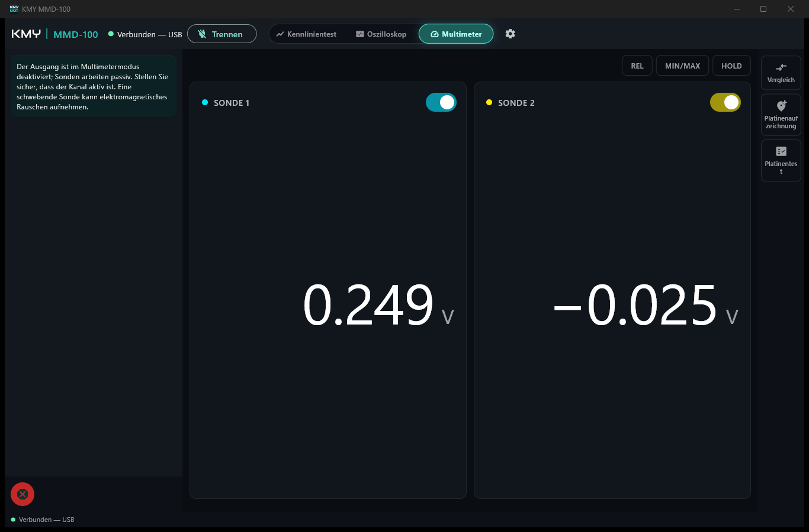

Beide Sonden messen Spannung unabhängig und gleichzeitig. KMY MMD-100 bestimmt AC/DC und Messbereich automatisch. Die Anzeige erfolgt in Volt (V) mit drei Nachkommastellen, beispielsweise **0.068 V**. Der Schalter oben rechts auf jeder Sondenkarte aktiviert oder deaktiviert den Kanal.

* **REL (Relativmessung):** Verwendet den Wert beim Aktivieren als null und zeigt folgende Abweichungen.
* **MIN/MAX:** Erfasst den niedrigsten und höchsten Messwert.
* **HOLD:** Hält den Anzeigewert fest.

Der Prüfausgang ist in dieser Betriebsart aus. Aktivieren Sie den benötigten Kanal. Eine nicht angeschlossene Sonde kann aufgenommene elektromagnetische Störungen anzeigen.

## Teil F — Einstellungen und Verbindung

### 16. Systemeinstellungen

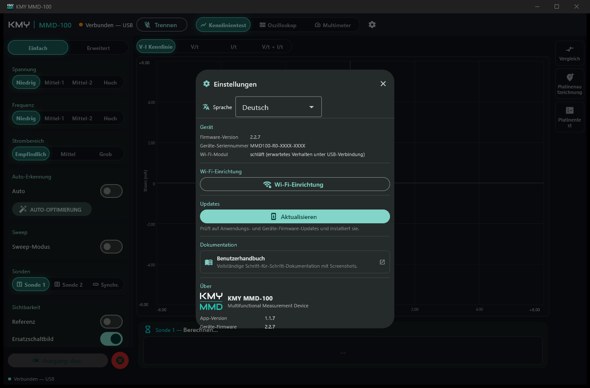

Öffnen Sie **Einstellungen** über das Zahnradsymbol in der oberen Leiste. Zur Auswahl stehen Türkisch, Englisch, Deutsch, Spanisch und Französisch.

Das Panel zeigt die Firmware-Version und Seriennummer des Geräts, die Wi-Fi-Werkzeuge sowie einen Link zu diesem Handbuch. Die Anwendungsversion finden Sie unter **Über**. **Aktualisieren** prüft Anwendungs- und Firmwareversionen. Firmware-Updates erfordern eine USB-Verbindung.

### 17. Drahtlosbetrieb und Wi-Fi-Einrichtung

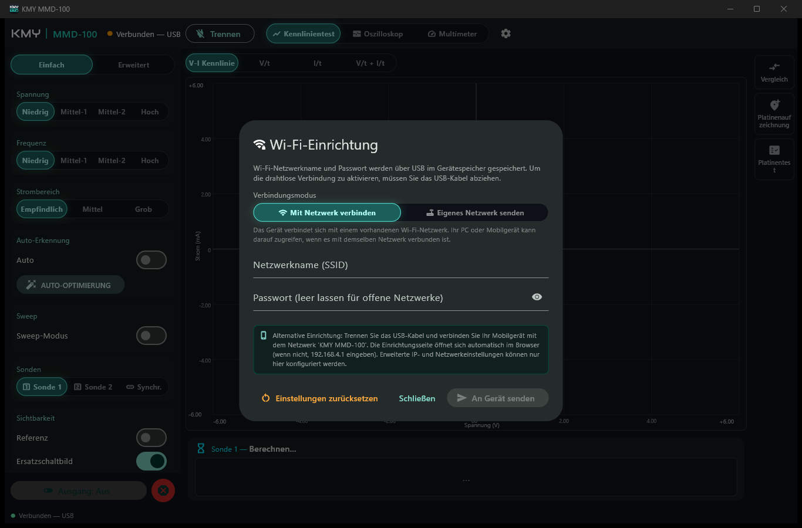

Wi-Fi bietet zwei Verbindungsarten:

1. **Stationsmodus (Station):** Das Gerät tritt einem bestehenden Netzwerk bei; Computer oder Mobilgerät verbinden sich über dasselbe Netz.
2. **Access-Point-Modus (AP):** Das Gerät stellt ein eigenes Netz für eine direkte Verbindung bereit.

#### Wi-Fi in der Anwendung einrichten

Öffnen Sie bei angeschlossenem USB **Einstellungen → Wi-Fi-Einrichtung**. Wählen Sie den Modus, geben Sie SSID und Passwort ein und übertragen Sie die Einstellungen.

#### Wi-Fi im Browser einrichten

Der standardmäßige Access Point stellt das Netz **KMY MMD-100** bereit. Verbinden Sie Smartphone oder Computer damit. Öffnet sich die Einrichtungsseite nicht automatisch, geben Sie **192.168.4.1** im Browser ein. Erweiterte Einstellungen wie eine feste IP sind nur dort verfügbar. Die Stromversorgung muss im Drahtlosbetrieb bestehen bleiben.

#### Gerät wird im Netz nicht angezeigt

Geben Sie die IP über **Manuelle IP-Adresse** ein. Manche Router verhindern, dass sich Geräte im Netz gegenseitig finden. Die Adresse steht in der Geräteliste des Routers oder der Weboberfläche des Geräts. In Android befindet sich die manuelle Eingabe unter dem Verbindungsbildschirm.

Das Gerät akzeptiert nur eine Verbindung gleichzeitig; **BESETZT** zeigt einen anderen verbundenen Client an. **Einstellungen zurücksetzen** stellt die standardmäßigen Funkparameter wieder her.

### 18. Nutzung auf Smartphone und Tablet

Die Android-Anwendung bietet die Mess-, Analyse- und Testfunktionen der Windows-Version in einer mobilen Oberfläche.

* **Statusleiste oben:** Durch Antippen oder Ziehen nach unten öffnen. Zeigt Verbindungsqualität, Warnungen und Sperrgründe. Enthält **Werkzeuge**, **Einstellungen** und **Verbinden/Trennen** und öffnet sich bei kritischen Warnungen automatisch.
* **Bedienleiste unten:** Durch Antippen oder Ziehen nach oben öffnen; bleibt auf der gewählten Höhe. Enthält Messeinstellungen, Kennlinientest, Oszilloskop, Multimeter sowie Schnellzugriffe für Spannung, Frequenz und Strombereich.

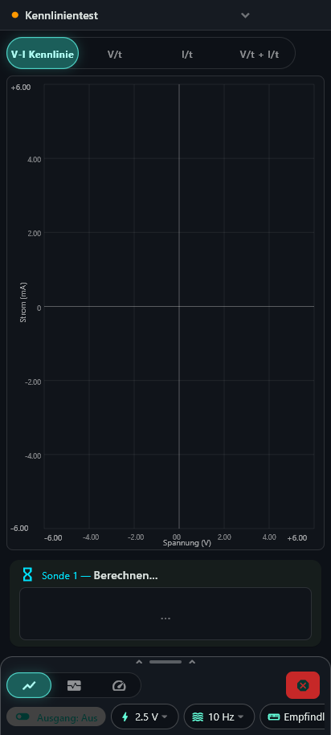

Vergleich, Platinenaufzeichnung und Platinentest befinden sich unter **Werkzeuge**, allgemeine Optionen unter **Einstellungen**. Der Verbindungsbereich enthält **Gerätesuche**, direkte Verbindung zum Gerätenetz und manuelle IP-Eingabe.

Mobile Firmware-Updates sind nicht möglich. **Aktualisieren** lädt die neue Version der Anwendung herunter und öffnet den Android-Installationsdialog.

### 19. Software-Updates

**Einstellungen → Aktualisieren** prüft Anwendungs- und Firmwareversionen für KMY MMD-100. Beim Anwendungsupdate startet die Installation; das Schließen und erneute Öffnen mit der neuen Version ist vorgesehen.

* Anwendungsupdates erfordern keine Geräteverbindung.
* Firmware-Updates benötigen einen Computer und ein angeschlossenes **USB-Kabel**. Sie sind über Wi-Fi oder die mobile Anwendung nicht möglich.
* Die Update-Prüfung benötigt Internetzugang. Fehlt dieser, informiert die Anwendung und erhält die bestehende Installation.

## Teil G — Referenzinformationen

### 20. Technische Grenzen und Parameter

| Parameter | Wert |
| :--- | :--- |
| **Testspannung** | $\pm 15\text{ V}$ Spitze (Peak) |
| **Testfrequenz** | $1\text{ Hz} - 1000\text{ Hz}$ |
| **Eingangsgrenze Oszilloskop / Voltmeter** | höchstens $50\text{ V}$ |
| **Abtastrate Oszilloskop** | $5,5\text{ kS/s}$ (hardwareseitig fest) |
| **Aufzeichnungstiefe Oszilloskop** | letzte $20\text{ Sekunden}$, lückenlos |
| **Versorgung** | über den USB-Anschluss |

**Regeln für Sicherheit und Betrieb**

* Trennen Sie vor dem Kennlinientest die Platinenversorgung und entladen Sie Kondensatoren hoher Kapazität.
* Prüfsignale werden nur im **Kennlinientest** erzeugt. In Oszilloskop- und Multimeter-Modus ist der Generator aus.
* Die rote Schaltfläche **NOT-AUS** unterbricht bei aktiver Verbindung sofort die Testausgangsspannung.
* Der Testausgang bleibt bis zum Ende der Startvorbereitung gesperrt.
* Das Gerät ist nicht für **220 V AC Netzspannung** ausgelegt. Verbinden Sie die Sonden nicht mit Steckdosen oder Hochspannungsleitungen.

### 21. Häufige Probleme und ihre Lösungen

* **Gerät nicht gelistet:** Prüfen Sie USB-Kabel und Computeranschluss. Bei Wi-Fi das gleiche Netz bestätigen und nötigenfalls die IP manuell eingeben.
* **Bedienelemente nach Verbindung gesperrt:** Warten Sie 13-15 Sekunden auf die Startvorbereitung.
* **Testausgang gesperrt:** Warten Sie die Startvorbereitung ab und schalten Sie aus und ein. Bleibt das Problem bestehen, kontaktieren Sie KMY Electronics.
* **Waagerechte Kurve:** Prüfen Sie Kontakt, Testspannung und Strombereich. Erhöhen Sie gegebenenfalls die Spannung um eine Stufe oder wählen Sie einen empfindlicheren Bereich.
* **Gelbe Warnung im Synchronmodus:** Lasten unterscheiden sich oder eine Sonde ist offen. Verwenden Sie den Einzelsondenmodus für genaue Messungen.
* **KEINE MESSUNG:** Prüfen Sie den Kontakt. Verwenden Sie bei hochohmigen Bauteilen **Empfindlich**.
* **BESETZT:** Ein anderer Client ist verbunden. Beenden Sie dessen Verbindung.
* **Messwertverschiebung:** Schalten Sie aus und ein. Bei anhaltender Abweichung oder Warnung wenden Sie sich an KMY Electronics.
* **Verzerrte Oszilloskopkurve:** Prüfen Sie die Frequenz. Bei 5,5 kS/s lassen sich Kurven über 1 kHz nicht zuverlässig untersuchen.
* **Gerät auf Mobilgerät nicht gefunden:** Prüfen Sie das gemeinsame Netz. Im AP-Modus muss das Smartphone mit **KMY MMD-100** verbunden sein.

### 22. Technischer Support und Kontakt

Für technische Fragen wenden Sie sich an KMY Electronics:

* [GitHub-Produktseite](https://github.com/kmyelectronicseu-png/kmy-mmd1)
* [kmyelectronics.eu@gmail.com](mailto:kmyelectronics.eu@gmail.com)

Nennen Sie Seriennummer, Anwendungsversion und Problembeschreibung. Die Seriennummer steht in den **Einstellungen** in der Zeile **Geräte-Seriennummer**.
