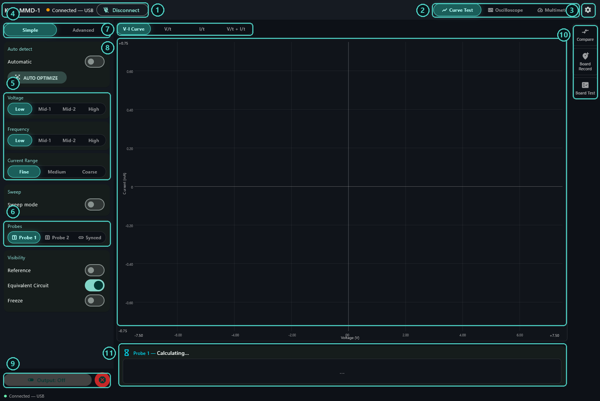
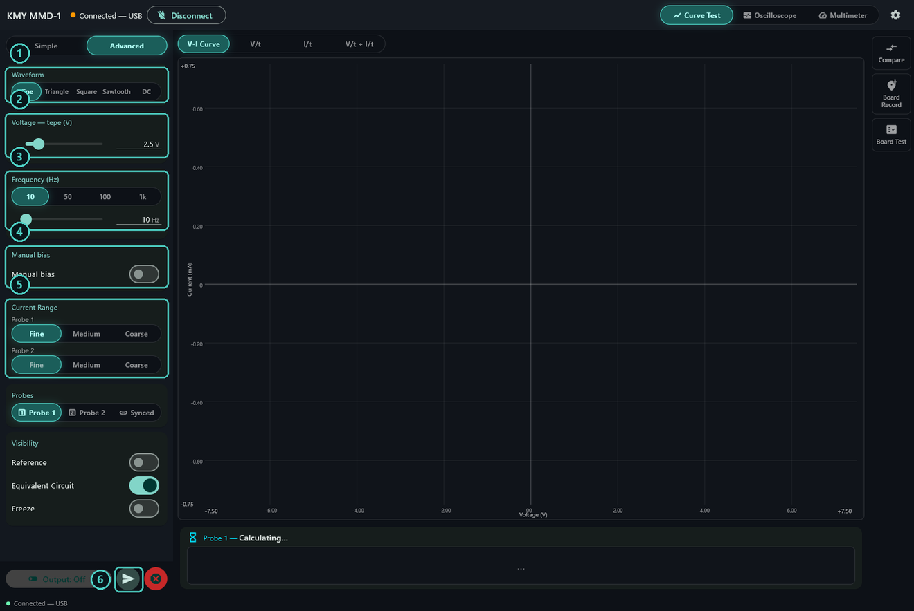
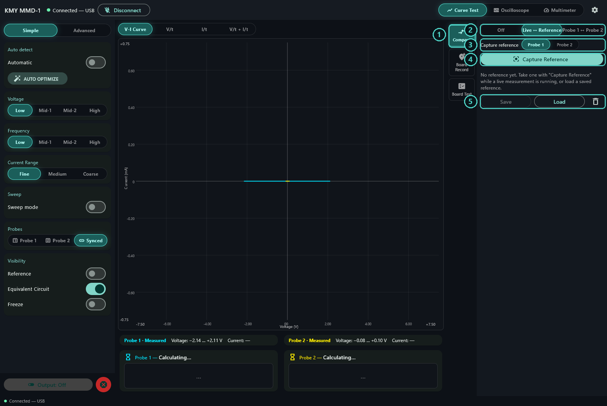
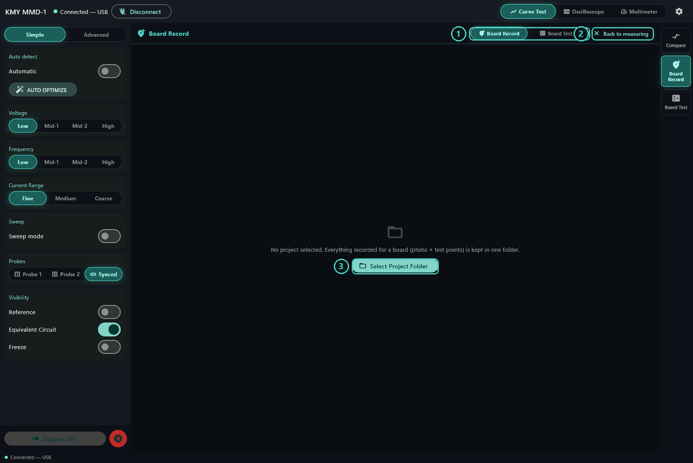
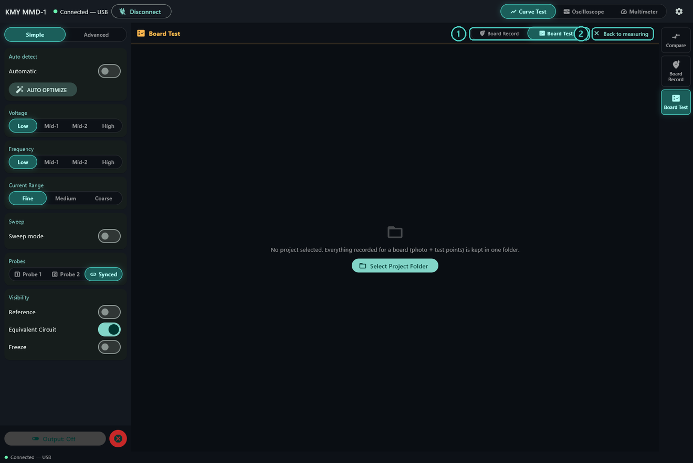
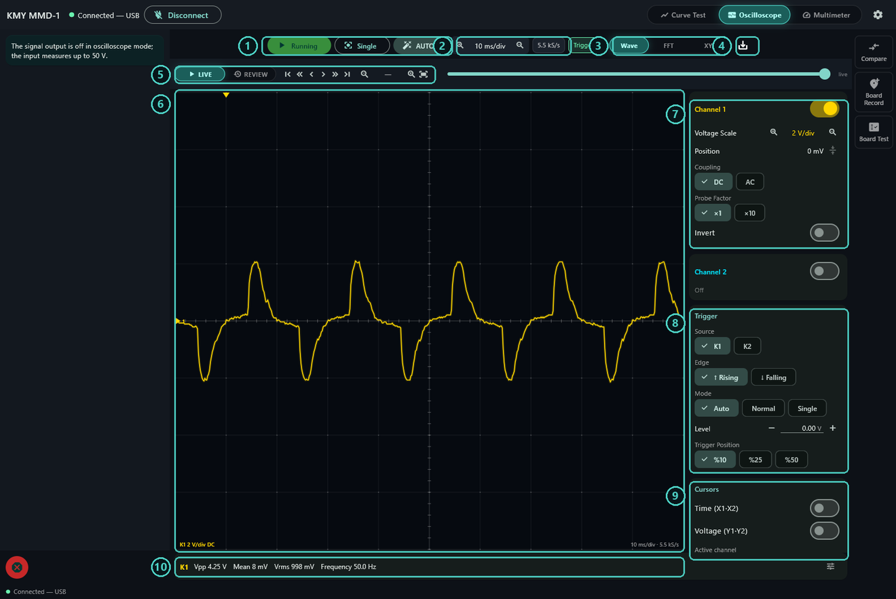
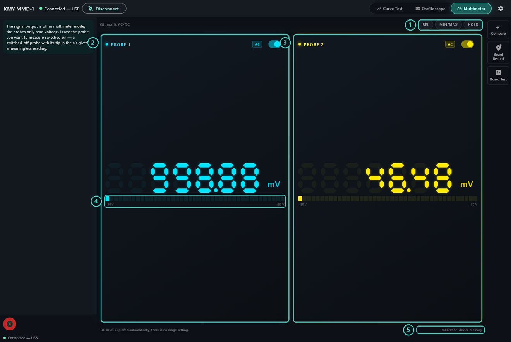
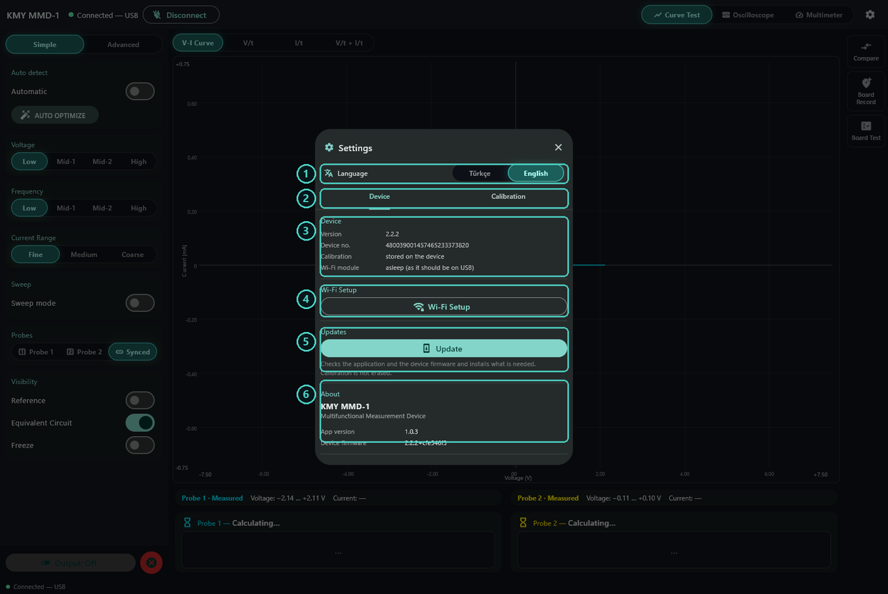
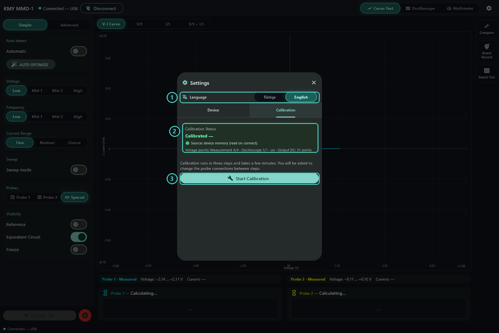

# KMY MMD-1 — User Guide

**Multifunctional Measurement Device**

Three instruments in one box: a curve tracer that identifies components from
the shape of their voltage–current curve, a two-channel oscilloscope, and a
two-channel voltmeter. It connects to a Windows PC over USB, and over Wi-Fi
once the network is set up. The same application runs on Android phones and
tablets.

> Türkçe sürüm: [user-guide-tr.md](user-guide-tr.md)

---

## Contents

1. [What you need](#1-what-you-need)
2. [Installing the software](#2-installing-the-software)
3. [First connection](#3-first-connection)
4. [The main window](#4-the-main-window)
5. [Curve Test](#5-curve-test)
6. [Comparing](#6-comparing)
7. [Board Record and Board Test](#7-board-record-and-board-test)
8. [Oscilloscope](#8-oscilloscope)
9. [Multimeter](#9-multimeter)
10. [Settings](#10-settings)
11. [Calibration](#11-calibration)
12. [Working over Wi-Fi](#12-working-over-wi-fi)
13. [On a phone](#13-on-a-phone)
14. [Updates](#14-updates)
15. [Safety and limits](#15-safety-and-limits)
16. [When something goes wrong](#16-when-something-goes-wrong)

---

## 1. What you need

The instrument, its USB cable, and a PC running 64-bit Windows 10 or 11. If you
want to work wirelessly, an Android 7.0 or newer phone or tablet will do as
well. Nothing else: the device runs off the USB port, and the software installs
without an administrator password.

**Before you touch anything with the probes**, make sure the circuit under test
is dead and its capacitors are discharged. The curve tracer drives its own test
signal into the probes; a live circuit pushes back, and both sides lose.

---

## 2. Installing the software

### Windows

1. Open the releases page:
   <https://github.com/kmyelectronicseu-png/kmy-mmd1/releases/latest>
2. Download **KMY-MMD-1-Kurulum.exe**.
3. Run it. The first screen asks which language the installer should use. That
   choice only affects the installer; the application has its own language
   setting you can change whenever you like.
4. Work through the wizard. It installs into your own user folder, which is why
   Windows never asks for an administrator password.

Everything the device needs, firmware included, comes inside that one file.
There is nothing else to download. The `.imza` file next to the installer is its
signature; the application uses it to check updates it downloads later, and you
never have to touch it.

### Android

From the same releases page, download **KMY-MMD-1-Mobil.apk** to the phone and
tap it. Android will ask you to allow installs from outside the store; say yes
to the prompt and the install carries on. The app needs Android 7.0 or newer on
64-bit ARM hardware.

The mobile app reaches the device over Wi-Fi only — there is no USB on a phone.
The one real consequence is that device firmware cannot be updated from a
phone; nothing is missing on the measurement side. See
[On a phone](#13-on-a-phone).

---

## 3. First connection

Plug in the USB cable and start **KMY MMD-1**. The device shows up in the list
at the top of the window; press **Connect**.

Every time it powers up, the first thing the device does is measure itself
against its internal voltage references. That takes about fifteen seconds. The
controls stay locked and the output will not switch on while it runs. There is
nothing to do but wait. The dot beside the connection state turns green when
the device is ready.

If you tried to connect the instant you plugged the cable in, the device may
still be starting. Give it a few seconds and try again.

---

## 4. The main window

| # | What it is |
|---|---|
| 1 | Device name, connection state, and the Connect / Disconnect button. |
| 2 | The three instruments: Curve Test, Oscilloscope, Multimeter. |
| 3 | Settings — language, device information, Wi-Fi, updates, calibration. |
| 4 | Simple / Advanced. Simple shows the three settings that matter most; Advanced opens the rest. |
| 5 | Test settings: peak voltage applied to the component, frequency, current range. |
| 6 | Which probe is driven: Probe 1, Probe 2, or both. |
| 7 | What the graph plots: the V-I curve, voltage against time, current against time, or both stacked. |
| 8 | The graph. The axes come from the voltage and current range you picked. |
| 9 | The output switch, and the red emergency stop beside it. |
| 10 | Compare, Board Record and Board Test — press one to open it. |
| 11 | The result: what the device makes of the component, with its values. |

The axes do not stretch to fit whatever you are measuring; they are worked out
from your settings. That way the space a curve takes up on screen means
something, and you can compare two measurements by eye.

Under **Visibility** at the bottom of the left panel there are three switches.
**Reference** lays a stored reference curve over the graph, **Equivalent
Circuit** draws the circuit the device settled on under the result, and
**Freeze** holds the picture where it is.

The red emergency stop cuts the output and drops every range at once. It works
whenever the device is connected, calibration or no calibration. If something
looks wrong, use it.

---

## 5. Curve Test

This is what the instrument is really for. It applies an alternating voltage to
a component and plots the current that flows against the voltage that caused
it. Every family of component draws a different shape, and that shape is its
identity.

### The three settings that matter

**Voltage** — the peak of the test signal. The Simple panel gives you four
steps: 2.5 V, 5 V, 10 V and 15 V (Low, Mid-1, Mid-2, High). The Advanced panel
lets you set anything from 0.1 V to 15 V. Start low on a part you do not know
and work up if the curve stays flat. Diodes and transistor junctions need
enough voltage to get past their forward threshold; resistors and capacitors do
not.

**Frequency** — 10, 50, 100 and 1000 Hz as ready steps, or anything from 1 to
1000 Hz in Advanced. This is what separates capacitors and inductors from
resistors. A resistor's curve does not care about frequency. A 100 nF capacitor
draws a thin, almost-closed sliver at 10 Hz and opens into a proper ellipse by
1 kHz. The quickest way to confirm you are holding a capacitor is to turn the
frequency and watch the opening change.

**Current range** — how much current the instrument expects to see.

| Range | What for |
|---|---|
| Fine | Capacitors, large resistors, anything drawing very little. |
| Medium | A good place to start on an unknown part. |
| Coarse | Small resistors, diodes in conduction, anything drawing a lot. |

If the curve looks clipped, or the app warns you the signal is at its limit,
drop the voltage or go one range coarser. The opposite catches people just as
often: measure a low-current part on Coarse and the curve flattens into a line,
and you write the part off as open. When in doubt, switch to Fine and look
again.

### Reading the curve

- **A slanted line through the middle** — a resistor. The steeper it is, the
  lower the value.
- **A line lying along the horizontal axis** — an open circuit, or nothing
  touching the probes.
- **A vertical line** — a short.
- **An ellipse** — a capacitor. The wider it opens, the larger the value.
- **A knee** — a diode or a junction. Where the knee sits on the voltage axis
  is the forward threshold: around 0.6 V for a silicon diode, further left for
  a Schottky, noticeably further right for an LED.
- **A knee on both sides** — a zener, or two junctions back to back. The right
  one is conduction, the left one is breakdown. You can see zeners below 15 V;
  above that the instrument does not have the voltage to reach them.

The result card under the graph names what it found, gives the value, and says
how confident it is. With **Equivalent Circuit** on, it also draws the circuit
it decided on.

When you measure a component on a board, the curve you get is not that
component — it is everything sitting in parallel with it. Where the result card
says "resistor" there may well be a resistor, a coil and half a circuit. If you
need to be certain, lift a leg.

### Advanced controls

| # | What it is |
|---|---|
| 1 | Simple / Advanced. |
| 2 | Waveform: sine, triangle, square, sawtooth, DC. Sine is the standard for curve testing; DC applies a steady voltage. |
| 3 | Peak voltage, as a slider and a number. 0.1–15 V; −15…+15 V with DC selected. |
| 4 | Frequency; ready steps (10, 50, 100, 1k) and a 1–1000 Hz slider. |
| 5 | Manual bias — moves the centre of the signal off zero. It comes switched off, and off is right for almost everything. |
| 6 | Apply. Appears when there are changes waiting to go to the device. |

Below these, the **Current Range** section becomes two rows in Advanced: Probe
1 and Probe 2 are set separately. If you are comparing the two probes, match
their ranges. Two curves taken on different ranges will never agree, even when
they are the same part.

### Auto detect and Auto Optimize

With **Automatic** on, the app watches the probes. Touch a component and it
works out what kind it is, then switches to the voltage, frequency and range
that show that kind best. It will not commit until it has seen the same answer
three times running, so the settings do not jump about while the contact is
still bouncing. Once it has decided, it leaves things alone until you lift the
probe and touch something else.

This is the fastest way through a tray of unknown parts. Keep it off during
board testing, though: changing the settings at every point breaks the
comparison against the settings the points were recorded at.

**Auto Optimize** runs the same search once, on demand, for whatever is on the
probes right now. If the search finds nothing useful it leaves the settings
alone and the result reads **Unidentified**.

### Sweep

**Sweep mode** walks one of the three axes — voltage, frequency or current
range — step by step and keeps looping until you stop it. The other two stay
put. It pauses about half a second on each step, a little longer on a range
sweep so the relays can settle.

If you have no idea what a part is, start with a frequency sweep: if the curve
changes with frequency it is reactive, if it does not it is resistive. When you
stop the sweep, the voltage, frequency and range you started with come back.

### Two probes

**Probe 1** and **Probe 2** drive one probe at a time. **Synced** drives both
from the same source at once, which is how you compare two components in a
single pass.

---

## 6. Comparing

| # | What it is |
|---|---|
| 1 | Opens the Compare drawer. |
| 2 | Off, Live ↔ Reference, or Probe 1 ↔ Probe 2. |
| 3 | Which probe the reference is captured from. |
| 4 | Capture Reference — stores the curve on screen as the one to match. |
| 5 | Save the reference to a file, load a stored one back, or delete it. |

**Live ↔ Reference** compares whatever the probe is touching now against a
curve you captured earlier. **Probe 1 ↔ Probe 2** compares the two probes
against each other: put a part you know is good on one and the suspect part on
the other. The second is the more trustworthy of the two, because both
measurements happen at the same moment, at the same temperature, on the same
settings. Both probes have to be on and set to a range for it to work.

The verdict is a similarity percentage against a threshold you set. Above it
reads **MATCH**, below it reads **NO MATCH**. The factory threshold is 90%,
which is a sensible place for ordinary work. Raise it and the instrument gets
fussier; lower it and it gets forgiving.

When you load a stored reference, the app applies its test settings too. If the
reference was taken at 5 V, 100 Hz on Medium, the comparison runs there as
well — anything else would be meaningless.

Turn the **audible alert** on and you can keep your eyes on the board instead
of the screen. It does not beep continuously, only when the verdict changes,
and there is a small amount of hysteresis so a measurement sitting right on the
threshold does not chatter.

One more thing worth knowing: if neither probe is drawing measurable current,
the app does not say "match", it says **NO READING**. Two pieces of noise look
very much alike and that resemblance means nothing. If you are seeing this,
either the probe is not making contact or the range is far too coarse for the
part.

**Critical-region sensitivity** has three settings: Off, Normal, High. It
tightens the comparison in the knee regions of the curve, which is where a
component's identity actually lives. Put it on High when you are chasing the
difference between two parts that look alike. Leave it on Normal day to day; on
High, good parts start failing too.

---

## 7. Board Record and Board Test

This is how you handle a board you will see again: record every test point
once, then check a suspect board against that record. Take the record from a
board you know is good. If you have no known-good board, take it from the best
one you have — and write down what you recorded.

| # | What it is |
|---|---|
| 1 | Switches between recording and testing. |
| 2 | Back to the ordinary measuring screen. |
| 3 | Choose the project folder. Everything about one board — its photo and all its test points — lives in one folder. |

The project folder travels: the photo is copied into it and the points are kept
in files inside it. Copy the folder to another machine as it is and open it
there.

### Recording a board

1. Pick a project folder and give the board a name.
2. Add a photo of the board. A shot taken straight down in flat light makes
   your life easier; on a photo taken at an angle it is hard to put the points
   where they belong.
3. Touch the probe to a test point, tap that spot on the photo, name the point
   and press **RECORD POINT**. The curve at that moment becomes the point's
   reference. Recording needs the output on and readings flowing.
4. Work your way round the board. Marker size and shape are set per point;
   use the small one on dense pin rows so the markers do not pile up.

Name the points after the board's own silkscreen: R14, C7, U3-1. Six months
later, "the one at the top left" tells you nothing.

**Multi-stage signature** records each point at three or four voltage and
frequency settings instead of one: the same point at half amplitude, at four
times the frequency, and at a quarter of it. Recording takes longer, but a
point recorded this way is much harder to fool. Two components that look
identical at one setting rarely look identical at all of them.

If you recalibrate the device after recording a board, your records stay valid;
the app maps the old curves onto the new calibration.

### Testing a board

Open **Board Test**, press **Start test**, and work through the points in
order. Each one is measured, compared against its reference, and marked passed
or failed. Failing points turn red on the board photo, so what you end up with
is a map of the fault rather than a list.

You can pause, skip a point you cannot reach, or finish early. Skipped points
are counted separately — neither passed nor failed — and the summary says so
plainly. After finishing you can come back to just the leftovers with **Test
the rest**.

**Auto mode** moves to the next point by itself once one matches. It waits for
five clean matches in a row before it commits; the counter in the header shows
where it is. Turn it on when you want to hold the probe and watch the board
instead of the screen.

When you are done, **Create Excel Report** writes the whole run out. The report
has three sheets: point-by-point detail (a crop of the board photo, the
settings, the curve and the verdict), a summary table, and a pass/fail map.

---

## 8. Oscilloscope

| # | What it is |
|---|---|
| 1 | Run/stop, single shot, and AUTO. |
| 2 | Timebase and the sample rate in use. |
| 3 | Waveform, FFT or XY view. |
| 4 | Save the screen as PNG and the visible data as CSV. |
| 5 | Live / Review, and the buttons for moving through the recording. |
| 6 | The display. |
| 7 | Channel settings: vertical scale, position, AC/DC coupling, probe factor, invert. |
| 8 | Trigger: source, edge, mode, level, and where the trigger sits on screen. |
| 9 | Measurement cursors. |
| 10 | Live measurements taken from the trace. |

In oscilloscope mode the signal output is off and the probes only listen. The
input measures up to 50 V.

The device always samples at 5.5 kS/s. That is the hardware limit, and changing
the timebase does not change it — it only changes the window you are looking
at. Know what that means in practice: this is a low-frequency oscilloscope. It
is comfortable on supply ripple, motor drives, sensor outputs, anything below
the audio band. Above a kilohertz you get only a handful of samples per cycle
and the shape of the wave stops being trustworthy.

The timebase runs from 5 ms/div to 2 s/div, the vertical scale from 50 mV/div
to 10 V/div.

**AUTO** is the quickest way to get a signal on screen: it looks at what is
coming in and sets the timebase, the vertical scale and the trigger level for
you. If there is no real signal at the input it will not zoom in on noise — it
leaves the settings alone.

**Triggering** works in three modes. *Auto* refreshes the screen whether or not
it finds a trigger; start here on a signal you know nothing about. *Normal*
draws only when a trigger arrives, so if the screen stays blank your level is
wrong. *Single* catches one frame and stops, which is what you want while
waiting for a one-off event. The trigger can sit at 10%, 25% or 50% across the
screen; 50% lets you see what happened before it.

**Review** stops the stream and lets you move back and forth through the last
twenty seconds and zoom in. The recording runs while you are watching live, so
when you say "something just happened", it is still there. Anything older than
twenty seconds falls off the end.

Switch one channel off and the device puts its whole measurement budget into
the other; the trace gets visibly cleaner. The sample rate is still 5.5 kS/s —
what changes is how many readings each sample is averaged from. Turn off the
channel you are not using.

**FFT** plots the active channel only; which one that is comes from "Active
channel" in the Cursors section. **XY** needs both channels on: channel 1 is
horizontal, channel 2 vertical.

Four measurements come up on the bottom bar by default (Vpp, Mean, Vrms,
Frequency). There are eleven in the list; Vmin, Vmax, AC Vrms, Period, Duty,
Rise and Fall can be added. The frequency reading shuts itself off in noise: if
the periods it measures do not agree with each other, the device leaves the
field blank rather than invent a number.

**Probe factor** only scales the number shown. If you have fitted a ×10 probe,
select ×10 here, otherwise every reading you take will be a tenth of the truth.

---

## 9. Multimeter

| # | What it is |
|---|---|
| 1 | REL, MIN/MAX and HOLD. |
| 2 | Probe 1 card: the reading, the AC/DC indicator, and the probe's on/off switch. |
| 3 | Probe 2 card. |
| 4 | Where the reading sits within the ±50 V scale. |
| 5 | Which calibration the readings are using. |

Both probes read voltage at the same time. There is no range switch and no
function switch: the device looks at the signal, decides for itself whether it
is DC or AC, and prints which one it is showing in the corner of the card. On
DC you get the sign as well.

- **REL** takes the present reading as zero. Use it to leave probe and lead
  drop out of a measurement, or to read a difference against a reference.
- **MIN/MAX** collects the lowest and highest readings it has seen; the
  **RESET** button that appears next to it clears them.
- **HOLD** freezes the display.

REL and MIN/MAX apply to both probes; HOLD freezes the whole screen.

The output is off in this mode as well. Leave the probe you are measuring with
switched on: a switched-off probe with its tip in the air is reading noise
picked up by the lead, not a voltage.

The measurement window adapts to the signal — about a tenth of a second on DC,
longer on low-frequency AC, where it waits for at least eight full cycles. It
will read a 1 Hz signal correctly; you just have to let it settle.

---

## 10. Settings

| # | What it is |
|---|---|
| 1 | Language — Turkish or English. It changes immediately and is remembered. |
| 2 | Device and Calibration tabs. |
| 3 | Device identity: firmware version, device number, calibration state, Wi-Fi module state. |
| 4 | Wi-Fi setup. |
| 5 | Update — checks the application and the device firmware together. |
| 6 | About: which versions you are running. |

The **Wi-Fi module** line is worth a glance. While the device is on USB it
should read *asleep*. A radio transmitting right next to the analogue front end
upsets its voltage references, so the device deliberately puts the module to
sleep whenever USB is plugged in. Over a network connection it is awake, of
course. That has one side effect: you cannot reach the device's own setup page
while USB is connected.

We ask for the **Device no.** when you contact support; you can copy it from
here.

At the bottom of the panel there is a **Service / Diagnostics** section. The
numbers in there — frames received, lost packets, self-check result, reference
readings — earn their keep when you are chasing a fault. They are not something
to watch day to day.

---

## 11. Calibration

| # | What it is |
|---|---|
| 1 | Language. |
| 2 | Calibration status, where it was read from, and how many points it holds. |
| 3 | Start Calibration. |

Calibration lives **inside the device**, not on the PC, and is read from there
on every connection. So it travels with the instrument: plug it into another
computer, or connect from a phone, and it is still calibrated.

**What you need:** a lead to short the probe, and a multimeter you trust. The
accuracy of that multimeter becomes the accuracy of this instrument, so use the
best one you have.

The wizard runs in five stages and takes a few minutes:

1. **Open circuit** — both probes free, touching nothing. Measures the zeros of
   the current channels and the oscilloscope baseline. Around half a minute.
2. **Probe 1 shorted** — join the Probe 1 tip to GND. Twenty seconds.
3. **Probe 2 shorted** — the same for Probe 2.
4. **Read calibration** — the device drives four DC levels in turn. At each
   one you measure the Probe 1 tip with your own multimeter and type in what
   you read. This is the step that ties the instrument's readings to a
   reference you trust, and it is the most important stage in the wizard.
5. **Output calibration** — the device sweeps its output from −15 V to +15 V in
   one-volt steps and corrects itself using its now-calibrated reading. About
   forty-five seconds; the probes must be free while it runs.

At the end you are offered one more stage: calibrating the oscilloscope
reading. That needs an **external** voltage source you trust, because in
oscilloscope mode the device cannot drive its own output. If you do not have
one, skip it — the oscilloscope reading stays uncorrected and everything else
works. Take points at two different voltages and both gain and offset are
solved; with one point only the gain is corrected.

Every confirmation screen lets you repeat the stage before it, so one bad
measurement does not mean starting over. If you cancel or close the wizard part
way through, the device carries on with the calibration it already had.
Nothing is written to the device until the run finishes.

When should you recalibrate? When the readings start drifting visibly from a
multimeter you trust, or when the app tells you the reference baseline has
moved from where it was at calibration time. Otherwise you should not need to
touch it again.

---

## 12. Working over Wi-Fi

The device gets onto a network one of two ways: it joins your existing Wi-Fi,
or it broadcasts its own. Which suits you depends on where you work. If there
is a network in the workshop, let it join — your PC stays on the internet and
on the instrument at the same time. If there is no network, or you are out in
the field, let the device broadcast its own and connect the PC or phone
straight to it. No separate router needed.

**To set it up from the app**, connect to the device, open **Settings → Wi-Fi
Setup**, choose the connection method, enter the network name and password and
send it. The device joins the network, and the app confirms the setup by
finding it there. The device may read **BUSY** for a while during this; that is
normal.

**To set it up from the device's own page**, unplug the USB cable first — with
the cable in, the Wi-Fi module is asleep and the page is unreachable. Out of
the box the device broadcasts an open network called **KMY MMD-1**. Connect
your phone or laptop to it and the setup page opens by itself; if it does not,
type `192.168.4.1` into the browser. Advanced settings such as a static IP
address live there only.

Once the device is on a network, switch the app to **Wi-Fi** and press
**Connect** — devices on the same network are listed automatically. Connect
still works even if the list stays empty: if the computer is on the device's
own network, 192.168.4.1 is tried directly.

A few things to know:

- One device serves one connection at a time. A device in use shows as
  **BUSY** in the list; you cannot have a phone and a PC on the same device at
  once.
- If you change the network settings over the network, this connection drops as
  the device moves to the new one. That is expected — you will need to find the
  device again on its new network.
- A laptop with a single Wi-Fi adapter loses its internet the moment it joins
  the device's own network. It is less of a problem on a phone, where mobile
  data stays up.
- If you want the device to forget its settings, **Reset network settings**
  puts it back to factory: it starts broadcasting "KMY MMD-1" again.

---

## 13. On a phone

The same application you use on Windows runs on Android. Nothing is missing on
the measurement side: curve test, oscilloscope, multimeter, comparison, board
record and board test are all there. The layout changes because the screen is
narrow. The button at the top switches between Curve Test and Oscilloscope;
comparison, board work, settings and calibration are gathered under the tools
icon in the toolbar.

The phone reaches the device over Wi-Fi only. If the device has not joined a
network yet, connect the phone to the device's own **KMY MMD-1** network, open
the app and press **Connect**. Once connected you can move the device onto your
workshop network with **Settings → Wi-Fi Setup**; the moment the setting is
written, this connection drops and you find the device again on its new
network.

**Device firmware cannot be updated from a phone.** Writing it needs USB, and a
phone does not have it. For firmware you will need a Windows PC.

The app's own update does work on a phone, slightly differently: **Update**
opens the APK's address in the browser, and Android does the downloading and
installing. The permission an app needs to install an APK directly is wider
than a measurement instrument has any business asking for, so we do not.

Two small details: the phone screen will not dim by itself while a measurement
is running, and anything you export (PNG, CSV, the Excel report) is written to
the app's own folder on the phone. On Windows that folder is
**Documents\KMY MMD-1**.

---

## 14. Updates

**Settings → Update** checks both the application and the device firmware and
installs whatever is out of date. Your calibration is left alone.

- The application update works whether or not the device is plugged in.
- Device firmware needs a USB connection; it cannot be written over the network
  or from a phone.
- With no internet connection the check says so, and nothing breaks.

Device firmware is not downloaded separately — it comes with the application
installer. Update the application and you have the firmware in hand.

You are asked once when a new version appears. You can say "do not ask about
this version again"; when a newer one comes out you will be asked again.

**Do not unplug the USB cable while device firmware is being written.** When it
finishes, the device disconnects and you will need to reconnect. That is
normal.

---

## 15. Safety and limits

| | |
|---|---|
| Test voltage | ±15 V peak |
| Test frequency | 1–1000 Hz |
| Oscilloscope / voltmeter input | up to 50 V |
| Oscilloscope sampling | 5.5 kS/s |
| Oscilloscope deep record | last 20 seconds |
| Power | from the USB port |

- **Test the board dead**, with its capacitors discharged.
- The instrument drives a signal in Curve Test mode only. In Oscilloscope and
  Multimeter modes the output is off and the probes only listen.
- The red emergency stop cuts the output and drops every range at once.
- The output switch will not turn on until the device has finished starting up
  and has a calibration stored in it.
- None of this is designed for mains voltage. Do not put the probes on mains.

---

## 16. When something goes wrong

**The device is not in the list.**
Check the cable and try another USB port. Windows needs a USB-serial driver for
the adapter; most systems already have one. On a phone the list only shows
devices on the network — USB does not appear there, and that is not a fault.

**The controls are locked right after connecting.**
The device is running its start-up self-calibration. It takes about fifteen
seconds and clears by itself.

**The output switch will not turn on.**
Either the device is still starting up, or it has no calibration stored. Open
Settings → Calibration and look at the status.

**The curve is flat.**
Nothing is touching the probes, the component is open, or the voltage is not
high enough to reach its threshold. Take the voltage up a step, or move to a
finer current range. If you are measuring on a board, make sure the probe tip
is on actual metal and not on solder mask.

**The comparison keeps saying NO READING.**
Neither probe is drawing measurable current. Check the probe contact, and move
to Fine for a high-impedance part.

**The device shows BUSY.**
Another connection has it — a phone, or another PC. Close that one first.

**The readings look shifted.**
Power the device off and on; the start-up self-calibration picks up most
drift. If the app reports that the reference baseline has moved from where it
was at calibration time, run the calibration again.

**The waveform looks wrong on the oscilloscope.**
Check the frequency of the signal. At 5.5 kS/s you cannot see the shape of a
wave above a kilohertz — you are left with a few points per cycle.

**The phone cannot find the device.**
Are the phone and the device on the same network? If the device is
broadcasting its own network, the phone has to be joined to it — ignore the
"no internet on this network" warning.

---

## Support

KMY Electronics — <https://github.com/kmyelectronicseu-png/kmy-mmd1>

The device number makes things easier when you get in touch:
**Settings → Device → Device no.**
