# KMY MMD-100 Circuit Analyzer and Fault Finder — User Guide

KMY MMD-100 provides current-voltage curve analysis and comparison with reference measurements for inspecting unpowered electronic boards. Its two-channel low-frequency oscilloscope and voltage measurement functions combine signal inspection and voltage measurements in a single instrument.

This guide covers Windows and Android installation, measurement settings, board recording and testing, connectivity, and troubleshooting.

## Part A — Overview

### 1. Purpose and functions

KMY MMD-100 examines component behavior and helps locate suspect test points without applying supply power to a board. Curve testing, reference comparison and voltage measurement use separate operating modes.

* **Curve test (V-I analysis):** Uses a low-level test signal to plot current against voltage and supports evaluation of resistors, capacitors, inductors, diodes and zeners.
* **Board record and board test:** Compares measurements from boards of the same model with stored reference points from a known-good board. Suitable for maintenance, repair and production checks.
* **Oscilloscope and multimeter:** Inspect signals and measure voltage on powered circuits within the input limits. Curve testing, by contrast, requires an unpowered board.

### 2. Device and connections

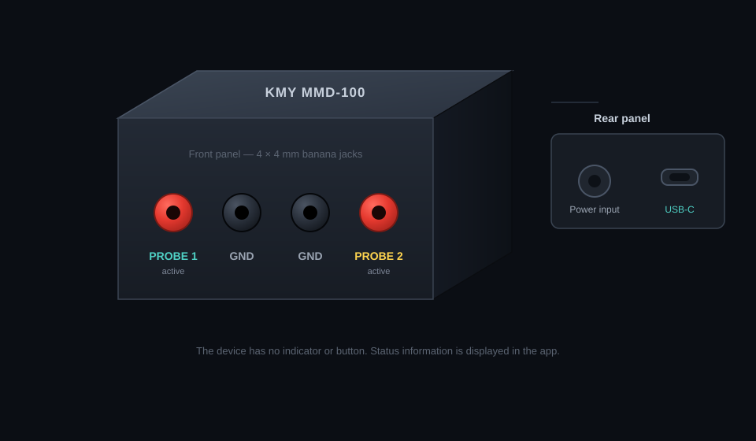

The front panel has four 4 mm banana sockets. The outer sockets are the active **Probe 1** and **Probe 2** connections; the inner sockets are **chassis ground (GND)**. Connect one component terminal to an active probe and the other to its adjacent GND socket.

The rear **USB-C** port on the right provides computer connectivity, data transfer and device power. The **external power input** on the left is reserved for a separate supply requirement.

The case has no buttons or LEDs. Monitor power, connection status and operating mode in the computer or mobile application.

### 3. System requirements and preparation

Computer use requires a USB cable and 64-bit Windows 10 or Windows 11. Mobile use requires Android 7.0 or later and a phone or tablet with a 64-bit ARM processor. Windows installation does not require administrator rights.

> **Disconnect board power and discharge its capacitors before curve testing.** The device applies its own test signal in this mode. A powered circuit can distort measurements and permanently damage the board or instrument.

## Part B — Installation and First Connection

### 4. Installing the software

#### Windows installation

1. Open the [latest release page](https://github.com/kmyelectronicseu-png/kmy-mmd1/releases/latest).
2. Download and run **KMY-MMD-100-Kurulum.exe**.
3. Select the installer language. This applies only to installation screens; change the application language under **Settings**.
4. Complete the installer steps. The application is installed in `%LocalAppData%\Programs\KMY MMD-100`.

The other files on the release page are used by the application's automatic update; you do not need to download them. Uninstalling preserves board projects and exported reports in **Documents**; preferences such as language selection are reset.

#### Android installation

1. Download and open **KMY-MMD-100-Mobil.apk** from the same release page.
2. Enable “Allow from this source” when Android requests installation permission, then complete installation.
3. Run the application on Android 7.0 or later with a 64-bit ARM processor.

The mobile application connects only over Wi-Fi. Measurement, analysis and test functions are equivalent to the desktop version. Device firmware updates require a computer and USB connection; they cannot be performed from a phone.

### 5. Connecting to the device for the first time

Connect the USB cable and open **KMY MMD-100**. Select the instrument from the device list at the top of the window and press **Connect**.

Startup preparation takes approximately **13-15 seconds**. Test output and operating mode controls remain unavailable during this period. A green connection indicator shows that the device is ready.

If connection fails immediately after plugging in the cable, wait a few seconds and retry. If the problem persists, power the device off and on and contact KMY Electronics support.

### 6. First measurement

For the first measurement, use a resistor with a known value **between 100 Ω and 10 kΩ**.

1. Connect one terminal to **Probe 1** and the other to the adjacent **GND** socket.
2. Select **Voltage: Low** and **Current Range: Medium**.
3. Press **Output: Off** to change it to **Output: On**.
4. Inspect the sloping straight line and the calculated resistance on the result card below the graph.
5. Press **Output** again or remove the resistor to end the measurement.

Other characteristic curves are described in the component signature section.

## Part C — Curve Testing and V-I Analysis

### 7. How the curve test works

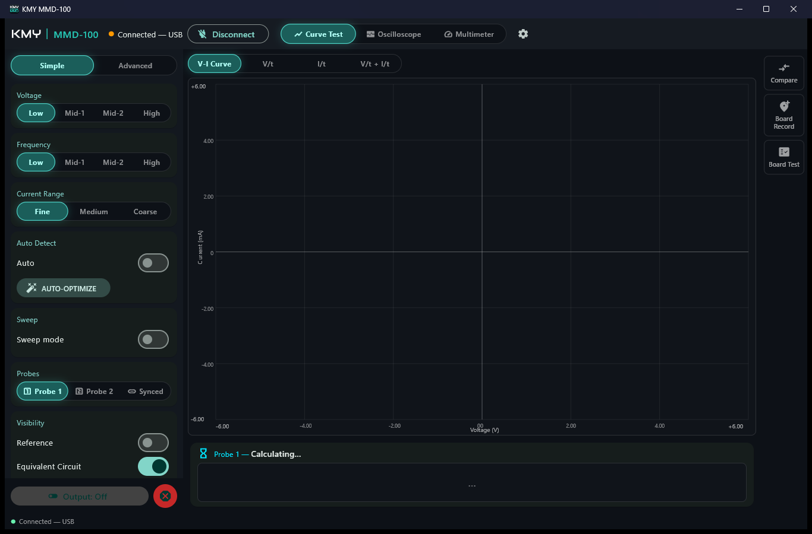

Measurement settings are on the left, the graph is in the center, and **Compare**, **Board Record** and **Board Test** are on the right.

During a sine test, AC voltage is applied to the component while current is measured at the same time. Plotting current against voltage produces the V-I curve. A resistor produces a sloping line, a capacitor an ellipse, and a diode a distinct transition into conduction.

The curve represents behavior between the two measured terminals. The independent probes can be used individually or in **Synced** mode.

### 8. Basic measurement settings

The **Simple** view provides voltage, frequency and current range controls. Voltage and frequency offer **Low, Mid-1, Mid-2, High** settings.

| Step name | Voltage (peak) | Frequency |
| :--- | :---: | :---: |
| **Low** | 2.5 V | 10 Hz |
| **Mid-1** | 5 V | 50 Hz |
| **Mid-2** | 10 V | 100 Hz |
| **High** | 15 V | 1000 Hz |

* **Voltage:** Sets the peak test voltage. Start at the lowest setting for an unknown component. Increase it gradually if the threshold needed for a semiconductor junction to conduct is not reached.
* **Frequency:** Helps assess reactive behavior. An ideal resistor's slope is independent of frequency. For example, a 100 nF capacitor gives a narrow curve at 10 Hz and a more pronounced ellipse at 1000 Hz.
* **Current Range:** Sets current measurement sensitivity.

| Range | Where to use it |
| :--- | :--- |
| **Fine** | Capacitors, high-value resistors and sensitive parts that draw very little current. |
| **Medium** | A safe starting point on a part you do not know. |
| **Coarse** | Low-value resistors, conducting diodes and rugged parts that draw a lot of current. |

If the curve is clipped or a clipping warning appears, lower the test voltage or select a coarser current range. Low-current components may produce a horizontal trace on **Coarse**; repeat the measurement on **Fine**. A horizontal trace alone does not establish a fault.

### 9. Reading the curve: a gallery of component signatures

The result card displays the component type inferred from the measurement, its calculated value and the confidence level. The following 12 examples support curve interpretation.

**Expected drift** indicates the expected difference from a reference multimeter under the current measurement conditions, for example **Expected drift +2.19%…+3.01%**. It depends on the current range and component value. An explanation replaces the number when conditions fall outside the supported scope, the drive is not sine/AC, probe loads differ substantially, or the device is not ready. “Under the reference limits” indicates a difference smaller than the reference measurement's tolerance limit.

KMY MMD-100 measures between two terminals. It does not independently classify three-terminal devices as transistors or MOSFETs; the user must identify the terminals being measured. Results describe behavior between those selected terminals.

#### Resistor
A sloping line through the center. Lower resistance increases the slope; higher resistance reduces it. For an ideal resistor, the slope is independent of frequency.

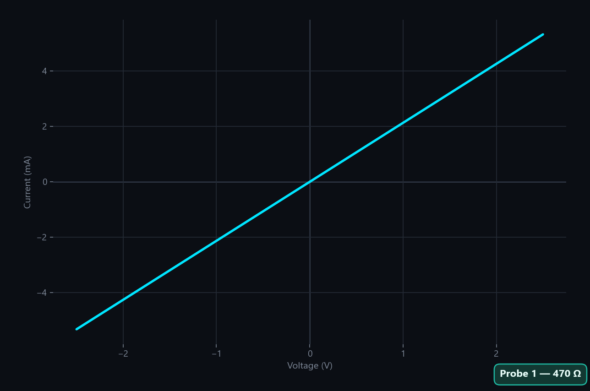

#### Capacitor
An elliptical curve that widens as frequency increases and narrows as it decreases.

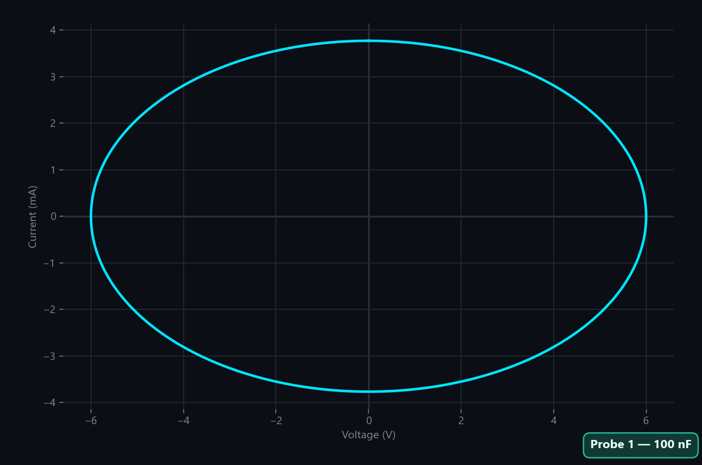

#### Inductor
An elliptical curve that narrows as frequency increases and widens as it decreases, opposite to a capacitor.

#### Capacitor and ESR
Series resistance tilts the capacitor ellipse. The result card displays capacitance and parallel/series resistance separately.

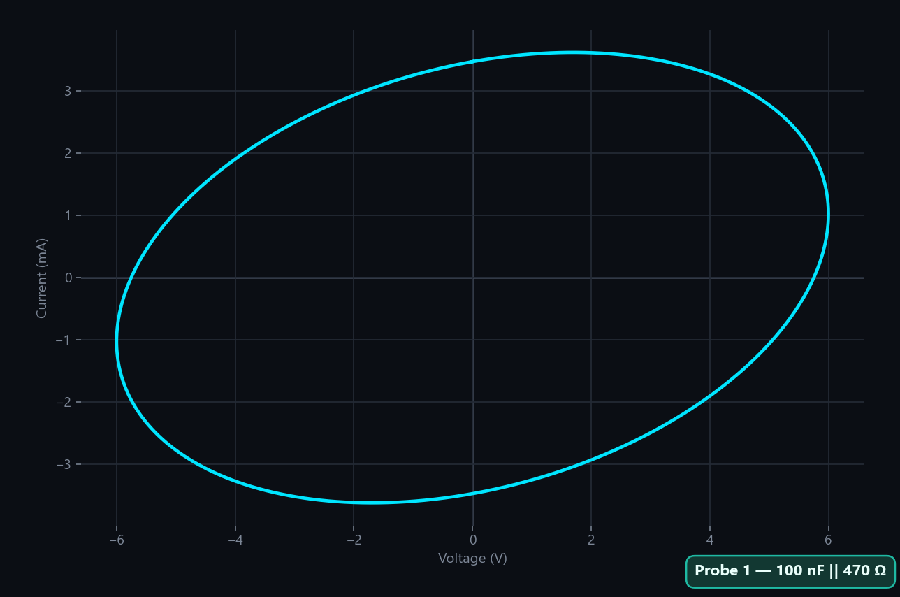

#### Diode
A straight cutoff region and a distinct conduction transition. Silicon diodes typically conduct around 0.6 V - 0.7 V. Schottky diodes may have a lower threshold and LEDs a higher one.

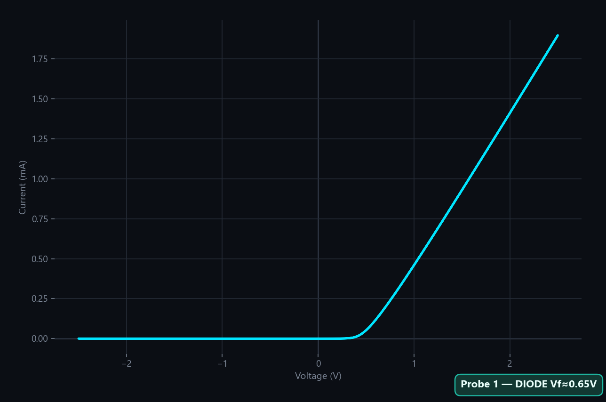

#### Zener diode
Shows forward conduction and reverse breakdown. With a maximum test voltage of 15 V, breakdown voltages above this limit cannot be observed.

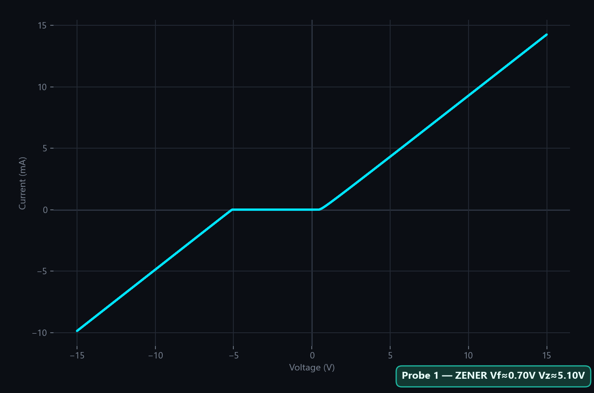

#### TVS diode
A unidirectional TVS behaves similarly to a zener and may be displayed as **ZENER**. A bidirectional TVS may produce **|Z|** or **Unidentified** because its symmetrical breakdown does not have a separate TVS classification.

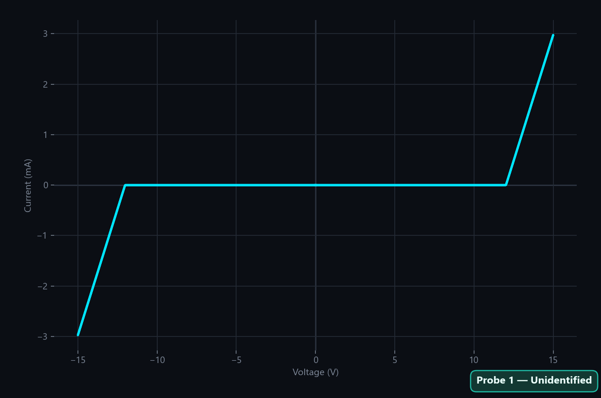

#### MOSFET gate-source
Gate insulation results in very low current. A few picofarads in a small-signal MOSFET may be below the measurement floor, producing **OPEN CIRCUIT**. A few nanofarads in a power MOSFET may produce a thin capacitor curve. An open-circuit result alone does not indicate a fault.

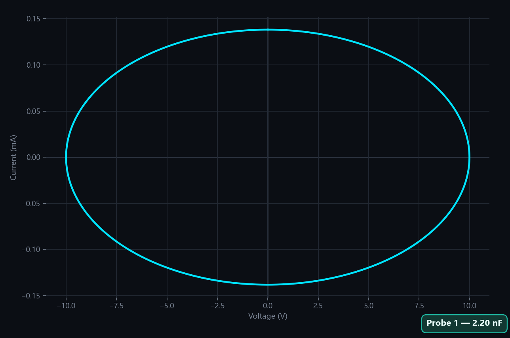

#### MOSFET drain-source
With gate tied to source or left open, the body diode behavior may be observed and displayed as **DIODE**. Forward voltage may be slightly higher than that of a signal diode.

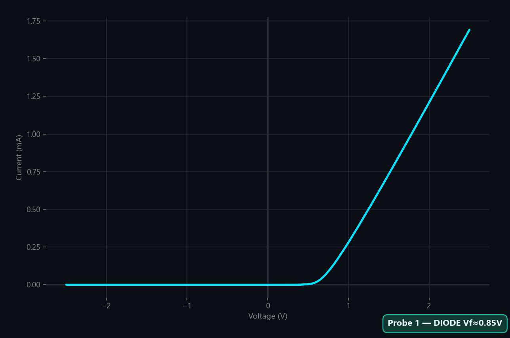

#### Transistor base-emitter
Behaves as a diode junction and is displayed as **DIODE**. Typical forward voltage is 0.65 V - 0.70 V.

#### Transistor base-collector
Behaves as a diode junction. Its conduction threshold may be slightly lower than the base-emitter junction; the result remains **DIODE**.

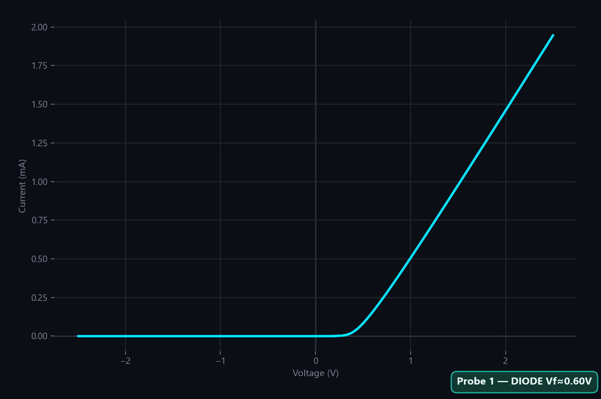

#### Transistor collector-emitter
With the base open, **OPEN CIRCUIT** may be displayed. Without base drive, this result alone does not indicate a fault.

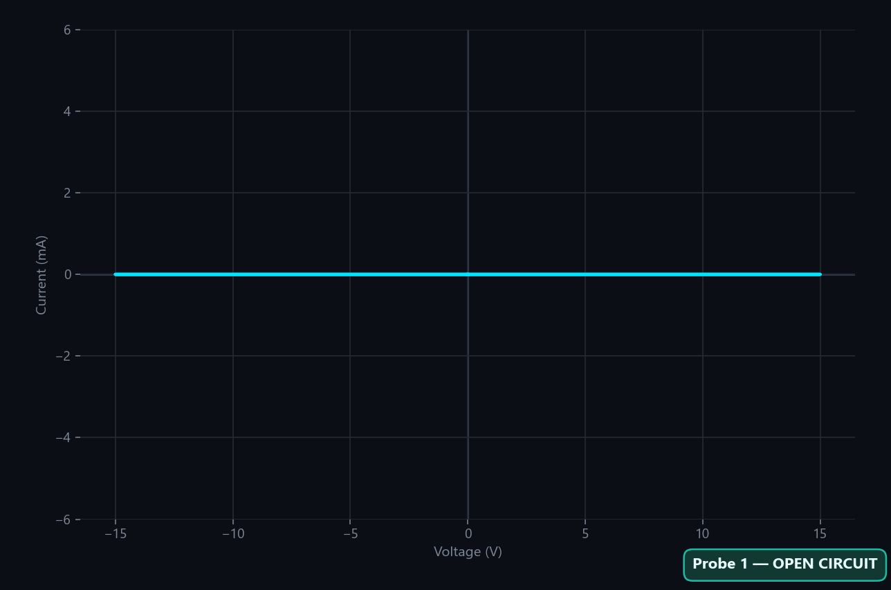

In-circuit measurements include the combined effect of parallel paths. If the result is inconclusive, disconnect one component terminal from the board and repeat the measurement.

### 10. Advanced measurement settings

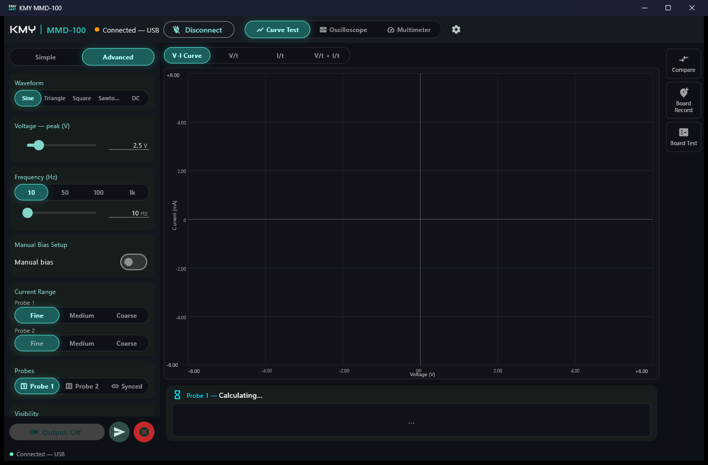

The **Advanced** view allows voltage adjustment from 0.1 - 15 V and frequency adjustment from 1 - 1000 Hz.

* **Waveform:** Select Sine, Triangle, Square, Sawtooth or DC. Curve analysis uses sine; DC applies a constant voltage.
* **Manual bias:** Moves the signal center above or below zero. Hold a direction button to change the value and select increments of 0.010 V, 0.100 V or 1.000 V. **Reset** returns the center to zero. This function is disabled by default; keep it disabled unless a specific test requires it.
* **Current Range:** Set independently for Probe 1 and Probe 2. Use the same range for comparison; different ranges affect curve alignment.

Changes are sent when a control is released. **Apply** sends settings immediately.

* **Auto Detect:** Selects voltage, frequency and current range according to component identification. At least three consecutive identical results are required before settings change.
* **AUTO-OPTIMIZE:** Searches once for suitable settings. It applies a suitable result if found; otherwise existing settings remain.
* **Sweep:** Varies voltage, frequency or current range within the selected interval while holding the other two constant. Frequency-dependent curves support evaluation of reactive behavior; unchanged curves support evaluation of predominantly resistive behavior.

In the **Visibility** tab, **Reference** displays a stored curve with the live measurement. **Equivalent Circuit** draws the simple circuit inferred from the measurement. **Freeze** holds the curve on screen.

### 11. Using both probes and Synced mode

**Probe 1** and **Probe 2** modes apply the test signal to one selected probe. **Synced** drives both probes simultaneously from a common test source.

A substantial load difference produces a yellow warning in the status bar or mobile notification panel. With one probe open, the other reading may show approximately **1%** drift. The warning does not automatically invalidate the result; it indicates that load balance must be considered.

For precise comparisons, complete the measurement in single-probe **Probe 1** or **Probe 2** mode.

## Part D — Comparison and Board Testing

### 12. Comparison modes

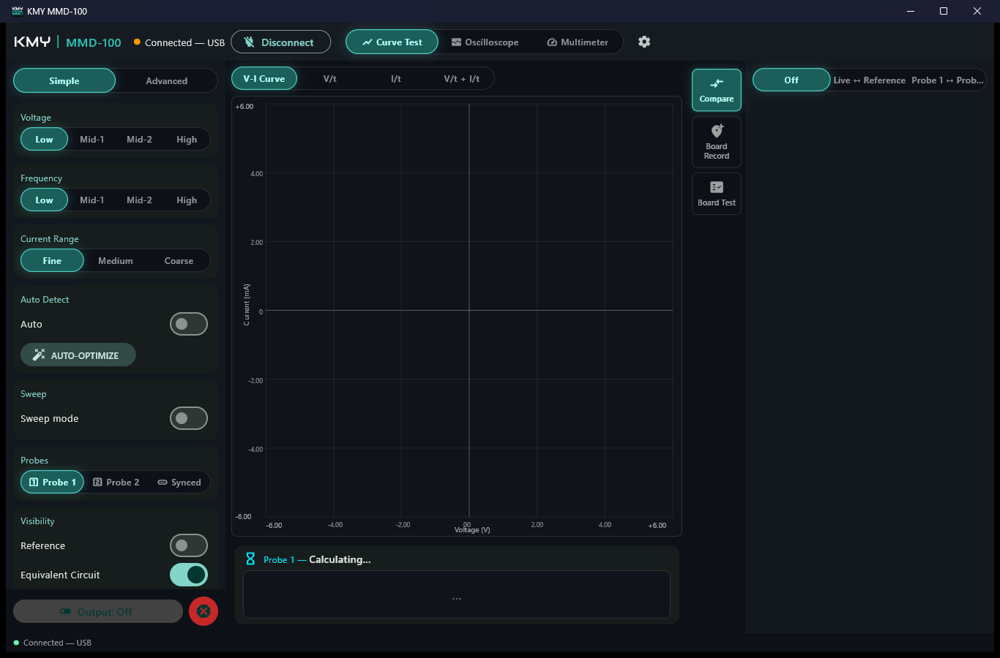

The **Compare** panel offers three options:

* **Off:** Disables comparison.
* **Live ↔ Reference:** Compares the live curve with a stored reference. **Capture Reference** captures the current curve; save it to a file and reload it as needed.
* **Probe 1 ↔ Probe 2:** Directly compares a known-good component with a suspect component. Simultaneous measurement reduces the effect of changes in timing and ambient conditions.

The similarity score is compared with the selected threshold. Results above it show **MATCH**; results below it show **NO MATCH**. The default threshold is **90%**. **Critical-region sensitivity** offers Off, Normal and High settings for assessing differences around curve transitions.

When no measurable current is present, **NO READING** is displayed. Check contact and current range. **Audible alert** sounds when the result changes between match and mismatch.

A mismatch identifies a deviation from the reference. Assess faults using circuit context and other measurements as well.

### 13. Board recording and board testing

Board recording creates a reference test plan for repair and production checks on boards of the same model.

#### Recording a board reference

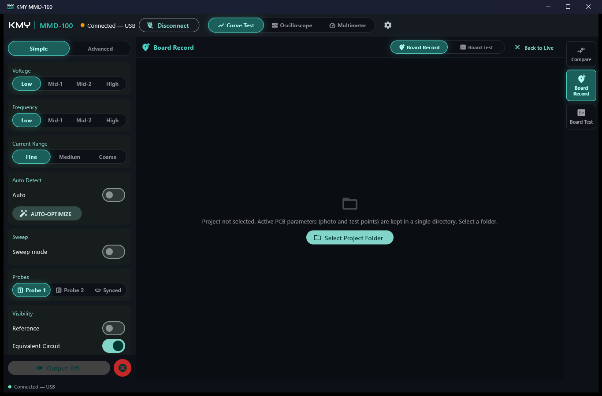

1. **Create a project folder.** The board image and test points are stored together. Copy the folder to open the project on another computer.
2. **Add a board image.** Use a clear, shadow-free photograph taken from above.
3. **Define the points.** Contact the test point with the probe, select its location in the photograph and assign a name such as R14, C7 or U3-1. Press **RECORD POINT**.
4. **Set the sequence.** Drag the points into the required test order.

**Multi-stage signature** records each point at 3 or 4 voltage and frequency levels. Recording takes longer and comparison covers multiple test conditions.

#### Testing a recorded board

Press **Start Test** and contact each point in sequence. Measurements are compared with the reference and marked **Match** or **Mismatch**. Mismatched points appear as **red markers** on the photograph.

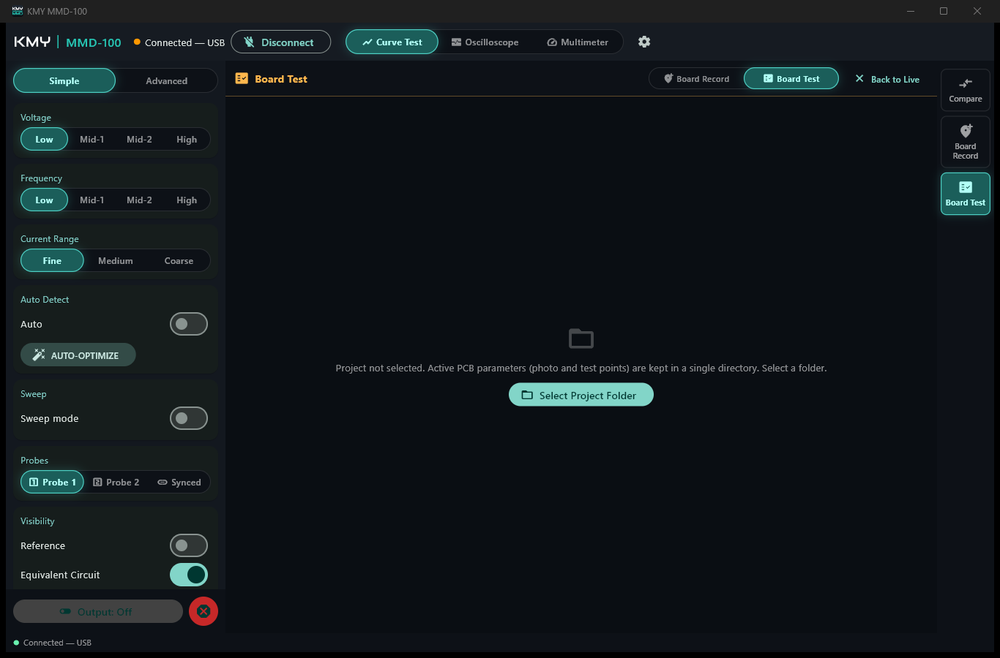

Pause the test or skip points as needed. **Test Remaining** completes unmeasured points. **Auto Advance** moves to the next point after a match.

The **Excel report** contains three worksheets: point-by-point measurements, a summary table and a match/mismatch map.

## Part E — Oscilloscope and Multimeter

### 14. Oscilloscope mode

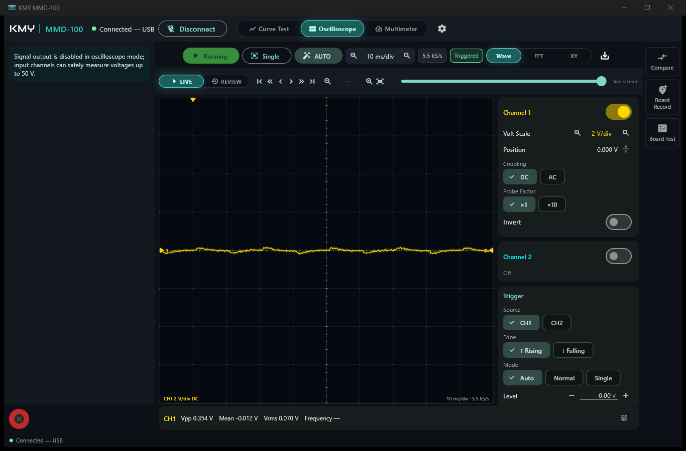

In oscilloscope mode the test generator is off and the probes measure external signals. The input limit is **50 V**. Channel 1 is **yellow** and Channel 2 **cyan**. In curve testing Probe 1 is cyan and Probe 2 yellow.

Sampling is fixed at **5.5 kS/s**, or 5500 samples per second. The timebase changes only the displayed time window. Use the device as a **low-frequency oscilloscope**; waveform accuracy is unreliable above 1 kHz. Supply ripple and motor-driver outputs within these frequency limits can be examined.

* **AUTO (auto setup):** Sets timebase, voltage scale and trigger level from the signal. If no meaningful signal is found, it retains the existing settings.
* **Auto:** Refreshes the display without requiring a trigger.
* **Normal:** Refreshes only when the trigger condition occurs.
* **Single:** Captures once and holds the display.

Drag baseline and trigger indicators with the mouse. **REVIEW** pauses the stream and allows inspection of **the last 20 seconds**, recorded continuously in the background.

The lower bar shows **Vpp**, **Mean**, **Vrms** and **Frequency**. Choose displayed values from **11 measurement parameters**. Voltage is shown in volts with three decimal places.

### 15. Multimeter mode

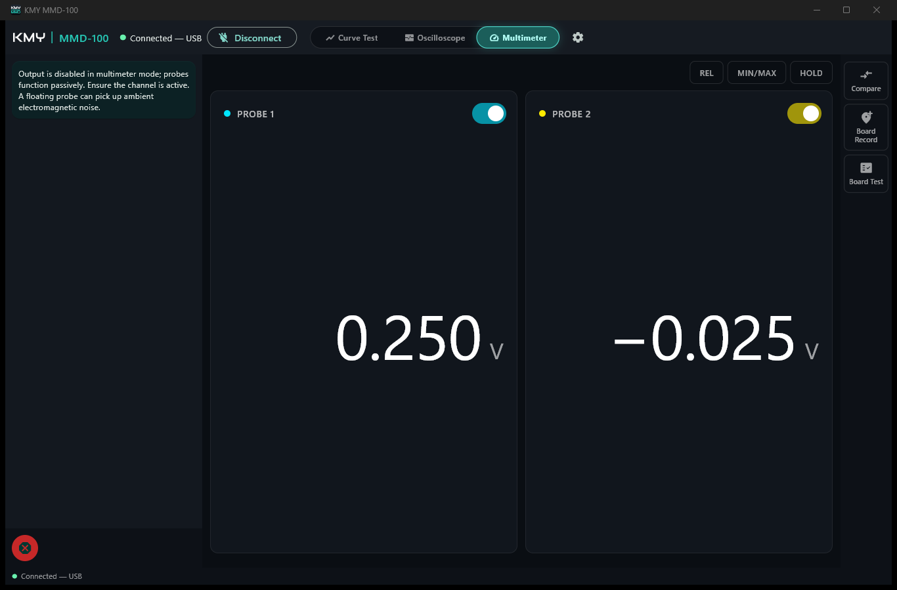

Both probes measure voltage independently and simultaneously. KMY MMD-100 selects AC/DC and measurement range automatically. Readings use volts (V) with three decimal places, for example **0.068 V**. The switch at the top right of each probe card enables or disables that channel.

* **REL (relative reading):** Uses the reading at activation as zero and displays subsequent differences.
* **MIN/MAX:** Tracks the lowest and highest readings.
* **HOLD:** Holds the displayed value.

Test output is disabled in this mode. Enable the required channel. A disconnected probe may display electromagnetic noise picked up from the environment.

## Part F — Settings and Connectivity

### 16. System settings

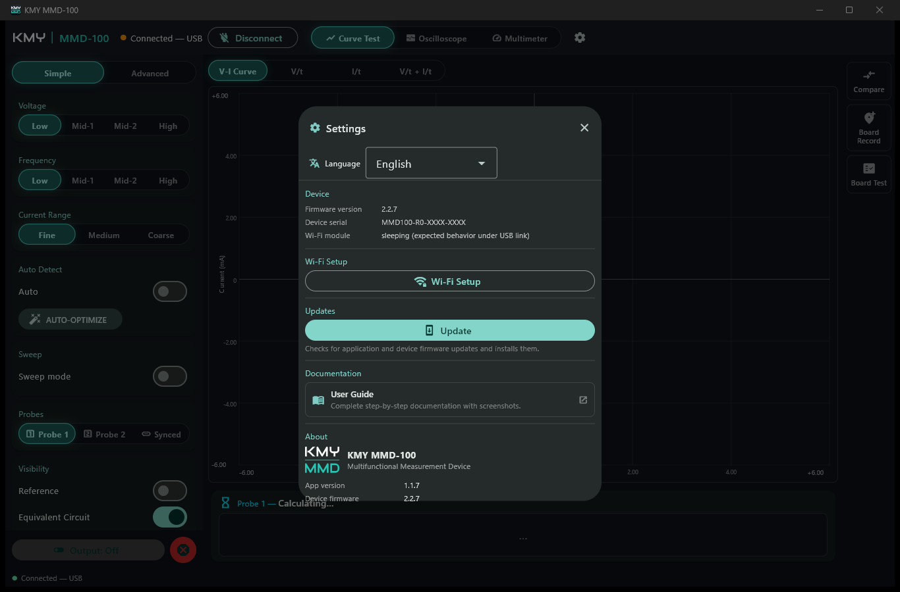

Open **Settings** using the gear icon in the top bar. Available languages are Turkish, English, German, Spanish and French.

The panel displays the device firmware version and serial number, Wi-Fi tools and a link to this guide. The application version is available under **About**. **Update** checks application and firmware versions. Firmware updates require USB connectivity.

### 17. Wireless use and Wi-Fi setup

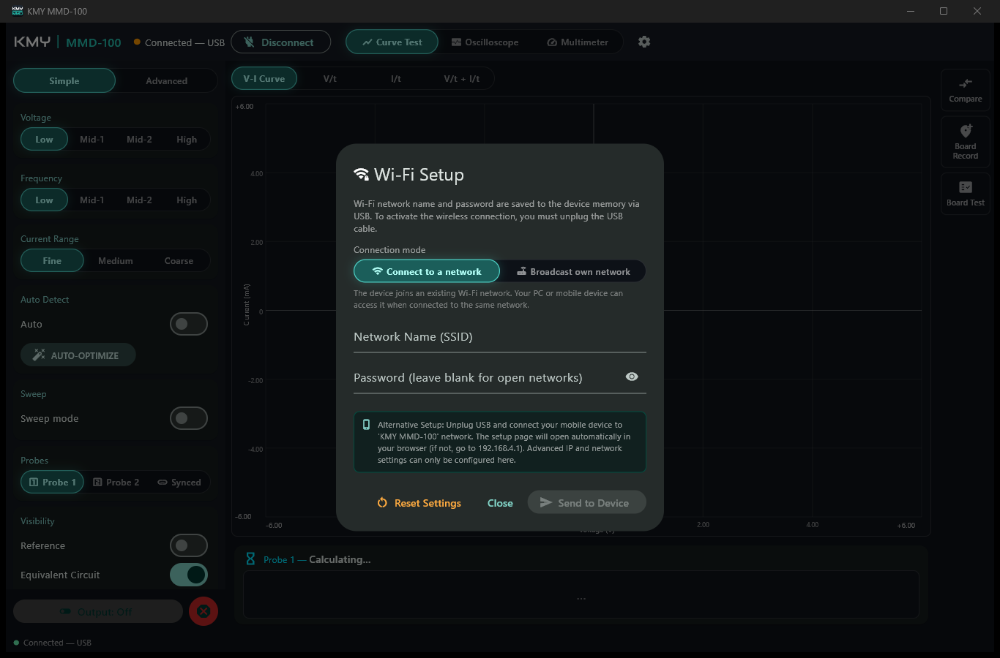

Wi-Fi supports two connection options:

1. **Station mode:** The device joins an existing network; the computer or mobile device connects through the same network.
2. **Access point (AP) mode:** The device creates its own network for direct computer or mobile connection.

#### Wi-Fi setup from the application

With USB connected, open **Settings → Wi-Fi Setup**. Select the mode, enter SSID and password, and send the settings to the device.

#### Wi-Fi setup from a browser

The default access point broadcasts a network named **KMY MMD-100**. Connect to it from a phone or computer. If the setup page does not open automatically, enter **192.168.4.1** in the browser. Advanced network settings such as static IP are available only in this web interface. The device must remain powered during wireless use.

#### If the device is not listed

Use **Manual IP Address** to enter its IP. Some routers prevent devices on the network from finding each other. Find the address in the router's device list or the device web interface. Manual entry in Android is below the connection screen.

Only one client can connect at a time; **BUSY** indicates another connection. **Reset Settings** restores the default wireless configuration.

### 18. Using the app on a phone or tablet

The Android application provides the Windows measurement, analysis and test functions in a mobile layout.

* **Top status strip:** Tap or swipe down to show connection quality, warnings and reasons for locked controls. Includes **Tools**, **Settings** and **Connect/Disconnect**; opens automatically for critical warnings.
* **Bottom control strip:** Tap or swipe up to open; it remains at the released height. Contains measurement settings, Curve Test, Oscilloscope and Multimeter buttons, plus Voltage, Frequency and Current Range shortcuts.

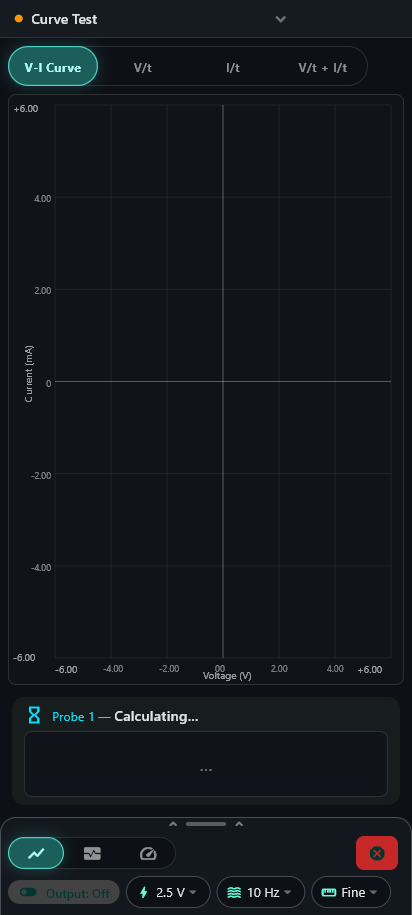

**Compare**, **Board Record** and **Board Test** are under **Tools**. General options are under **Settings**. The connection panel provides network discovery, direct connection to the device network and manual IP entry.

Mobile firmware updates are not supported. **Update** downloads the new version of the mobile application and opens the Android installer.

### 19. Software updates

**Settings → Update** checks application and KMY MMD-100 firmware versions. Application updates launch installation; closing and reopening with the updated version is expected behavior.

* Application updates do not require a device connection.
* Firmware updates require a computer and a physical **USB cable**. They cannot run over Wi-Fi or from the mobile application.
* Update checks require internet access. If unavailable, the application informs the user and preserves the existing installation.

## Part G — Reference Information

### 20. Specifications and limits

| Parameter | Value |
| :--- | :--- |
| **Test voltage** | $\pm 15\text{ V}$ peak |
| **Test frequency** | $1\text{ Hz} - 1000\text{ Hz}$ |
| **Oscilloscope / voltmeter input limit** | $50\text{ V}$ max |
| **Oscilloscope sample rate** | $5.5\text{ kS/s}$ (fixed in hardware) |
| **Oscilloscope record depth** | Last $20\text{ seconds}$, continuous |
| **Power** | From the USB port |

**Safety and operating rules**

* Disconnect board power and discharge high-capacity capacitors before curve testing.
* Test signals are generated only in **Curve Test** mode. The generator is off in Oscilloscope and Multimeter modes.
* The red **STOP** button immediately cuts test output voltage while the connection is active.
* Test output remains unavailable until startup preparation is complete.
* The instrument is not designed for **220 V AC mains**. Do not connect probes to outlets or high-voltage lines.

### 21. Common problems and fixes

* **Device not listed:** Check the USB cable and computer port. For Wi-Fi, confirm the same network and enter the IP manually if needed.
* **Controls locked after connection:** Allow 13-15 seconds for startup preparation.
* **Test output unavailable:** Wait for startup preparation, then power the device off and on. Contact KMY Electronics support if the problem persists.
* **Horizontal curve:** Check probe contact, test voltage and current range. If appropriate, raise voltage one level or select a finer range.
* **Yellow warning in Synced mode:** Probe loads may differ or one probe may be open. Use single-probe mode for precise measurements.
* **NO READING:** Check contact. Try **Fine** for high-impedance components.
* **BUSY:** Another client is connected. Close that connection on the other computer or mobile device.
* **Measurement drift:** Power the device off and on. If drift or warnings persist, contact KMY Electronics support.
* **Distorted oscilloscope waveform:** Check frequency. At 5.5 kS/s, waveforms above 1 kHz cannot be reliably examined.
* **Device not found on mobile:** Confirm the same network. In AP mode, connect the phone to **KMY MMD-100**.

### 22. Support and contact

Contact KMY Electronics for technical questions and support:

* [GitHub product page](https://github.com/kmyelectronicseu-png/kmy-mmd1)
* [kmyelectronics.eu@gmail.com](mailto:kmyelectronics.eu@gmail.com)

Include the device serial, application version and a description of the issue. The serial is shown in **Settings**, on the **Device serial** line.
