# KMY MMD-100 Analizador de Circuitos y Detector de Averías — Manual de Usuario

KMY MMD-100 permite examinar placas electrónicas sin alimentación mediante el análisis de curvas de corriente y tensión y la comparación con mediciones de referencia. El osciloscopio de baja frecuencia de dos canales y la función de medición de tensión reúnen el análisis de señales y las mediciones de tensión en un mismo equipo.

Esta guía describe la instalación en Windows y Android, los ajustes de medición, el registro y la prueba de placas, las opciones de conexión y la resolución de problemas.

## Parte A — Descripción general

### 1. Finalidad y funciones

KMY MMD-100 examina el comportamiento eléctrico de los componentes y ayuda a localizar puntos sospechosos sin aplicar alimentación a la placa. La prueba de curva, la comparación con referencias y la medición de tensión utilizan modos de funcionamiento distintos.

* **Prueba de curva (análisis V-I):** Aplica una señal de prueba de bajo nivel para representar la corriente frente a la tensión y evaluar resistencias, condensadores, bobinas, diodos y zéner.
* **Registro y prueba de placas:** Compara cada punto de placas del mismo modelo con las referencias guardadas de una placa en buen estado. Puede utilizarse en mantenimiento, reparación y controles de producción.
* **Osciloscopio y multímetro:** Permiten examinar señales y medir tensión en circuitos alimentados dentro de los límites de entrada. La prueba de curva requiere una placa sin alimentación.

### 2. Equipo y conexiones

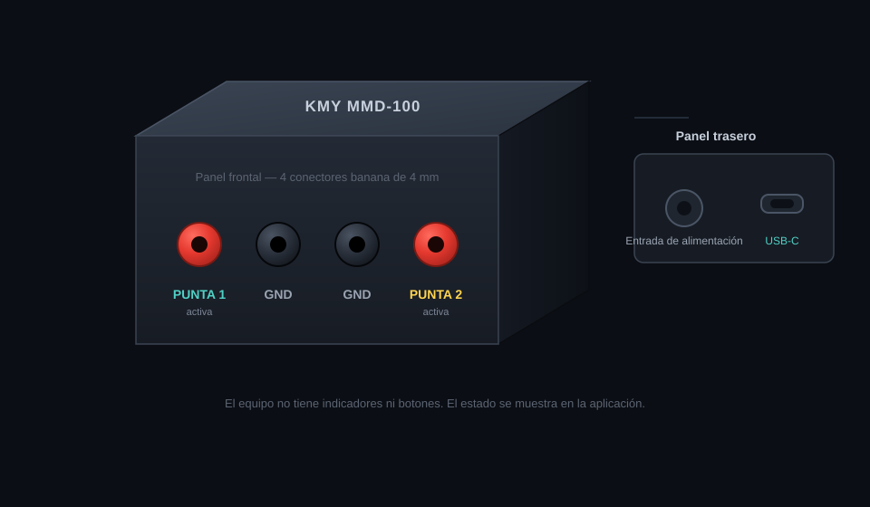

El panel frontal dispone de cuatro bornes de 4 mm. Los exteriores son las conexiones activas **Sonda 1** y **Sonda 2**; los interiores corresponden a **masa (GND)**. Conecte un terminal del componente a una sonda activa y el otro al borne GND contiguo.

El puerto **USB-C** trasero derecho proporciona conexión con el ordenador, transferencia de datos y alimentación. La **entrada de alimentación externa** de la izquierda está reservada para una alimentación independiente.

La carcasa no contiene botones ni LED. Consulte la alimentación, el estado de conexión y el modo de funcionamiento en la aplicación de ordenador o móvil.

### 3. Requisitos del sistema y preparación

El uso con ordenador requiere un cable USB y Windows 10 o Windows 11 de 64 bits. El uso móvil requiere Android 7.0 o posterior y un teléfono o tableta con procesador ARM de 64 bits. La instalación en Windows no necesita permisos de administrador.

> **Desconecte la alimentación de la placa y descargue sus condensadores antes de realizar la prueba de curva.** El equipo aplica su propia señal de prueba en este modo. Un circuito alimentado puede alterar las medidas y dañar permanentemente la placa o el equipo.

## Parte B — Instalación y primera conexión

### 4. Instalación del software

#### Instalación en Windows

1. Abra la [página de la versión más reciente](https://github.com/kmyelectronicseu-png/kmy-mmd1/releases/latest).
2. Descargue y ejecute **KMY-MMD-100-Kurulum.exe**.
3. Seleccione el idioma de instalación. Solo afecta al asistente; el idioma de la aplicación se cambia en **Ajustes**.
4. Complete los pasos. La aplicación se instala en `%LocalAppData%\Programs\KMY MMD-100`.

Los demás archivos de la página de versiones los utiliza la actualización automática de la aplicación; no es necesario descargarlos. La desinstalación conserva los proyectos de placas y los informes exportados en **Documentos**; restablece preferencias como el idioma.

#### Instalación en Android

1. Descargue y abra **KMY-MMD-100-Mobil.apk** desde la misma página.
2. Active el permiso de instalación desde esa fuente cuando Android lo solicite y complete la instalación.
3. Utilice Android 7.0 o posterior con un procesador ARM de 64 bits.

La aplicación móvil se conecta exclusivamente mediante Wi-Fi. Las funciones de medición, análisis y prueba equivalen a las de escritorio. Las actualizaciones del firmware requieren ordenador y USB; no pueden realizarse desde el teléfono.

### 5. Primera conexión con el equipo

Conecte el cable USB y abra **KMY MMD-100**. Seleccione el equipo en la lista superior y pulse **Conectar**.

La preparación inicial dura aproximadamente **13-15 segundos**. Durante este periodo, la salida de prueba y la selección de modo permanecen bloqueadas. El indicador de conexión verde señala que el equipo está listo.

Si la conexión falla inmediatamente después de conectar el cable, espere unos segundos y vuelva a intentarlo. Si persiste, apague y encienda el equipo y contacte con el soporte de KMY Electronics.

### 6. Primera medición

Utilice una resistencia de valor conocido **entre 100 Ω y 10 kΩ** para la primera medición.

1. Conecte un terminal a **Sonda 1** y el otro al **GND** contiguo.
2. Seleccione **Voltaje: Bajo** y **Rango de Corriente: Medio**.
3. Pulse **Salida: Apagado** para pasar a **Salida: Encendido**.
4. Examine la recta inclinada y el valor calculado de resistencia en la ficha bajo el gráfico.
5. Pulse **Salida** de nuevo o retire la resistencia para terminar.

La galería de firmas describe las curvas de otros componentes.

## Parte C — Prueba de curva y análisis V-I

### 7. Cómo funciona la prueba de curva

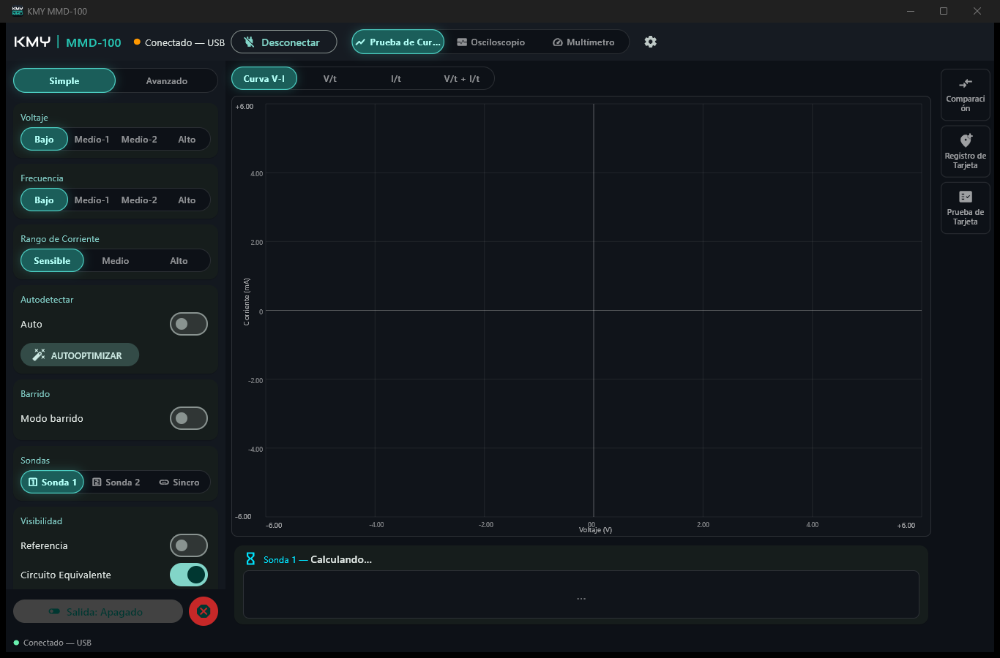

Los ajustes están a la izquierda, el gráfico en el centro y **Comparación**, Registro de Tarjeta y Prueba de Tarjeta a la derecha.

En una prueba senoidal, el equipo aplica tensión alterna y mide simultáneamente la corriente. Al representar corriente frente a tensión obtiene la curva V-I. Una resistencia produce una recta inclinada, un condensador una elipse y un diodo una transición definida hacia la conducción.

La curva representa el comportamiento entre los dos terminales medidos. Las sondas independientes pueden utilizarse individualmente o en modo **Sincro**.

### 8. Ajustes básicos de medición

La vista **Simple** ofrece tensión, frecuencia y rango de corriente. Para tensión y frecuencia están disponibles **Bajo, Medio-1, Medio-2, Alto**.

| Nivel | Tensión (valor de pico) | Frecuencia |
| :--- | :---: | :---: |
| **Bajo** | 2,5 V | 10 Hz |
| **Medio-1** | 5 V | 50 Hz |
| **Medio-2** | 10 V | 100 Hz |
| **Alto** | 15 V | 1000 Hz |

* **Voltaje:** Determina la tensión de pico de prueba. Comience por el nivel más bajo en componentes desconocidos. Aumente gradualmente si no se alcanza el umbral de conducción de la unión semiconductora.
* **Frecuencia:** Ayuda a evaluar el comportamiento reactivo. La pendiente de una resistencia ideal no depende de la frecuencia. Por ejemplo, un condensador de 100 nF muestra una curva estrecha a 10 Hz y una elipse más definida a 1000 Hz.
* **Rango de Corriente:** Determina la sensibilidad de la medición de corriente.

| Rango | Dónde se usa |
| :--- | :--- |
| **Sensible** | Condensadores, resistencias de valor alto y componentes delicados que consumen muy poca corriente. |
| **Medio** | Arranque seguro con una pieza desconocida. |
| **Alto** | Resistencias de valor bajo, diodos en conducción y piezas robustas que consumen mucha corriente. |

Si la curva aparece recortada o se muestra una advertencia, reduzca la tensión o seleccione un rango de corriente menos sensible. Los componentes de corriente muy baja pueden dar una línea horizontal en **Alto**; repita la medida en **Sensible**. Una línea horizontal no confirma por sí sola una avería.

### 9. Leer la curva: galería de firmas de componentes

La ficha de resultados muestra el tipo de componente deducido, el valor calculado y el nivel de confianza. Los 12 ejemplos siguientes facilitan la interpretación.

**Deriva esperada** indica la diferencia prevista respecto a un multímetro de referencia en las condiciones actuales, por ejemplo **Deriva esperada +2,19 %…+3,01 %**. Depende del rango de corriente y del valor del componente. Si las condiciones están fuera del alcance admitido, la señal no es senoidal/CA, las cargas de las sondas difieren mucho o el equipo no está listo, aparece una explicación en lugar del número. «Por debajo de los límites de referencia» indica una diferencia menor que el límite de tolerancia de la medida de referencia.

KMY MMD-100 mide entre dos terminales. No clasifica por sí solo los componentes de tres terminales como transistor o MOSFET. El usuario debe identificar los terminales utilizados; el resultado describe el comportamiento entre ellos.

#### Resistencia
Recta inclinada que pasa por el centro. La pendiente aumenta al reducir la resistencia y disminuye al aumentarla. En una resistencia ideal no varía con la frecuencia.

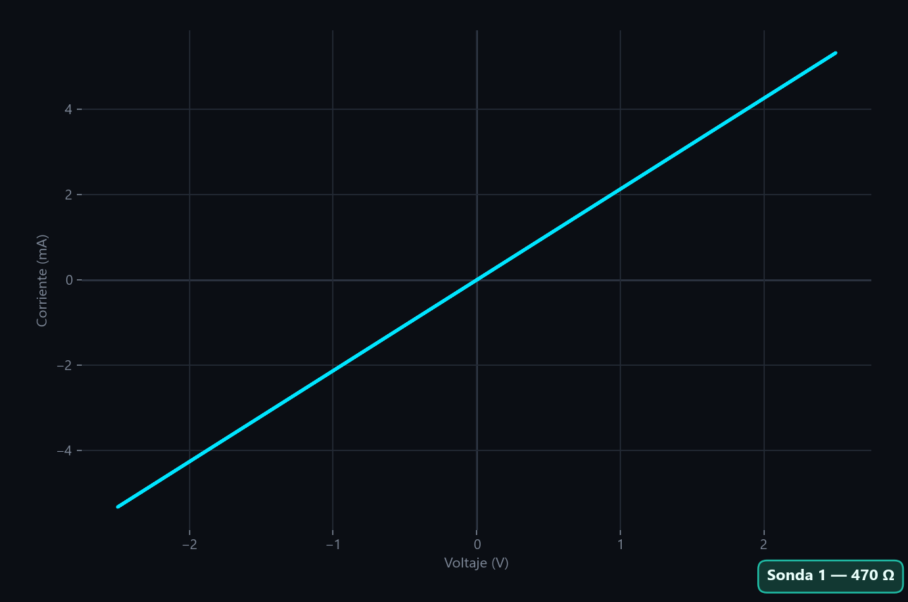

#### Condensador
Curva elíptica que se ensancha al aumentar la frecuencia y se estrecha al reducirla.

#### Bobina
Curva elíptica que se estrecha al aumentar la frecuencia y se ensancha al reducirla, al contrario que el condensador.

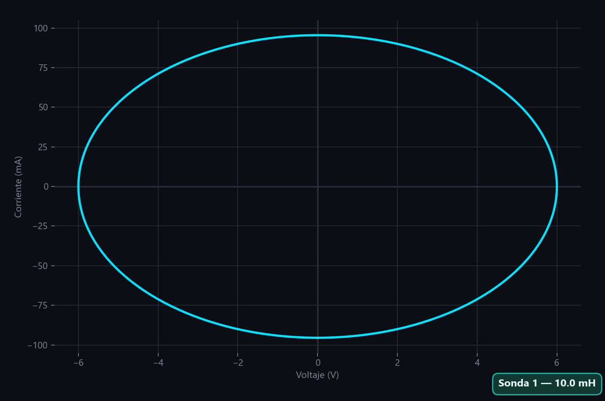

#### Condensador y ESR
La resistencia en serie inclina la elipse. La ficha muestra por separado capacidad y resistencias paralela y serie.

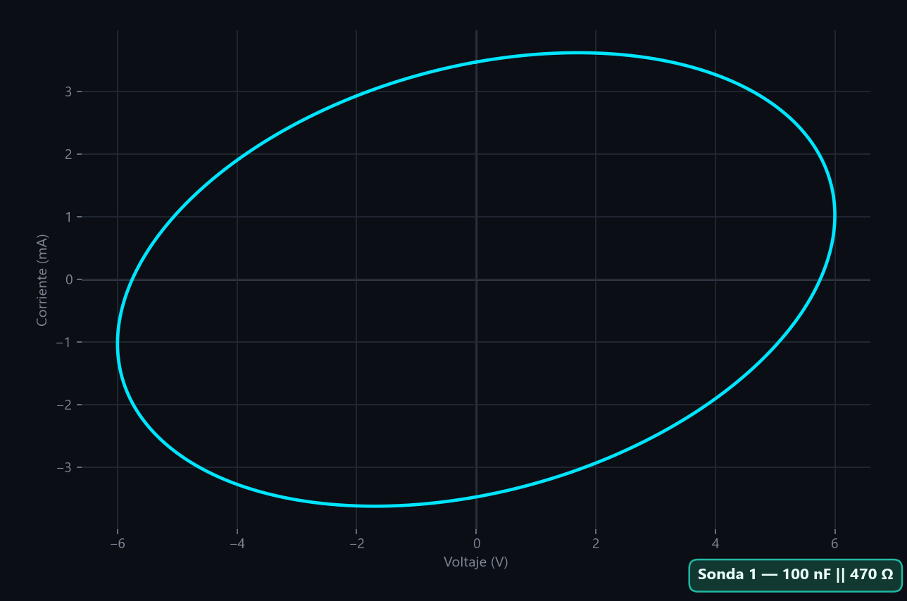

#### Diodo
Región de corte recta y transición definida a conducción. Los diodos de silicio suelen conducir alrededor de 0,6 V - 0,7 V; el umbral puede ser menor en Schottky y mayor en LED.

#### Diodo zéner
Muestra conducción directa y ruptura inversa. La tensión máxima de prueba de 15 V impide observar rupturas por encima de ese límite.

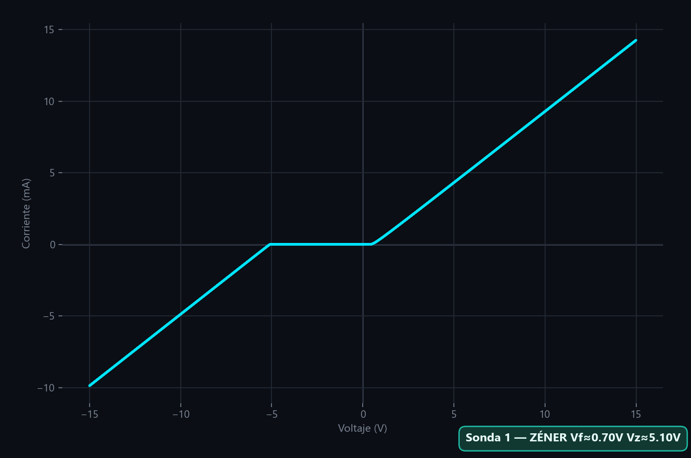

#### Diodo TVS
Un TVS unidireccional se comporta de forma similar a un zéner y puede mostrarse como **ZÉNER**. Un TVS bidireccional puede aparecer como **|Z|** o **No identificado** por su ruptura simétrica. No existe una clasificación TVS independiente.

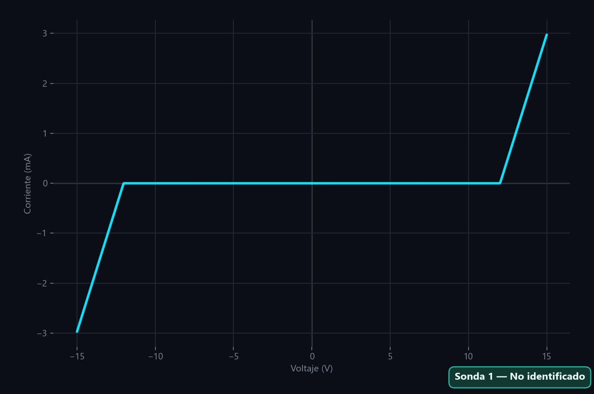

#### MOSFET puerta-fuente
El aislamiento de puerta produce una corriente muy baja. Unos pocos picofaradios en MOSFET de pequeña señal pueden quedar por debajo del límite de medida y mostrar **CIRCUITO ABIERTO**. Unos pocos nanofaradios en MOSFET de potencia pueden formar una elipse estrecha. Un circuito abierto no indica por sí solo una avería.

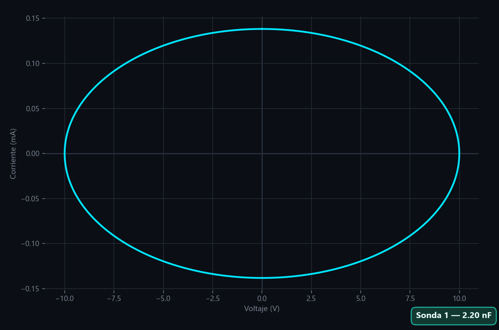

#### MOSFET drenador-fuente
Con la puerta unida a la fuente o sin conectar, puede observarse el diodo interno y mostrarse **DIODO**. La tensión directa puede ser algo mayor que la de un diodo de señal.

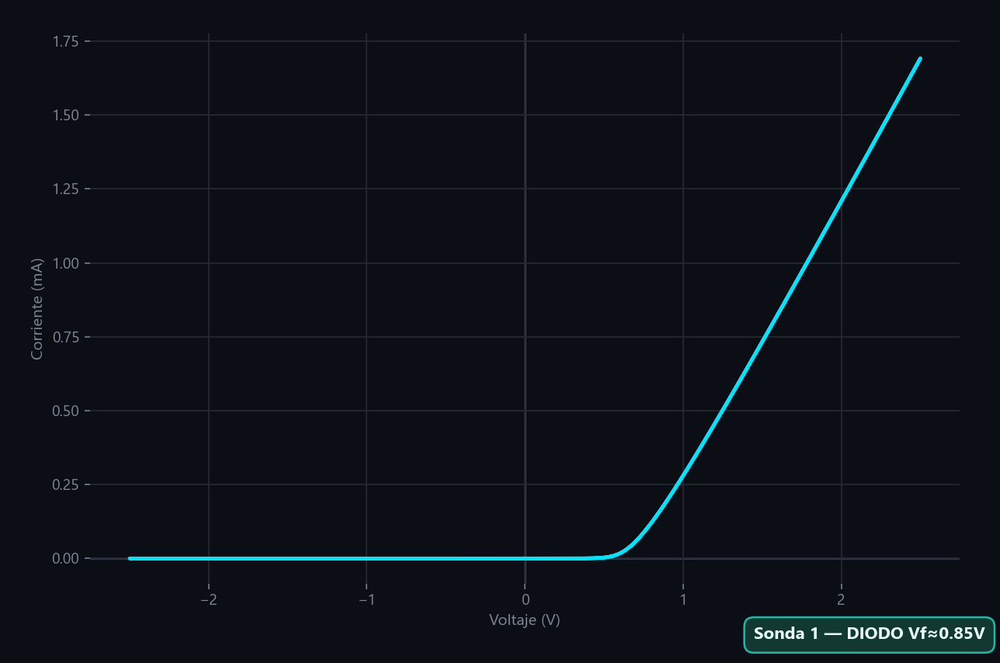

#### Transistor base-emisor
Se comporta como una unión de diodo y aparece como **DIODO**. La tensión directa típica es de 0,65 V - 0,70 V.

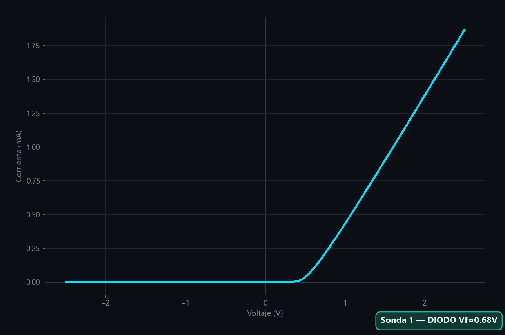

#### Transistor base-colector
Se comporta como una unión de diodo. El umbral puede ser algo menor que en base-emisor; el resultado sigue siendo **DIODO**.

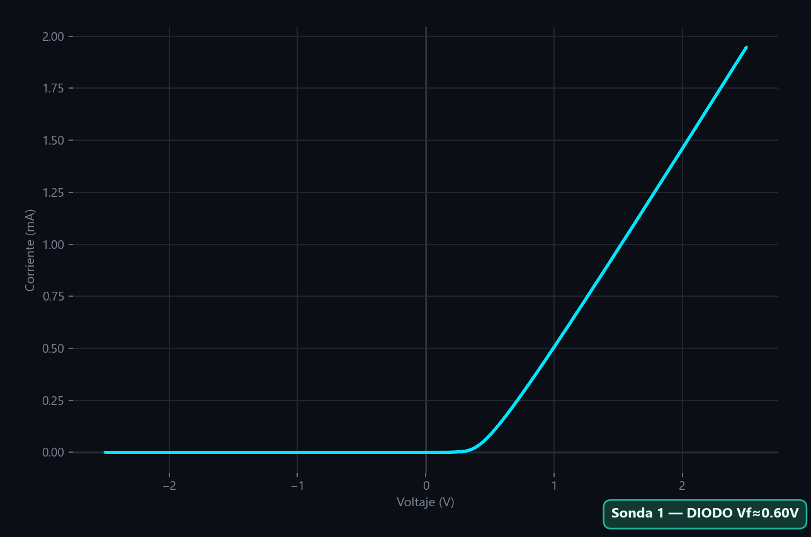

#### Transistor colector-emisor
Con la base sin conectar puede mostrarse **CIRCUITO ABIERTO**. Sin excitación de base, este resultado no demuestra por sí solo una avería.

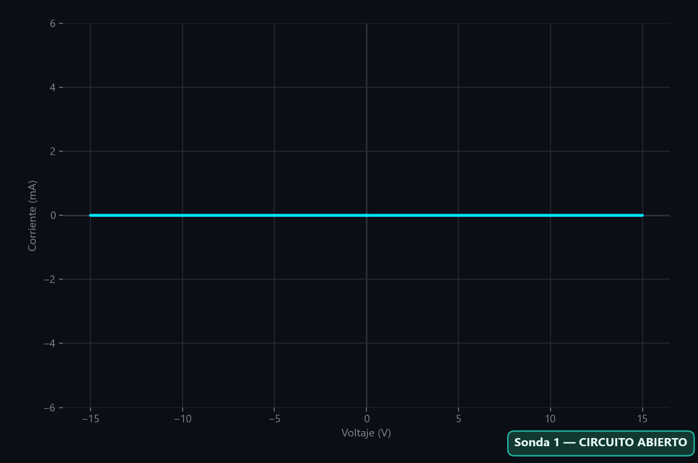

Las medidas en circuito incluyen el efecto conjunto de los caminos en paralelo. Si el resultado es dudoso, desconecte un terminal del componente de la placa y repita la medida.

### 10. Ajustes avanzados de medición

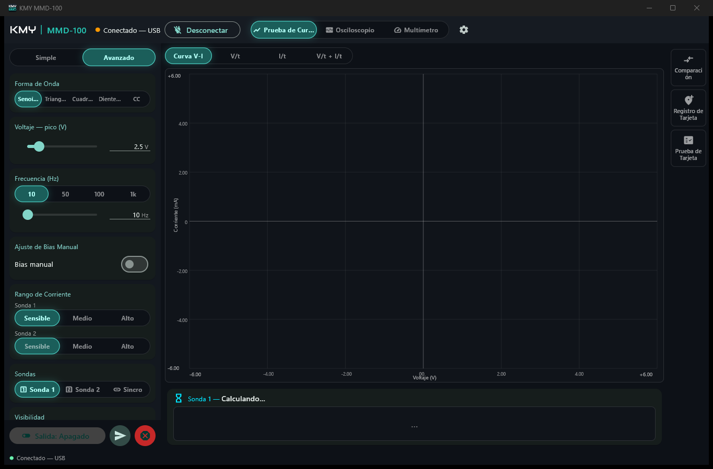

En **Avanzado**, la tensión puede ajustarse entre 0,1 - 15 V y la frecuencia entre 1 - 1000 Hz.

* **Forma de Onda:** Senoidal, Triangular, Cuadrada, Diente de Sierra o CC. El análisis utiliza la senoidal; CC aplica una tensión constante.
* **Bias manual:** Desplaza el centro de la señal respecto a cero. Mantenga pulsado un botón de dirección y seleccione pasos de 0.010 V, 0.100 V o 1.000 V. **Restablecer** devuelve el centro a cero. Está desactivado por defecto; actívelo solo cuando una prueba específica lo requiera.
* **Rango de Corriente:** Se ajusta de forma independiente para Sonda 1 y Sonda 2. Utilice el mismo rango al comparar; rangos distintos afectan a la superposición.

Los cambios se envían al soltar el control. **Aplicar** transmite los ajustes inmediatamente.

* **Autodetectar:** Selecciona tensión, frecuencia y rango según la identificación del componente. Requiere al menos tres resultados iguales consecutivos antes de cambiar ajustes.
* **AUTOOPTIMIZAR:** Busca una vez los ajustes adecuados. Si los encuentra, los aplica; si no, conserva los actuales.
* **Modo barrido:** Varía tensión, frecuencia o rango dentro del intervalo elegido y mantiene fijos los otros dos. Las curvas que cambian con la frecuencia ayudan a evaluar el comportamiento reactivo; las estables, el predominantemente resistivo.

En **Visibilidad**, **Referencia** muestra la curva guardada junto a la medida en vivo. **Circuito Equivalente** dibuja el circuito sencillo deducido. **Congelar** mantiene la curva en pantalla.

### 11. Uso de las dos sondas y modo Sincro

**Sonda 1** y **Sonda 2** aplican la señal a una sola sonda seleccionada. **Sincro** alimenta ambas simultáneamente desde una fuente común.

Una diferencia importante de carga genera un aviso amarillo en la barra de estado o el panel móvil. Si una sonda está abierta, la otra lectura puede presentar aproximadamente **1 %** de desviación. El aviso no invalida automáticamente el resultado; indica que debe considerarse el equilibrio de carga.

Para comparaciones precisas, termine la medida en modo individual **Sonda 1** o **Sonda 2**.

## Parte D — Comparación y prueba de placas

### 12. Funciones de comparación

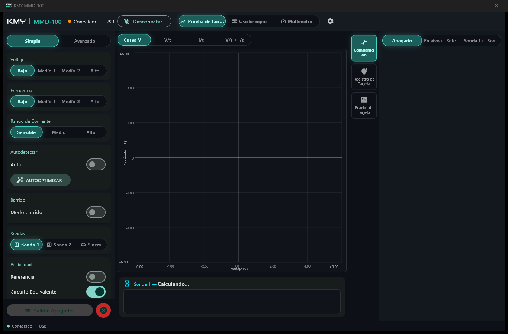

**Comparación** ofrece tres opciones:

* **Apagado:** Desactiva la comparación.
* **En vivo ↔ Referencia:** Compara la curva actual con una referencia. **Capturar Referencia** guarda la curva actual; puede almacenarla en un archivo y cargarla después.
* **Sonda 1 ↔ Sonda 2:** Compara un componente en buen estado con otro sospechoso. La medida simultánea reduce los efectos de cambios temporales y ambientales.

La similitud se compara con el umbral elegido. Por encima aparece **COINCIDE**; por debajo, **NO COINCIDE**. El umbral predeterminado es **90 %**. **Sensibilidad de codo** ofrece Apagado, Normal y Alto para evaluar diferencias en las transiciones.

Sin corriente medible aparece **SIN LECTURA**. Revise contacto y rango. **Alerta sonora** avisa cuando el resultado cambia entre coincidencia y discrepancia.

La discrepancia indica una diferencia respecto a la referencia. Evalúe posibles averías junto con el circuito y otras mediciones.

### 13. Registro de tarjeta y sistema de prueba de tarjeta

El registro crea un plan de prueba de referencia para reparar y verificar placas del mismo modelo.

#### Registrar una referencia

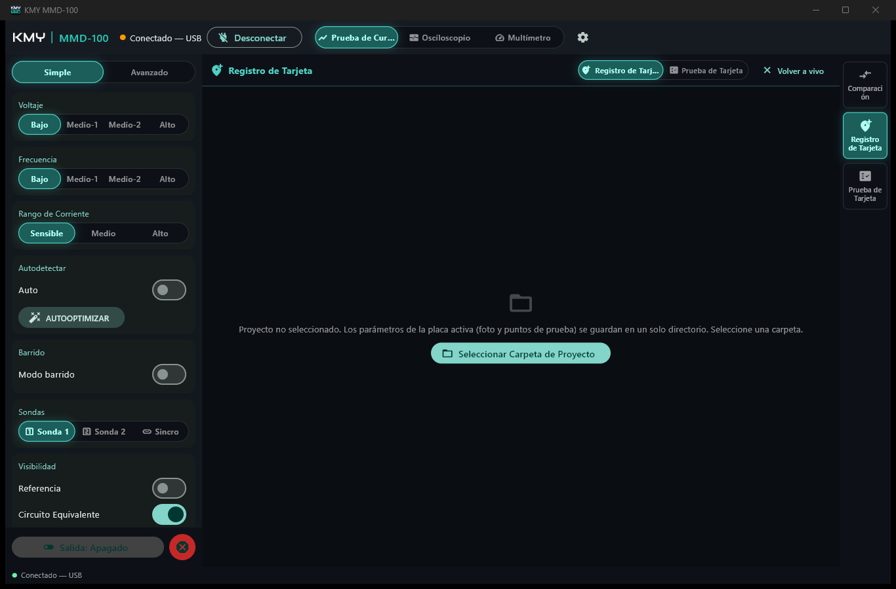

1. **Cree una carpeta de proyecto.** La foto y los puntos se guardan juntos. Copie la carpeta para abrir el proyecto en otro ordenador.
2. **Añada la imagen de la placa.** Utilice una fotografía nítida, sin sombras y tomada desde arriba.
3. **Defina los puntos.** Toque el punto con la sonda, seleccione su posición en la fotografía y asígnele un nombre como R14, C7 o U3-1. Pulse **GUARDAR PUNTO**.
4. **Ordene la secuencia.** Arrastre los puntos al orden de prueba requerido.

**Firma multietapa** registra cada punto en 3 o 4 niveles de tensión y frecuencia. El registro tarda más y la comparación abarca varias condiciones.

#### Probar una placa registrada

Pulse **Iniciar Prueba** y toque los puntos en secuencia. Cada medida se compara con la referencia y se marca como coincidencia o discrepancia. Los puntos discrepantes aparecen como **marcadores rojos** en la fotografía.

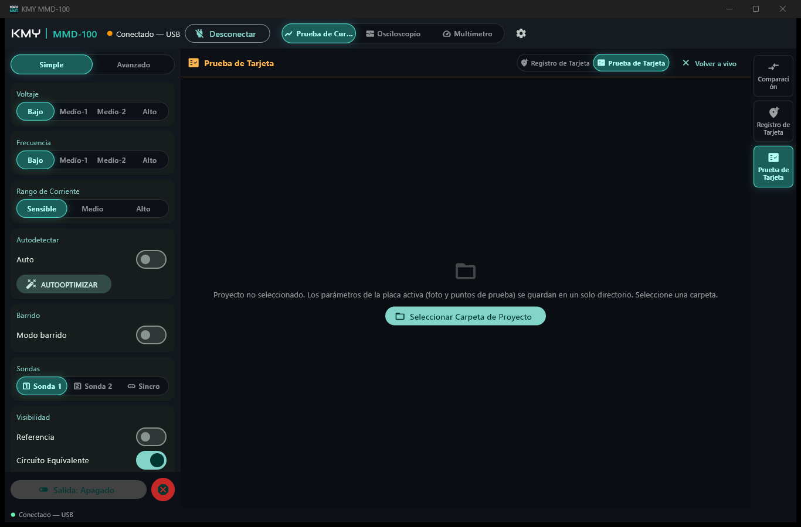

Puede pausar o saltar puntos. **Probar restantes** completa los que no se han medido. **Avance Automático** pasa al siguiente punto tras una coincidencia.

**Exportar Reporte Excel** genera tres hojas de cálculo: medidas por punto, tabla resumen y mapa de coincidencias y discrepancias.

## Parte E — Osciloscopio y multímetro

### 14. Modo osciloscopio

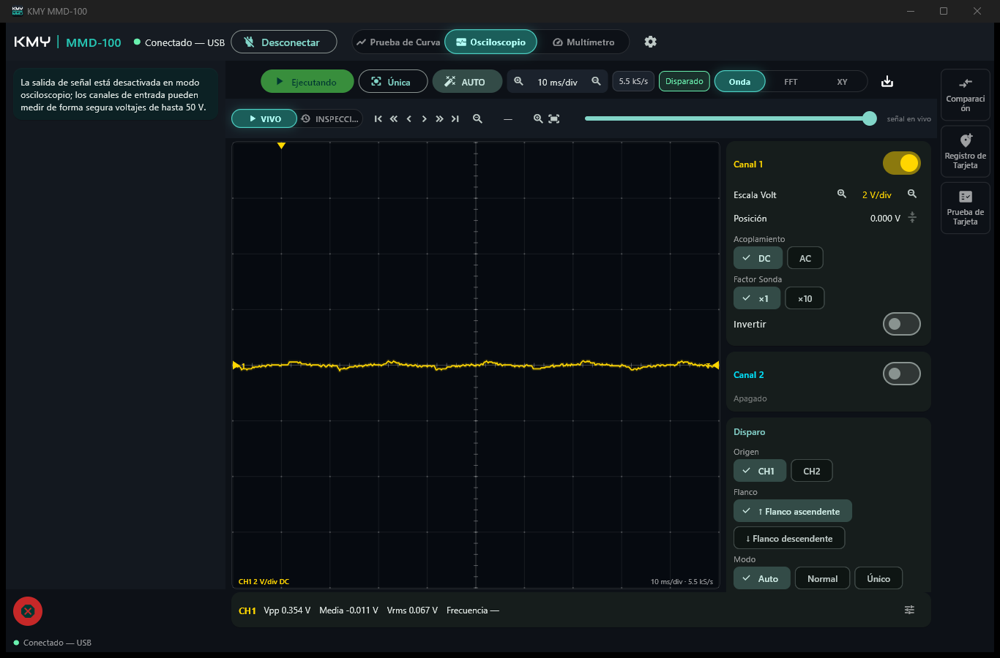

En modo osciloscopio, el generador de prueba está apagado y las sondas miden señales externas. El límite de entrada es **50 V**. Canal 1 es **amarillo** y Canal 2 **cian**. En prueba de curva, Sonda 1 es cian y Sonda 2 amarilla.

El muestreo fijo es de **5,5 kS/s**, es decir, 5500 muestras por segundo. La base de tiempos solo cambia el intervalo mostrado. Utilice el equipo como **osciloscopio de baja frecuencia**; por encima de 1 kHz la forma de onda no es fiable. Pueden examinarse ondulación de alimentación y salidas de controladores de motor dentro de estos límites.

* **AUTO (ajuste automático):** Ajusta base de tiempos, escala de tensión y nivel de disparo. Sin señal útil conserva los ajustes.
* **Auto:** Actualiza la pantalla sin necesitar disparo.
* **Normal:** Actualiza solo al cumplirse la condición de disparo.
* **Single:** Captura una vez y mantiene la imagen.

Arrastre con el ratón los indicadores de línea base y disparo. **INSPECCIONAR** detiene el flujo para revisar **los últimos 20 segundos**, registrados continuamente en segundo plano.

La barra inferior muestra **Vpp**, **Media**, **Vrms** y **Frecuencia**. Puede elegir entre **11 parámetros de medición**. Las tensiones se muestran en voltios con tres decimales.

### 15. Modo multímetro

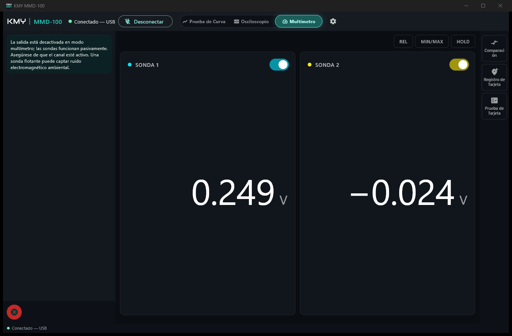

Ambas sondas miden tensión de forma independiente y simultánea. KMY MMD-100 selecciona automáticamente CA/CC y rango. Los valores se muestran en voltios (V) con tres decimales, por ejemplo **0.068 V**. El interruptor superior derecho de cada ficha activa o desactiva el canal.

* **REL (medición relativa):** Toma el valor inicial como cero y muestra las diferencias posteriores.
* **MIN/MAX:** Registra el mínimo y el máximo.
* **HOLD:** Mantiene el valor mostrado.

La salida de prueba está desactivada. Active el canal necesario. Una sonda desconectada puede mostrar ruido electromagnético captado del entorno.

## Parte F — Ajustes y conexión

### 16. Ajustes del sistema

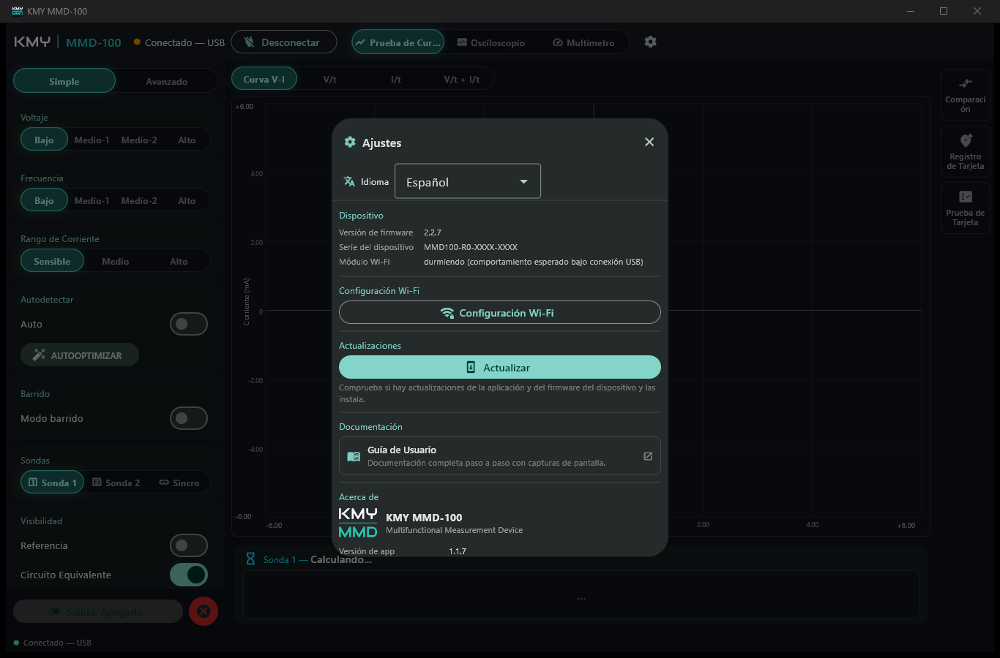

Abra **Ajustes** mediante el icono de engranaje superior. Puede seleccionar turco, inglés, alemán, español o francés.

El panel muestra la versión de firmware y el número de serie del equipo, las herramientas Wi-Fi y un enlace a esta guía. La versión de la aplicación se encuentra en **Acerca de**. **Actualizar** comprueba las versiones de aplicación y firmware. El firmware requiere conexión USB para actualizarse.

### 17. Uso inalámbrico y configuración Wi-Fi

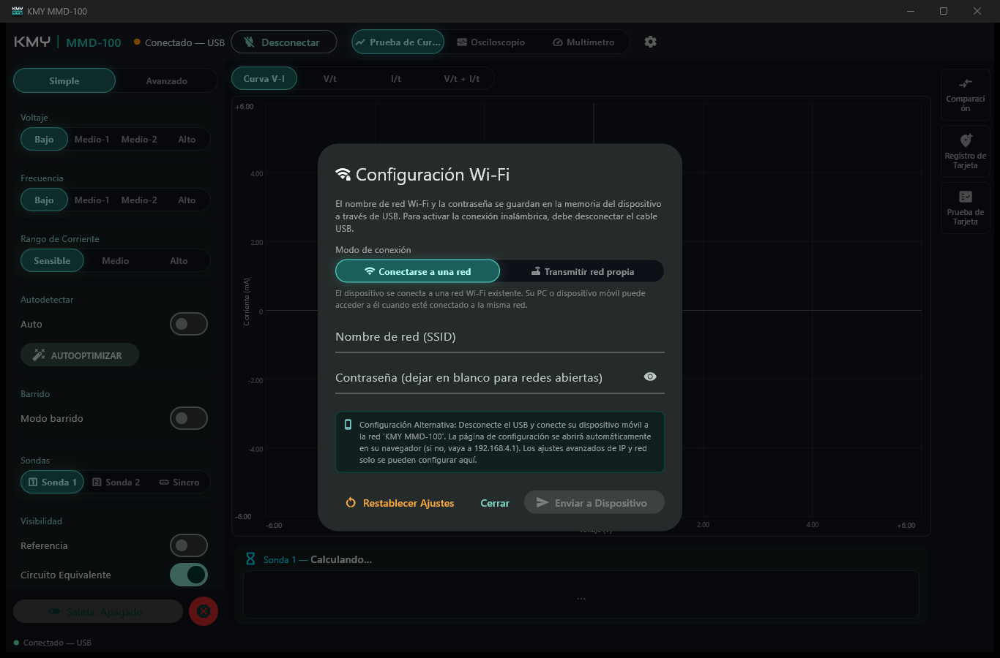

Wi-Fi admite dos opciones:

1. **Modo estación:** El equipo se une a una red existente; ordenador o móvil se conectan por la misma red.
2. **Modo punto de acceso (AP):** El equipo crea su propia red para la conexión directa.

#### Configurar Wi-Fi desde la aplicación

Con USB conectado, abra **Ajustes → Configuración Wi-Fi**. Seleccione modo, escriba SSID y contraseña y envíe los ajustes.

#### Configurar Wi-Fi desde el navegador

El punto de acceso predeterminado emite la red **KMY MMD-100**. Conecte el teléfono u ordenador. Si la página no se abre automáticamente, introduzca **192.168.4.1** en el navegador. Los ajustes avanzados, como IP fija, solo están en esta interfaz. El equipo debe permanecer alimentado durante el uso inalámbrico.

#### El equipo no aparece en la red

Introduzca su dirección mediante **IP Manual**. Algunos routers impiden que los equipos de la red se encuentren entre sí. Consulte la dirección en la lista del router o la interfaz web del equipo. En Android, la entrada manual está debajo de la pantalla de conexión.

Solo se admite una conexión simultánea; **OCUPADO** indica otro cliente conectado. **Restablecer Ajustes** recupera la configuración inalámbrica predeterminada.

### 18. Uso en dispositivos móviles (teléfono/tableta)

Android ofrece las funciones de medición, análisis y prueba de Windows con una disposición móvil.

* **Barra de estado superior:** Se abre al tocar o deslizar hacia abajo. Muestra calidad de conexión, avisos y motivos de bloqueo. Contiene **Herramientas**, **Ajustes** y **Conectar/Desconectar**; se abre automáticamente ante avisos críticos.
* **Barra de control inferior:** Se abre al tocar o deslizar hacia arriba y permanece a la altura elegida. Contiene ajustes, Prueba de Curva, Osciloscopio y Multímetro, y accesos a Voltaje, Frecuencia y Rango de Corriente.

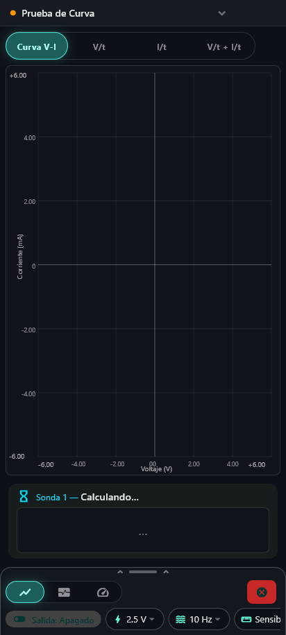

**Comparación**, **Registro de Tarjeta** y **Prueba de Tarjeta** están en **Herramientas**; las opciones generales, en **Ajustes**. El panel de conexión ofrece búsqueda en red, conexión directa a la red del equipo e IP manual.

No se actualiza el firmware desde el móvil. **Actualizar** descarga la nueva versión de la aplicación móvil y abre el instalador de Android.

### 19. Actualizaciones de software

**Ajustes → Actualizar** comprueba las versiones de aplicación y firmware de KMY MMD-100. La actualización inicia la instalación; es normal que la aplicación se cierre y vuelva a abrirse con la nueva versión.

* La actualización de la aplicación no necesita conexión con el equipo.
* El firmware requiere un ordenador y **cable USB** conectado. No se actualiza por Wi-Fi ni desde la aplicación móvil.
* La comprobación requiere internet. Si no está disponible, la aplicación informa y conserva la instalación existente.

## Parte G — Información de referencia

### 20. Límites técnicos y parámetros

| Parámetro | Valor |
| :--- | :--- |
| **Voltaje de prueba** | $\pm 15\text{ V}$ pico (peak) |
| **Frecuencia de prueba** | $1\text{ Hz} - 1000\text{ Hz}$ |
| **Límite de entrada de osciloscopio / voltímetro** | Máximo $50\text{ V}$ |
| **Frecuencia de muestreo del osciloscopio** | $5,5\text{ kS/s}$ (fija en hardware) |
| **Profundidad de registro del osciloscopio** | Últimos $20\text{ segundos}$, sin cortes |
| **Alimentación** | Por el puerto USB |

**Reglas de seguridad y uso**

* Desconecte la alimentación y descargue los condensadores de gran capacidad antes de la prueba de curva.
* La señal de prueba solo se genera en **Prueba de Curva**. El generador está apagado en Osciloscopio y Multímetro.
* El botón rojo **PARADA** corta inmediatamente la tensión de prueba mientras la conexión permanece activa.
* La salida de prueba permanece bloqueada hasta terminar la preparación inicial.
* El equipo no está diseñado para **220 V CA de red**. No conecte sondas a enchufes ni líneas de alta tensión.

### 21. Problemas frecuentes y soluciones

* **Equipo no listado:** Revise cable USB y puerto. En Wi-Fi, confirme la misma red e introduzca la IP manualmente si es necesario.
* **Controles bloqueados al conectar:** Espere 13-15 segundos para la preparación inicial.
* **Salida de prueba bloqueada:** Espere la preparación y apague y encienda el equipo. Si persiste, contacte con KMY Electronics.
* **Curva horizontal:** Revise contacto, tensión y rango. Si procede, aumente un nivel de tensión o elija un rango más sensible.
* **Aviso amarillo en Sincro:** Las cargas pueden diferir o una sonda estar abierta. Utilice una sola sonda para medidas precisas.
* **SIN LECTURA:** Revise el contacto. Pruebe **Sensible** en componentes de alta impedancia.
* **OCUPADO:** Otro cliente está conectado. Cierre esa conexión.
* **Desviación de medidas:** Apague y encienda. Si la desviación o los avisos continúan, contacte con KMY Electronics.
* **Onda deformada:** Revise la frecuencia. Con 5,5 kS/s no se examinan de forma fiable ondas por encima de 1 kHz.
* **Equipo no encontrado en móvil:** Confirme la misma red. En modo AP, conecte el teléfono a **KMY MMD-100**.

### 22. Soporte técnico y contacto

Contacte con KMY Electronics para consultas técnicas y asistencia:

* [Página del producto en GitHub](https://github.com/kmyelectronicseu-png/kmy-mmd1)
* [kmyelectronics.eu@gmail.com](mailto:kmyelectronics.eu@gmail.com)

Incluya número del equipo, versión de aplicación y descripción del problema. El número figura en **Ajustes**, en la línea **Serie del dispositivo**.
