# Guide de l'Utilisateur de l'Analyseur de Circuits et de l'Appareil de Détection de Pannes KMY MMD-1

Le KMY MMD-1 est un appareil professionnel de détection de pannes et d'essais qui permet la localisation de composants défectueux sur des cartes électroniques sans qu'il soit nécessaire d'appliquer d'énergie à la carte. Lorsque deux sondes sont mises en contact avec les bornes du composant suspecté, l'appareil applique un signal de test de faible niveau, normalisant graphiquement sur l'écran la relation dynamique entre la tension et le courant. Cette courbe caractéristique résultante est considérée comme "l'empreinte digitale" électrique du composant. Selon la forme de la courbe sur le graphique, il peut être immédiatement déterminé si le composant est une résistance, un condensateur ou une diode défectueuse. Le système dispose également d'un oscilloscope et d'un voltmètre à deux canaux intégrés.

L'appareil peut être utilisé en le connectant à un ordinateur doté du système d'exploitation Windows via un câble USB, ou il peut être opéré à l'aide de l'option de connexion sans fil. De plus, le logiciel de contrôle est pleinement compatible avec les smartphones et tablettes dotés du système d'exploitation Android.

*(Note : Le guide de l'utilisateur en anglais [user-guide-en.md](user-guide-en.md) est actuellement obsolète. Jusqu'à ce que cette version anglaise soit mise à jour, les informations techniques du présent guide mis à jour doivent être prises comme référence principale.)*

---

## Table des Matières

* **A. Introduction**
  1. [Que fait cet appareil ?](#1-que-fait-cet-appareil)
  2. [Premier aperçu de l'appareil](#2-premier-apercu-de-lappareil)
  3. [Exigences et préparation préliminaire](#3-exigences-et-preparation-preliminaire)
* **B. Installation et Première Connexion**
  4. [Installation du logiciel](#4-installation-du-logiciel)
  5. [Première connexion à l'appareil](#5-premiere-connexion-a-lappareil)
  6. [Votre première mesure](#6-votre-premiere-mesure)
* **C. Traceur de Courbes (Analyseur V-I)**
  7. [Principe de fonctionnement du test de courbe](#7-principe-de-fonctionnement-du-test-de-courbe)
  8. [Paramètres de mesure de base](#8-parametres-de-mesure-de-base)
  9. [Lecture de la courbe : Galerie de signatures de composants](#9-lecture-de-la-courbe-galerie-de-signatures-de-composants)
  10. [Paramètres de mesure avancés](#10-parametres-de-mesure-avances)
  11. [Utilisation de double sonde et mode synchrone](#11-utilisation-de-double-sonde-et-mode-synchrone)
* **D. Mode de Comparaison et Test de Cartes**
  12. [Fonctions de comparaison](#12-fonctions-de-comparaison)
  13. [Enregistrement de cartes et système de test de cartes](#13-enregistrement-de-cartes-et-systeme-de-test-de-cartes)
* **E. Autres Outils Auxiliaires**
  14. [Mode Oscilloscope](#14-mode-oscilloscope)
  15. [Mode Multimètre](#15-mode-multimetre)
* **F. Paramètres Système, Étalonnage et Connexion**
  16. [Paramètres Système](#16-parametres-systeme)
  17. [Assistant d'étalonnage](#17-assistant-detalonnage)
  18. [Utilisation sans fil et configuration Wi-Fi](#18-utilisation-sans-fil-et-configuration-wi-fi)
  19. [Utilisation sur appareils mobiles (Téléphone/Tablette)](#19-utilisation-sur-appareils-mobiles-telephonetablette)
  20. [Mises à jour logicielles](#20-mises-a-jour-logicielles)
* **G. Informations de Référence**
  21. [Limites techniques et paramètres](#21-limites-techniques-et-parametres)
  22. [Dépannage et solutions](#22-depannage-et-solutions)
  23. [Support technique et contact](#23-support-technique-et-contact)

---

## Section A — Introduction

### 1. Que fait cet appareil ?

Dans le processus de test d'une carte électronique défectueuse, appliquer de l'énergie directement sur la carte est une méthode courante, mais cette opération entraîne généralement des dommages permanents à d'autres composants sains de la carte. Le KMY MMD-1 est conçu spécifiquement pour éliminer ces risques. Grâce à cet appareil, l'état de santé des composants peut être analysé en toute sécurité en les contactant individuellement sans appliquer d'énergie à la carte.

L'appareil effectue cette détection selon trois méthodes différentes :

* **Test de Courbe (Analyse V-I) :** Applique un signal de test de faible niveau au composant pour obtenir la courbe tension-courant. Dans la plupart des cas, le système détecte automatiquement le type et la valeur du composant. Chaque classe de composants, telle que résistance, condensateur, inductance, diode et zener, trace une courbe unique. Ces courbes peuvent être examinées avec des exemples réels dans la Section 9.
* **Enregistrement de Cartes et Test de Cartes :** Cette méthode est développée spécialement pour les organisations engagées dans la production de masse ou le personnel technique effectuant des travaux répétitifs sur un même modèle de carte. Les points de test sur une carte de référence approuvée sont enregistrés une seule fois dans le système. Ensuite, les cartes suspectées d'être défectueuses sont automatiquement comparées à ces données enregistrées. L'appareil signale clairement à l'utilisateur les points s'écartant des valeurs de référence.
* **Oscilloscope et Multimètre :** Une fois la carte sous tension, les mêmes sondes et la même interface logicielle peuvent être utilisées pour surveiller les signaux en temps réel ou effectuer des mesures de tension précises.

En résumé, le KMY MMD-1 est un matériel auxiliaire professionnel conçu pour le personnel technique engagé dans la conception électronique, la détection de pannes et les activités de réparation, ainsi que pour les fabricants souhaitant effectuer une validation rapide sur les lignes de production de masse.

### 2. Premier aperçu de l'appareil

Il y a 4 entrées de prise de type banane de 4 mm sur le panneau avant de l'appareil. Les prises positionnées à l'extrême gauche et à l'extrême droite sont des sondes actives (Sonde 1 et Sonde 2). Les tests de courbe, l'oscilloscope et les mesures de multimètre sont tous effectués via ces deux entrées actives. Les deux prises du milieu sont des points de connexion de châssis (GND).

Lors de la mesure de n'importe quel composant, une borne du composant doit être connectée à la sonde active (Sonde 1 ou Sonde 2), et l'autre borne doit être connectée à la prise GND adjacente. Par exemple, lors du test d'une résistance ou d'une diode à deux bornes, une borne est connectée à la Sonde 1, et l'autre borne est connectée à la ligne de châssis (GND) adjacente.

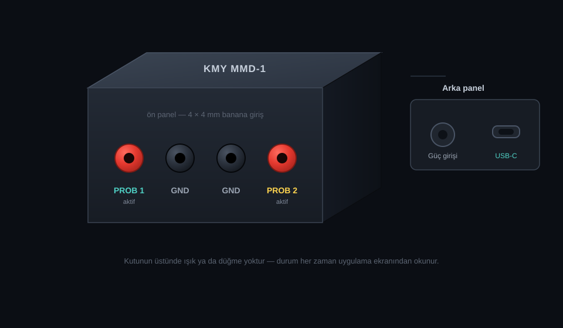

Il y a deux points de connexion sur le panneau arrière de l'appareil :
* **Entrée USB-C (Droite) :** Fournit la connexion à l'ordinateur et le transfert de données. L'appareil obtient également l'énergie nécessaire à son fonctionnement via ce port.
* **Entrée d'alimentation externe (Gauche) :** Réservée aux besoins d'alimentation alternative.

Il n'y a aucun bouton physique ni LED de notification sur le châssis de l'appareil. Les informations d'état, la connexion et les modes de fonctionnement actifs de l'appareil doivent toujours être surveillés à partir de l'écran du logiciel s'exécutant sur l'ordinateur ou l'appareil mobile.

### 3. Exigences et préparation préliminaire

Pour faire fonctionner le système, l'appareil KMY MMD-1, un câble USB et un ordinateur équipé d'un système d'exploitation Windows 10 ou Windows 11 64 bits sont suffisants. En cas d'utilisation sans fil, un smartphone ou une tablette fonctionnant sous Android 7.0 et supérieur peut être privilégié. L'installation est extrêmement simplifiée, et le logiciel peut être installé sur Windows sans nécessiter de privilèges d'administrateur.

⚠️ **Avertissement de sécurité important :** Avant d'entrer en contact avec la carte à l'aide des sondes, il doit être absolument garanti que la carte à tester est **complètement hors tension** et que tous **les condensateurs présents sur celle-ci sont entièrement déchargés**. Lorsque le traceur de courbes est actif, il applique son propre signal de test à partir des sondes. Un circuit sous tension peut fausser ce signal et causer des dommages permanents à la fois à la carte et à l'appareil KMY MMD-1.

---

## Section B — Installation et Première Connexion

### 4. Installation du logiciel

#### Étapes d'installation sur le système d'exploitation Windows
1. Visitez la page officielle de publication sur GitHub : [https://github.com/kmyelectronicseu-png/kmy-mmd1/releases/latest](https://github.com/kmyelectronicseu-png/kmy-mmd1/releases/latest)
2. Téléchargez et exécutez le fichier actuel **KMY-MMD-1-Kurulum.exe**.
3. Au début de l'installation, un écran de sélection de la langue s'affichera. Cette sélection ne couvre que les étapes d'installation ; la langue de l'interface propre de l'application peut être modifiée à tout moment à partir du menu "Paramètres".
4. Suivez les étapes de l'assistant d'installation. Pour éviter les barrières d'administration sur le système, le programme est installé directement dans le répertoire de l'utilisateur plutôt que dans "Program Files" (`%LocalAppData%\Programs\KMY MMD-1`). De cette manière, l'installation est finalisée avec succès même s'il n'y a pas de privilèges d'administrateur sur l'ordinateur.

Tous les composants et micrologiciels requis par l'appareil et le logiciel sont inclus dans ce seul fichier d'installation ; aucun téléchargement supplémentaire n'est nécessaire. Le fichier d'extension `.imza` sur la page de téléchargement est la vérification de sécurité de l'installation. L'application vérifie automatiquement les futures mises à jour avec ce fichier de signature ; aucune action manuelle n'est requise.

*Note : Même si l'application est désinstallée du système, les projets de cartes créés, les profils d'étalonnage et les rapports d'essais exportés continuent d'être stockés en toute sécurité dans le dossier **Documents**. Seules les préférences de l'utilisateur, comme le choix de la langue, sont réinitialisées lors du processus de désinstallation.*

#### Étapes d'installation sur le système d'exploitation Android
1. Téléchargez le fichier **KMY-MMD-1-Mobil.apk** depuis la page de publication correspondante sur l'appareil mobile et ouvrez le fichier.
2. Le système d'exploitation Android demandera l'autorisation d'installer à partir de sources extérieures à la boutique officielle en raison des protocoles de sécurité. Une fois l'option "Autoriser à partir de cette source" activée, l'installation se terminera automatiquement.
3. L'application mobile fonctionne de manière transparente sur tous les appareils à architecture ARM 64 bits équipés d'Android 7.0 et supérieur.

*Note importante : L'application mobile ne peut se connecter à l'appareil que sans fil via Wi-Fi. La connexion directe via USB n'est pas prise en charge sur les appareils mobiles. La seule différence pratique est que le micrologiciel de l'appareil ne peut pas être mis à jour via l'appareil mobile. En termes de fonctions de mesure, d'analyse et de test, il n'y a aucune différence fonctionnelle entre la version mobile et la version de bureau. Pour des informations détaillées, la section [Utilisation sur appareils mobiles](#19-utilisation-sur-appareils-mobiles-telephonetablette) peut être examinée.*

### 5. Première connexion à l'appareil

Après avoir connecté le câble USB à l'ordinateur, exécutez l'application **KMY MMD-1**. Votre appareil s'affichera dans la liste des appareils disponibles en haut de l'écran ; appuyez sur le bouton **Se connecter** pour lancer la connexion.

Pour garantir la précision, l'appareil s'étalonne automatiquement selon les références de tension internes à chaque démarrage (processus d'auto-étalonnage). Ce processus prend **environ 13-15 secondes**. Durant ce processus critique, les commandes du logiciel sont temporairement verrouillées ; la sortie ne peut pas être activée, et les modes de fonctionnement ne peuvent pas être sélectionnés. Pendant cette période, l'appareil doit être attendu pour terminer son processus de préparation. Lorsque l'indicateur d'état de la connexion devient vert, l'appareil est prêt à être utilisé.

> 🖼️ **[RÉSERVÉ POUR L'IMAGE - CE BLOC DOIT ÊTRE COMPLÈTEMENT SUPPRIMÉ APRÈS L'AJOUT DE L'IMAGE]**
> **Description de l'image :** Capture d'écran de la fenêtre principale du logiciel KMY MMD-1 pendant la phase d'étalonnage au démarrage. La liste des connexions doit être visible en haut, indiquant l'appareil en cours de "Calibrage..." ou "Connexion en cours...", et toutes les commandes doivent être grisées/verrouillées avec un indicateur de compte à rebours de 13-15 secondes.
> **Suggestion de nom de fichier :** `software-connection.png`
> **Instructions d'utilisation :** Une fois l'image placée ici, cette boîte de description (espace réservé) doit être complètement supprimée.

*Si une erreur se produit lors du clic sur le bouton "Se connecter" immédiatement après avoir branché le câble, le matériel n'a peut-être pas encore terminé sa routine de démarrage. Il est recommandé de répéter le processus après avoir attendu quelques secondes.*

### 6. Votre première mesure

Pour tester l'appareil, procurez-vous une résistance standard de valeur connue. Bien que sa valeur ne soit pas très critique, n'importe quelle résistance **entre 100 Ω et 10 kΩ** convient parfaitement pour le premier test.

1. Connectez une borne de la résistance à l'entrée active désignée sous le nom de **Sonde 1**, et l'autre borne à la prise **GND** adjacente.
2. Laissez les paramètres du panneau gauche à leurs réglages par défaut. Les réglages initiaux de **Tension : Basse** et **Gamme de courant : Moyenne** sont suffisants pour mesurer une résistance.
3. Cliquez sur le bouton **Sortie : Désactivée** dans le coin inférieur gauche de l'écran pour changer l'état en **Sortie : Activée**.
4. Une ligne oblique et inclinée apparaîtra au milieu de l'écran. Cette ligne droite est la "signature" électrique du composant de résistance. Vous pouvez visualiser la valeur calculée de la résistance dans la carte d'information située juste en dessous du graphique.
5. Pour terminer le test, appuyez à nouveau sur le bouton **Sortie** pour désactiver la sortie ou retirez la résistance de la prise.

> 🖼️ **[RÉSERVÉ POUR L'IMAGE - CE BLOC DOIT ÊTRE COMPLÈTEMENT SUPPRIMÉ APRÈS L'AJOUT DE L'IMAGE]**
> **Description de l'image :** Capture d'écran du premier écran de mesure dans le logiciel. Une courbe linéaire oblique parfaite d'une résistance standard doit s'afficher sur la grille, et la carte de résultats inférieure doit indiquer "RÉSISTANCE" et sa valeur calculée (par exemple, 1.0 kΩ) avec une confiance élevée.
> **Suggestion de nom de fichier :** `first-measurement-resistor.png`
> **Instructions d'utilisation :** Une fois l'image placée ici, cette boîte de description (espace réservé) doit être complètement supprimée.

Dans la Section 9, les signatures caractéristiques de tous les autres composants sur l'écran seront examinées en détail. Pour l'instant, il a été observé à quel point le système fonctionne de manière pratique et rapide.

---

## Section C — Traceur de Courbes (Analyseur V-I)

### 7. Principe de fonctionnement du test de courbe

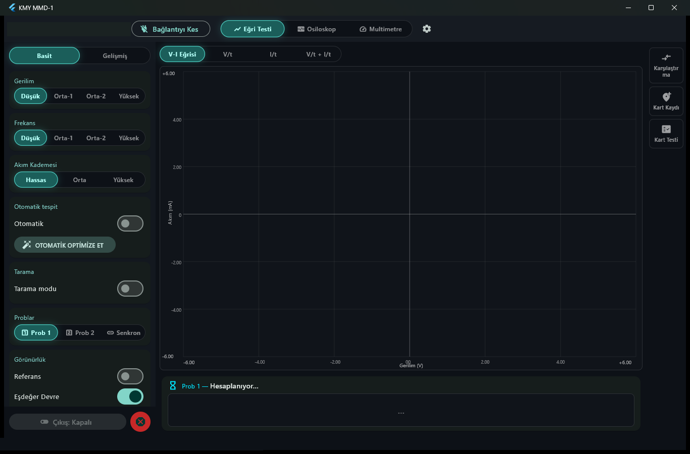

Dans l'interface logicielle ; les paramètres de test sont situés sur le côté gauche, l'écran graphique au centre, et les onglets Comparaison, Enregistrement de cartes et Test de cartes sur le bord droit.

Dans le test de courbe, l'appareil applique une tension sous forme d'onde sinusoïdale alternative (CA) au composant mesuré. Pendant ce temps, il trace la quantité de courant traversant le composant sur le graphique simultanément par rapport à la valeur de tension appliquée.

* **Résistance :** Comme le courant et la tension changent de manière totalement simultanée, une ligne droite et inclinée se forme sur l'écran.
* **Condensateur :** Comme le courant atteint sa valeur maximale avant la tension, une forme d'ellipse est tracée sur l'écran.
* **Diode :** Comme elle ne laisse passer le courant que dans un sens, une rupture nette (coude) se produit sur l'écran.

Chaque famille de composants trace un graphique unique en fonction de sa structure physique. Ce graphique constitue une carte d'identité pour ce composant. L'appareil dispose de deux sondes indépendantes ; celles-ci peuvent être utilisées individuellement ou simultanément (Mode Synchrone) selon les besoins (les détails se trouvent dans la Section 11).

### 8. Paramètres de mesure de base

Le mode de visualisation **Simple** dans le panneau gauche offre les trois réglages de base les plus critiques pour les mesures. Dans ce mode, au lieu de chiffres techniques complexes, des désignations de niveau claires telles que **Bas, Moyen-1, Moyen-2, Élevé** sont préférées pour une plus grande facilité d'utilisation. Les paramètres de Tension et de Fréquence utilisent tous deux ces quatre niveaux.

Les valeurs techniques réelles correspondant à ces niveaux sont les suivantes :

| Nom du niveau | Tension (Valeur de crête) | Fréquence |
| :--- | :---: | :---: |
| **Bas** | 2,5 V | 10 Hz |
| **Moyen-1** | 5 V | 50 Hz |
| **Moyen-2** | 10 V | 100 Hz |
| **Élevé** | 15 V | 1000 Hz |

* **Tension :** Le niveau de tension maximal (de crête) appliqué au composant. Lors de la mesure d'un composant suspect de type inconnu, on doit toujours commencer par le niveau le plus bas. Si la ligne à l'écran reste horizontale et plate, le niveau de tension doit être augmenté étape par étape. Les semi-conducteurs, tels que les jonctions de diodes et de transistors, nécessitent une tension de seuil minimale pour entrer en conduction ; les composants passifs comme les résistances et les condensateurs ne recherchent pas un tel seuil.
* **Fréquence :** Le paramètre le plus important pour distinguer des résistances les composants sensibles à la fréquence (réactifs) comme les condensateurs et les inductances. La ligne droite tracée par la résistance n'est pas affectée par les changements de fréquence. D'un autre côté, par exemple, un condensateur de 100 nF apparaît comme une ligne fine et fermée à 10 Hz, alors que lorsque la fréquence est augmentée à 1000 Hz, il s'ouvre pour prendre la forme d'une ellipse parfaite. Le moyen le plus rapide de vérifier si le composant est un condensateur est d'observer la largeur de l'ellipse sur l'écran en changeant la fréquence.
* **Gamme de courant :** Détermine avec quel niveau de sensibilité de courant l'appareil fonctionnera pendant la mesure.

| Gamme | Zone d'utilisation idéale |
| :--- | :--- |
| **Sensible** | Condensateurs, résistances de valeur élevée et tous les composants sensibles consommant un courant très faible. |
| **Moyenne** | Un point de départ sûr pour les composants inconnus. |
| **Élevée** | Résistances de faible valeur, diodes conductrices et pièces robustes consommant un courant élevé. |

*Si les parties supérieures de la courbe à l'écran apparaissent aplaties (écrêtées) ou si le logiciel émet un avertissement de limite de signal, réduisez la tension de test ou passez à une gamme de courant plus élevée (plus grossière). De même, si un composant sensible consommant très peu de courant est mesuré dans la gamme de courant "Élevée", la courbe à l'écran peut se transformer en une ligne complètement horizontale, et le composant peut être confondu avec un élément défectueux (circuit ouvert). Dans de tels cas suspects, répétez la mesure en réglant la gamme de courant sur "Sensible".*

### 9. Lecture de la courbe : Galerie de signatures de composants

La carte de résultats située juste en dessous de l'écran du graphique nomme le composant détecté par l'appareil, calcule sa valeur et fournit un taux de confiance indiquant à quel point cette détection est certaine. Les 12 exemples de composants de base répertoriés ci-dessous ont été établis conformément aux comportements électriques réels, et les expressions écrites sur la carte de résultats sont exactement les mêmes que les textes que vous verrez sur l'écran de l'appareil.

*Ligne « Dérive attendue » :* La carte de résultats comporte une ligne **Dérive attendue** à côté de la valeur calculée (par exemple *Dérive attendue +2,19 %…+3,01 %*). Elle indique de combien l'appareil s'écarte d'un multimètre étalonné dans les conditions de mesure du moment — essentiellement le rapport entre le calibre de courant choisi et la valeur du composant mesuré. Ce chiffre n'est pas une estimation : ce sont des valeurs mesurées au banc, transposées à ces conditions. Lorsque les conditions sortent de ce qui a été mesuré, l'appareil n'invente pas de chiffre : il en donne la raison. Si le rapport entre le calibre de courant et la valeur du composant se situe dans une zone non mesurée, si l'excitation n'est pas une onde sinusoïdale/alternative, si les deux sondes portent des charges très différentes ou si l'appareil n'est pas encore étalonné, une courte explication remplace le nombre. Lorsque la dérive passe sous la limite de tolérance du multimètre de référence lui-même, la ligne affiche « sous la limite de référence » : l'écart est alors trop faible pour être mesuré sur ce banc.

⚠️ **Détail important du matériel :** Le KMY MMD-1 est un traceur de courbes à deux bornes (sondes) ; par conséquent, il ne peut pas identifier par lui-même par logiciel les classes de composants à trois bornes telles que "MOSFET" ou "Transistor". Vous devez savoir quelles deux bornes des éléments à trois bornes vous mesurez. L'appareil interprète le comportement électrique entre ces deux bornes contactées. Ainsi, les exemples de transistors et de MOSFET dans le guide sont expliqués en fonction du "comportement vu par l'appareil" et des textes réels à l'écran sur la carte de résultats.

#### Résistance
Une ligne droite et inclinée traversant l'écran du graphique exactement au milieu. À mesure que la valeur de la résistance diminue, la ligne prend un angle proche de la verticale ; à mesure que la résistance augmente, la ligne s'aplatit horizontalement. Lorsque la fréquence est modifiée, l'angle de cette ligne ne change jamais. C'est la caractéristique la plus claire qui distingue la résistance de tous les autres composants.

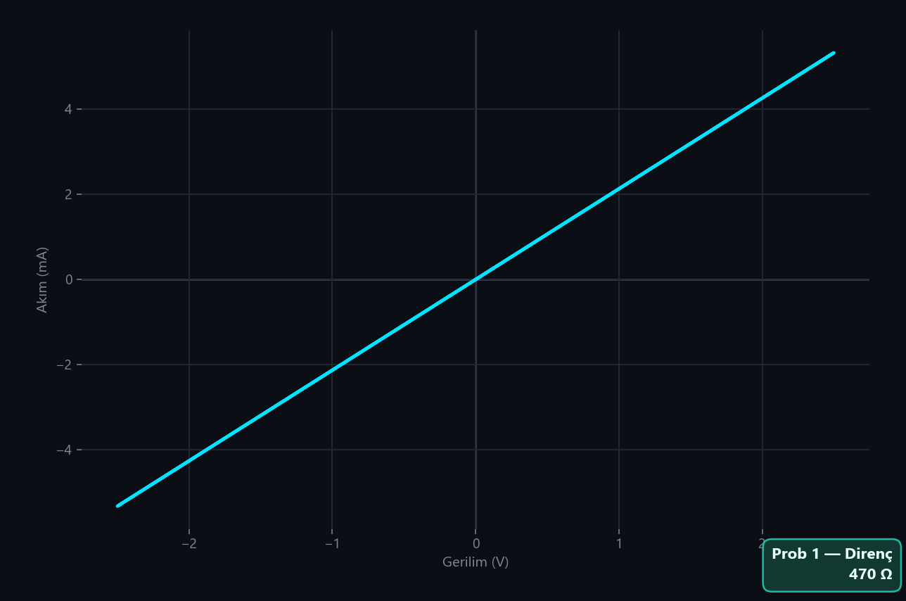

#### Condensateur
Forme une ellipse claire sur l'écran. Lorsque la fréquence est augmentée, l'intérieur de l'ellipse s'ouvre et devient distinct, tandis que lorsque la fréquence est diminuée, il se ferme vers une ligne fine.

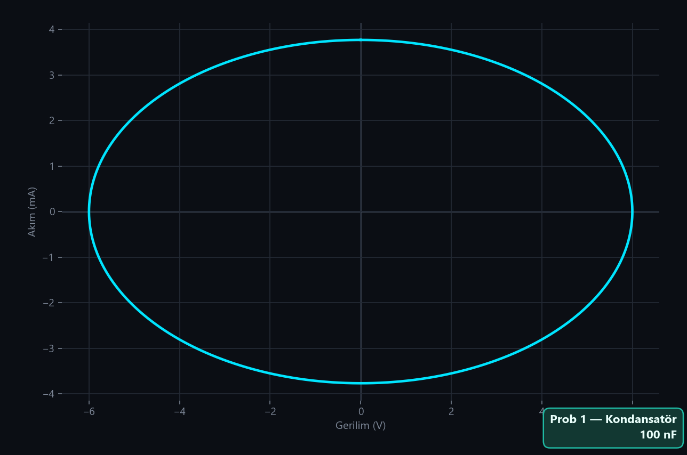

#### Inductance
L'image miroir exacte du condensateur. Elle trace également une ellipse, mais sa réponse est dans la direction opposée : lorsque la fréquence est augmentée, l'ellipse se rétrécit, tandis que lorsque la fréquence diminue, elle s'élargit.

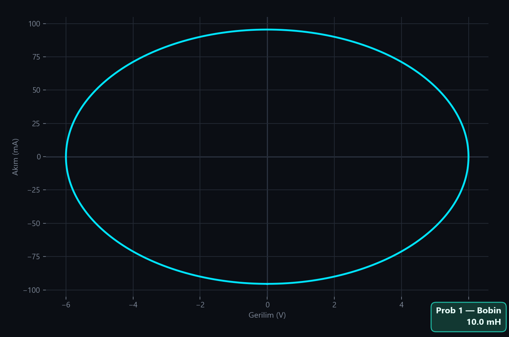

#### Condensateur + ESR (Résistance Série Équivalente)
L'ellipse caractéristique d'un condensateur, mais elle est légèrement inclinée vers la droite ou la gauche sur le graphique. La résistance série (ESR) ici rend l'ellipse inclinée. La valeur de capacité du condensateur et les valeurs de résistance série/parallèle sont affichées séparément sur la carte de résultats.

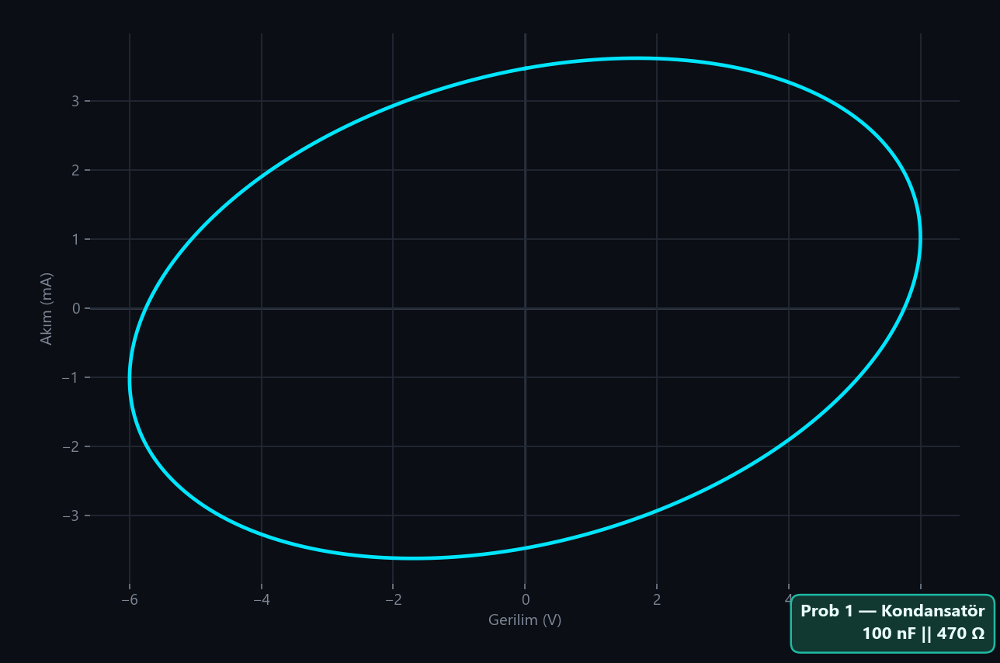

#### Diode
Forme une ligne plate dans un sens (blocage) et une forme de "coude" distincte dans l'autre sens (conduction). La position de ce point de coude sur l'axe de tension est le seuil de conduction (tension directe) de la diode. Alors que ce seuil est d'environ 0,6 V - 0,7 V pour les diodes au silicium, il est plus à gauche (à une tension plus basse) pour les diodes Schottky, et nettement plus à droite (à une tension plus élevée) pour les LED.

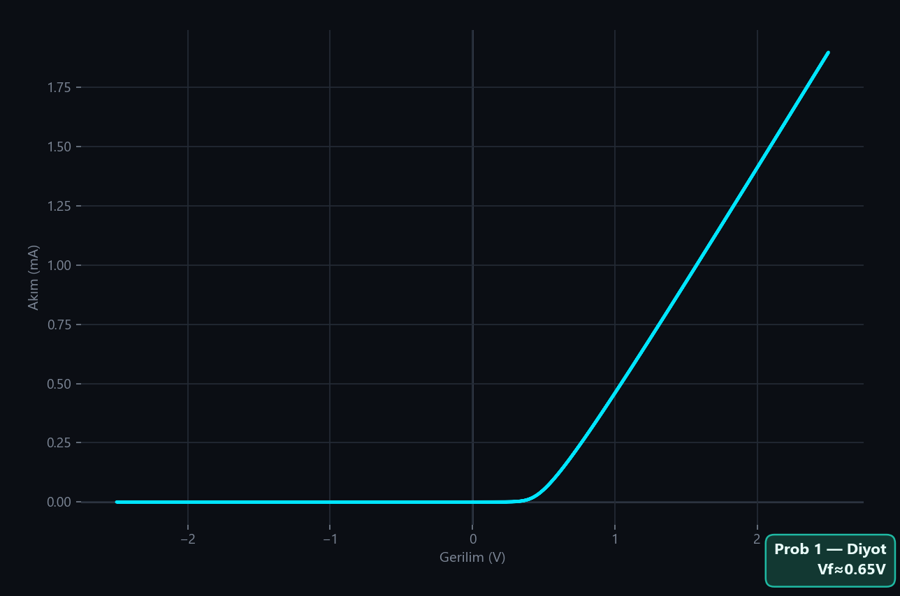

#### Diode Zener
Des coudes de conduction sont observés dans les deux sens du graphique. Le coude de droite montre le seuil de conduction normal de la diode, et le coude de gauche montre la tension de claquage zener ($V_z$). Les diodes zener jusqu'à 15 V peuvent être facilement analysées avec cet appareil ; pour les zeners à tension supérieure, la limite de tension de test de l'appareil ne sera pas suffisante.

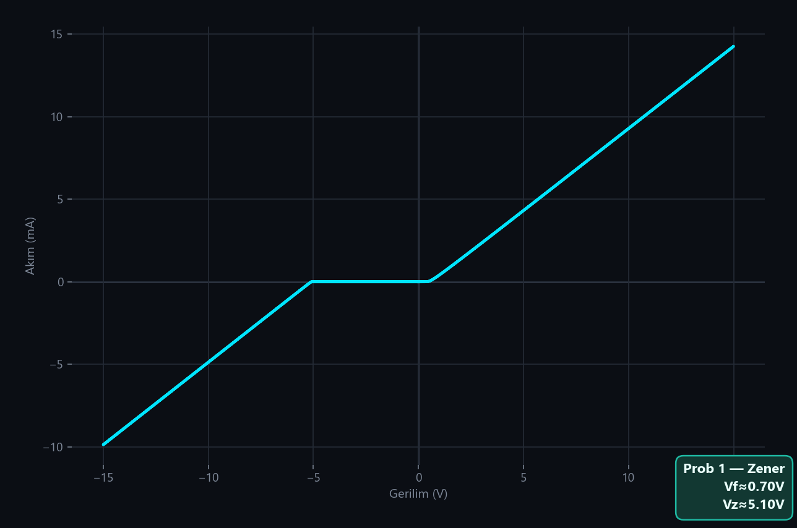

#### Diode TVS
Une diode TVS unidirectionnelle présente électriquement exactement les mêmes caractéristiques qu'une diode zener. L'appareil la classe également automatiquement comme **ZENER** (il n'y a pas d'étiquette séparée "TVS" sur la carte de résultats). Le claquage symétrique des diodes TVS bidirectionnelles dans les deux sens ne correspond parfaitement à aucune des classes de composants standard. Lors de la mesure, il peut être indiqué **|Z|** ou **Indéfini** sur la carte.

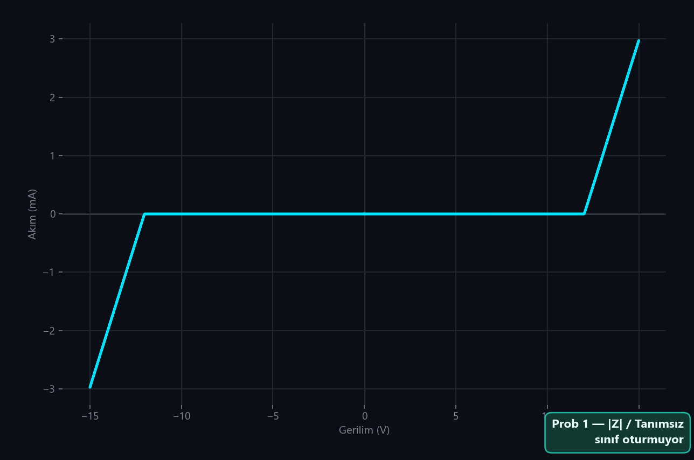

#### MOSFET — Bornes Grille-Source (Gate-Source)
La borne de grille des MOSFET est comme un très petit condensateur isolé du corps, et presque aucun courant ne la traverse. Dans les MOSFET petits signaux, cette valeur de capacité est si faible (quelques picofarads) que le courant circulant reste inférieur à la limite de détection de l'appareil, et la carte affiche **CIRCUIT OUVERT**. Ce n'est pas un défaut mais l'état naturel de la grille. Dans les MOSFET de puissance plus puissants (avec une capacité de quelques nanofarads), une fine ellipse de **Condensateur** peut être observée.

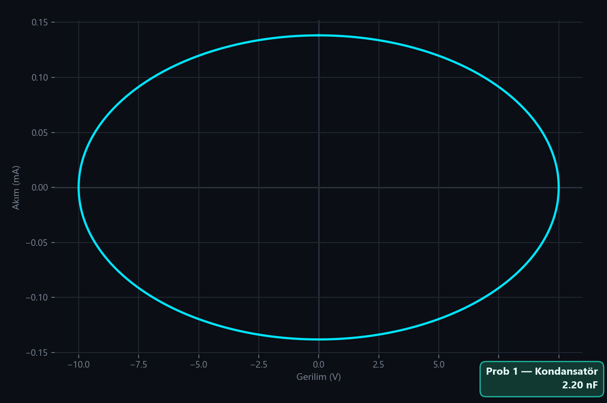

#### MOSFET — Bornes Drain-Source
Chaque MOSFET possède naturellement une diode de corps (body diode) formée lors de la production. Lorsque la grille est flottante ou connectée à la Source, et que vous contactez Drain-Source, un courant est observé traversant cette diode de corps plutôt que le canal. L'appareil la reconnaît directement comme une **DIODE** standard ; généralement avec une tension directe ($V_f$) légèrement supérieure à celle des diodes de signal.

#### Transistor — Jonction Base-Émetteur
La jonction Base-Émetteur est électriquement une jonction de diode. L'appareil écrit **DIODE** sur l'écran, et la tension directe ($V_f$) est généralement mesurée entre 0,65 V et 0,70 V.

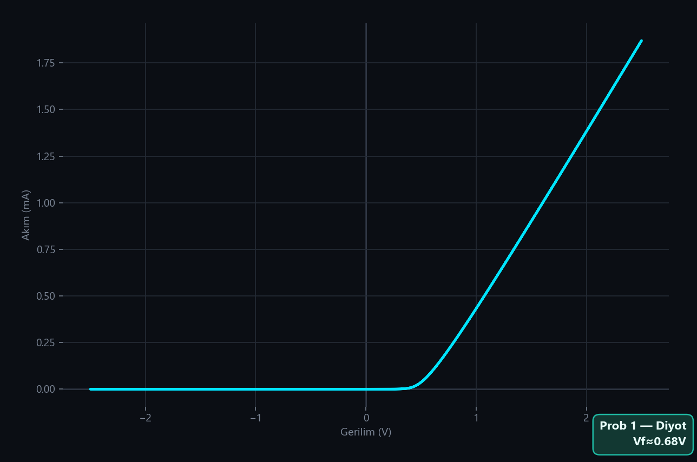

#### Transistor — Jonction Base-Collecteur
La jonction Base-Collecteur est de même une jonction de diode. Cependant, comme cette jonction est physiquement répartie sur une zone plus grande, sa tension de seuil s'avère généralement légèrement inférieure à celle de la jonction Base-Émetteur. **DIODE** est affiché sur la carte de résultats.

#### Transistor — Bornes Collecteur-Émetteur

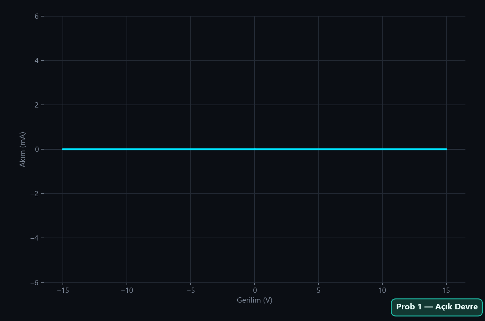
Si le Collecteur-Émetteur est mesuré sans toucher à la Base, les deux jonctions internes restent fermées, et l'appareil détecte un **CIRCUIT OUVERT**. Ce n'est pas un défaut mais l'état naturel du transistor ; comme une excitation de base est requise pour que le transistor conduise, il est normalement attendu qu'il soit dans un état isolant dans ces conditions de test.

*Note importante sur la conception :* Lors de la mesure d'un composant sur une carte sans le dessouder, la courbe observée n'est pas la courbe de ce composant seul ; elle est la somme des réponses électriques de tous les autres chemins et éléments connectés en parallèle avec lui. En cas de doute, soulever une seule broche du composant de la carte avec un fer à souder et répéter la mesure fournira le résultat le plus fiable.

### 10. Paramètres de mesure avancés

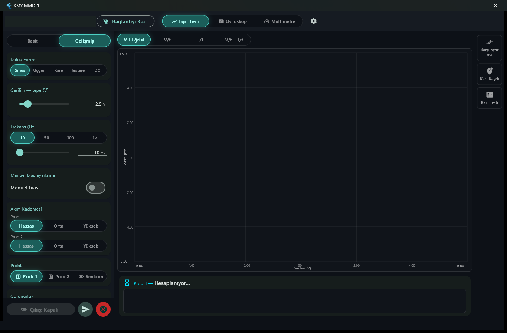

Lors du passage à la vue **Avancée** dans l'interface, les trois paramètres du panneau Simple ne sont plus basés sur des étapes mais peuvent être contrôlés au millimètre près grâce à des curseurs précis (Tension 0,1 - 15 V, Fréquence 1 - 1000 Hz). Dans ce mode, les fonctionnalités avancées suivantes sont en outre offertes à votre contrôle :

* **Forme d'onde :** Vous pouvez sélectionner les types d'onde Sinusoïdale, Triangulaire, Carrée, Dent de scie et CC. Le standard pour l'analyse des courbes est toujours l'onde sinusoïdale. L'option CC applique une tension constante au composant.
* **Biais manuel (Offset) :** Permet de décaler le point central du signal de test au-dessus ou en dessous du niveau zéro. Pour le réglage, au lieu d'une barre de défilement classique, des boutons de direction (pavé fléché) qui fournissent une augmentation/diminution continue lorsqu'ils sont enfoncés sont utilisés. Le pas peut être réglé sur 10 mV, 100 mV ou 1 V, et un bouton **Réinitialiser** en un clic est disponible. Il est désactivé par défaut, et il est recommandé de le laisser désactivé pour presque tous les tests standard.
* **Gamme de courant :** Contrairement au mode Simple, elle peut être ajustée de manière complètement indépendante pour la Sonde 1 and la Sonde 2. Si vous devez comparer deux sondes entre elles, vous devez égaliser les gammes de courant des deux sondes ; deux courbes obtenues sur des gammes différentes ne correspondront jamais, même si vous observez exactement les mêmes composants.

La plupart des modifications apportées sont automatiquement transmises à l'appareil dès que vous cessez d'interagir avec les molettes ou boutons de réglage. Le bouton **Appliquer** est utilisé pour forcer l'envoi immédiat des paramètres au matériel sans attendre cette période automatique.

Au bas du panneau gauche, se trouvent trois fonctions intelligentes qui facilitent les mesures :

* **Détection automatique :** Lorsqu'elle est active, l'appareil reconnaît le type de composant dès que vous le touchez avec la sonde et passe automatiquement à la tension, à la fréquence et à la gamme de courant idéales qui affichent le mieux ce type. Pour éviter les transitions erronées, le système ne modifie pas les paramètres sans confirmer le même résultat au moins trois fois de suite. Ainsi, lorsque votre main tremble, les paramètres de l'écran ne sautent pas d'avant en arrière en permanence.
* **Optimisation automatique (Auto-Optimize) :** Effectue une recherche unique des paramètres idéaux pour le composant actuellement sur la sonde lorsqu'il est pressé ; il applique les réglages optimaux si un résultat significatif est trouvé, et ne touche pas aux réglages si aucun résultat utile n'est obtenu.
* **Mode de balayage (Sweep) :** Balaye automatiquement de manière progressive une plage sélectionnée pour l'un des paramètres de tension, fréquence ou gamme de courant jusqu'à ce qu'il soit arrêté ; les deux autres paramètres restent constants. S'il y a un composant dont l'identité est inconnue, lancer un balayage de fréquence est une excellente méthode : si sa courbe change avec la fréquence, il est réactif (condensateur/inductance) ; s'il ne change pas, il est résistif.

**Onglet Visibilité :**
* **Référence :** Superpose une courbe de référence précédemment enregistrée sur la mesure en direct actuelle en tant que modèle.
* **Circuit équivalent :** Dessine dynamiquement le schéma de circuit simplifié décidé par l'appareil sous la carte de résultats.
* **Geler :** Gèle la courbe actuelle sur l'écran telle quelle pour examen.

### 11. Utilisation de double sonde et mode synchrone

Normalement, les modes **Sonde 1** et **Sonde 2** pilotent une seule sonde à la fois. Le mode **Synchrone** pilote les deux à partir de la même source en même temps. C'est le moyen pratique de comparer deux composants côte à côte en une seule fois.

Lors du fonctionnement en mode synchrone, l'appareil surveille en permanence l'équilibre de la charge électrique sur les deux sondes et affiche des fenêtres d'avertissement jaunes à l'écran si un déséquilibre est détecté :

* *“Les charges sur les sondes sont très différentes ; la sensibilité de lecture peut dériver en mode synchrone. Utilisez le mode sonde unique pour des mesures précises.”*
* *“La borne S1 est flottante ; la lecture de S2 peut dériver de ~1% pendant la mesure synchrone.”* *(L'avertissement symétrique apparaît pour S1 lorsque S2 est flottante.)*

Voir ces avertissements ne signifie pas que la mesure est complètement incorrecte. Cela vous rappelle seulement que lorsque la différence de charge sur les deux sondes est très élevée, la lecture en mode synchrone peut dériver légèrement en raison de sa nature. Pour des comparaisons nécessitant une précision au millimètre près, le passage au mode sonde unique (Sonde 1 ou Sonde 2) est l'approche la plus sûre.

---

## Section D — Mode de Comparaison et Test de Cartes

### 12. Fonctions de comparaison

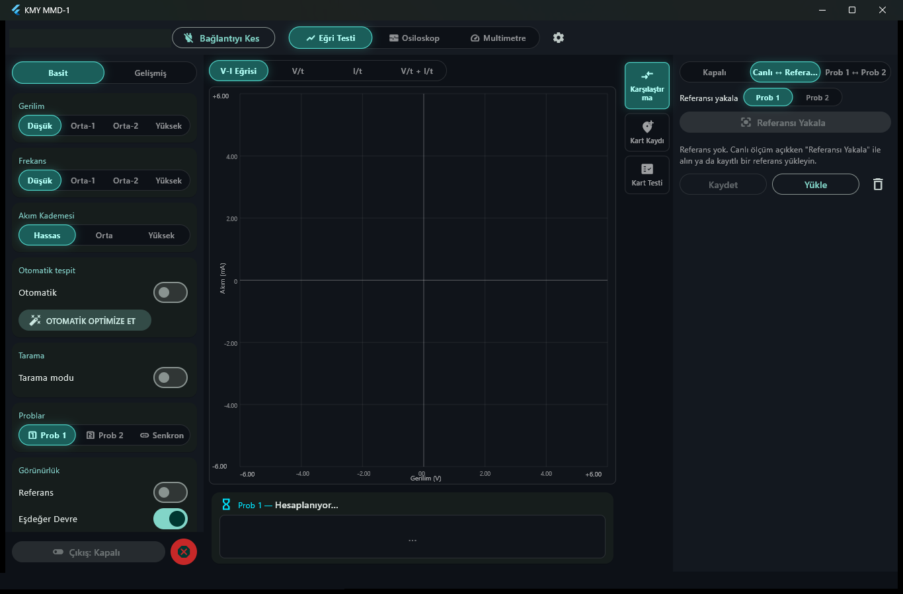

L'onglet **Comparaison** sur le bord droit ouvre un tiroir latéral pratique. Trois modes sont disponibles :

* **Désactivé :** Désactive le mode de comparaison.
* **En direct ↔ Référence :** Compare le composant actif actuellement touché par la sonde avec une courbe de référence capturée précédemment. Cliquer sur le bouton **Capturer la référence** enregistre la courbe à l'écran comme point de repère ; vous pouvez la sauvegarder dans un fichier et la recharger plus tard.
* **Sonde 1 ↔ Sonde 2 :** Compare directement les deux sondes entre elles. Vous connectez le composant connu comme étant bon en tant que référence à une sonde, et le composant suspect à l'autre. Cette méthode est beaucoup plus sûre car les deux mesures sont effectuées exactement en même temps, à la même température et dans des conditions électriques identiques.

La décision est un pourcentage de similitude basé sur un seuil que vous définissez. Si la similitude est supérieure au seuil, **CORRESPONDANCE** (vert) s'affiche ; si elle est inférieure, **NON-CORRESPONDANCE** (rouge) apparaît. Le seuil d'usine est de 90%. L'option **Sensibilité de la zone critique** (Désactivée, Normale, Élevée) resserre la comparaison dans les régions de flexion et de coude de la courbe, car la véritable identité électrique du composant est principalement cachée là.

Si aucune sonde ne consomme de courant mesurable, l'appareil ne déclare pas faussement une "correspondance" en comparant le bruit flottant de fond. Au lieu de cela, il écrit **PAS DE MESURE**. Cet avertissement indique que soit la sonde ne fait pas contact, soit la gamme est sélectionnée de manière trop grossière (élevée) pour ce composant.

En activant la fonction **Avertisseur acoustique**, vous n'avez pas besoin de garder les yeux fixés sur l'écran ; le système émettra un signal acoustique uniquement lorsque la décision de correspondance (réussite/échec) change.

### 13. Enregistrement de cartes et système de test de cartes

C'est la méthode idéale pour tester des modèles de cartes spécifiques que vous allez réparer ou valider à plusieurs reprises : enregistrez chaque point de test une fois, puis analysez rapidement toutes les cartes suspectes par rapport à cette base de données de référence.

#### Enregistrement pas à pas d'une référence de carte :

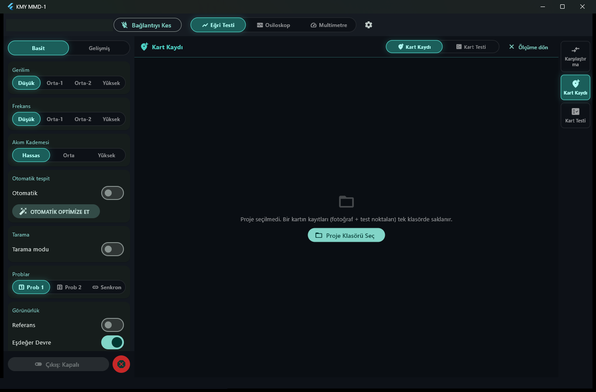
1. **Créer un dossier de projet :** Sélectionnez un dossier de travail pour vous-même. L'image de la carte et tous les points de test sont conservés dans ce seul dossier ; vous pouvez copier et transporter le dossier dans son ensemble vers un autre ordinateur.
2. **Ajouter une image de la carte :** Téléchargez une photographie nette et sans ombre de la carte prise directement du dessus. Une photo prise sous un éclairage plat et uniforme facilite le positionnement précis des points de test sur l'image.
3. **Définir les points :** Touchez le point de test cible sur la carte physique avec la sonde de test. En même temps, cliquez sur cet emplacement sur la photo de la carte sur l'écran du logiciel. Donnez au point un nom descriptif (il est recommandé d'utiliser les marquages propres à la carte : R14, C7, U3-1) et cliquez sur **Enregistrer le point**.
4. **Organiser la séquence :** Vous pouvez organiser les points enregistrés dans l'ordre de test souhaité en les glissant-déposant de manière pratique.

* **Signature multi-étapes (Multi-Stage Signature) :** Lorsqu'elle est active, chaque point de test est enregistré non pas à un seul réglage, mais à 3-4 niveaux de tension et de fréquence différents. Le processus d'enregistrement prend un peu plus de temps, mais il est beaucoup plus difficile pour un composant défectueux de contourner un point enregistré de cette manière.

#### Test d'une carte enregistrée :
Cliquez sur le bouton **Démarrer le test** et parcourez les points dans l'ordre. Chaque point est mesuré, comparé à sa référence et marqué comme réussi ou échoué. Les points non correspondants apparaissent en **rouge** sur la photographie de la carte. Au lieu d'une liste de texte fastidieuse, vous obtenez une carte visuelle de la panne. Vous pouvez mettre le test en pause et sauter des points, et après avoir terminé, utiliser l'option **Tester les restants** pour revenir uniquement aux points incomplets.

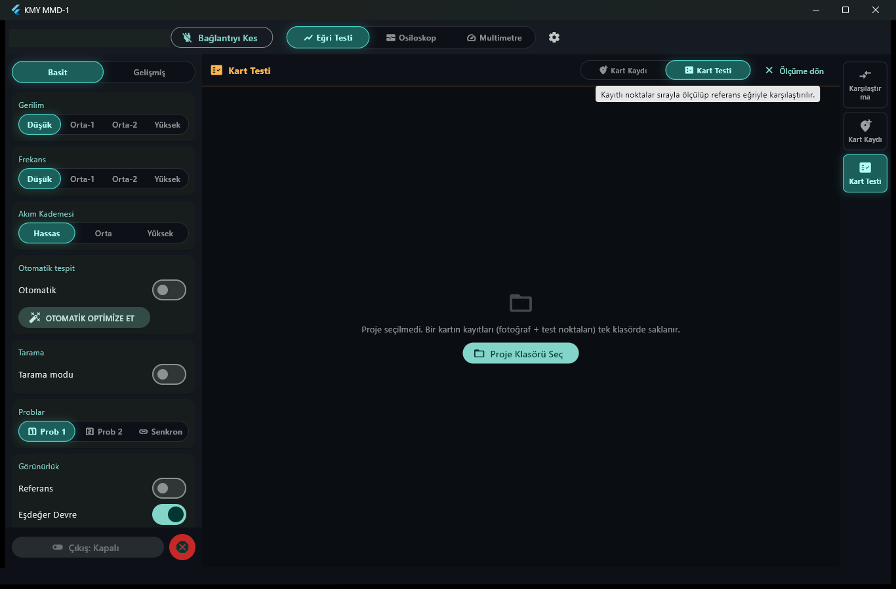

* **Mode Auto :** Passe automatiquement au point suivant lorsque la correspondance du point est réussie. Activez ce mode lorsque vous souhaitez regarder la carte plutôt que l'écran tout en tenant les sondes.
* **Créer un rapport Excel :** Lorsque le test est terminé, cliquer sur ce bouton génère un rapport Excel détaillé de trois pages : détails point par point, tableau récapitulatif et carte visuelle réussite/échec de la carte.

---

## Section E — Autres Outils Auxiliaires

### 14. Mode Oscilloscope

Lors du passage en mode oscilloscope, la sortie de signal de l'appareil est complètement désactivée, et les sondes entrent dans un mode d'écoute passive pour surveiller les signaux externes. Les canaux d'entrée peuvent mesurer en toute sécurité **jusqu'à 50 V**.

🎨 **Note importante sur le code couleur des canaux :** Sur l'écran de l'oscilloscope, le Canal 1 est représenté en **jaune**, et le Canal 2 est représenté en **cyan**. Ce code couleur est l'opposé exact de la Sonde 1 (cyan) et de la Sonde 2 (jaune) dans l'écran du Traceur de courbes. Les couleurs des deux modes sont délibérément conçues pour être différentes afin d'éviter les confusions ; ne soyez pas surpris par cette différence de couleur lors de la transition entre les modes.

L'appareil échantillonne toujours à **5,5 kS/s** (5500 échantillons par seconde) en raison des limites du matériel. Modifier la base de temps (timebase) dans le programme ne change pas ce taux d'échantillonnage ; cela ne fait que modifier la fenêtre temporelle affichée sur l'écran. Le résultat pratique est que le KMY MMD-1 est un **oscilloscope basse fréquence**. Il fonctionne parfaitement pour les ondulations d'alimentation, les commandes de moteurs et les signaux inférieurs à la bande audio, mais au-dessus de 1 kHz, la précision de forme de l'onde commencera à devenir peu fiable.

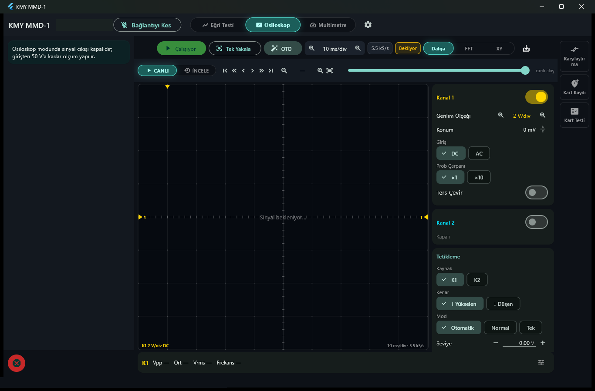

* **AUTO :** Analyse le signal entrant et règle automatiquement pour vous la base de temps, l'échelle verticale de tension et le niveau de déclenchement. Si aucun signal significatif n'est détecté, il ne touche pas aux réglages.
* **Modes de déclenchement (Trigger) :**
  * *Auto :* Rafraîchit l'écran en continu même si aucune condition de déclenchement n'est remplie.
  * *Normal :* Rafraîchit l'écran uniquement lorsque la condition de déclenchement spécifiée se produit.
  * *Single :* Capture le signal une fois lorsque la condition de déclenchement est remplie et gèle l'écran.

Les flèches de ligne de base et la flèche de niveau de déclenchement sur les bords de l'écran peuvent être directement glissées à la souris. C'est le moyen le plus rapide d'effectuer des réglages rapides sans avoir à saisir de valeurs dans des cases numériques. Le bouton **Inspecter** permet de suspendre le flux en direct et de naviguer dans les **20 dernières secondes d'historique enregistré**. Comme l'enregistrement se poursuit en arrière-plan pendant que vous regardez l'écran en direct, l'événement est toujours capturé lorsque vous remarquez une fluctuation soudaine.

Quatre mesures s'affichent immédiatement sur la barre d'information inférieure : **Vpp** (tension crête à crête), **Avg** (tension moyenne), **Vrms** (tension efficace) et **Fréquence**. Il y a 11 paramètres de mesure au total dans la base de données ; vous pouvez ajouter ou supprimer tous les paramètres de votre choix sur cette barre.

### 15. Mode Multimètre

Dans ce mode, les deux sondes peuvent lire la tension indépendamment et en même temps. Il n'y a aucun bouton de sélection manuelle de gamme ou de fonction (CA/CC). Le KMY MMD-1 analyse le signal entrant pour décider s'il doit être mesuré en CC ou en CA.

* **REL (Mesure Relative) :** Accepte la valeur actuellement lue comme référence zéro et montre les changements ultérieurs par rapport à cette valeur (+/-).
* **MIN/MAX :** Accumule les valeurs de tension les plus basses et les plus élevées lues depuis le début de la mesure et les répertorie à l'écran.
* **HOLD :** Gèle la valeur de mesure actuelle sur l'écran.

Dans ce mode également, la sortie active de signal de test est complètement désactivée. N'oubliez pas de garder ouvert le canal de la sonde que vous souhaitez mesurer. Si la sonde d'un canal fermé est laissée flottante dans l'air, la valeur lue sur l'écran n'est pas une tension réelle, mais un bruit électromagnétique collecté par le câble.

---

## Section F — Paramètres Système, Étalonnage et Connexion

### 16. Paramètres Système

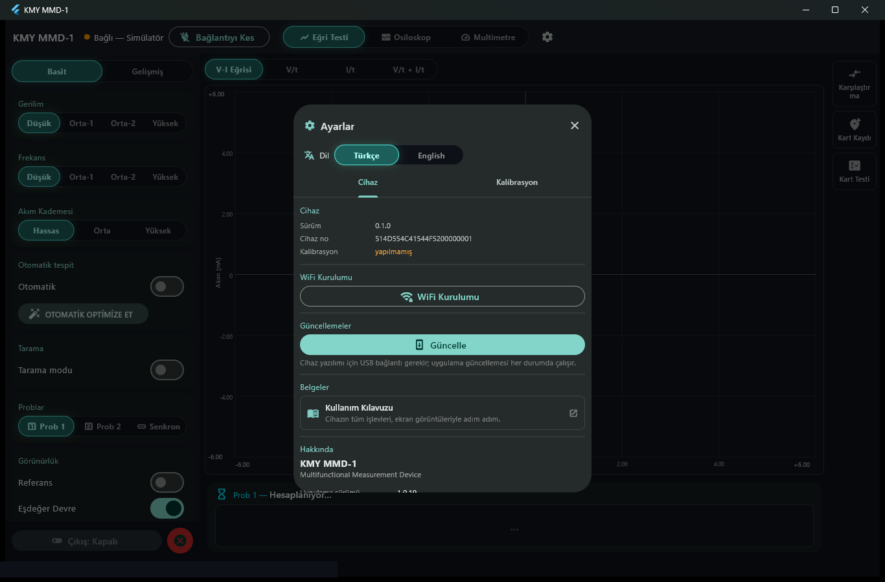

Cliquer sur l'icône d'engrenage dans la barre supérieure ouvre le panneau des paramètres généraux. Il se compose de deux onglets de base : **Appareil** et **Étalonnage**. Les deux onglets disposent d'une option de sélection rapide de la langue (Turc / Anglais) en haut.

#### Contenu de l'onglet Appareil :
Cette section contient la version du logiciel, le numéro unique de l'appareil, les outils de configuration de la connexion Wi-Fi et un bouton intégré **Mettre à jour**. Le bouton Mettre à jour vérifie et met à jour à la fois le logiciel de l'ordinateur et le micrologiciel de l'appareil en un seul clic.

De plus, sous la rubrique "Service / Diagnostic", il existe un outil d'urgence qui permet de restaurer l'appareil vers une version stable et plus ancienne de micrologiciel en cas de problème lors d'une nouvelle mise à jour de micrologiciel. Ce n'est pas une zone qui doit être consultée lors de l'utilisation quotidienne ; c'est une zone spéciale utilisée uniquement dans les situations de support technique.

### 17. Assistant d'étalonnage

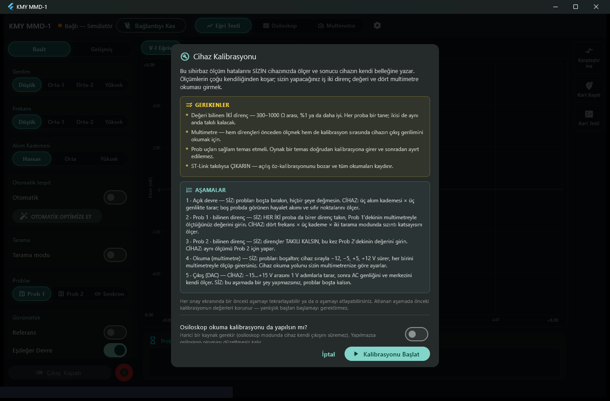

Les données d'étalonnage du KMY MMD-1 sont stockées **directement dans la mémoire non volatile interne de l'appareil lui-même (EEPROM/Flash)**, et non sur l'ordinateur. Le logiciel lit cette table d'étalonnage à partir de l'appareil lui-même à chaque démarrage. De cette façon, quel que soit l'ordinateur ou le téléphone auquel vous connectez l'appareil, vous pouvez continuer à l'utiliser directement dans son état étalonné sans avoir besoin de le réétalonner.

#### Exigences pour l'étalonnage :
* Deux résistances standard de valeur connue (de préférence à tolérance de 1% ou supérieure, **entre 300 Ω et 1000 Ω** ; une pour chaque sonde, les deux doivent rester connectées simultanément pendant tout le processus d'étalonnage).
* Un multimètre numérique capable de faire des mesures précises.
* Le processus d'étalonnage prend **environ 15 minutes** et se déroule en 5 étapes de base.

#### Étapes d'étalonnage pas à pas :
1. **Circuit ouvert (Environ 30 s) :** Les deux pointes de sonde doivent être complètement flottantes et ne doivent rien toucher. Dans cette étape, les points zéro des canaux de courant et la ligne de base de l'oscilloscope sont étalonnés.
2. **Mesure de résistance sur S1 :** *“Connectez une résistance connue aux DEUX sondes ; dans cette étape, seule la Sonde 1 sera mesurée.”* Les deux résistances restent branchées dans leurs fentes, mais l'appareil n'analyse que le côté de la Sonde 1. Lorsque la mesure est terminée, entrez la **valeur de résistance réelle** mesurée avec votre multimètre sur l'écran, plutôt que de vous fier aux codes couleur sur la résistance.
3. **Mesure de résistance sur S2 :** *“Gardez les deux résistances CONNECTÉES.”* Les mêmes deux résistances restent en place ; cette fois, la Sonde 2 est mesurée.

Les trois premières étapes de l'étalonnage sont suivies d'une seule fenêtre de confirmation : **Enregistrer et continuer**. L'écriture sur la mémoire flash est combinée ici.

4. **Lecture de tension (Multimètre) :** Retirez les sondes de leurs fentes et laissez-les complètement flottantes. L'appareil émettra des tensions de test de $-12	ext{ V}$, $-5	ext{ V}$, $+5	ext{ V}$, et $+12	ext{ V}$ en séquence. À chaque niveau, mesurez physiquement la tension à la borne de la Sonde 1 avec votre multimètre externe et entrez la valeur lue dans le logiciel.
5. **Étalonnage CC de la sortie (CNA) (Environ 45 s) :** L'appareil balaye automatiquement la plage $-15	ext{ V}$ à $+15	ext{ V}$ par pas de 1 V et se corrige lui-même en fonction des mesures de tension saisies à l'étape précédente. Immédiatement après cette étape, alors que les sondes sont toujours flottantes, l'appareil mesure et corrige automatiquement l'amplitude d'excitation CA et le décalage central. Aucune action supplémentaire n'est requise de votre part ; le processus prend seulement un peu plus de temps.

* **Étape 6 facultative (Étalonnage de l'oscilloscope) :** À la fin des étapes, une phase facultative est proposée pour affiner les lectures de l'oscilloscope. Comme l'appareil ne peut pas piloter sa propre sortie en mode oscilloscope, il vous est demandé d'utiliser une source de tension/signal externe de précision connue. Si vous ne disposez pas d'une telle source, vous pouvez ignorer cette étape en toute sécurité ; tout le reste en dehors de l'oscilloscope restera entièrement étalonné.

*Fonctionnalités logicielles :* Chaque écran de confirmation vous permet de répéter l'étape précédente si vous pensez avoir fait une erreur. Lors des trois premières étapes, s'il existe déjà un étalonnage valide sur l'appareil, vous pouvez choisir de sauter cette étape et de conserver les valeurs précédentes. Le processus d'écriture sur la mémoire flash de l'appareil est différé jusqu'à ce que toutes les étapes soient terminées avec succès. Si vous fermez l'assistant à mi-chemin, les anciennes données d'étalonnage sur l'appareil restent intactes.

*Points d'étalonnage enregistrés :* Chaque point saisi lors de l'étape de lecture de tension au multimètre est conservé dans une liste que vous pouvez ouvrir depuis l'assistant. Chaque ligne indique la valeur mesurée par l'appareil, la valeur réelle que vous avez saisie et une colonne **écart** : de combien de millivolts ce point s'éloigne de la droite de correction calculée à partir des autres points. La ligne la plus éloignée est signalée en orange et, en pratique, c'est celle où la valeur du multimètre a été mal saisie. Il suffit de supprimer la ligne mal saisie ; la droite de correction est recalculée aussitôt à partir des points restants. Comme la correction a besoin d'au moins deux points pour tracer une droite, les deux derniers ne peuvent pas être supprimés — pour repartir de zéro, relancez l'étape de lecture.

*À quelle fréquence l'étalonnage doit-il être effectué ?* Il est recommandé de renouveler l'étalonnage lorsque vous constatez que vos valeurs de mesure dévient visiblement d'un multimètre externe de confiance, ou lorsque le logiciel signale que la ligne de base de référence a dérivé. Sinon, vous n'avez pas besoin de toucher au menu d'étalonnage dans des conditions normales de fonctionnement.

### 18. Utilisation sans fil et configuration Wi-Fi

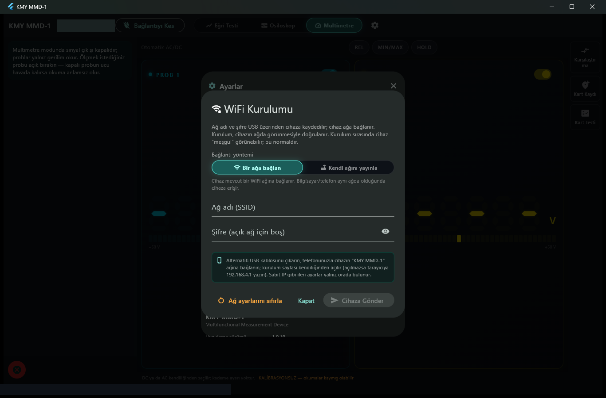

Le KMY MMD-1 prend en charge la connexion réseau sans fil selon deux modes différents :

1. **Mode Station :** S'il existe un réseau Wi-Fi actif dans votre atelier, l'appareil rejoint ce réseau. Ainsi, votre ordinateur ou téléphone peut accéder à l'appareil via le réseau existant.
2. **Mode Point d'Accès (AP) :** Si vous travaillez sur le terrain ou s'il n'y a pas de réseau Wi-Fi dans l'environnement, l'appareil diffuse son propre réseau sans fil. Vous pouvez connecter votre ordinateur ou téléphone directement à l'appareil.

#### Configuration du Wi-Fi via l'application :
Pendant que l'appareil est connecté via USB, ouvrez le menu **Paramètres → Configuration Wi-Fi**, sélectionnez le mode de connexion souhaité, saisissez le nom du réseau (SSID) et le mot de passe, puis envoyez-les à l'appareil.

#### Configuration du Wi-Fi via navigateur (Interface Web) :
Déconnectez le câble USB. À la sortie de l'emballage, le KMY MMD-1 diffuse un réseau sans fil non sécurisé nommé **KMY MMD-1**. Lorsque vous connectez votre téléphone ou votre ordinateur portable à ce réseau, la page de configuration s'ouvre automatiquement ; si elle ne s'ouvre pas, saisissez **192.168.4.1** dans la barre d'adresse de votre navigateur. Les options de configuration réseau avancées, telles que la définition d'une IP fixe, se trouvent uniquement dans cette interface Web.

#### Si l'appareil ne s'affiche pas dans la liste (Connexion manuelle) :
Si vous êtes sûr que l'appareil est connecté au réseau mais que vous ne le voyez pas dans la liste du logiciel, vous pouvez cliquer sur la petite icône **"Saisir manuellement l'adresse de l'appareil"** à côté du sélecteur Wi-Fi et saisir son adresse IP manuellement. Cela peut être nécessaire car la détection repose sur un paquet de diffusion envoyé par l'appareil une fois par seconde, et certains routeurs ne transmettent pas ces paquets de diffusion aux clients sans fil. Vous pouvez obtenir l'adresse IP à partir de la liste des appareils connectés de votre routeur ou de la propre page de configuration Web de l'appareil. La même option de saisie manuelle de l'IP est également disponible sous l'écran de connexion dans l'application mobile Android.

*Détails importants à connaître :*
* Le matériel KMY MMD-1 ne prend en charge qu'une seule connexion active à la fois ; un appareil actuellement utilisé apparaît comme **OCCUPÉ** dans la liste.
* L'option **Réinitialiser les paramètres réseau** restaure la configuration du réseau sans fil à l'état d'usine par défaut à tout moment.

### 19. Utilisation sur appareils mobiles (Téléphone/Tablette)

La même application utilisée sous Windows fonctionne sous Android, sans aucune déficience fonctionnelle en termes de mesure et d'analyse. La disposition est optimisée pour les écrans mobiles étroits : des barres fines sont toujours visibles en haut et en bas de la zone graphique.

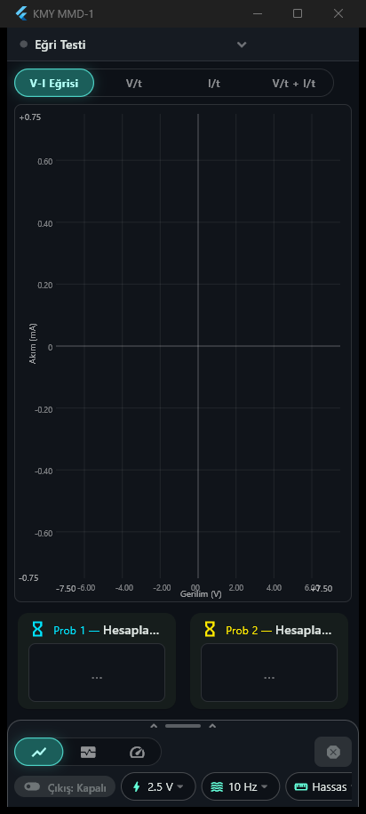

* **Dérouler la barre d'état supérieure :** Dérouler cette barre vers le bas ouvre le panneau d'état. Il contient l'état de la connexion, le message d'erreur ou le motif de verrouillage (le cas échéant), et trois boîtes : **Outils**, **Paramètres**, et **Se connecter/Se déconnecter**. En cas d'avertissement ou d'erreur important, ce panneau s'ouvre automatiquement.
* **Dérouler la barre de commande inférieure :** Glisser cette barre vers le haut ouvre le panneau de commande complet. Il s'arrête à la hauteur où vous laissez votre doigt ; il n'a pas besoin d'être complètement ouvert ou fermé. Il contient exactement les mêmes réglages que la version de bureau. La barre affiche toujours les boutons de transition de Test de courbe, d'Oscilloscope et de Multimètre, ainsi que des raccourcis pour la Tension, la Fréquence et la Gamme de courant (en Test de courbe).
* **Accès aux fonctions :** Vous accédez à **Comparaison, Enregistrement de cartes et Test de cartes** à partir de la boîte *Outils*. Vous accédez aux **Paramètres généraux et Étalonnage** à partir de la boîte *Paramètres*. Les deux sont identiques aux fenêtres du bureau, seulement mises à l'échelle pour l'écran mobile.
* **Panneau de connexion :** La boîte *Se connecter* propose une liste de détection, un bouton de secours qui tente de se connecter directement au propre réseau de l'appareil, et un champ de saisie manuelle de l'IP.

*Limitation de la mise à jour du micrologiciel mobile :* Le micrologiciel de l'appareil ne peut pas être mis à jour via des appareils mobiles car l'écriture nécessite un protocole USB sécurisé et la connexion USB directe n'est pas prise en charge sur mobile. Cependant, les mises à jour de l'application mobile elle-même sont installées sur le téléphone : lorsque vous cliquez sur **Mettre à jour**, l'application télécharge la nouvelle version, vérifie sa signature et ouvre l'écran d'installation propre d'Android. L'installation se termine d'un seul geste de confirmation, sans nécessiter de navigateur Web.

### 20. Mises à jour logicielles

Suivre **Paramètres → Mettre à jour** vérifie à la fois l'application et le micrologiciel de l'appareil, et installe tout ce qui est obsolète. Vos données d'étalonnage restent intactes.

Au début de l'installation de la mise à jour, vous verrez ce qui suit sur l'écran : *“L'installation démarre, l'application va maintenant se fermer et se rouvrir avec la nouvelle version.”* Il est normal que la fenêtre se ferme soudainement et se rouvre après quelques secondes ; ce n'est pas un plantage.

*Détails des mises à jour :*
* Les mises à jour de l'application fonctionnent que l'appareil soit branché ou non.
* Le micrologiciel de l'appareil ne peut être écrit que via une **connexion physique USB**. Il ne peut pas être écrit sur le réseau ou depuis un téléphone ; il est inclus dans l'installation de l'application de bureau.
* S'il n'y a pas de connexion Internet, la vérification de mise à jour en informera l'utilisateur ; rien dans la configuration d'exécution existante n'est perdu ni corrompu.

---

## Section G — Informations de Référence

### 21. Limites techniques et paramètres

| Paramètre | Limite technique et valeur |
| :--- | :--- |
| **Tension de test** | $\pm 15	ext{ V}$ Crête (Peak) |
| **Fréquence de test** | $1	ext{ Hz} - 1000	ext{ Hz}$ |
| **Limite d'entrée oscilloscope / voltmètre** | Maximum $50	ext{ V}$ |
| **Taux d'échantillonnage de l'oscilloscope** | $5,5	ext{ kS/s}$ (Fixé par le matériel) |
| **Profondeur d'enregistrement de l'oscilloscope** | Les $20	ext{ dernières secondes}$ en continu |
| **Alimentation électrique** | Par le port USB |

* **Règles de base de sécurité et de fonctionnement :**
  * Testez les cartes lorsque leur alimentation est débranchée et que les condensateurs sont complètement déchargés.
  * Le KMY MMD-1 n'émet un signal que dans le mode de **Test de courbe**. Dans les modes Oscilloscope et Multimètre, la sortie est désactivée, et les sondes n'effectuent qu'une écoute passive.
  * Le bouton rouge d'**Arrêt d'urgence** coupe la sortie immédiatement. Il fonctionne toujours tant que l'appareil est connecté à l'ordinateur, même en l'absence d'étalonnage.
  * La sortie n'est pas activée tant que l'appareil n'a pas terminé sa routine de démarrage et vérifié qu'il contient un étalonnage enregistré.
  * ⚠️ **Avertissement important sur le secteur :** Aucun des matériels présentés ici n'est conçu pour fonctionner sous la tension du secteur ($220	ext{ V CA}$). Ne touchez jamais les sondes aux prises de courant ou aux lignes haute tension.

### 22. Dépannage et solutions

* **L'appareil ne s'affiche pas dans la liste :**
  Vérifiez le câble USB physique et le port USB de votre ordinateur. S'il est sur le réseau et n'apparaît toujours pas, essayez la méthode de [Saisie manuelle de l'IP](#18-utilisation-sans-fil-et-configuration-wi-fi).
* **Les commandes sont verrouillées immédiatement après la connexion :**
  Ce n'est pas une erreur. L'appareil effectue un auto-étalonnage de démarrage pour équilibrer le matériel interne. Cela prend environ 13 à 15 secondes et s'ouvre automatiquement.
* **La sortie ne peut pas être activée (la sortie ne s'allume pas) :**
  L'appareil est soit toujours en cours de démarrage, soit aucun étalonnage n'est enregistré à l'intérieur. Ouvrez **Paramètres → Étalonnage** pour vérifier l'état.
* **La courbe est plate et horizontale :**
  Les sondes ne touchent à rien (circuit ouvert) ou la tension de test n'atteint pas le seuil de conduction du composant semi-conducteur. Augmentez le niveau de tension ou passez à une gamme de courant plus sensible.
* **Une barre d'avertissement jaune apparaît à l'écran en mode synchrone :**
  Les charges sur les sondes sont très différentes ou l'une d'elles est flottante. Passez en mode sonde unique pour des mesures précises (détails à la Section 11).
* **L'écran de comparaison affiche en permanence "PAS DE MESURE" :**
  Aucune sonde ne consomme de courant mesurable. Vérifiez le contact de la sonde et passez à la gamme **Sensible** pour les pièces à haute impédance.
* **L'appareil apparaît comme "OCCUPÉ" dans la liste d'état :**
  Une autre connexion utilise l'appareil, soit un téléphone, soit un autre ordinateur. Fermez d'abord l'application sur l'autre appareil.
* **Les valeurs de mesure et les graphiques semblent dériver :**
  Éteignez et rallumez l'appareil ; l'auto-étalonnage au démarrage résout la plupart des dérives. Si le logiciel signale que la ligne de base de référence a dérivé, effectuez à nouveau l'étalonnage.
* **La forme d'onde apparaît déformée ou brisée en mode oscilloscope :**
  Vérifiez la fréquence du signal d'entrée. Avec un taux d'échantillonnage de 5,5 kS/s, vous ne pouvez pas visualiser de manière fiable la forme d'onde d'un signal supérieur à 1 kHz.
* **L'application mobile ne trouve pas l'appareil sur le réseau sans fil :**
  Assurez-vous que votre téléphone et l'appareil sont connectés au même réseau Wi-Fi. Si l'appareil diffuse son propre réseau (mode Point d'accès), confirmez que votre téléphone est connecté directement au réseau **KMY MMD-1**.

### 23. Support technique et contact

Pour toute question technique, demande d'assistance ou support concernant le KMY MMD-1, vous pouvez visiter notre page officielle GitHub ou nous contacter par e-mail :

* **Page officielle GitHub :** [https://github.com/kmyelectronicseu-png/kmy-mmd1](https://github.com/kmyelectronicseu-png/kmy-mmd1)
* **Support e-mail direct :** [kmyelectronics.eu@gmail.com](mailto:kmyelectronics.eu@gmail.com)

Pour faciliter une solution rapide, noter le numéro de votre appareil avant de contacter l'équipe de support nous aidera grandement. Vous pouvez trouver le numéro de votre appareil en suivant **Paramètres → Appareil → N° de l'appareil** dans l'interface logicielle.