# KMY MMD-100, analyseur de circuits et testeur de pannes — Guide de l'utilisateur

KMY MMD-100 permet d’examiner les cartes électroniques hors tension par analyse des courbes courant-tension et comparaison avec des mesures de référence. Son oscilloscope basse fréquence à deux voies et sa fonction de mesure de tension réunissent l’examen des signaux et les mesures de tension dans un même appareil.

Ce guide présente l’installation sous Windows et Android, les réglages de mesure, l’enregistrement et le test de carte, les connexions et la résolution des problèmes.

## Partie A — Présentation

### 1. Utilisation et fonctions

KMY MMD-100 examine le comportement électrique des composants et aide à localiser les points suspects sans alimenter la carte. Le test de courbe, la comparaison avec une référence et la mesure de tension utilisent des modes distincts.

* **Test de courbe (analyse V-I) :** Un signal de faible niveau permet de tracer le courant en fonction de la tension et d’évaluer résistances, condensateurs, bobines, diodes et diodes Zener.
* **Enregistrement et test de carte :** Compare les mesures de cartes du même modèle aux points de référence d’une carte fonctionnelle. Ces fonctions conviennent à la maintenance, à la réparation et aux contrôles de production.
* **Oscilloscope et multimètre :** Permettent l’examen des signaux et la mesure de tension sur des circuits alimentés, dans les limites d’entrée. Le test de courbe exige une carte hors tension.

### 2. Appareil et connexions

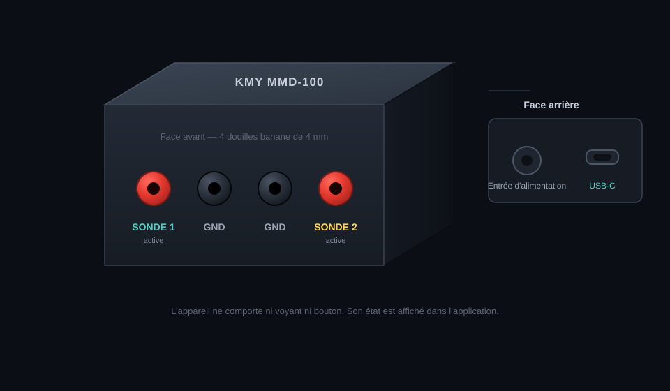

La face avant comporte quatre prises bananes de 4 mm. Les prises extérieures sont les connexions actives **Sonde 1** et **Sonde 2** ; les prises intérieures correspondent à la **masse (GND)**. Reliez une borne du composant à une sonde active et l’autre à la prise GND voisine.

Le port **USB-C** arrière droit assure la connexion à l’ordinateur, le transfert des données et l’alimentation. L’**entrée d’alimentation externe** à gauche est réservée à une alimentation séparée.

Le boîtier ne comporte ni bouton ni voyant. Consultez l’alimentation, l’état de connexion et le mode dans l’application pour ordinateur ou mobile.

### 3. Configuration requise et préparation

L’utilisation sur ordinateur nécessite un câble USB et Windows 10 ou Windows 11 en version 64 bits. L’utilisation mobile nécessite Android 7.0 ou ultérieur et un téléphone ou une tablette à processeur ARM 64 bits. L’installation Windows ne nécessite pas de droits administrateur.

> **Débranchez l’alimentation de la carte et déchargez ses condensateurs avant le test de courbe.** L’appareil applique son propre signal dans ce mode. Un circuit alimenté peut fausser les mesures et endommager définitivement la carte ou l’appareil.

## Partie B — Installation et première connexion

### 4. Installation du logiciel

#### Installation sous Windows

1. Ouvrez la [page de la dernière version](https://github.com/kmyelectronicseu-png/kmy-mmd1/releases/latest).
2. Téléchargez et exécutez **KMY-MMD-100-Kurulum.exe**.
3. Sélectionnez la langue d’installation. Elle concerne uniquement l’assistant ; la langue de l’application se règle dans **Paramètres**.
4. Terminez les étapes. L’application est installée dans `%LocalAppData%\Programs\KMY MMD-100`.

Les autres fichiers de la page des versions servent à la mise à jour automatique de l’application ; il est inutile de les télécharger. La désinstallation conserve les projets et rapports exportés dans **Documents** ; les préférences, notamment la langue, sont réinitialisées.

#### Installation sous Android

1. Téléchargez et ouvrez **KMY-MMD-100-Mobil.apk** depuis la même page.
2. Autorisez l’installation depuis cette source lorsque Android le demande, puis terminez l’installation.
3. Utilisez Android 7.0 ou ultérieur avec un processeur ARM 64 bits.

L’application mobile se connecte uniquement par Wi-Fi. Les fonctions de mesure, d’analyse et de test correspondent à celles de la version pour ordinateur. Le micrologiciel nécessite un ordinateur et une connexion USB pour être mis à jour ; cette opération n’est pas possible depuis un téléphone.

### 5. Première connexion à l'appareil

Branchez le câble USB et ouvrez **KMY MMD-100**. Sélectionnez l’appareil dans la liste supérieure et cliquez sur **Connecter**.

La préparation au démarrage dure environ **13-15 secondes**. La sortie de test et la sélection du mode restent indisponibles pendant cette période. L’indicateur de connexion vert signale que l’appareil est prêt.

Si la connexion échoue immédiatement après le branchement, attendez quelques secondes et réessayez. Si le problème persiste, éteignez puis rallumez l’appareil et contactez le support KMY Electronics.

### 6. Première mesure

Pour la première mesure, utilisez une résistance de valeur connue **entre 100 Ω et 10 kΩ**.

1. Reliez une borne à **Sonde 1** et l’autre à la prise **GND** voisine.
2. Sélectionnez **Tension : Basse** et **Calibre de Courant : Moyenne**.
3. Passez **Sortie** de **Inactif** à **Actif**.
4. Examinez la droite inclinée et la résistance calculée dans la fiche sous le graphique.
5. Cliquez de nouveau sur **Sortie** ou retirez la résistance pour terminer.

Les autres courbes sont décrites dans la galerie des signatures.

## Partie C — Test de courbe et analyse V-I

### 7. Comment fonctionne le test de courbe

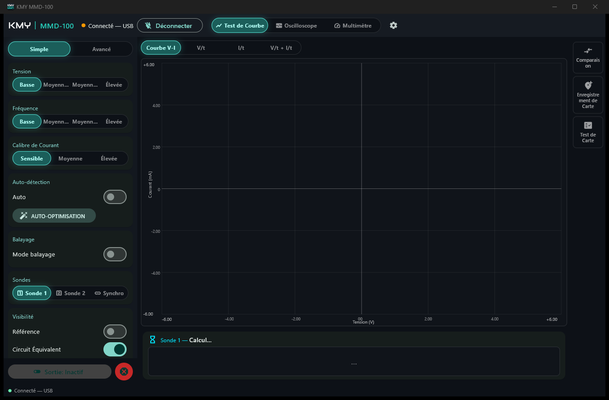

Les réglages sont à gauche, le graphique au centre et **Comparaison**, **Enregistrement de Carte** et **Test de Carte** à droite.

Lors d’un test sinusoïdal, l’appareil applique une tension alternative et mesure simultanément le courant. Leur représentation produit la courbe V-I. Une résistance donne une droite inclinée, un condensateur une ellipse et une diode une transition marquée vers la conduction.

La courbe décrit le comportement entre les deux bornes mesurées. Les sondes indépendantes s’utilisent individuellement ou en mode **Synchro**.

### 8. Réglages de mesure de base

La vue **Simple** permet de choisir tension, fréquence et calibre de courant. Tension et fréquence proposent **Basse, Moyenne-1, Moyenne-2, Élevée**.

| Niveau | Tension (crête) | Fréquence |
| :--- | :---: | :---: |
| **Basse** | 2,5 V | 10 Hz |
| **Moyenne-1** | 5 V | 50 Hz |
| **Moyenne-2** | 10 V | 100 Hz |
| **Élevée** | 15 V | 1000 Hz |

* **Tension :** Définit la valeur de crête du signal de test. Commencez au niveau le plus bas pour un composant inconnu. Augmentez progressivement si le seuil de conduction d’une jonction n’est pas atteint.
* **Fréquence :** Aide à évaluer les composants réactifs. La pente d’une résistance idéale ne dépend pas de la fréquence. Un condensateur de 100 nF présente une courbe étroite à 10 Hz et une ellipse plus marquée à 1000 Hz.
* **Calibre de Courant :** Définit la sensibilité de mesure du courant.

| Calibre | Quand l'utiliser |
| :--- | :--- |
| **Sensible** | Condensateurs, résistances de valeur élevée et composants délicats qui ne tirent qu'un courant infime. |
| **Moyenne** | Point de départ sûr sur une pièce inconnue. |
| **Élevée** | Résistances de faible valeur, diodes en conduction et pièces robustes qui tirent beaucoup de courant. |

Si la courbe est écrêtée ou si **Signal écrêté** apparaît, réduisez la tension ou choisissez un calibre moins sensible. Les composants à faible courant peuvent produire une droite horizontale en **Élevée** ; recommencez avec **Sensible**. Une droite horizontale ne suffit pas à confirmer une panne.

### 9. Galerie des signatures de composants

La fiche indique le type de composant déduit, la valeur calculée et la **Confiance** de l’identification. Les 12 exemples suivants facilitent l’interprétation.

**Dérive attendue** indique l’écart prévu par rapport à un multimètre de référence dans les conditions actuelles, par exemple **Dérive attendue +2,19 %…+3,01 %**. Elle dépend du calibre et de la valeur du composant. Hors du domaine pris en charge, avec un signal autre que sinusoïdal/CA, des charges très différentes ou un appareil non prêt, une explication remplace le nombre. « Sous les limites de référence » signifie que l’écart est inférieur à la limite de tolérance de la mesure de référence.

KMY MMD-100 mesure entre deux bornes. Il ne classe pas automatiquement un composant à trois bornes comme transistor ou MOSFET. L’utilisateur doit identifier les bornes mesurées ; le résultat décrit leur comportement électrique.

#### Résistance
Droite inclinée passant par le centre. La pente augmente lorsque la résistance diminue et diminue lorsque la résistance augmente. Pour une résistance idéale, elle ne dépend pas de la fréquence.

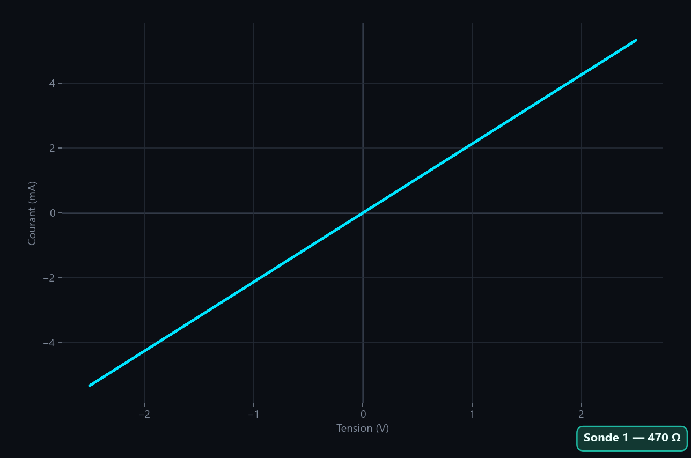

#### Condensateur
Courbe elliptique qui s’élargit lorsque la fréquence augmente et se resserre lorsqu’elle diminue.

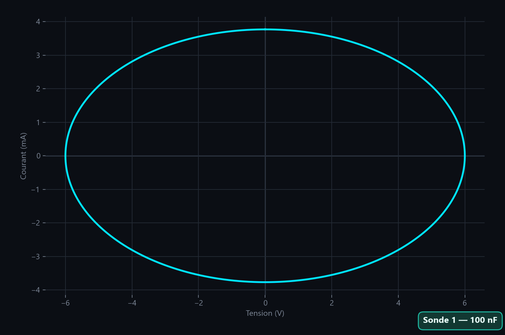

#### Bobine
Courbe elliptique qui se resserre lorsque la fréquence augmente et s’élargit lorsqu’elle diminue, à l’inverse du condensateur.

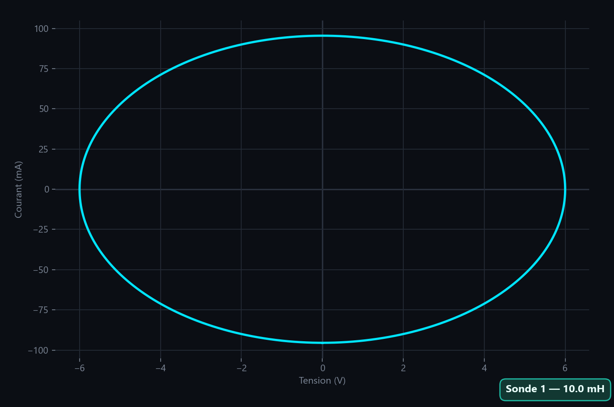

#### Condensateur et ESR
La résistance série incline l’ellipse. La fiche affiche séparément capacité et résistances parallèle et série.

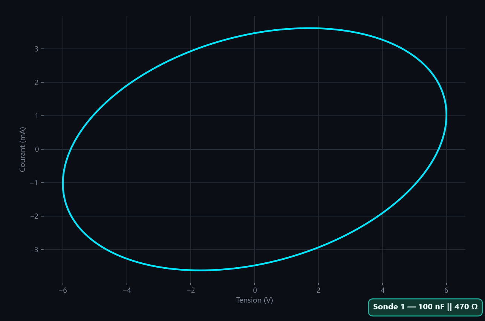

#### Diode
Zone de blocage rectiligne et transition nette vers la conduction. Le seuil typique d’une diode au silicium est de 0,6 V - 0,7 V. Il peut être plus faible pour une Schottky et plus élevé pour une LED.

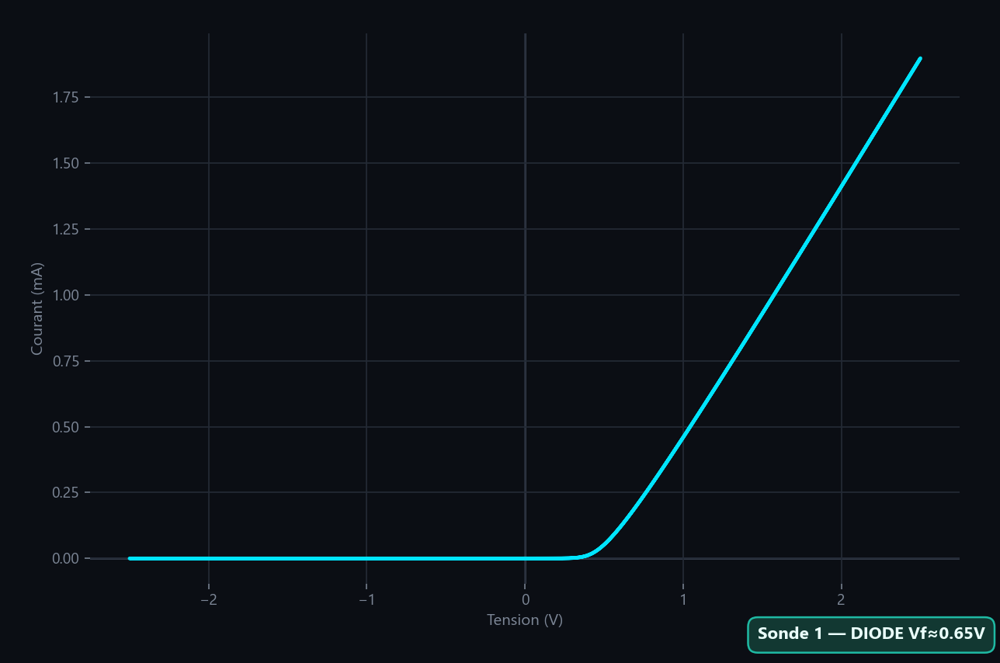

#### Diode Zener
Présente une conduction directe et un claquage inverse. La tension maximale de test de 15 V ne permet pas d’observer un claquage au-delà de cette limite.

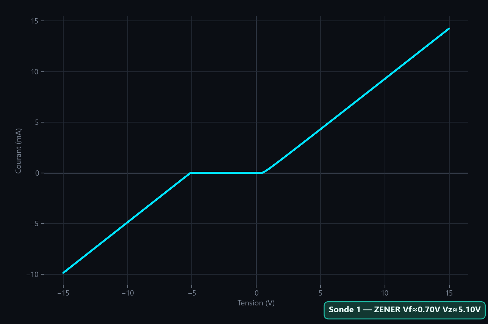

#### Diode TVS
Une TVS unidirectionnelle se comporte comme une Zener et peut être affichée **ZENER**. Une TVS bidirectionnelle peut donner **|Z|** ou **Non identifié**, car son claquage symétrique ne dispose pas d’une classe TVS dédiée.

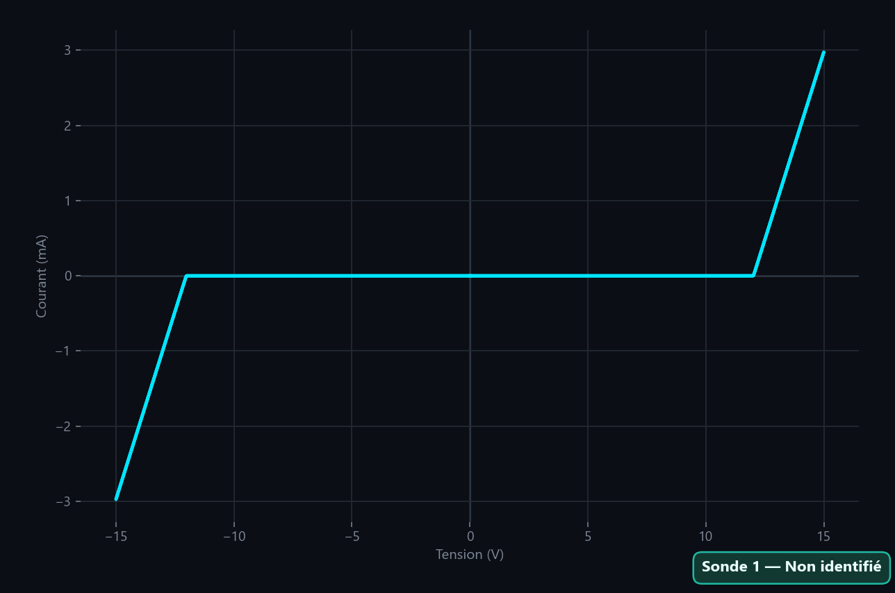

#### MOSFET grille-source
L’isolation de grille produit un courant très faible. Quelques picofarads sur un MOSFET de faible signal peuvent rester sous le seuil de mesure et donner **CIRCUIT OUVERT**. Quelques nanofarads sur un MOSFET de puissance peuvent former une ellipse étroite. Un résultat ouvert ne constitue pas à lui seul une panne.

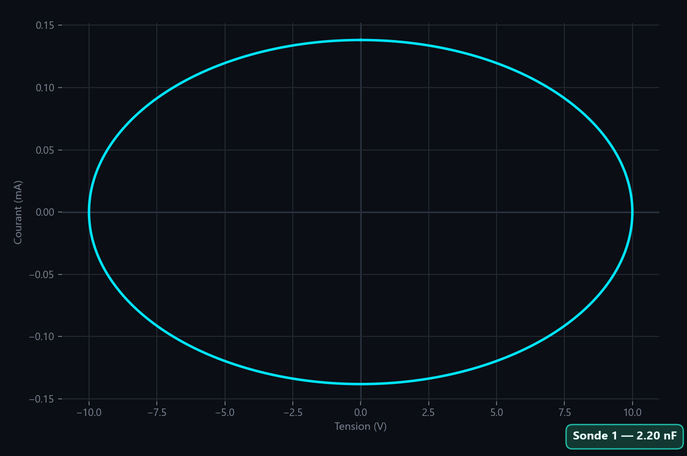

#### MOSFET drain-source
Avec la grille reliée à la source ou laissée ouverte, le comportement de la diode intrinsèque peut apparaître avec **DIODE**. La tension directe peut être légèrement supérieure à celle d’une diode de signal.

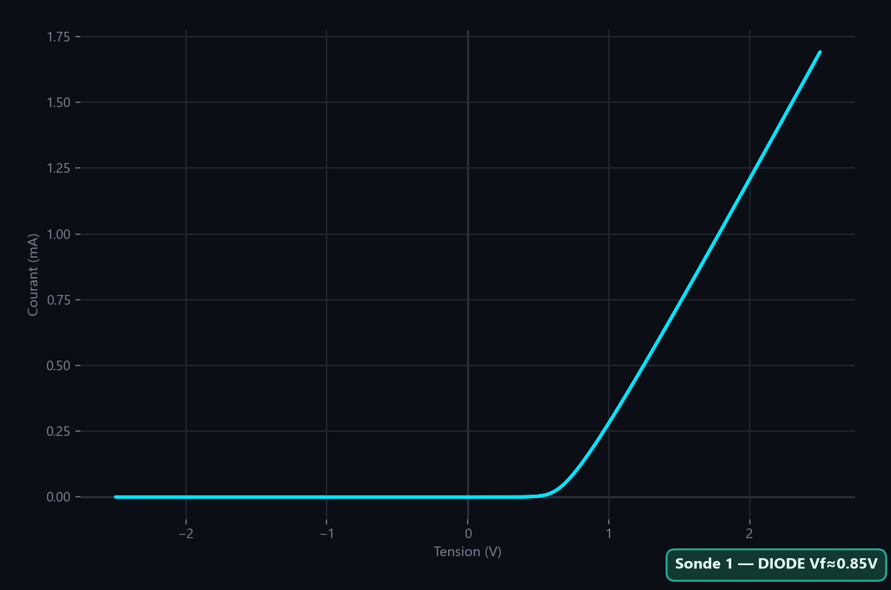

#### Transistor base-émetteur
Se comporte comme une jonction de diode et affiche **DIODE**. La tension directe typique est de 0,65 V - 0,70 V.

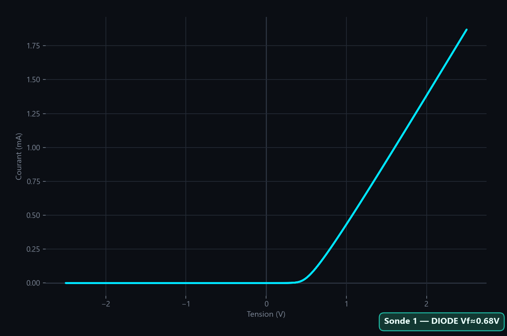

#### Transistor base-collecteur
Se comporte comme une jonction de diode. Le seuil peut être légèrement inférieur à celui de base-émetteur ; l’affichage reste **DIODE**.

#### Transistor collecteur-émetteur
Avec la base ouverte, **CIRCUIT OUVERT** peut apparaître. Sans commande de base, ce résultat ne suffit pas à indiquer une panne.

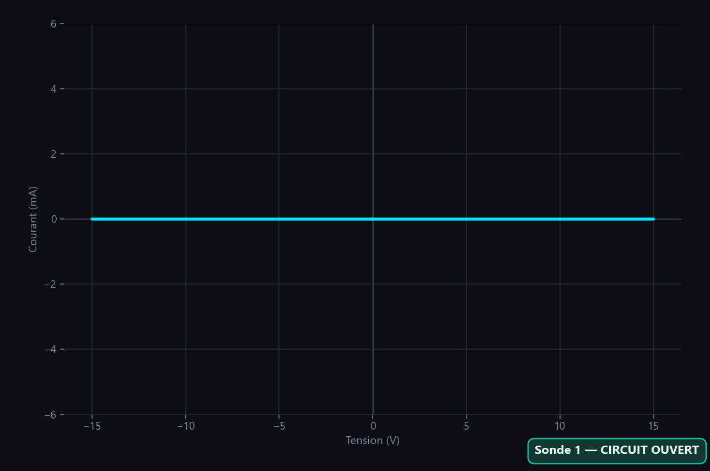

Les mesures en circuit incluent l’effet des chemins parallèles. En cas de doute, déconnectez une borne du composant de la carte et recommencez la mesure.

### 10. Réglages de mesure avancés

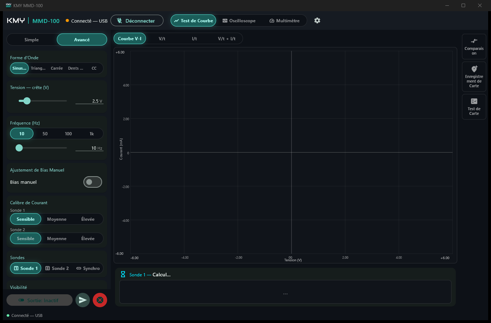

La vue **Avancé** permet de régler la tension entre 0,1 - 15 V et la fréquence entre 1 - 1000 Hz.

* **Forme d'Onde :** Sinusoïdale, Triangulaire, Carrée, Dents de Scie ou CC. L’analyse utilise la sinusoïde ; CC applique une tension constante.
* **Bias manuel :** Décale le centre du signal par rapport à zéro. Maintenez un bouton de direction et choisissez un pas de 0.010 V, 0.100 V ou 1.000 V. **Réinitialiser** remet le centre à zéro. La fonction est désactivée par défaut ; ne l’activez que pour un test particulier.
* **Calibre de Courant :** Indépendant pour Sonde 1 et Sonde 2. Utilisez le même calibre pour comparer ; des calibres différents modifient la superposition.

Les changements sont envoyés au relâchement du contrôle. **Appliquer** transmet immédiatement les réglages.

* **Auto-détection :** Choisit tension, fréquence et calibre selon l’identification. Au moins trois résultats identiques consécutifs sont nécessaires avant modification.
* **AUTO-OPTIMISATION :** Recherche une fois des réglages adaptés. Elle les applique si la recherche aboutit ; sinon, conserve les valeurs actuelles.
* **Mode balayage :** Fait varier tension, fréquence ou calibre dans l’intervalle choisi, en maintenant les deux autres fixes. Les courbes dépendantes de la fréquence aident à évaluer un comportement réactif ; les courbes stables, un comportement principalement résistif.

Dans **Visibilité**, **Référence** montre la courbe enregistrée avec la mesure en direct. **Circuit Équivalent** dessine le circuit simple déduit. **Figer** maintient la courbe à l’écran.

### 11. Les deux sondes et le mode Synchro

**Sonde 1** et **Sonde 2** appliquent le signal à une seule sonde sélectionnée. **Synchro** alimente simultanément les deux sondes depuis une source commune.

Une différence importante de charge déclenche un avertissement jaune dans la barre d’état ou le panneau mobile. Si une sonde est ouverte, l’autre lecture peut présenter environ **1 %** d’écart. L’avertissement n’invalide pas automatiquement le résultat ; il signale l’influence de l’équilibre des charges.

Pour une comparaison précise, terminez en mode individuel **Sonde 1** ou **Sonde 2**.

## Partie D — Comparaison et test de carte

### 12. Fonctions de comparaison

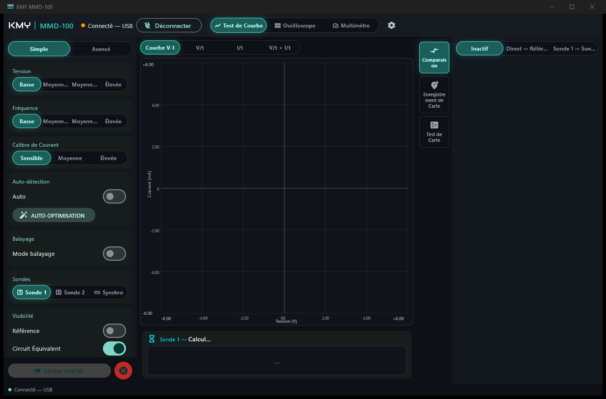

**Comparaison** propose trois options :

* **Inactif :** Désactive la comparaison.
* **Direct ↔ Référence :** Compare la courbe actuelle avec une référence. **Capturer Référence** prend la courbe actuelle ; elle peut être enregistrée et rechargée.
* **Sonde 1 ↔ Sonde 2 :** Compare un composant fonctionnel à un composant suspect. La mesure simultanée réduit l’effet des variations temporelles et ambiantes.

La similitude est comparée au seuil choisi. Au-dessus apparaît **CORRESPONDANCE** ; au-dessous, **NON-CORRESPONDANCE**. Le seuil par défaut est **90 %**. **Sensibilité de coude** propose Inactif, Normal et Élevée pour examiner les différences autour des transitions.

Sans courant mesurable, **PAS DE MESURE** apparaît. Vérifiez contact et calibre. **Alerte sonore** signale le changement entre correspondance et écart.

Un écart indique une différence par rapport à la référence. Évaluez une éventuelle panne en tenant compte du circuit et d’autres mesures.

### 13. Enregistrement et test de carte

L’enregistrement crée un plan de test de référence pour réparer et contrôler des cartes du même modèle.

#### Enregistrer une référence

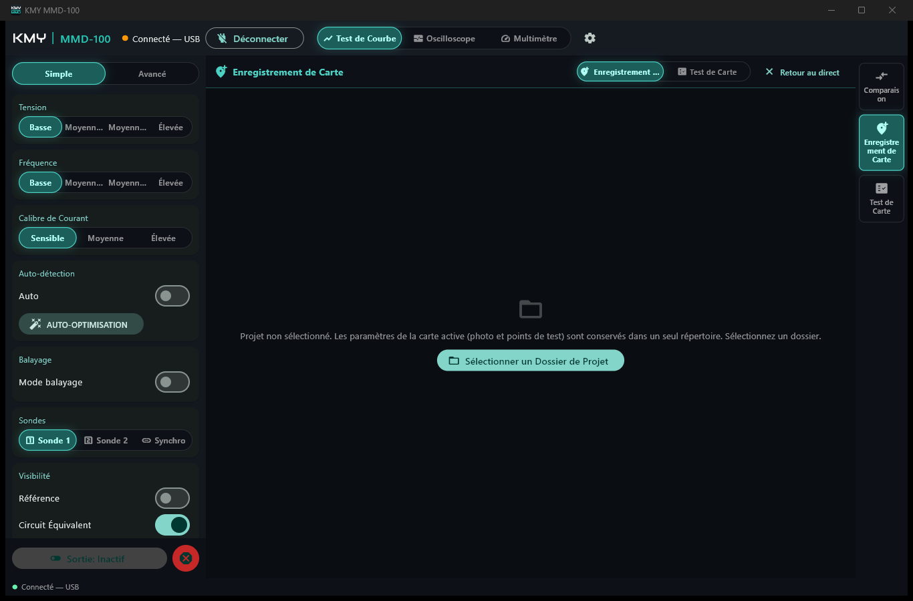

1. **Créez un dossier de projet.** Photo et points sont enregistrés ensemble. Copiez le dossier pour ouvrir le projet sur un autre ordinateur.
2. **Ajoutez l’image de la carte.** Utilisez une photo nette, sans ombre, prise de dessus.
3. **Définissez les points.** Posez la sonde sur le point, sélectionnez sa position dans la photo et attribuez un nom tel que R14, C7 ou U3-1. Cliquez sur **ENREGISTRER LE POINT**.
4. **Ordonnez la séquence.** Faites glisser les points dans l’ordre requis.

**Signature multi-étapes** enregistre chaque point à 3 ou 4 niveaux de tension et de fréquence. L’opération dure plus longtemps et couvre plusieurs conditions de test.

#### Tester une carte enregistrée

Cliquez sur **Démarrer Test** et contactez les points dans l’ordre. Chaque mesure est comparée et marquée **Correspond** ou **Écart**. Les écarts apparaissent comme **marqueurs rouges** sur la photo.

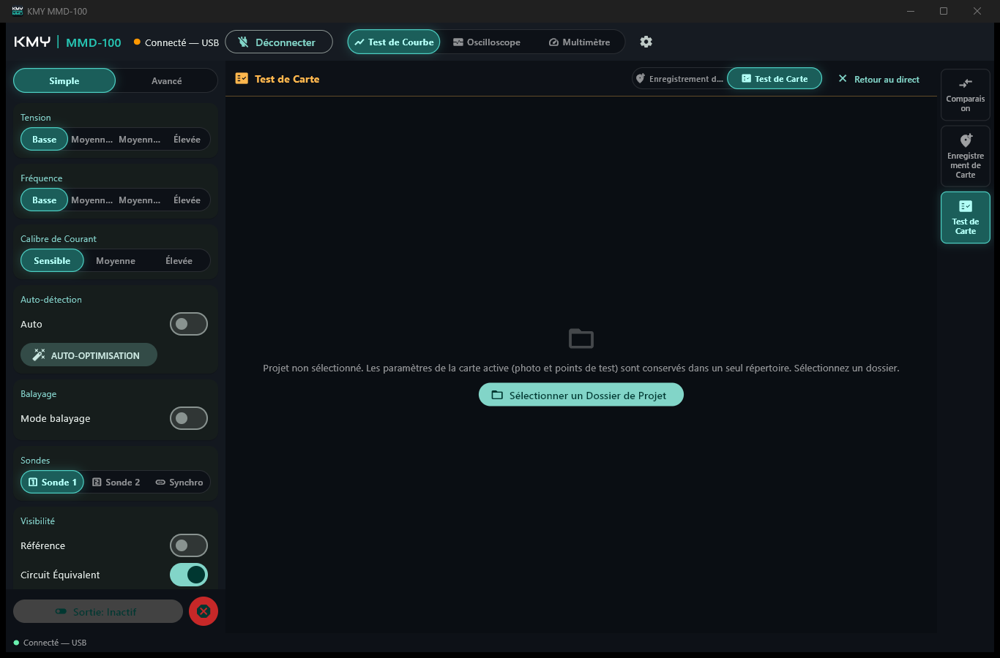

Vous pouvez suspendre le test ou ignorer des points. **Tester les restants** complète les mesures manquantes. **Avancement Automatique** passe au point suivant après une correspondance.

**Exporter Rapport Excel** produit trois feuilles : mesures par point, tableau récapitulatif et carte des correspondances et écarts.

## Partie E — Oscilloscope et multimètre

### 14. Mode oscilloscope

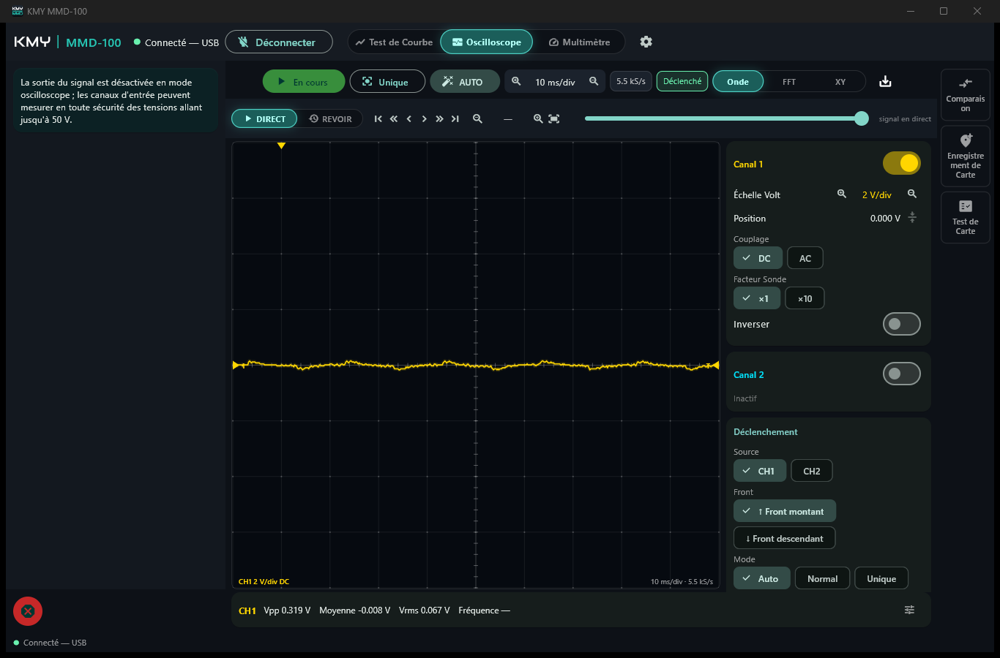

En mode oscilloscope, le générateur de test est arrêté et les sondes mesurent les signaux externes. La limite d’entrée est de **50 V**. La voie 1 est **jaune**, la voie 2 **cyan**. En test de courbe, Sonde 1 est cyan et Sonde 2 jaune.

L’échantillonnage est fixe à **5,5 kS/s**, soit 5500 échantillons par seconde. La base de temps modifie seulement l’intervalle affiché. Utilisez l’appareil comme **oscilloscope basse fréquence** ; au-dessus de 1 kHz, la forme d’onde n’est pas fiable. L’ondulation d’alimentation et les sorties de commande moteur peuvent être étudiées dans ces limites.

* **AUTO (réglage automatique) :** Règle base de temps, échelle de tension et seuil de déclenchement. Sans signal exploitable, conserve les réglages.
* **Auto :** Rafraîchit sans déclenchement requis.
* **Normal :** Rafraîchit seulement lorsque la condition de déclenchement est remplie.
* **Single :** Capture une fois et maintient l’affichage.

Déplacez les indicateurs de ligne de base et de déclenchement à la souris. **REVOIR** suspend le flux et permet d’examiner les **20 dernières secondes**, enregistrées en continu en arrière-plan.

La barre inférieure affiche **Vpp**, **Moyenne**, **Vrms** et **Fréquence**. Choisissez les valeurs visibles parmi **11 paramètres de mesure**. Les tensions sont affichées en volts avec trois décimales.

### 15. Mode multimètre

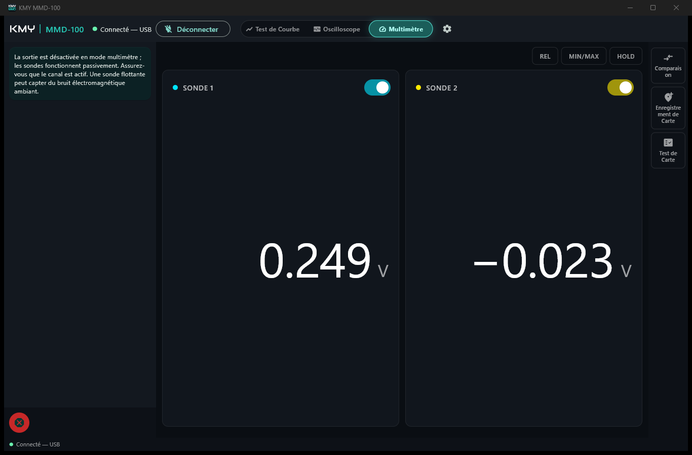

Les deux sondes mesurent indépendamment et simultanément la tension. KMY MMD-100 sélectionne automatiquement CA/CC et calibre. Les valeurs sont exprimées en volts (V) avec trois décimales, par exemple **0.068 V**. L’interrupteur en haut à droite de chaque fiche active ou désactive la voie.

* **REL (mesure relative) :** Prend la valeur initiale comme zéro et affiche les différences suivantes.
* **MIN/MAX :** Suit les valeurs minimale et maximale.
* **HOLD :** Maintient la valeur affichée.

La sortie de test est inactive. Activez la voie nécessaire. Une sonde déconnectée peut afficher du bruit électromagnétique capté dans l’environnement.

## Partie F — Paramètres et connexion

### 16. Paramètres système

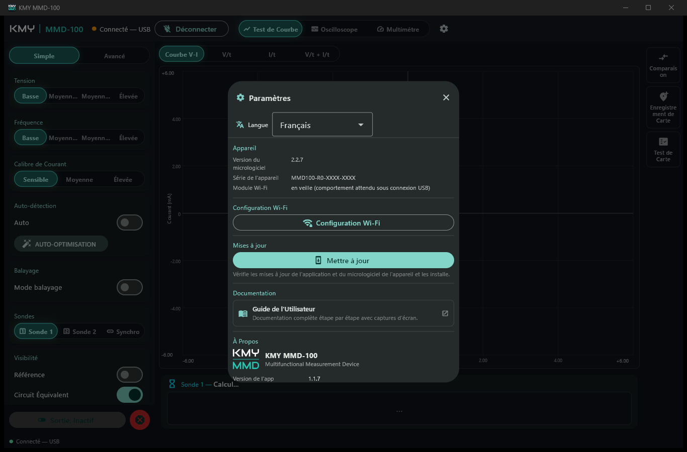

Ouvrez **Paramètres** avec l’engrenage de la barre supérieure. Les langues proposées sont turc, anglais, allemand, espagnol et français.

Le panneau affiche la version du micrologiciel et le numéro de série de l’appareil, les outils Wi-Fi et un lien vers ce guide. La version de l’application est indiquée sous **À Propos**. **Mettre à jour** vérifie les versions de l’application et du micrologiciel. Le micrologiciel nécessite une connexion USB pour être mis à jour.

### 17. Utilisation sans fil et configuration Wi-Fi

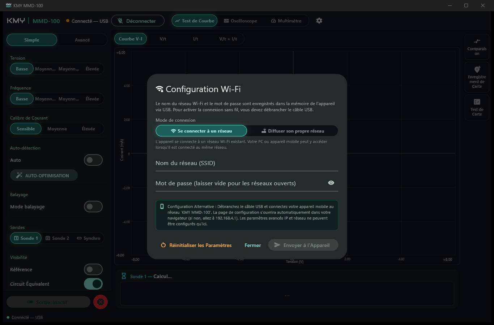

Le Wi-Fi propose deux connexions :

1. **Mode station :** L’appareil rejoint un réseau existant ; ordinateur ou mobile se connectent par ce même réseau.
2. **Mode point d’accès :** L’appareil crée son propre réseau pour une connexion directe.

#### Configuration depuis l’application

Avec USB connecté, ouvrez **Paramètres → Configuration Wi-Fi**. Sélectionnez le mode, entrez SSID et mot de passe puis envoyez les réglages.

#### Configuration depuis le navigateur

Le point d’accès par défaut diffuse le réseau **KMY MMD-100**. Connectez le téléphone ou l’ordinateur. Si la page ne s’ouvre pas automatiquement, saisissez **192.168.4.1** dans le navigateur. Les paramètres avancés, comme une IP fixe, sont disponibles uniquement dans cette interface. L’appareil doit rester alimenté pendant l’utilisation sans fil.

#### Appareil absent de la liste réseau

Saisissez son adresse avec **IP Manuel**. Certains routeurs empêchent les appareils du réseau de se détecter entre eux. Retrouvez l’adresse dans la liste du routeur ou l’interface web de l’appareil. Sous Android, la saisie manuelle est sous l’écran de connexion.

Une seule connexion est acceptée à la fois ; **OCCUPÉ** indique un autre client connecté. **Réinitialiser les Paramètres** restaure les réglages sans fil par défaut.

### 18. Utilisation sur mobile (téléphone/tablette)

L’application Android fournit les fonctions Windows de mesure, d’analyse et de test dans une disposition mobile.

* **Bandeau d’état supérieur :** S’ouvre au toucher ou par glissement vers le bas. Affiche connexion, avertissements et motifs de blocage. Contient **Outils**, **Paramètres** et **Connecter/Déconnecter** ; s’ouvre automatiquement pour les avertissements critiques.
* **Bandeau de commande inférieur :** S’ouvre au toucher ou par glissement vers le haut et reste à la hauteur choisie. Contient réglages, Test de Courbe, Oscilloscope, Multimètre et raccourcis Tension, Fréquence et Calibre de Courant.

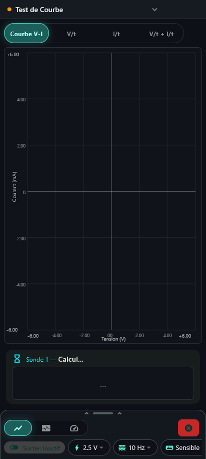

**Comparaison**, **Enregistrement de Carte** et **Test de Carte** sont dans **Outils** ; les options générales dans **Paramètres**. Le panneau de connexion propose recherche réseau, connexion directe au réseau de l’appareil et IP manuelle.

Le micrologiciel ne peut pas être mis à jour sur mobile. **Mettre à jour** télécharge la nouvelle version de l’application et ouvre l’installation Android.

### 19. Mises à jour logicielles

**Paramètres → Mises à jour** vérifie les versions de l’application et du micrologiciel KMY MMD-100. La mise à jour démarre l’installation ; la fermeture puis la réouverture avec la nouvelle version sont normales.

* L’application peut être mise à jour sans connexion à l’appareil.
* Le micrologiciel nécessite un ordinateur et un **câble USB** branché. La mise à jour est impossible par Wi-Fi ou application mobile.
* La vérification nécessite internet. Sans connexion, l’application informe l’utilisateur et conserve l’installation existante.

## Partie G — Informations de référence

### 20. Limites et paramètres techniques

| Paramètre | Valeur |
| :--- | :--- |
| **Tension de test** | $\pm 15\text{ V}$ crête (peak) |
| **Fréquence de test** | $1\text{ Hz} - 1000\text{ Hz}$ |
| **Limite d'entrée oscilloscope / voltmètre** | $50\text{ V}$ au maximum |
| **Fréquence d'échantillonnage de l'oscilloscope** | $5,5\text{ kS/s}$ (figée dans le matériel) |
| **Profondeur d'enregistrement de l'oscilloscope** | Les $20$ dernières secondes, sans interruption |
| **Alimentation** | Par le port USB |

**Règles de sécurité et d’utilisation**

* Coupez l’alimentation et déchargez les condensateurs de forte capacité avant le test de courbe.
* Le signal n’est généré qu’en **Test de Courbe**. Le générateur est arrêté en Oscilloscope et Multimètre.
* Le bouton rouge **ARRÊT** coupe immédiatement la tension de test lorsque la connexion est active.
* La sortie reste indisponible jusqu’à la fin de la préparation au démarrage.
* L’appareil n’est pas conçu pour le **secteur 220 V CA**. Ne reliez pas les sondes à des prises ou lignes haute tension.

### 21. Problèmes courants et solutions

* **Appareil non listé :** Vérifiez câble USB et port. En Wi-Fi, confirmez le réseau commun et saisissez l’IP si nécessaire.
* **Commandes bloquées après connexion :** Attendez 13-15 secondes pour la préparation.
* **Sortie indisponible :** Attendez la préparation, puis éteignez et rallumez. Si le problème persiste, contactez KMY Electronics.
* **Courbe horizontale :** Vérifiez contact, tension et calibre. Si nécessaire, augmentez la tension d’un niveau ou choisissez un calibre plus sensible.
* **Avertissement jaune en Synchro :** Charges différentes ou sonde ouverte possibles. Utilisez une seule sonde pour les mesures précises.
* **PAS DE MESURE :** Vérifiez le contact. Essayez **Sensible** pour une forte impédance.
* **OCCUPÉ :** Un autre client est connecté. Fermez cette connexion.
* **Décalage des mesures :** Éteignez et rallumez. Si l’écart ou les avertissements persistent, contactez KMY Electronics.
* **Onde déformée :** Vérifiez la fréquence. À 5,5 kS/s, les ondes supérieures à 1 kHz ne peuvent pas être examinées de façon fiable.
* **Appareil non trouvé sur mobile :** Confirmez le réseau commun. En mode point d’accès, connectez le téléphone à **KMY MMD-100**.

### 22. Support technique et contact

Pour vos questions techniques, contactez KMY Electronics :

* [Page du produit sur GitHub](https://github.com/kmyelectronicseu-png/kmy-mmd1)
* [kmyelectronics.eu@gmail.com](mailto:kmyelectronics.eu@gmail.com)

Indiquez le numéro de l’appareil, la version et la description du problème. Le numéro figure dans **Paramètres**, sur la ligne **Série de l'appareil**.
