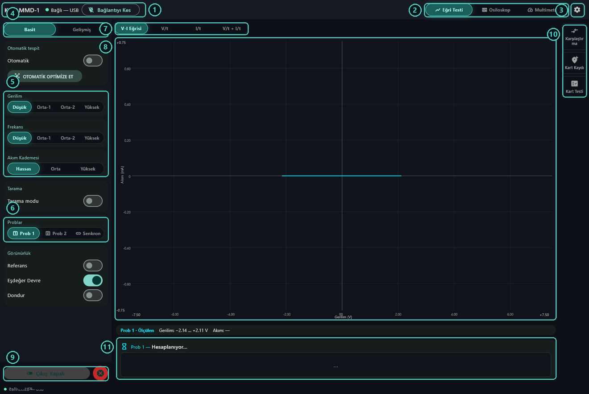
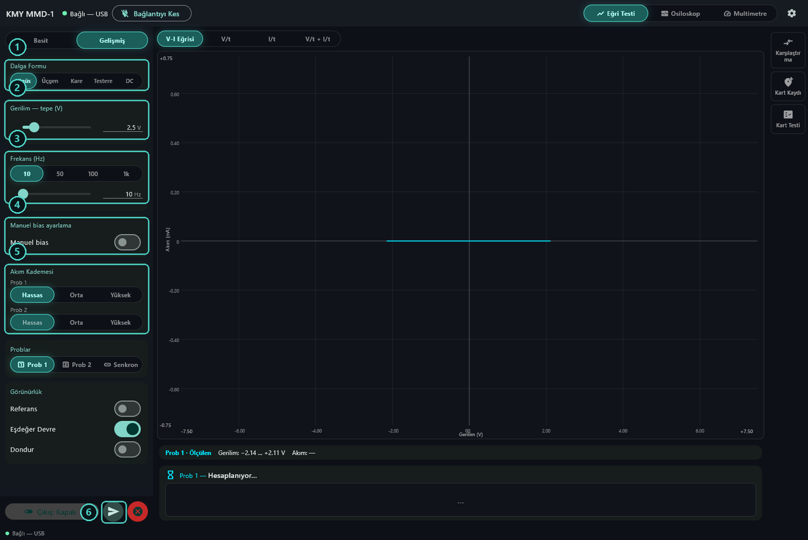
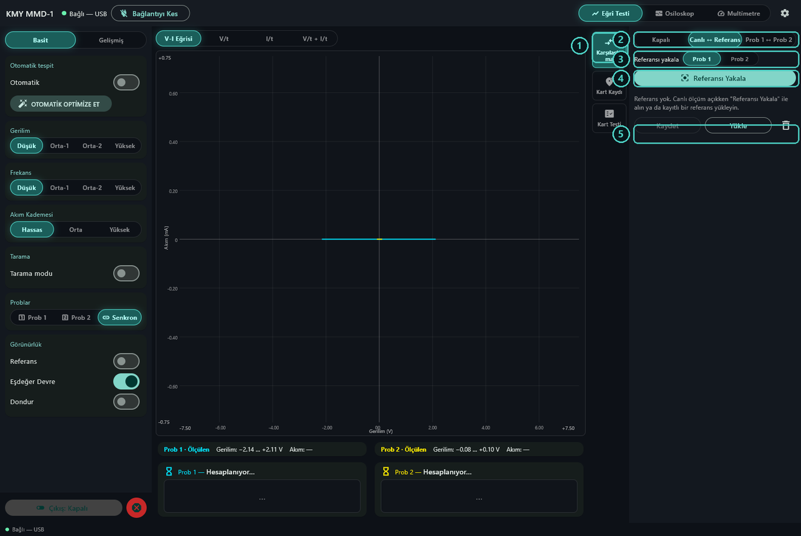
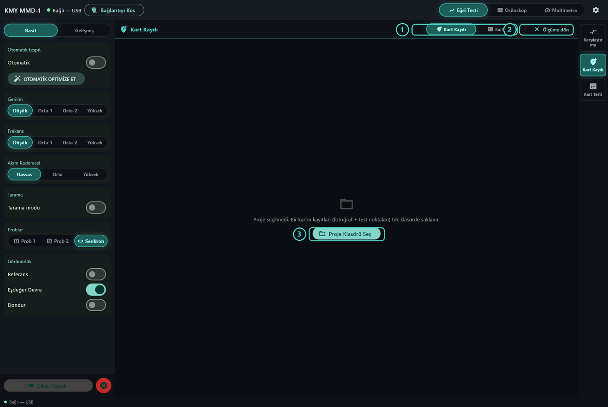
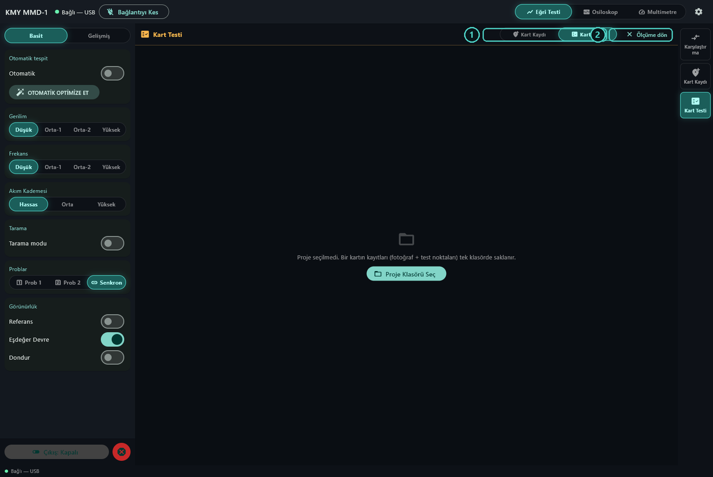
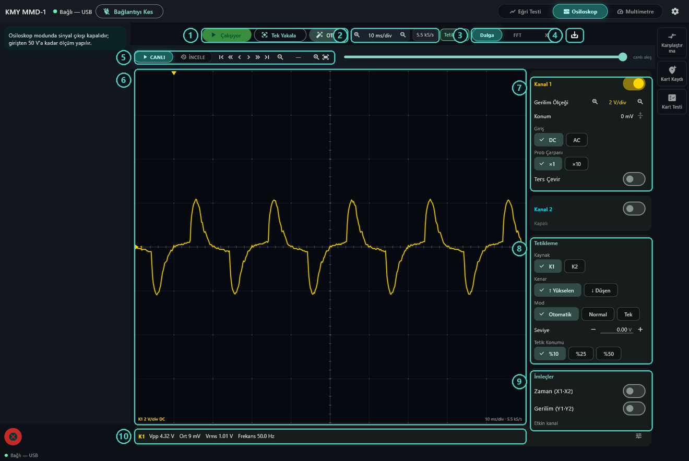
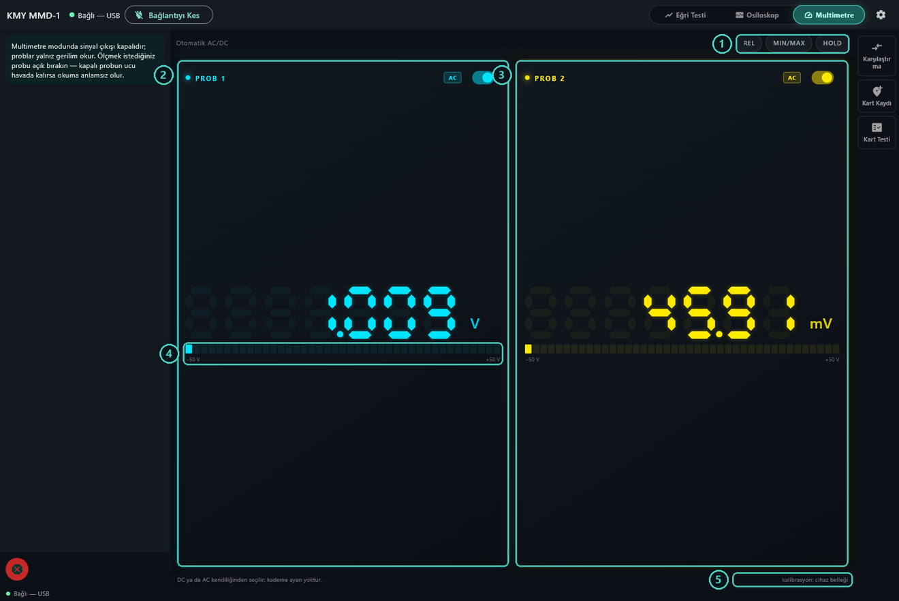
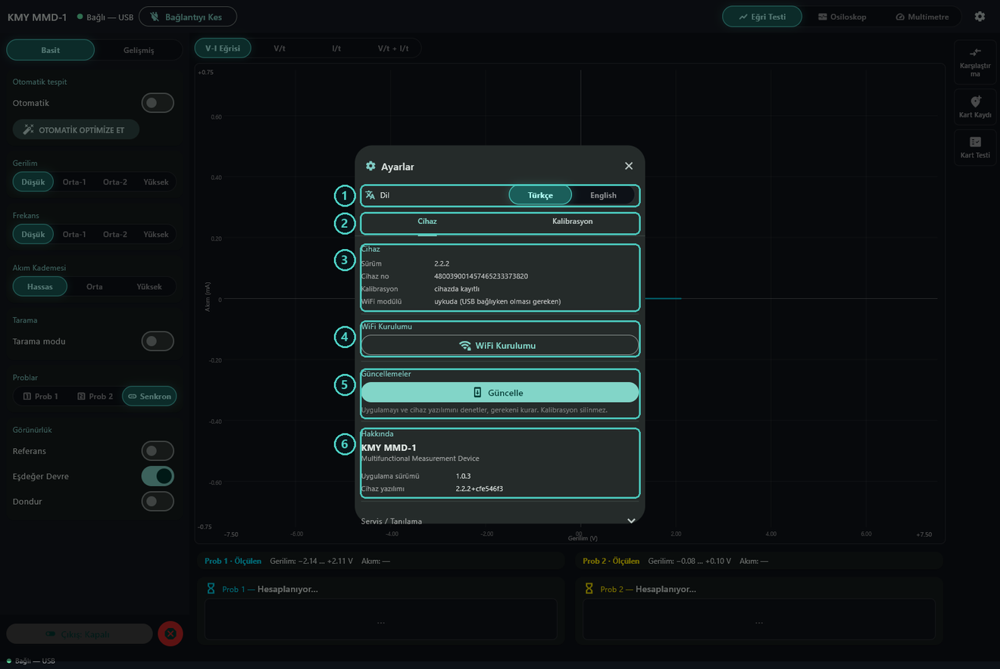
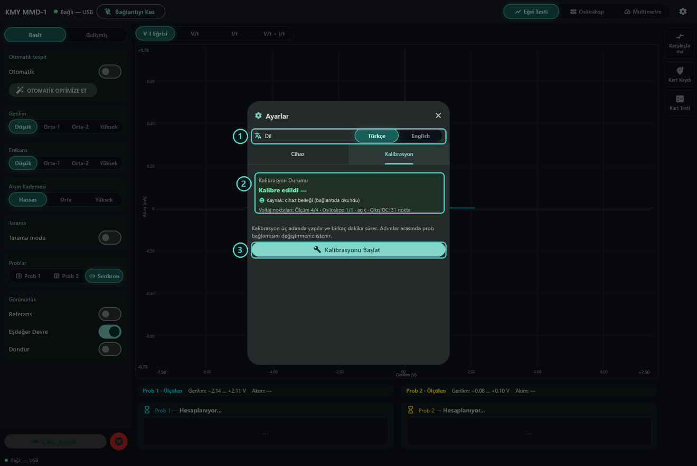

# KMY MMD-1 — Kullanım Kılavuzu

**Çok Fonksiyonlu Ölçüm Cihazı**

Tek kutuda üç alet: bileşenleri gerilim–akım eğrisinin biçiminden tanıyan bir
eğri çizici, iki kanallı bir osiloskop ve iki kanallı bir voltmetre. Windows
bilgisayara USB ile bağlanır; ağ kurulumunu yaptıktan sonra kablosuz da
çalışır.

> English version: [user-guide-en.md](user-guide-en.md)

---

## İçindekiler

1. [Gerekenler](#1-gerekenler)
2. [Yazılımın kurulumu](#2-yazılımın-kurulumu)
3. [İlk bağlantı](#3-ilk-bağlantı)
4. [Ana pencere](#4-ana-pencere)
5. [Eğri Testi](#5-eğri-testi)
6. [Karşılaştırma](#6-karşılaştırma)
7. [Kart Kaydı ve Kart Testi](#7-kart-kaydı-ve-kart-testi)
8. [Osiloskop](#8-osiloskop)
9. [Multimetre](#9-multimetre)
10. [Ayarlar](#10-ayarlar)
11. [Kalibrasyon](#11-kalibrasyon)
12. [Kablosuz kullanım](#12-kablosuz-kullanım)
13. [Güncellemeler](#13-güncellemeler)
14. [Güvenlik ve sınırlar](#14-güvenlik-ve-sınırlar)
15. [Bir şeyler ters giderse](#15-bir-şeyler-ters-giderse)

---

## 1. Gerekenler

- KMY MMD-1 ve USB kablosu.
- 64 bit Windows 10 ya da 11 çalıştıran bir bilgisayar.
- Başka bir şey yok. Cihaz gücünü USB portundan alır, yazılım da yönetici izni
  istemeden kurulur.

**Probları bir yere değdirmeden önce:** test edeceğiniz devre kapalı ve
kondansatörleri boşalmış olmalı. Alet, probların değdiği şeye kendi test
sinyalini uygular; enerjili bir devre o sinyalle çekiştiğinde iki taraf da
zarar görür.

---

## 2. Yazılımın kurulumu

1. Yayın sayfasını açın:
   <https://github.com/kmyelectronicseu-png/kmy-mmd1/releases/latest>
2. **KMY-MMD-1-Kurulum.exe** dosyasını indirin.
3. Çalıştırın. İlk ekran kurulumun hangi dilde ilerleyeceğini sorar — bu seçim
   yalnız kurulumu ilgilendirir; uygulamanın kendi dil ayarı ayrıdır ve
   istediğiniz zaman değiştirilebilir.
4. Sihirbazı takip edin. Kurulum kendi kullanıcı klasörünüze yapılır, bu yüzden
   Windows yönetici parolası sormaz.

Kurulum dosyasının yanındaki `.imza` dosyası onun imzasıdır. Uygulama sonradan
indirdiği güncellemeleri bununla doğrular; sizin bir şey yapmanız gerekmez.

Cihazın ihtiyacı olan her şey — cihaz yazılımı dahil — bu tek kurulum
dosyasının içinde gelir. Ayrıca indirilecek bir şey yoktur.

---

## 3. İlk bağlantı

USB kablosunu takın ve **KMY MMD-1** uygulamasını açın.

Cihaz, pencerenin üstündeki listede görünür. **Bağlan** düğmesine basın.

Cihaz açıldıktan sonra ilk işi kendini dahili gerilim referanslarına göre
kalibre etmektir. Bu yaklaşık on beş saniye sürer ve bu sırada denetimler
kilitli kalır — normaldir, beklemek yeterli. Cihaz hazır olduğunda bağlantı
durumunun yanındaki nokta yeşile döner.

---

## 4. Ana pencere

| # | Nedir |
|---|---|
| 1 | Bağlantı durumu ve Bağlan / Bağlantıyı Kes düğmesi. |
| 2 | Üç alet: Eğri Testi, Osiloskop, Multimetre. |
| 3 | Ayarlar — dil, WiFi, güncellemeler, kalibrasyon. |
| 4 | Basit / Gelişmiş. Basit en çok işe yarayan üç ayarı gösterir, Gelişmiş geri kalanını açar. |
| 5 | Test ayarları: bileşene uygulanan tepe gerilim, frekans ve akım kademesi. |
| 6 | Hangi probun sürüldüğü: Prob 1, Prob 2 ya da ikisi birden. |
| 7 | Grafiğin ne çizdiği: V-I eğrisi, gerilim/zaman, akım/zaman ya da ikisi alt alta. |
| 8 | Grafik. Eksenler ölçülen şeye göre kendini ayarlar. |
| 9 | Çıkış anahtarı ve yanındaki kırmızı acil durdurma. |
| 10 | Karşılaştırma, Kart Kaydı ve Kart Testi — birine basınca açılır. |
| 11 | Sonuç: cihazın bileşeni ne sandığı ve değerleri. |

Acil durdurma (9'un yanındaki) çıkışı keser ve bütün kademeleri anında bırakır.
Bir şey ters göründüğünde kullanın.

---

## 5. Eğri Testi

Aletin ana işi budur. Bileşene küçük bir alternatif gerilim uygular ve akan
akımı, onu doğuran gerilime karşı çizer. Her bileşen ailesi farklı bir biçim
çizer; o biçim bileşenin kimliğidir.

### İşin özü olan üç ayar

**Gerilim** — test sinyalinin tepe değeri. Bilmediğiniz bir bileşende düşükten
başlayın, eğri düz kalıyorsa yükseltin. Diyot ve transistör eklemleri iletim
eşiğine ulaşacak kadar gerilim ister; kondansatör ve dirençler istemez.

**Frekans** — kondansatör ve bobinler frekansa göre farklı davranır, onları
dirençten ayıran şey budur. Direncin eğrisi frekansla değişmez; kondansatörün
eğrisi frekans yükseldikçe daha geniş bir elipse açılır.

**Akım kademesi** — aletin ne kadar akım görmeye hazırlandığı.

| Kademe | Ne için |
|---|---|
| Hassas | Kondansatörler, büyük dirençler, çok az akım çeken her şey. |
| Orta | Çoğu bileşen için iyi bir başlangıç. |
| Yüksek | Küçük dirençler, iletimdeki diyotlar, çok akım çeken her şey. |

Eğri tepesinden kesilmiş görünüyorsa ya da uygulama sinyalin sınırda olduğunu
söylüyorsa gerilimi düşürün veya daha kaba bir kademeye geçin.

### Eğriyi okumak

- **Ortadan geçen düz bir çizgi** — direnç. Ne kadar dikse direnç o kadar
  küçüktür.
- **Yatay eksende düz bir çizgi** — açık devre ya da problara değen bir şey yok.
- **Dikey bir çizgi** — kısa devre.
- **Elips** — kondansatör. Ne kadar açıksa değer o kadar büyüktür.
- **Kıvrım (diz)** — diyot ya da bir eklem. Kıvrımın yeri iletim eşiğidir.

Grafiğin altındaki sonuç kartı bulduğu şeyi adlandırır, değerini verir ve ne
kadar emin olduğunu söyler. **Eşdeğer Devre** açıkken karar verdiği devreyi de
çizer.

### Gelişmiş denetimler

| # | Nedir |
|---|---|
| 1 | Dalga formu. Eğri testinin standardı sinüstür; DC sabit gerilim uygular. |
| 2 | Tepe gerilim; hem kaydırma çubuğu hem sayı olarak. |
| 3 | Frekans; hazır kademeler ve kaydırma çubuğu. |
| 4 | Manuel bias — sinyalin merkezini sıfırdan kaydırır. Varsayılan kapalıdır ve neredeyse her iş için kapalı doğrudur. |
| 5 | Prob başına akım kademesi; iki prob farklı ayarlanabilir. |
| 6 | Uygula. Cihaza gönderilmeyi bekleyen değişiklik varsa belirir. |

### Otomatik tespit ve otomatik optimize

Basit paneldeki **Otomatik**, probları izler. Bir bileşene değdiğinizde ne
olduğunu tanır ve onu en iyi ölçtüğü gerilim, frekans ve kademeye geçer.
Bilinmeyen parçalarla dolu bir tepsiyi elden geçirmenin en hızlı yolu budur.

**Otomatik Optimize Et** aynı aramayı, o an probda duran bileşen için siz
isteyince yapar.

### Tarama

**Tarama modu** bir ekseni — gerilim, frekans ya da akım kademesi — adım adım
gezer ve siz durdurana kadar döner. Diğer iki ayar yerinde kalır. Tek bir değer
okumak yerine bileşenin eğrisinin nasıl değiştiğini görmek istediğinizde işe
yarar.

### İki prob

**Prob 1** ve **Prob 2** tek seferde tek probu sürer. **Senkron** ikisini aynı
kaynaktan aynı kademede sürer; iki bileşeni tek turda karşılaştırmanın yolu
budur.

---

## 6. Karşılaştırma

| # | Nedir |
|---|---|
| 1 | Karşılaştırma çekmecesini açar. |
| 2 | Kapalı, Canlı ↔ Referans ya da Prob 1 ↔ Prob 2. |
| 3 | Referansın hangi probdan yakalanacağı. |
| 4 | Referansı Yakala — ekrandaki eğriyi ölçüt olarak saklar. |
| 5 | Referansı dosyaya kaydet, geri yükle ya da sil. |

**Canlı ↔ Referans**, probların o an değdiği şeyi daha önce yakaladığınız bir
eğriyle karşılaştırır. **Prob 1 ↔ Prob 2** iki probu birbiriyle karşılaştırır —
birine sağlam olduğunu bildiğiniz parçayı, diğerine şüpheliyi bağlarsınız.

Karar, sizin belirlediğiniz eşiğe göre bir benzerlik yüzdesidir. Eşiğin üstü
**EŞLEŞTİ**, altı **EŞLEŞMEDİ** okur.

İki şeyi bilmekte fayda var:

- **Sesli uyarıyı açın**, gözünüzü ekranda değil kartta tutabilirsiniz. Sürekli
  ötmez; yalnız karar değiştiğinde öter.
- Hiçbir prob ölçülebilir akım çekmiyorsa — problara bir şey değmiyorsa ya da
  kademe parça için fazla kabaysa — uygulama "eşleşti" demek yerine ölçüm
  olmadığını söyler. İki parça gürültü "aynı" değildir; ortada ölçüm yoktur.

**Kritik bölge hassasiyeti**, karşılaştırmayı eğrinin kıvrım bölgelerinde
sıkılaştırır; bileşenin kimliği asıl orada saklıdır. Birbirine benzeyen
parçalar arasındaki ince farkları kovalarken yükseltin.

---

## 7. Kart Kaydı ve Kart Testi

Tekrar göreceğiniz bir kartı test etmenin yolu budur: her test noktasını bir
kez kaydedin, sonra şüpheli kartı o kayda karşı denetleyin.

| # | Nedir |
|---|---|
| 1 | Kayıt ile test arasında geçiş. |
| 2 | Normal ölçüm ekranına dön. |
| 3 | Proje klasörünü seç. Bir karta ait her şey — fotoğrafı ve bütün test noktaları — tek klasörde durur. |

### Bir kartı kaydetmek

1. Bir proje klasörü seçin ve karta bir ad verin.
2. Kartın fotoğrafını ekleyin.
3. Probu test noktasına değdirin, fotoğrafta o yere dokunun, noktaya ad verin
   ve **Noktayı Kaydet** deyin. O andaki eğri, noktanın referansı olur.
4. Kartın üzerinde ilerleyin. İşaretçi boyutu ve şekli nokta başına
   ayarlanabilir; sık bacaklı bölgelerde okunaklı kalır.

**Çok kademeli imza**, her noktayı tek ayar yerine birkaç gerilim ve frekans
ayarında kaydeder. Daha uzun sürer ama böyle kaydedilmiş bir noktayı
kandırmak çok daha zordur: tek ayarda birbirinin aynısı görünen iki bileşen,
bütün ayarlarda nadiren aynı görünür.

### Bir kartı test etmek

**Kart Testi**'ni açın, **Testi başlat** deyin ve noktaları sırayla dolaşın.
Her nokta ölçülür, referansıyla karşılaştırılır ve geçti/kaldı olarak
işaretlenir. Uyumsuz noktalar kart fotoğrafında kırmızı görünür — elinize bir
liste değil, arızanın haritası geçer.

Duraklatabilir, ulaşamadığınız bir noktayı atlayabilir ya da testi erken
bitirebilirsiniz. Atlanan noktalar ayrıca sayılır — ne geçti ne kaldı sayılır
ve özet bunu açıkça söyler.

**Oto Mod**, nokta eşleşince kendiliğinden sıradakine geçer; böylece probu
tutup ekrana değil karta bakabilirsiniz.

İş bitince **Excel Raporu Oluştur** bütün turu yazar: noktalar, ayarlar,
benzerlikler ve kararlar.

---

## 8. Osiloskop

| # | Nedir |
|---|---|
| 1 | Çalıştır/durdur, tek yakalama ve OTO. |
| 2 | Zaman tabanı ve kullanılan örnekleme hızı. |
| 3 | Dalga, FFT ya da XY görünümü. |
| 4 | Ekranı PNG, görünen veriyi CSV olarak kaydet. |
| 5 | Canlı / İncele ve kayıtta gezinme düğmeleri. |
| 6 | Ekran. |
| 7 | Kanal ayarları: dikey ölçek, konum, AC/DC giriş, prob çarpanı, ters çevirme. |
| 8 | Tetikleme: kaynak, kenar, mod, seviye ve konum. |
| 9 | Ölçüm imleçleri. |
| 10 | İzden çıkarılan canlı ölçümler. |

Osiloskop kipinde sinyal çıkışı **kapalıdır** — problar yalnız dinler. Giriş
50 V'a kadar dayanır.

**OTO**, ekrana sinyal getirmenin en hızlı yoludur: gelen sinyale bakıp zaman
tabanını, dikey ölçeği ve tetik seviyesini sizin yerinize kurar.

**İncele** akışı durdurur ve son yirmi saniyede ileri geri gidip yakınlaşmanıza
izin verir. Kayıt siz canlı bakarken de sürdüğü için, az önce olan şey siz onu
aramaya gittiğinizde hâlâ oradadır.

Bir kanal kapalıyken cihaz bütün örnekleme gücünü diğerine verir ve iz gözle
görülür biçimde temizlenir. Kullanmadığınız kanalı kapatın.

---

## 9. Multimetre

| # | Nedir |
|---|---|
| 1 | REL, MIN/MAX ve HOLD. |
| 2 | Prob 1 okuması. |
| 3 | Prob 2 okuması. |
| 4 | Okumanın aralık içindeki yeri. |
| 5 | Okumaların hangi kalibrasyonu kullandığı. |

İki prob da aynı anda gerilim okur; DC ya da AC kendiliğinden seçilir —
yanlış ayarlayacağınız bir kademe düğmesi yoktur.

- **REL**, o anki okumayı sıfır kabul eder; fark ölçmek için.
- **MIN/MAX**, gördüğü en küçük ve en büyük okumayı tutar.
- **HOLD**, ekranı dondurur.

Bu kipte de çıkış kapalıdır. Ölçtüğünüz probu açık bırakın: ucu havada duran
kapalı bir prob gerilim değil gürültü okur.

---

## 10. Ayarlar

| # | Nedir |
|---|---|
| 1 | Dil — Türkçe ya da İngilizce. Anında değişir ve hatırlanır. |
| 2 | Cihaz ve Kalibrasyon sekmeleri. |
| 3 | Cihaz kimliği: yazılım sürümü, seri no, kalibrasyon durumu, WiFi modülünün durumu. |
| 4 | WiFi kurulumu. |
| 5 | Güncelle — uygulamayı ve cihaz yazılımını birlikte denetler. |
| 6 | Hakkında: hangi sürümleri kullandığınız. |

**WiFi modülü** satırına bir göz atmakta fayda var. Cihaz USB'deyken modül
*uykuda* okumalı — analog ön ucun yanında yayın yapan bir WiFi radyosu gerilim
referanslarını bozar, bu yüzden cihaz onu bilerek uyutur. Ağ bağlantısındaysa
elbette uyanıktır.

---

## 11. Kalibrasyon

| # | Nedir |
|---|---|
| 1 | Dil. |
| 2 | Kalibrasyon durumu, nereden okunduğu ve kaç nokta taşıdığı. |
| 3 | Kalibrasyonu Başlat. |

Kalibrasyon bilgisayarda değil **cihazın içinde** durur; yani aletle birlikte
gezer. Başka bir bilgisayara taktığınızda kalibre kalır.

Sihirbaz beş aşamada ilerler ve birkaç dakika sürer:

1. **Açık devre** — iki prob da boşta. Akım kanalı sıfırlarını ve osiloskop
   taban çizgisini ölçer.
2. **Prob 1 kısa** — iki ucu birleştirilmiş.
3. **Prob 2 kısa**.
4. **Okuma kalibrasyonu** — cihaz sırayla DC seviyeler sürer, siz her birini
   kendi multimetrenizle ölçüp değeri girersiniz. Aletin okumalarını
   güvendiğiniz bir referansa bağlayan adım budur.
5. **Çıkış kalibrasyonu** — cihaz çıkışını −15 V'tan +15 V'a tarar ve artık
   kalibre olan okumasıyla kendini düzeltir.

İsteğe bağlı altıncı aşama, osiloskop okumasını harici bir kaynağa göre
kalibre eder.

**Gerekenler:** probları kısa devre yapacak bir kablo ve güvendiğiniz bir
multimetre. O multimetrenin doğruluğu aletin doğruluğu olur; iyisini kullanın.

Her onay ekranı bir önceki aşamayı tekrarlamanıza izin verir; yanlışlık baştan
başlamayı gerektirmez. Sihirbazı yarıda iptal eder ya da kapatırsanız cihaz
elindeki kalibrasyonla çalışmaya devam eder — tur bitmeden hiçbir şey yazılmaz.

---

## 12. Kablosuz kullanım

Cihaz ya mevcut ağınıza katılır ya da kendi ağını yayınlar.

**Kurmak için** önce USB ile bağlanın, **Ayarlar → WiFi Kurulumu**'nu açın, ağ
adı ile şifreyi girip gönderin. Cihaz ağa katılır ve uygulama onu orada bularak
kurulumu doğrular.

**Kutudan çıktığı hâliyle** cihaz **KMY MMD-1** adlı şifresiz bir ağ yayınlar.
Telefonunuzu ya da dizüstünüzü bu ağa bağlayın, kurulum sayfası kendiliğinden
açılır; açılmazsa tarayıcıya `192.168.4.1` yazın. Sabit IP gibi ileri ayarlar
o sayfada bulunur.

Cihaz ağa girdikten sonra uygulamada **WiFi**'ye geçip **Bağlan** deyin — aynı
ağdaki cihazlar kendiliğinden bulunur.

Bir cihaz aynı anda tek bağlantıya hizmet eder. Zaten kullanımda olan bir cihaz
**MEŞGUL** görünür.

---

## 13. Güncellemeler

**Ayarlar → Güncelle**, uygulamayı ve cihaz yazılımını birlikte denetler ve
eskiyen ne varsa kurar. Kalibrasyonunuza dokunulmaz.

- Uygulama güncellemesi cihaz takılı olsa da olmasa da çalışır.
- Cihaz yazılımı için USB bağlantı gerekir.
- İnternet yoksa denetim bunu söyler, hiçbir şey bozulmaz.

Güncelleme çıktığında bir kez sorulur; o sürüm için bir daha sorulmamasını
seçebilirsiniz. Daha yeni bir sürüm çıktığında yine sorulur.

**Cihaz yazılımı yazılırken USB kablosunu çıkarmayın.**

---

## 14. Güvenlik ve sınırlar

| | |
|---|---|
| Test gerilimi | ±15 V tepe |
| Osiloskop / voltmetre girişi | 50 V'a kadar |
| Besleme | USB portundan |

- **Kartı enerjisi kesikken** ve kondansatörleri boşalmışken test edin.
- Alet, Eğri Testi kipinde kendi sinyalini sürer. Osiloskop ve Multimetre
  kiplerinde çıkış kapalıdır, problar yalnız dinler.
- Kırmızı acil durdurma çıkışı keser ve bütün kademeleri anında bırakır.
- Buradaki hiçbir şey şebeke gerilimi için tasarlanmamıştır. Probları şebekeye
  değdirmeyin.

---

## 15. Bir şeyler ters giderse

**Cihaz listede görünmüyor.**
Kabloyu kontrol edin, başka bir USB portu deneyin. Windows'un adaptör için bir
USB-seri sürücüsüne ihtiyacı var; çoğu sistemde zaten kuruludur.

**Bağlandıktan hemen sonra denetimler kilitli.**
Cihaz açılış öz-kalibrasyonunu yapıyor. Yaklaşık on beş saniye sürer ve
kendiliğinden açılır.

**Çıkış anahtarı açılmıyor.**
Cihaz ya hâlâ açılıyordur ya da içinde kayıtlı kalibrasyon yoktur. Ayarlar →
Kalibrasyon'u açıp duruma bakın.

**Eğri düz.**
Problara bir şey değmiyor, bileşen açık devre ya da gerilim eşiğe ulaşacak
kadar yüksek değil. Gerilimi bir kademe artırın veya daha hassas bir akım
kademesine geçin.

**Karşılaştırma sürekli "ölçüm yok" diyor.**
Hiçbir prob ölçülebilir akım çekmiyor. Prob temasını kontrol edin; yüksek
empedanslı bir parça için daha hassas bir kademeye geçin.

**Cihaz MEŞGUL görünüyor.**
Başka bir bağlantı onu kullanıyor — bir telefon ya da başka bir bilgisayar.
Önce onu kapatın.

**Okumalar kaymış görünüyor.**
Cihazı kapatıp açın. Uygulama, referans tabanının kalibrasyon anındakinden
kaydığını bildiriyorsa kalibrasyonu yeniden yapın.

---

## Destek

KMY Electronics — <https://github.com/kmyelectronicseu-png/kmy-mmd1>

Bize ulaşırken cihazın seri numarası işi kolaylaştırır: **Ayarlar → Cihaz →
Cihaz no**.
