# KMY MMD-1 Devre Analiz ve Arıza Tespit Cihazı Kullanım Kılavuzu

KMY MMD-1; elektronik kartlar üzerindeki arızalı bileşenleri, karta herhangi bir enerji uygulamadan tespit etmeye olanak tanıyan profesyonel bir arıza tespit ve test cihazıdır. Şüphelenilen bileşenin terminallerine iki adet prob temas ettirildiğinde cihaz, ilgili bileşene düşük seviyeli bir test sinyali uygulayarak gerilim ile akım arasındaki dinamik ilişkiyi ekran üzerinde grafik olarak normalize eder. Oluşan bu karakteristik eğri, bileşenin elektriksel "parmak izi" olarak kabul edilir. Grafikteki eğrinin formuna bağlı olarak bileşenin bir direnç, kondansatör ya da arızalı bir diyot olup olmadığı anında tespit edilebilmektedir. Sistem bünyesinde ayrıca bir osiloskop ve iki kanallı bir voltmetre de entegre olarak yer almaktadır. [1]

Cihaz, Windows işletim sistemine sahip bir bilgisayara USB kablosu vasıtasıyla bağlanarak kullanılabildiği gibi, kablosuz bağlantı seçeneğiyle de çalıştırılabilmektedir. Ayrıca kontrol yazılımı, Android işletim sistemini barındıran akıllı telefon ve tablet cihazlarıyla da tam uyumluluk göstermektedir. [2]

*(Not: İngilizce kullanım kılavuzu olan [user-guide-en.md](user-guide-en.md) şu an için güncel değildir. İngilizce sürüm güncellenene kadar Türkçe kılavuzdaki teknik bilgilerin referans alınması gerekmektedir.)* [2]

---

## İçindekiler

* **A. Tanıtım**
  1. [Bu Cihaz Ne İşe Yarar?](#1-bu-cihaz-ne-i̇se-yarar)
  2. [Cihaza İlk Bakış](#2-cihaza-i̇lk-bakıs)
  3. [Gerekenler ve Ön Hazırlık](#3-gerekenler-ve-on-hazırlık)
* **B. Kurulum ve İlk Bağlantı**
  4. [Yazılımın Kurulumu](#4-yazılımın-kurulumu)
  5. [Cihaza İlk Bağlanma](#5-cihaza-i̇lk-baglanma)
  6. [İlk Ölçümünüz](#6-i̇lk-olcumunuz)
* **C. Eğri Çizici (V-I Analizörü)**
  7. [Eğri Testinin Çalışma Mantığı](#7-egri-testinin-calısma-mantıgı)
  8. [Temel Ölçüm Ayarları](#8-temel-olcum-ayarları)
  9. [Eğriyi Okumak: Bileşen İmzaları Galerisi](#9-egriyi-okumak-bilesen-imzaları-galerisi)
  10. [Gelişmiş Ölçüm Ayarları](#10-gelismis-olcum-ayarları)
  11. [Çift Prob Kullanımı ve Senkron Mod](#11-cift-prob-kullanımı-ve-senkron-mod)
* **D. Karşılaştırma Modu ve Kart Testi**
  12. [Karşılaştırma Fonksiyonları](#12-karsılastırma-fonksiyonları)
  13. [Kart Kaydı ve Kart Testi Sistemi](#13-kart-kaydı-ve-kart-testi-sistemi)
* **E. Diğer Yardımcı Araçlar**
  14. [Osiloskop Modu](#14-osiloskop-modu)
  15. [Multimetre Modu](#15-multimetre-modu)
* **F. Sistem Ayarları, Kalibrasyon ve Bağlantı**
  16. [Sistem Ayarları](#16-sistem-ayarları)
  17. [Kalibrasyon Sihirbazı](#17-kalibrasyon-sihirbazı)
  18. [Kablosuz Kullanım ve Wi-Fi Kurulumu](#18-kablosuz-kullanım-ve-wi-fi-kurulumu)
  19. [Mobil Cihazlarda (Telefon/Tablet) Kullanım](#19-mobil-cihazlarda-telefontablet-kullanım)
  20. [Yazılım Güncellemeleri](#20-yazılım-guncellemeleri)
* **G. Referans Bilgiler**
  21. [Teknik Sınırlar ve Parametreler](#21-teknik-sınırlar-ve-parametreler)
  22. [Sık Karşılaşılan Sorunlar ve Çözümleri](#22-sık-karsılasılan-sorunlar-ve-cozumleri)
  23. [Teknik Destek ve İletişim](#23-teknik-destek-ve-iletisim)

---

## Bölüm A — Tanıtım

### 1. Bu Cihaz Ne İşe Yarar?

Arızalı bir elektronik kartın test edilmesi sürecinde karta doğrudan enerji verilmesi yaygın bir yöntem olmakla birlikte, bu işlem genellikle kart üzerindeki diğer sağlam bileşenlerin de kalıcı hasar görmesine yol açmaktadır. KMY MMD-1, bu riskleri ortadan kaldırmak amacıyla tasarlanmıştır. Cihaz vasıtasıyla karta enerji uygulamadan, bileşenlere tek tek temas edilerek sağlamlık durumları güvenli bir şekilde analiz edilebilmektedir. [3]

Cihaz, bu tespiti üç farklı yöntemle gerçekleştirmektedir: [4, 5]

* **Eğri Testi (V-I Analizi):** Bileşene düşük seviyeli bir test sinyali uygulayarak gerilim-akım eğrisini elde eder. Sistem, çoğu durumda bileşenin türünü ve değerini otomatik olarak tespit etmektedir. Direnç, kondansatör, bobin, diyot ve zener gibi her bileşen sınıfı kendine özgü bir eğri çizmektedir. Bu eğriler gerçek örnekleriyle Bölüm 9'da incelenebilmektedir. [4]
* **Kart Kaydı ve Kart Testi:** Özellikle seri üretim gerçekleştiren kuruluşlar veya aynı kart modeli üzerinde mükerrer çalışmalar yürüten teknik personeller için geliştirilmiş bir yöntemdir. Sağlamlığı onaylanmış referans bir kart üzerindeki test noktaları bir kez sisteme kaydedilir. Ardından, arızalı olduğundan şüphelenilen kartlar bu kayıt verileriyle otomatik olarak karşılaştırılır. Cihaz, referans değerlerden sapma gösteren noktaları kullanıcıya net bir şekilde raporlamaktadır. [4]
* **Osiloskop ve Multimetre:** Kart enerjilendirildikten sonra canlı sinyallerin izlenmesi veya hassas gerilim ölçümlerinin yapılması amacıyla da yine aynı problardan ve aynı yazılım arayüzünden faydalanılabilmektedir. [5]

Özetle KMY MMD-1; elektronik tasarım, arıza tespiti ve onarım faaliyetleriyle uğraşan teknik personeller ile seri üretim hatlarında hızlı doğrulama gerçekleştirmek isteyen üreticiler için tasarlanmış profesyonel bir yardımcı donanımdır. [5]

### 2. Cihaza İlk Bakış

Cihazın ön panelinde 4 adet 4 mm banana tipi soket girişi yer almaktadır. En solda ve en sağda konumlandırılmış olan soketler aktif problardır (Prob 1 ve Prob 2). Eğri testi, osiloskop ve multimetre ölçümlerinin tamamı bu iki aktif giriş üzerinden gerçekleştirilmektedir. Ortadaki iki soket ise şasi (GND) bağlantı noktalarıdır. [5]

Herhangi bir bileşenin ölçümü esnasında, bileşenin bir ucu aktif proba (Prob 1 veya Prob 2), diğer ucu ise hemen yanındaki GND soketine bağlanmalıdır. Örneğin iki bacaklı bir direnç veya diyot test edilirken; bir bacak Prob 1'e, diğer bacak ise onun hemen yanındaki şasi (GND) hattına irtibatlandırılır. [5]

Cihazın arka panelinde iki adet bağlantı noktası bulunmaktadır: [6]
* **USB-C Girişi (Sağda):** Bilgisayar bağlantısını ve veri aktarımını sağlar. Cihaz, çalışması için gereksinim duyduğu enerjiyi de bu port üzerinden temin etmektedir.
* **Harici Güç Girişi (Solda):** Alternatif besleme gereksinimleri için rezerve edilmiştir.

Cihaz kasası üzerinde herhangi bir fiziksel buton veya bildirim LED'i yer almamaktadır. Cihazın durum bilgisi, bağlantısı ve aktif çalışma modları her zaman bilgisayar veya mobil cihaz üzerinde çalışan yazılım ekranından takip edilmelidir. [6]

### 3. Gerekenler ve Ön Hazırlık

Sistemin çalıştırılabilmesi için KMY MMD-1 cihazı, bir USB kablosu ve 64-bit Windows 10 veya Windows 11 işletim sistemine sahip bir bilgisayar yeterli olmaktadır. Kablosuz kullanım durumunda ise Android 7.0 ve üzeri işletim sistemine sahip bir akıllı telefon veya tablet tercih edilebilmektedir. Kurulum son derece basitleştirilmiş olup, yazılım Windows üzerinde yönetici (administrator) yetkisi gerektirmeden kurulabilmektedir. [6]

⚠️ **Önemli Güvenlik Uyarısı:** Probları karta temas ettirmeden önce, test edilecek kartın **enerjisinin tamamen kesildiğinden** ve üzerindeki tüm **kondansatörlerin deşarj edildiğinden** kesinlikle emin olunmalıdır. Eğri çizici aktif durumdayken problardan kendi test sinyalini uygulamaktadır. Enerji altındaki bir devre bu sinyali bozabileceği gibi hem karta hem de KMY MMD-1 cihazına kalıcı zararlar verebilmektedir. [7]

---

## Bölüm B — Kurulum ve İlk Bağlantı

### 4. Yazılımın Kurulumu

#### Windows İşletim Sistemi Kurulum Adımları
1. Resmi GitHub yayın sayfasını ziyaret ediniz: [https://github.com/kmyelectronicseu-png/kmy-mmd1/releases/latest](https://github.com/kmyelectronicseu-png/kmy-mmd1/releases/latest) [7]
2. Güncel **KMY-MMD-1-Kurulum.exe** dosyasını indiriniz ve çalıştırınız. [7]
3. Kurulum başlangıcında dil seçim ekranı görüntülenecektir. Bu seçim yalnızca kurulum adımlarını kapsamaktadır; uygulamanın kendi arayüz dili dilediğiniz an "Ayarlar" menüsünden değiştirilebilmektedir. [7]
4. Kurulum sihirbazındaki adımları takip ediniz. Program, sistemdeki yönetici engeline takılmamak adına "Program Files" dizini yerine doğrudan kullanıcı dizinine kurulmaktadır (`%LocalAppData%\Programs\KMY MMD-1`). Bu sayede bilgisayarda yönetici yetkisi olmasa dahi kurulum başarıyla tamamlanmaktadır. [7]

Cihazın ve yazılımın ihtiyaç duyduğu tüm bileşenler ile donanım yazılımları (firmware) bu tek yükleme dosyasının içerisinde yer almaktadır; ek bir indirme yapılmasına gerek yoktur. İndirme sayfasında yer alan `.imza` uzantılı dosya, kurulumun güvenlik doğrulamasıdır. Uygulama, gelecekteki güncellemeleri bu imza dosyasıyla otomatik olarak denetlemektedir; manuel bir işleme gereksinim duyulmamaktadır. [8]

*Not: Uygulama sistemden kaldırılsa dahi oluşturulan kart projeleri, kalibrasyon profilleri ve dışa aktarılan test raporları **Belgeler** klasöründe güvenle saklanmaya devam etmektedir. Kaldırma işlemi sırasında yalnızca dil seçimi gibi kullanıcı tercihleri sıfırlanmaktadır.* [8]

#### Android İşletim Sistemi Kurulum Adımları
1. İlgili yayın sayfasından **KMY-MMD-1-Mobil.apk** dosyasını mobil cihaza indiriniz ve dosyayı açınız. [8]
2. Android işletim sistemi, güvenlik protokolleri gereği mağaza dışı kaynaklardan yükleme izni talep edecektir. "Bu kaynağa izin ver" seçeneği etkinleştirildikten sonra kurulum otomatik olarak tamamlanacaktır. [8]
3. Mobil uygulama, Android 7.0 ve üzeri sürüme sahip 64-bit ARM mimarili cihazlarda sorunsuz çalışmaktadır. [8]

*Önemli Not: Mobil uygulama, cihaza yalnızca Wi-Fi üzerinden kablosuz olarak bağlanabilmektedir. Mobil cihazlarda USB üzerinden doğrudan bağlantı desteği bulunmamaktadır. Bunun tek pratik farkı, cihaz donanım yazılımının (firmware) mobil cihaz üzerinden güncellenememesidir. Ölçüm, analiz ve test fonksiyonları açısından mobil sürüm ile masaüstü sürüm arasında herhangi bir işlevsel fark bulunmamaktadır. Detaylı bilgi için [Telefonda Kullanım](#19-mobil-cihazlarda-telefontablet-kullanım) bölümü incelenebilir.* [9]

### 5. Cihaza İlk Bağlanma

USB kablosunu bilgisayara bağladıktan sonra **KMY MMD-1** uygulamasını çalıştırınız. Cihaz, ekranın üst kısmındaki kullanılabilir cihazlar listesinde görüntülenecektir; **Bağlan** butonuna basarak bağlantıyı başlatınız. [9]

Cihaz, her açılışta doğruluğu garanti altına almak adına kendini dahili gerilim referanslarına göre otomatik olarak kalibre eder (öz-kalibrasyon süreci). Bu işlem **yaklaşık 13-15 saniye** sürmektedir. Bu kritik süreç boyunca yazılımdaki kontroller geçici olarak kilitlenir; çıkış aktif hale getirilemez ve çalışma modları seçilemez. Bu süre zarfında cihazın hazırlık sürecini tamamlaması beklenmelidir. Bağlantı durum göstergesi yeşile döndüğünde cihaz kullanıma hazır hale gelecektir. [9]

*Eğer kabloyu taktıktan hemen sonra "Bağlan" butonuna tıklandığında hata alınıyorsa, donanım henüz başlangıç rutinini tamamlamamış olabilir. Birkaç saniye beklendikten sonra işlemin tekrarlanması önerilir.* [10]

### 6. İlk Ölçümünüz

Cihazı test etmek amacıyla elinize değeri bilinen, standart bir direnç alınız. Değeri çok kritik olmamakla birlikte, **100 Ω ile 10 kΩ arasında** herhangi bir direnç ilk test için son derece uygundur. [10]

1. Direncin bir bacağını **Prob 1** olarak belirtilen aktif girişe, diğer bacağını ise hemen yanındaki **GND** soketine bağlayınız. [10]
2. Sol paneldeki parametreleri varsayılan ayarlarda bırakınız. Başlangıçta gelen **Gerilim: Düşük** ve **Akım Kademesi: Orta** seçenekleri, bir direnci ölçmek için yeterlidir. [10]
3. Ekranın sol alt köşesinde bulunan **Çıkış: Kapalı** butonuna tıklayarak durumu **Çıkış: Açık** konumuna getiriniz. [10]
4. Ekranın tam ortasında çapraz, eğik bir çizgi belirecektir. Bu düz çizgi, direnç bileşeninin elektriksel "imzasıdır". Grafiğin hemen altındaki bilgi kartında direncin hesaplanan değerini görüntüleyebilirsiniz. [10]
5. Testi sonlandırmak için **Çıkış** butonuna tekrar basarak çıkışı kapatınız veya direnci soketten çıkarınız. [10]

Bölüm 9'da diğer tüm bileşenlerin ekrandaki karakteristik imzaları ayrıntılı olarak incelenecektir. Şimdilik sistemin ne kadar pratik ve hızlı çalıştığı gözlemlenmiş olmaktadır. [11]

---

## Bölüm C — Eğri Çizici (V-I Analizörü)

### 7. Eğri Testinin Çalışma Mantığı

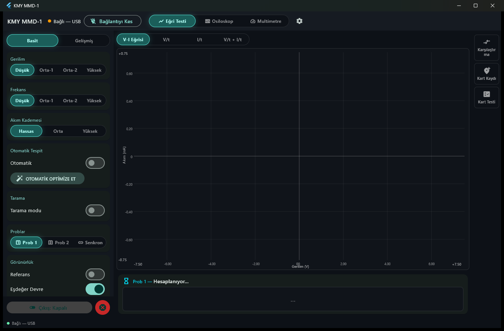

Yazılım arayüzünde; sol tarafta test parametreleri, merkezde grafik ekranı ve sağ kenarda ise Karşılaştırma, Kart Kaydı ve Kart Testi sekmeleri yer almaktadır. [11]

Eğri testinde cihaz, ölçülen bileşene alternatif (AC) sinüs dalgası şeklinde bir gerilim uygular. Bu esnada bileşenden geçen akım miktarını, uygulanan gerilim değerine göre eş zamanlı olarak grafik üzerine işler. [11]

* **Direnç:** Akım ve gerilim tamamen eş zamanlı olarak değiştiği için ekranda düz, açılı bir çizgi oluşmaktadır. [11]
* **Kondansatör:** Akım gerilimden daha önce tepe noktasına ulaştığı için ekranda bir elips şekli çizilmektedir. [11]
* **Diyot:** Akımı yalnızca tek bir yönde geçirdiği için ekranda keskin bir kırılma (dizleme) meydana gelmektedir. [11]

Her bileşen ailesi, fiziksel yapısına bağlı olarak kendine has bir grafik çizmektedir. Bu grafik, o bileşenin kimlik kartı niteliğindedir. Cihazda iki adet birbirinden bağımsız prob bulunmakta olup, bunlar isteğe göre tek tek ya da aynı anda (Senkron Mod) kullanılabilmektedir (detaylar Bölüm 11'de yer almaktadır). [11, 12]

### 8. Temel Ölçüm Ayarları

Sol panelde yer alan **Basit** görünüm modu, ölçümler için en kritik olan üç temel ayarı sunmaktadır. Bu modda karmaşık teknik rakamlar yerine kullanım kolaylığı açısından **Düşük, Orta-1, Orta-2, Yüksek** gibi kademe adlandırmaları tercih edilmiştir. Hem Gerilim hem de Frekans parametreleri bu dört kademeyi kullanmaktadır. [12]

Bu kademelerin karşılık geldiği gerçek teknik değerler şu şekildedir: [12]

| Kademe Adı | Gerilim (Tepe Değeri) | Frekans |
| :--- | :---: | :---: |
| **Düşük** | 2,5 V | 10 Hz |
| **Orta-1** | 5 V | 50 Hz |
| **Orta-2** | 10 V | 100 Hz |
| **Yüksek** | 15 V | 1000 Hz |

* **Gerilim:** Bileşene uygulanan maksimum (tepe) voltaj seviyesidir. Türü bilinmeyen şüpheli bir parçayı ölçerken her zaman en düşük kademeden başlanmalıdır. Eğer ekrandaki çizgi yatay ve düz kalıyorsa gerilim seviyesi adım adım yükseltilmelidir. Diyot ve transistör eklemleri gibi yarı iletkenler iletime geçebilmek için belirli bir eşik gerilimine ihtiyaç duymaktadır; direnç ve kondansatör gibi pasif bileşenler ise böyle bir eşik aramamaktadır. [12]
* **Frekans:** Kondansatör ve bobin gibi frekansa duyarlı (reaktif) bileşenleri dirençlerden ayırt etmeyi sağlayan en önemli parametredir. Direncin çizdiği düz çizgi frekans değişimlerinden etkilenmemektedir. Öte yandan, örneğin 100 nF değerindeki bir kondansatör 10 Hz frekansta ince ve kapalı bir çizgi gibi görünürken, frekans 1000 Hz seviyesine çıkarıldığında genişleyerek bir elips şeklini almaktadır. Parçanın kondansatör olup olmadığını anlamanın en hızlı yolu, frekansı değiştirerek ekrandaki elipsin genişliğini izlemektir. [13]
* **Akım Kademesi:** Cihazın ölçüm yaparken ne kadarlık bir akım hassasiyetiyle çalışacağını belirler. [13]

| Kademe | İdeal Kullanım Alanı |
| :--- | :--- |
| **Hassas** | Kondansatörler, yüksek değerli dirençler ve çok düşük akım çeken hassas bileşenler. |
| **Orta** | Bilinmeyen bileşenlerde güvenli bir başlangıç noktasıdır. |
| **Yüksek** | Düşük değerli dirençler, iletimdeki diyotlar ve yüksek akım çeken dayanıklı parçalar. |

*Eğer ekrandaki eğrinin üst kısımları düzleşmişse (kesilmiş görünüyorsa) veya yazılım sinyal sınır uyarısı veriyorsa, test gerilimini düşürünüz veya daha yüksek (kaba) bir akım kademesine geçiniz. Benzer şekilde, çok az akım çeken hassas bir bileşeni "Yüksek" akım kademesinde ölçerseniz, ekrandaki eğri tamamen yatay bir çizgiye dönüşebilir ve parçayı arızalı (açık devre) sanabilirsiniz. Bu tür şüpheli durumlarda akım kademesini "Hassas" konumuna alarak ölçümü tekrarlayınız.* [14]

### 9. Eğriyi Okumak: Bileşen İmzaları Galerisi

Grafik ekranının hemen altındaki sonuç kartı; cihazın algıladığı bileşeni isimlendirir, değerini hesaplar ve bu tespitten ne kadar emin olduğunu gösteren bir güven oranı sunar. Aşağıda listelenen 12 temel bileşen örneği, gerçek elektriksel davranışlar doğrultusunda oluşturulmuştur ve sonuç kartında yazan ifadeler cihazın ekranında görülecek metinlerle birebir aynıdır. [14]

*Beklenen Sapma Satırı:* Sonuç kartında, hesaplanan değerin hemen yanında **Beklenen sapma** satırı yer alır (örneğin *Beklenen sapma +%2,19…+%3,01*). Bu satır, o anki ölçüm koşulunda — seçili akım kademesi ile ölçülen bileşenin değeri arasındaki orana göre — cihazın kalibre bir multimetreye karşı ne kadar saptığını söyler. Sayı bir tahmin değil, tezgâhta ölçülmüş değerlerin o koşula uyarlanmasıdır. Ölçüm koşulu bu ölçümlerin kapsamı dışına çıktığında cihaz sayı üretmez, bunun yerine nedenini yazar: akım kademesi ile bileşen değeri arasındaki oran ölçülmemiş bir bölgedeyse, sürüş sinüs/AC değilse, iki probdaki yükler birbirinden çok farklıysa ya da cihaz henüz kalibre edilmemişse satırda sayı yerine kısa bir açıklama görürsünüz. Sapmanın, karşılaştırmada kullanılan referans multimetrenin kendi tolerans sınırının altına düştüğü durumda ise "referans sınırının altında" yazar; bu, sapmanın o tezgâhta ölçülemeyecek kadar küçük olduğu anlamına gelir.

⚠️ **Önemli Donanım Detayı:** KMY MMD-1, iki uçlu (prob) çalışan bir eğri çizicidir; bu nedenle yazılımsal olarak doğrudan "MOSFET" ya da "Transistör" gibi üç bacaklı bileşen sınıflarını tek başına tanımlayamamaktadır. Üç bacaklı elemanların hangi iki bacağını ölçtüğünüzü sizin bilmeniz gerekmektedir. Cihaz, dokunulan o iki uç arasındaki elektriksel davranışı yorumlar. Bu yüzden kılavuzdaki transistör ve MOSFET örnekleri, "cihazın gördüğü davranış" ve sonuç kartındaki gerçek ekran yazıları temel alınarak açıklanmıştır. [15]

#### Direnç
Grafik ekranını tam ortadan kesen düz, eğik bir çizgidir. Direnç değeri küçüldükçe çizgi dike yakın bir açı alır; direnç büyüdükçe çizgi yataylaşır. Frekansı değiştirdiğinizde bu çizginin açısı asla değişmez. Direnci diğer tüm bileşenlerden ayıran en net özellik budur.

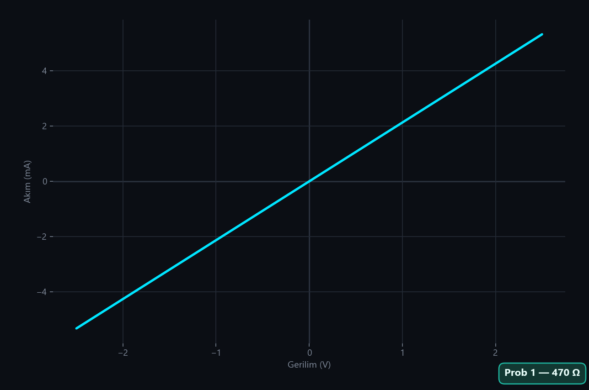

 [15]

#### Kondansatör

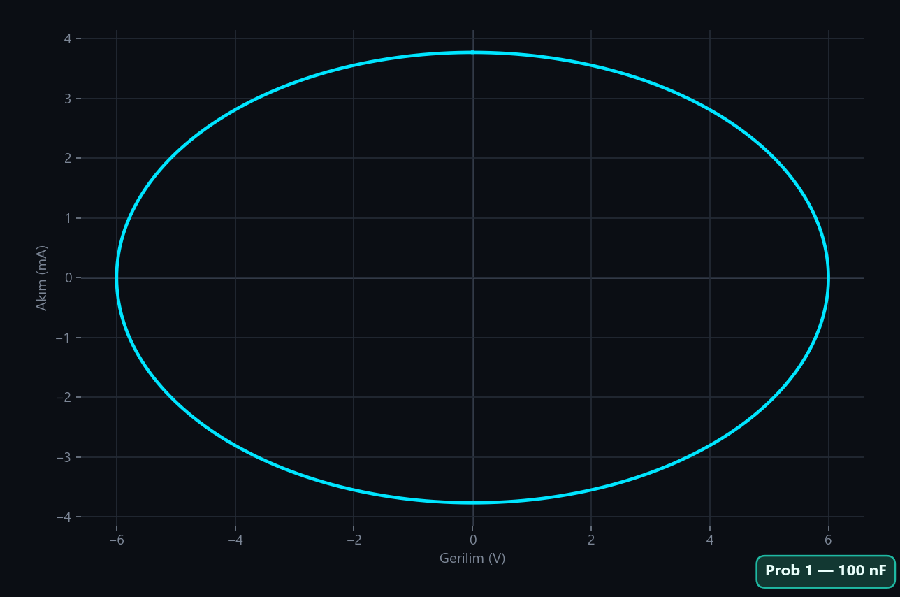
Ekranda net bir elips oluşturur. Frekans yükseltildiğinde elipsin içi açılıp belirginleşirken, frekans düşürüldüğünde ince bir çizgiye doğru kapanır. [16]

#### Bobin

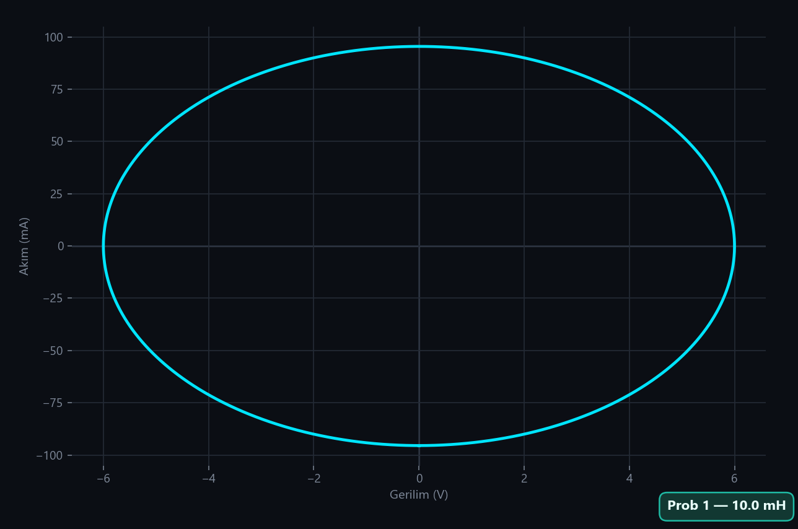
Kondansatörün tam ayna görüntüsüdür. Yine bir elips çizer ancak tepkisi ters yöndedir: Frekans yükseltildiğinde elips daralırken, frekans düştükçe genişler. [16]

#### Kondansatör + ESR (Seri Eşdeğer Direnç)
Kondansatörün karakteristik elipsidir ancak grafik üzerinde hafifçe sağa veya sola yatık durur. Buradaki seri direnç (ESR) elipsi açılı hale getirir. Sonuç kartında kondansatörün kapasitans değeri ile paralel/seri direnç değerleri ayrı ayrı gösterilir.

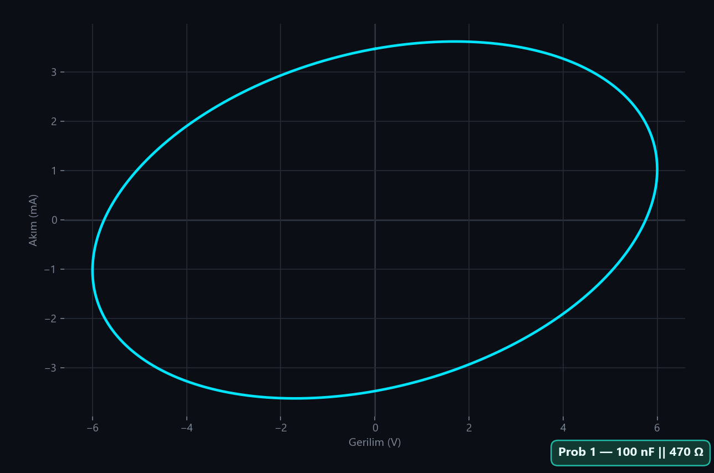

 [16]

#### Diyot
Tek yönde düz (kesimde), diğer yönde ise belirgin bir "diz" (iletimde) şekli oluşturur. Bu diz noktasının gerilim eksenindeki konumu, diyotun iletime geçme (eşik) voltajıdır. Silisyum diyotlarda bu eşik 0,6 V - 0,7 V civarındayken, Schottky diyotlarda daha solda (daha düşük gerilimde), LED'lerde ise belirgin şekilde daha sağda (yüksek gerilimde) yer alır.

 [16]

#### Zener Diyot
Grafiğin her iki yönünde de diz kırılması görülür. Sağdaki kırılma diyotun normal iletim eşiğini, soldaki kırılma ise zener delinme gerilimini ($V_z$) gösterir. Bu cihazla 15 V'a kadar olan zener diyotları kolayca analiz edebilirsiniz; daha yüksek gerilimli zener'ler için cihazın test voltaj sınırı yetmeyecektir.

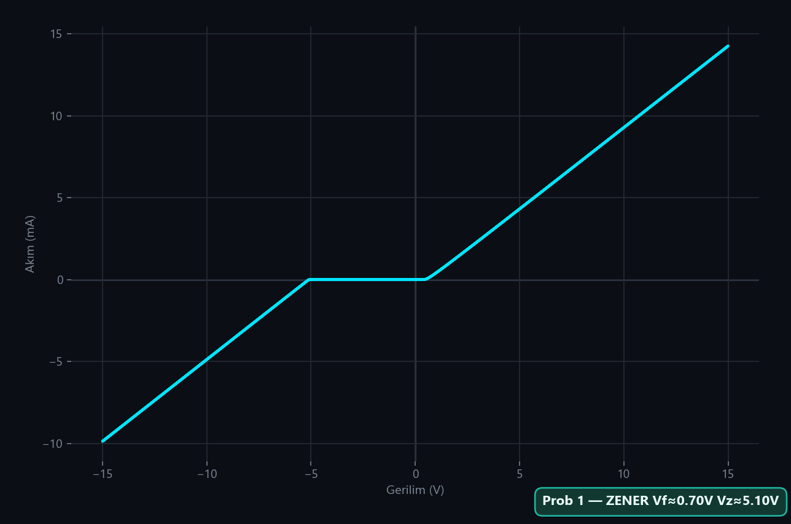

 [17]

#### TVS Diyot

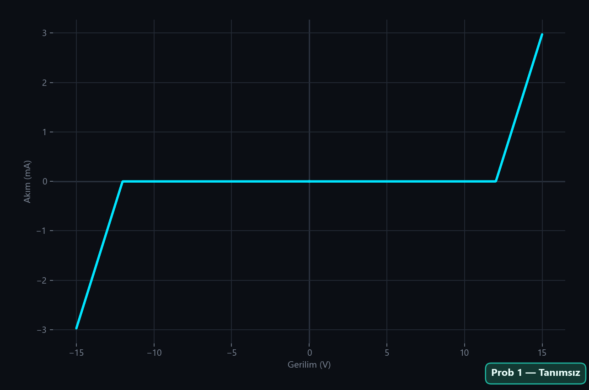
Tek yönlü (uni-directional) bir TVS diyot, elektriksel olarak zener diyotla tamamen aynı karakteristiği sergiler. Cihaz da bunu otomatik olarak **ZENER** şeklinde sınıflandırır (sonuç kartında ayrı bir "TVS" ibaresi yer almaz). Çift yönlü (bi-directional) TVS diyotların her iki yöndeki simetrik kırılması ise standart bileşen sınıflarına tam oturmadığı için ekranda **|Z|** veya **Tanımsız** olarak raporlanabilir. [17]

#### MOSFET — Gate-Source Uçları
MOSFET'lerin "gate" ucu, yapısı gereği gövdeden yalıtılmış çok küçük bir kondansatör gibidir ve üzerinden neredeyse hiç akım geçmez. Küçük sinyal MOSFET'lerinde bu kapasite değeri o kadar düşüktür ki (birkaç pikofarad) akan akım cihazın ölçüm sınırının altında kalır ve ekranda **AÇIK DEVRE** uyarısı görünür. Bu durum bir hata değil, bileşenin doğal yapısıdır. Daha güçlü güç MOSFET'lerinde (birkaç nanofarad kapasiteli) ise ince bir **Kondansatör** elipsi görebilirsiniz.

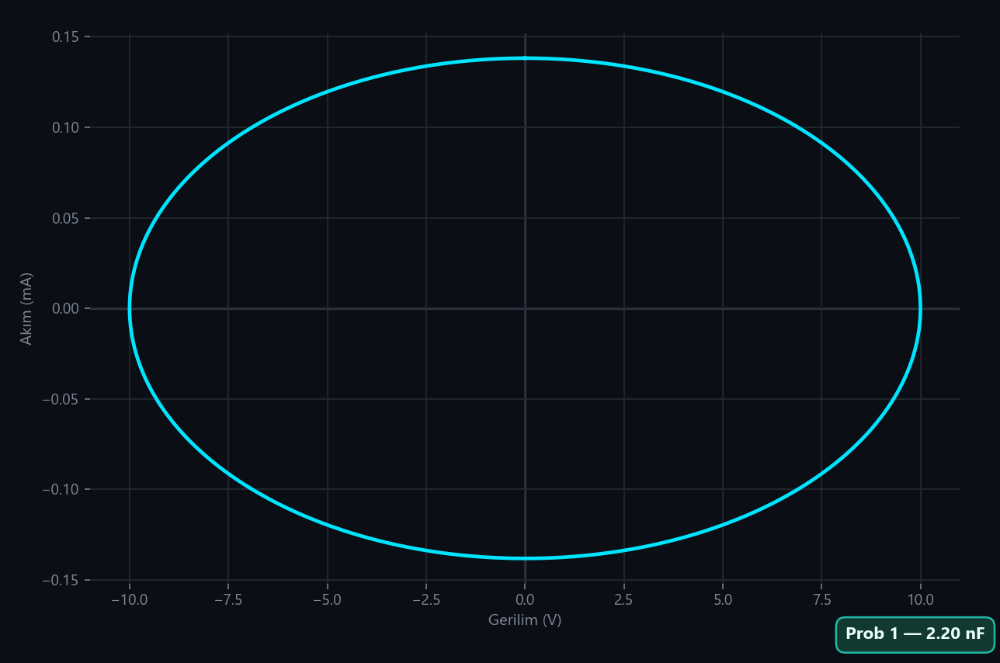

 [18]

#### MOSFET — Drain-Source Uçları
Her MOSFET'in içerisinde üretim aşamasında doğal olarak oluşan bir gövde diyotu (body diode) bulunur. Gate ucu boşta veya Source ucuna bağlıyken Drain-Source arasına dokunduğunuzda, akımın kanaldan değil bu gövde diyotundan aktığını görürsünüz. Cihaz bunu doğrudan standart bir **DİYOT** olarak algılar; yalnızca sinyal diyotlarına kıyasla iletim gerilimi ($V_f$) biraz daha yüksek çıkabilir.

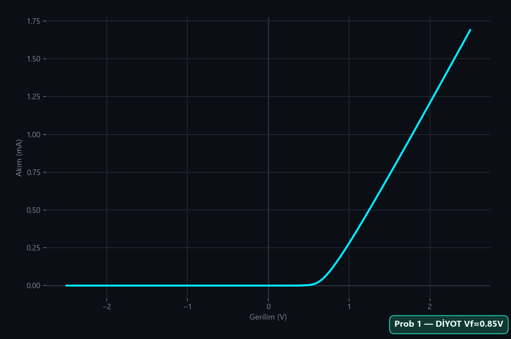

 [19]

#### Transistör — Baz-Emiter Eklemi
Baz-Emiter arası elektriksel olarak bir diyot eklemidir. Cihaz ekranda **DİYOT** yazar ve iletim voltajı ($V_f$) tipik olarak 0,65 V ile 0,70 V arasında ölçülür.

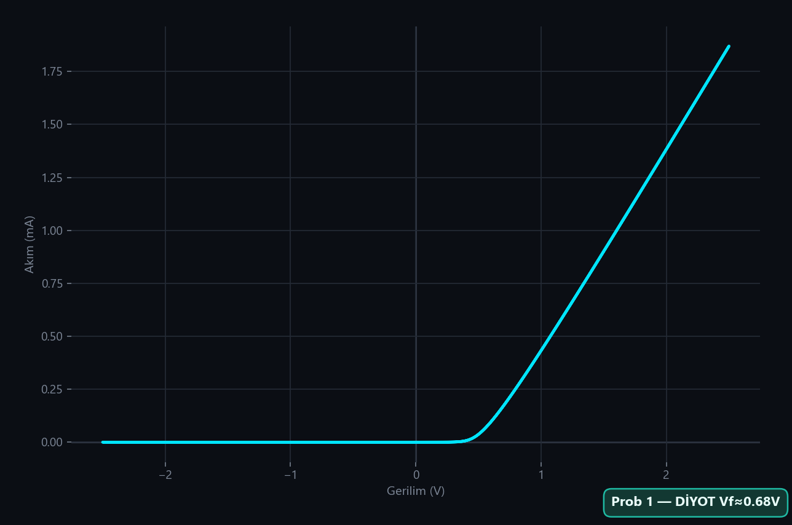

 [19]

#### Transistör — Baz-Kolektör Eklemi
Baz-Kolektör arası da benzer şekilde bir diyot eklemidir. Ancak bu eklem fiziksel olarak daha geniş bir alana yayıldığı için eşik voltajı genellikle Baz-Emiter eklemine göre bir miktar daha düşük çıkar. Sonuç kartında yine **DİYOT** ifadesi yer alır.

 [19]

#### Transistör — Kolektör-Emiter Uçları
Baz ucu boşta bırakılarak Kolektör-Emiter uçları ölçüldüğünde her iki iç eklem de kapalı kalacağından cihaz ekranda **AÇIK DEVRE** gösterecektir. Bu bir arıza belirtisi değildir; transistörün çalışması için baz tetiklemesi gerektiğinden normal şartlarda yalıtım durumunda olması beklenir.

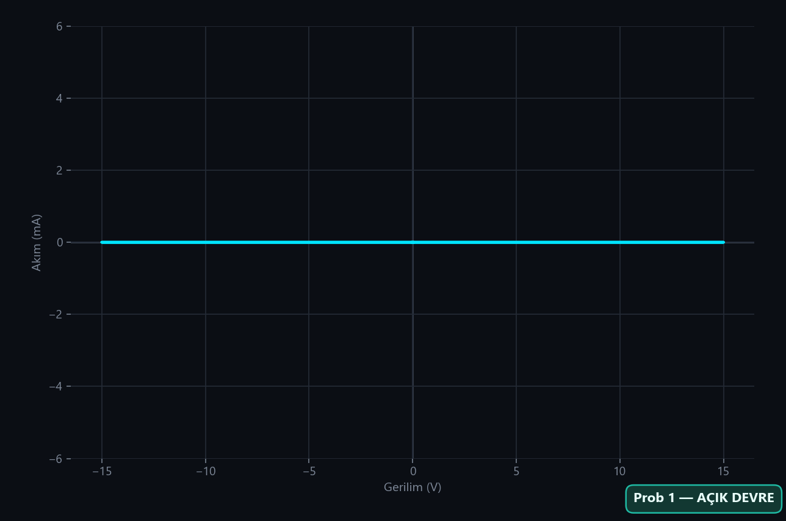

 [20]

*Önemli Tasarım Notu:* Kart üzerindeki bir bileşeni sökmeden ölçtüğünüzde göreceğiniz eğri, yalnızca o bileşene ait değildir; ona paralel bağlı olan diğer tüm yolların ve elemanların toplam elektriksel yanıtıdır. Şüpheli bir durumda kesin karar verebilmek için bileşenin tek bir bacağını havyayla karttan kaldırarak ölçümü tekrarlamanız en sağlıklı sonucu verecektir. [20]

### 10. Gelişmiş Ölçüm Ayarları

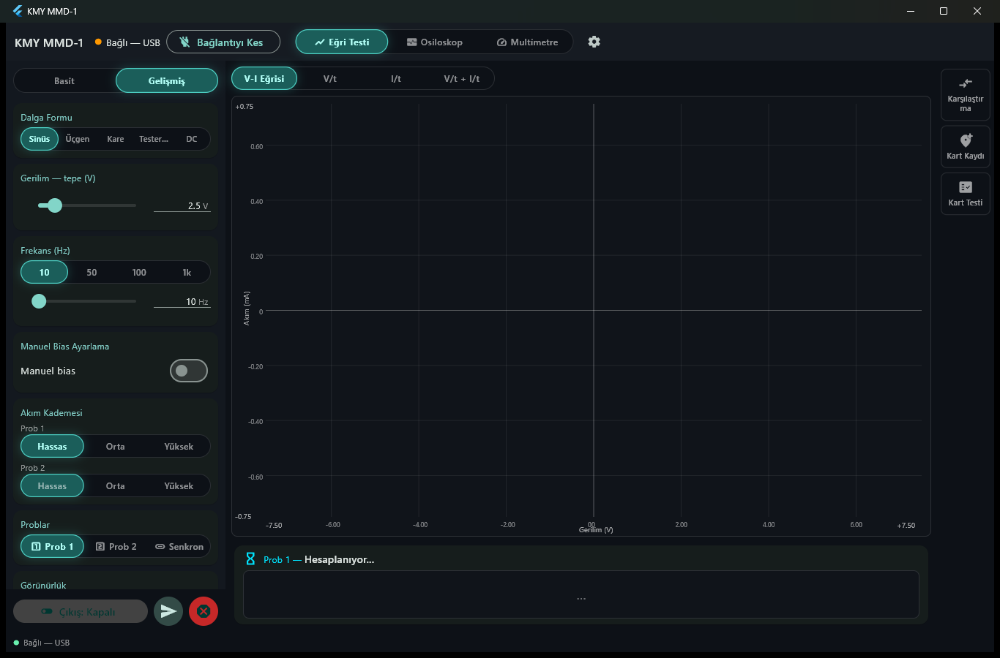

Arayüzde **Gelişmiş** görünüme geçiş yapıldığında, Basit moddaki üç parametre artık kademeli değil, hassas ayar barlarıyla milimetrik olarak kontrol edilebilir duruma gelir (Gerilim 0,1 - 15 V, Frekans 1 - 1000 Hz arası). Bu modda ek olarak şu gelişmiş özellikler kontrolünüze sunulur: [21]

* **Dalga Formu:** Sinüs, Üçgen, Kare, Testere dişi ve DC dalga tiplerini seçebilirsiniz. Standart eğri analizlerinde her zaman sinüs dalgası kullanılır. DC seçeneği ise bileşene sabit bir gerilim uygular. [21]
* **Manuel Bias:** Test sinyalinin merkez noktasını (offset) sıfır seviyesinden yukarı veya aşağı kaydırmayı sağlar. Ayar için klasik bir kaydırma çubuğu yerine, üzerine basılı tutulduğunda sürekli artış/azalış sağlayan yön butonları (ok-pad) kullanılır. Adım büyüklüğünü 10 mV, 100 mV veya 1 V olarak belirleyebilir ve tek tıklamayla **Sıfırla** butonunu kullanabilirsiniz. Varsayılan olarak kapalı gelir ve neredeyse tüm standart testler için kapalı kalması önerilir. [21]
* **Akım Kademesi:** Basit modun aksine, Prob 1 ve Prob 2 için tamamen bağımsız olarak ayarlanabilir. İki probu birbiriyle karşılaştıracaksanız her iki probun da akım kademelerini mutlaka eşitlemeniz gerekir; farklı kademelerdeki iki eğri, tamamen aynı bileşenleri ölçüyor olsanız dahi asla birbiriyle eşleşmeyecektir. [21]

Yaptığınız parametre değişiklikleri, siz ayar düğmelerini veya butonları bıraktığınız anda otomatik olarak cihaza iletilir. **Uygula** butonu, bu otomatik süreyi beklemeden ayarların anında donanıma gönderilmesini zorlamak için kullanılır. [22]

Sol panelinin alt kısmında ise ölçüm kolaylığı sağlayan üç akıllı fonksiyon yer alır: [22]

* **Otomatik Tespit:** Bu özellik aktifken probu bir bileşene değdirdiğiniz anda cihaz parçayı tanır ve onu en doğru şekilde analiz edebileceğiniz ideal gerilim, frekans ve akım kademesine kendiliğinden geçer. Hatalı geçişleri önlemek için sistem aynı sonucu üst üste en az üç kez teyit etmeden ayarları değiştirmez. Böylece eliniz titrediğinde ekran ayarları sürekli olarak ileri-geri atlamaz. [22]
* **Otomatik Optimize Et (Auto-Optimize):** O an probun ucunda duran bileşen için tek seferlik bir ideal parametre araması yapar. Optimum ayarları bulduğunda uygulamaya koyar, anlamlı bir sonuç bulamazsa mevcut ayarlara dokunmaz. [22]
* **Tarama Modu (Sweep):** Gerilim, frekans veya akım kademelerinden birini seçtiğiniz aralıkta adım adım gezerek döngüsel olarak tarar. Diğer iki parametre ise sabit kalır. Ne olduğunu çözemediğiniz bir bileşeni incelerken frekans taramasını başlatmak harika bir yöntemdir: eğer tarama boyunca grafik sürekli değişiyorsa parça reaktiftir (kondansatör/bobin), şekil hiç bozulmuyorsa dirençtir. [23]

**Görünürlük Sekmesi:** [23]
* **Referans:** Daha önce kaydettiğiniz bir referans eğriyi o anki canlı ölçümün arkasına şablon olarak yerleştirir.
* **Eşdeğer Devre:** Sonuç kartının hemen altına, cihazın ölçüm sonucunda tahmin ettiği basitleştirilmiş devre şemasını dinamik olarak çizer.
* **Dondur:** Ekrandaki güncel eğriyi dondurarak incelemeniz için sabitler.

### 11. Çift Prob Kullanımı ve Senkron Mod

Normal şartlarda **Prob 1** ve **Prob 2** modları, test sinyalini sırayla tek bir proba aktarır. **Senkron** mod ise her iki probu da aynı anda, tek bir test kaynağından besler. İki farklı bileşenin elektriksel davranışını aynı anda, yan yana karşılaştırmanın en pratik yolu budur. [24]

Senkron modda çalışırken cihaz, iki prob üzerindeki elektriksel yük dengesini sürekli kontrol eder ve dengesizlik tespit ederse ekranda sarı renkli uyarı pencereleri gösterir: [24]

* *“Problardaki yükler çok farklı; senkron modda okuma hassasiyeti sapabilir. Kesin ölçümler için tek prob modunu tercih edin.”*
* *“P1 ucu boşta; senkron ölçüm esnasında P2 okumasında yaklaşık %1 sapma görülebilir.”* *(Aynı durum P2 boşta kaldığında P1 için de geçerlidir.)*

Bu uyarıları almanız, yaptığınız ölçümün tamamen yanlış olduğu anlamına gelmez. Sadece problardaki yük farkı çok yüksek olduğunda, senkron modun doğası gereği ufak okuma sapmaları olabileceğini hatırlatır. Eğer milimetrik ve kesin doğruluğa sahip bir karşılaştırma yapmak istiyorsanız, tek prob moduna (Prob 1 veya Prob 2) geçerek ölçümü tamamlamanız en güvenli yaklaşımdır. [24]

---

## Bölüm D — Karşılaştırma Modu ve Kart Testi

### 12. Karşılaştırma Fonksiyonları

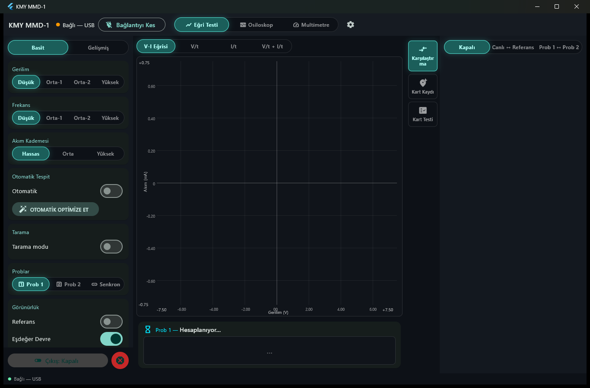

Ekranın sağ kenarındaki **Karşılaştırma** sekmesi, pratik bir yan menü çekmecesi açar. Burada seçebileceğiniz üç temel mod bulunur: [25]

* **Kapalı:** Karşılaştırma modunu devre dışı bırakır.
* **Canlı ↔ Referans:** Probu dokundurduğunuz aktif bileşenin eğrisini, daha önceden hafızaya aldığınız bir referans eğriyle anlık olarak kıyaslar. **Referansı Yakala** butonuna basarak o an ekrandaki eğriyi şablon olarak kaydedebilir, daha sonra kullanmak üzere bilgisayarınıza dosya olarak saklayabilir veya geri yükleyebilirsiniz. [25]
* **Prob 1 ↔ Prob 2:** İki probu birbiriyle doğrudan karşılaştırır. Problardan birine sağlamlığı kesin olan referans bileşeni, diğerine ise şüpheli parçayı bağlarsınız. Bu yöntem çok daha güvenlidir; çünkü her iki ölçüm de tam olarak aynı anda, aynı sıcaklıkta ve birebir aynı elektriksel koşullarda gerçekleşir. [25]

Sistem, iki eğri arasındaki benzerlik oranını hesaplayarak belirlediğiniz tolerans sınırına göre karar verir. Eğrilerin benzerliği belirlediğiniz eşiğin üzerindeyse ekranda yeşil renkli **EŞLEŞTİ**, altındaysa kırmızı renkli **EŞLEŞMEDİ** yazısı belirir. Fabrika çıkışı varsayılan eşleşme sınırı %90'dır. **Kritik Bölge Hassasiyeti** (Kapalı, Normal, Yüksek) seçeneği, karşılaştırma algoritmasını eğrilerin bükülme ve kırılma noktalarında daha sıkı denetim yapmaya zorlar; nitekim yarı iletkenlerin ve hassas bileşenlerin gerçek elektriksel karakteri asul olarak bu kıvrım bölgelerinde gizlidir. [26]

Eğer probların ikisinde de ölçülebilir bir akım akışı yoksa, cihaz boşta kalan gürültüleri kıyaslayıp yanıltıcı bir şekilde "Eşleşti" kararı vermez. Bunun yerine ekranda **ÖLÇÜM YOK** uyarısı gösterilir. Bu uyarıyı alıyorsanız ya problar bileşene düzgün temas etmiyordur ya da seçilen akım kademesi o bileşenin çekeceği akıma göre fazla kaba (yüksek) kalmıştır. [26]

**Sesli Uyarı** özelliğini aktif hale getirerek gözünüzü ekrandan ayırıp tamamen karta odaklanabilirsiniz. Sistem, yalnızca eşleşme durumu (geçti/kaldı) değiştiğinde sesli sinyal vererek sizi uyaracaktır. [27]

### 13. Kart Kaydı ve Kart Testi Sistemi

Sürekli tamir veya üretim doğrulaması yaptığınız belirli kart modelleri için en ideal yöntem budur. Kart üzerindeki kritik test noktalarını bir kez sisteme kaydedip, ardından tüm şüpheli kartları bu referans veri tabanına göre hızlıca tarayabilirsiniz. [27]

#### Adım Adım Kart Referansı Kaydetme:

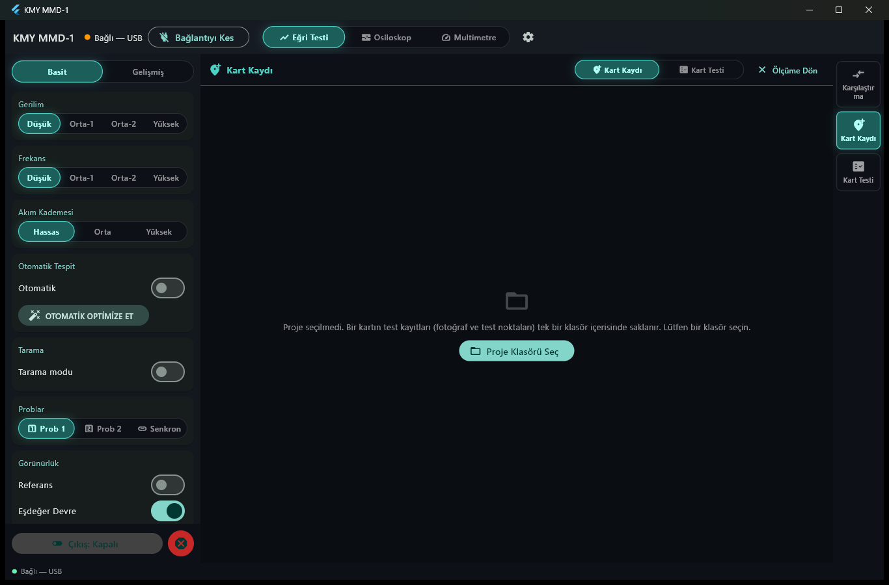
1. **Proje Klasörü Oluşturun:** Kendinize bir çalışma klasörü seçin. Kartın görseli ve eklediğiniz tüm test noktaları bu klasörde tek bir bütün halinde tutulur. Böylece projeyi klasör olarak kopyalayıp başka bir bilgisayarda da doğrudan kullanabilirsiniz. [27]
2. **Kart Görseli Ekleyin:** Kartın üstten çekilmiş, gölgesiz ve net bir fotoğrafını sisteme yükleyin. Düzgün bir ışık altında çekilmiş fotoğraflar, test noktalarını görsel üzerinde doğru konumlandırmanızı kolaylaştırır. [27]
3. **Noktaları Tanımlayın:** Test probunu kart üzerindeki hedeflenen noktaya dokundurun. Aynı anda yazılım ekranındaki fotoğrafta da ilgili yere tıklayın. Noktaya açıklayıcı bir isim verin (kart baskısındaki R14, C7, U3-1 gibi kodları kullanmanız önerilir) ve **Noktayı Kaydet** butonuna basın. [27]
4. **Sıralamayı Düzenleyin:** Kaydettiğiniz noktaları sürükle-bırak yöntemiyle pratik bir şekilde test sırasına dizebilirsiniz. [27]

* **Çok Kademeli İmza (Multi-Stage Signature):** Bu özellik aktif edildiğinde, her test noktası tek bir parametre yerine 3 veya 4 farklı gerilim ve frekans kademesinde ayrı ayrı taranarak kaydedilir. Kayıt süreci biraz daha uzun sürse de, bu yöntemle kaydedilen noktaların doğruluğu ve hata yakalama kabiliyeti çok daha yüksektir. [28]

#### Kayıtlı Kartı Test Etme:
**Testi Başlat** butonuna basın ve probları sırasıyla belirlenen noktalara dokundurun. Sistem her noktayı hızlıca ölçer, referans değerleriyle karşılaştırır ve "Geçti" veya "Kaldı" olarak işaretler. Eşleşmeyen hatalı noktalar, kart fotoğrafı üzerinde doğrudan **kırmızı renkli işaretçilerle** gösterilir. Böylece sıkıcı listelerle uğraşmak yerine, arızanın görsel haritasına sahip olursunuz.

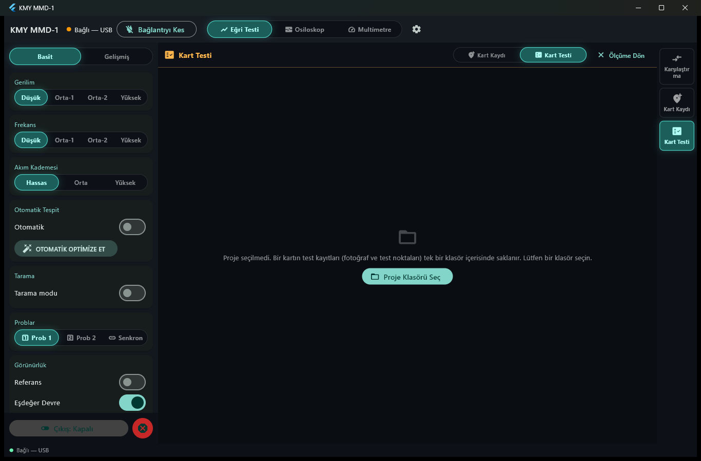

 Test akışını dilediğiniz an duraklatabilir, bazı noktaları atlayabilir ve süreç sonunda **Kalanları Test Et** seçeneğiyle sadece eksik kalan noktaları tamamlayabilirsiniz. [28]

* **Oto Mod (Otomatik İlerleme):** Nokta eşleşmesi başarılı olduğunda sistem sıradaki test noktasına kendiliğinden geçer. Probları tutarken sürekli ekrana bakma zorunluluğunu ortadan kaldırarak doğrudan kart üzerindeki el işinize odaklanmanızı sağlar. [29]
* **Excel Raporu Oluşturma:** Test işlemi tamamlandığında tek tıkla üç sayfadan oluşan detaylı bir rapor dosyası üretebilirsiniz. Bu raporda; nokta bazlı tüm ölçüm detayları, genel bir özet tablosu ve kartın görsel geçti/kaldı haritası yer alır. [29]

---

## Bölüm E — Diğer Yardımcı Araçlar

### 14. Osiloskop Modu

Osiloskop moduna geçildiğinde cihazın sinyal üreteci çıkışı tamamen kapatılır ve problar yalnızca dışarıdan gelen sinyalleri dinleyecek şekilde pasif konuma geçer. Giriş kanalları **50 V gerilim seviyesine kadar** güvenle ölçüm yapabilir. [29]

🎨 **Kanal Renk Düzeni Hakkında Önemli Not:** Osiloskop ekranında Kanal 1 **sarı**, Kanal 2 ise **camgöbeği** rengiyle temsil edilir. Bu renk şeması, Eğri Testi ekranındaki Prob 1 (camgöbeği) ve Prob 2 (sarı) renklerinin tam tersidir. İki farklı çalışma modunun birbirine karışmaması için bu renkler bilinçli olarak bu şekilde tasarlanmıştır; mod geçişlerinde renk farkı sizi şaşırtmasın.

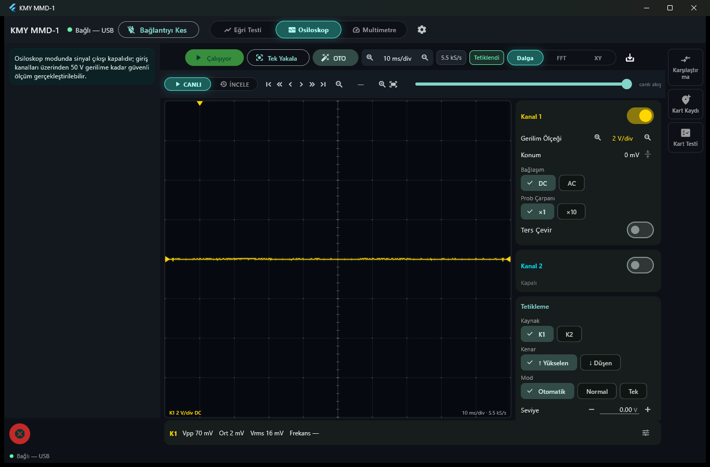

 [29]

Cihazın örnekleme hızı donanımsal olarak **5,5 kS/s** (saniyede 5500 örnek) ile sınırlıdır. Programdaki zaman tabanını (timebase) değiştirmek bu örnekleme hızını değiştirmez, sadece ekranda o an görüntülenen zaman penceresini daraltır veya genişletir. Bu durum donanımı **alçak frekans osiloskobu** sınıfına sokar. Güç kaynağı dalgalanmaları (ripple), motor sürücü çıkışları, ses frekansı altındaki sinyaller gibi alanlarda mükemmel çalışırken, 1 kHz üzerindeki yüksek frekanslı dalgaların şekil doğruluğu güvenilmez olmaya başlayacaktır. [30]

* **OTO (Otomatik Kurulum):** Gelen sinyali anlık analiz ederek zaman tabanını, dikey voltaj ölçeğini ve tetikleme (trigger) eşiğini sizin yerinize otomatik ayarlar. Girişlerde anlamlı bir sinyal tespit edilemezse mevcut ayarları korur. [30]
* **Tetikleme Modları:** [30]
  * *Otomatik (Auto):* Tetikleme koşulu sağlanmasa bile ekranı sürekli olarak günceller.
  * *Normal:* Ekranı yalnızca belirlenen tetikleme koşulu gerçekleştiğinde günceller.
  * *Tek (Single):* Tetikleme koşulu sağlandığı anda sinyali bir kez yakalar ve ekranı dondurur.

Hızlı ve pratik bir kullanım için ekran kenarında bulunan referans taban çizgisi oklarını ve tetikleme seviyesi göstergesini farenizle doğrudan sürükleyerek ayarlayabilirsiniz. Sayı kutularına manuel değer yazmakla vakit kaybetmezsiniz. **İncele** butonu ise sinyal akışını duraklatarak **son 20 saniyelik geçmiş kayıtta** geriye dönük gezinmenizi sağlar. Kayıt işlemi siz canlı ekranı izlerken de arka planda sürekli devam ettiği için, "az önce ani bir dalgalanma oldu" dediğiniz an akışı durdurup o dalgalanmayı kolayca bulabilirsiniz. [31]

Ekranın alt bilgi çubuğunda en çok ihtiyaç duyulan 4 temel ölçüm değeri hazır olarak sunulur: **Vpp** (tepeden tepeye gerilim), **Ort** (ortalama gerilim), **Vrms** (etkin gerilim) ve **Frekans**. Sistemde toplam 11 farklı ölçüm parametresi yer almakta olup, dilediğinizi bu alt çubuğa ekleyip çıkartabilirsiniz. [31]

### 15. Multimetre Modu

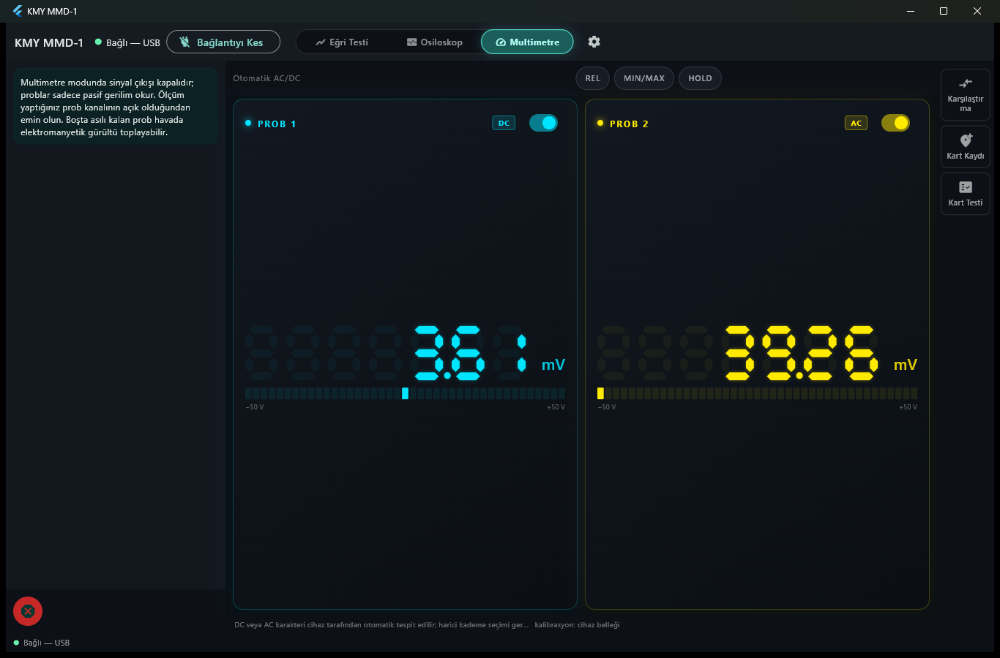

Bu modda her iki prob da aynı anda bağımsız olarak voltaj ölçümü yapabilmektedir. Herhangi bir manuel kademe veya fonksiyon (AC/DC) seçimi yapmanıza gerek yoktur; KMY MMD-1 gelen sinyalin karakterini analiz ederek DC mi yoksa AC mi ölçüleceğine kendisi karar verir. [31]

* **REL (Bağıl Ölçüm):** Butona basıldığı an okunan değeri sıfır referans noktası kabul eder ve sonraki değişimleri bu değere göre (+/-) gösterir. [32]
* **MIN/MAX:** Ölçümün başından itibaren okunan en düşük ve en yüksek gerilim değerlerini hafızasında biriktirerek ekranda listeler. [32]
* **HOLD:** Ekrandaki güncel ölçüm değerini dondurur. [32]

Multimetre modunda da cihazın aktif sinyal çıkışı tamamen kapalıdır. Ölçüm yapmak istediğiniz probun kanalını açık duruma getirmeyi unutmayın. Eğer ölçüm yapmayan boş bir kanalın probu havada asılı kalırsa, ekranda okunan değer gerçek bir voltajı değil, ortamdaki kablonun topladığı elektromanyetik gürültüyü ifade edecektir. [32]

---

## Bölüm F — Sistem Ayarları, Kalibrasyon ve Bağlantı

### 16. Sistem Ayarları

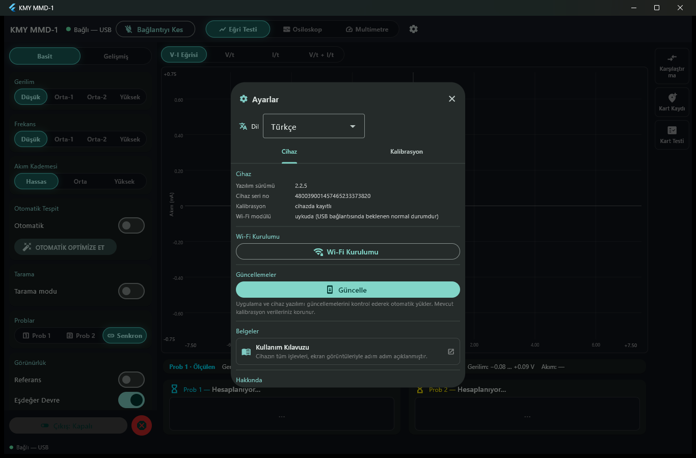

Yazılımın üst çubuğunda bulunan dişli simgesine tıkladığınızda genel ayarlar paneli açılır. Bu panel **Cihaz** ve **Kalibrasyon** olmak üzere iki temel sekmeden oluşur. Her iki sekmenin de üst kısmında hızlı dil değiştirme seçeneği (Türkçe / İngilizce) yer almaktadır. [32]

#### Cihaz Sekmesi İçeriği:
Bu bölümde uygulamanın sürüm bilgisi, benzersiz cihaz numarası, Wi-Fi bağlantı kurulum araçları ve entegre bir **Güncelle** butonu bulunur. Güncelle butonu, tek bir tıklamayla hem bilgisayar uygulamasını hem de cihazın kendi donanım yazılımını (firmware) denetleyerek günceller. [33]

Ayrıca "Servis / Tanılama" başlığı altında; USB bağlantısı etkinken, yeni bir yazılım güncellemesinde sorun yaşanması durumunda cihazı kararlı eski bir donanım yazılımı sürümüne geri döndürmenizi sağlayan bir acil durum aracı da mevcuttur. Bu menü, günlük kullanım rutininde ihtiyaç duyulmayan, sadece teknik destek durumlarında kullanılan özel bir alandır. [33]

### 17. Kalibrasyon Sihirbazı

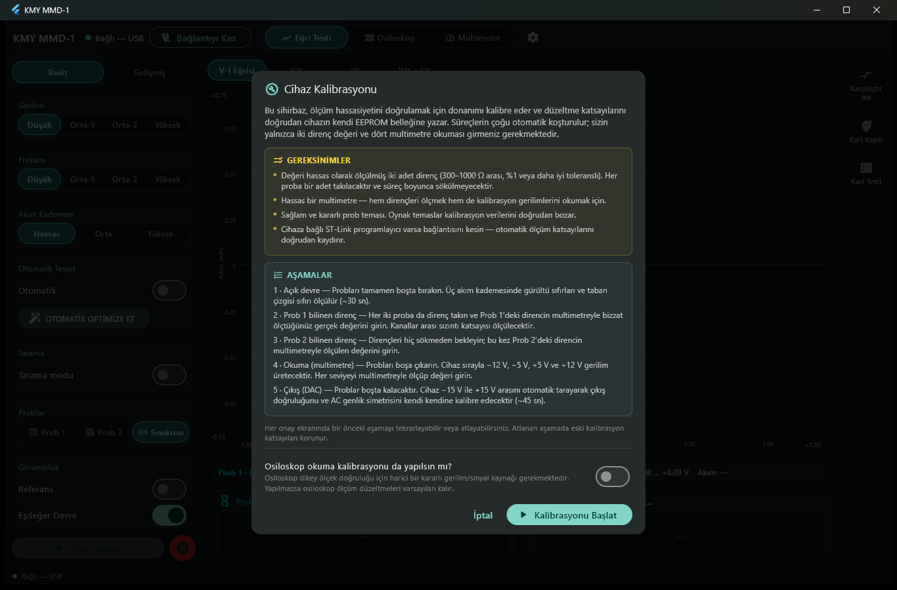

KMY MMD-1 kalibrasyon verileri bilgisayarda değil, **doğrudan cihazın kendi dahili belleğinde (EEPROM/Flash)** saklanır. Yazılım her açıldığında kalibrasyon tablosunu cihazın kendisinden okur. Bu sayede cihazı hangi bilgisayara ya da telefona takarsanız takın, yeniden kalibrasyon yapmanıza gerek kalmadan doğrudan kalibre edilmiş şekilde kullanmaya devam edebilirsiniz. [33]

#### Kalibrasyon İçin Gerekenler:
* Değeri kesin olarak bilinen (tercihen %1 veya daha iyi toleranslı, **300 Ω ile 1000 Ω arasında**) iki adet standart direnç. [34]
* Hassas ölçüm yapabilen bir multimetre. [34]
* Kalibrasyon işlemi **yaklaşık 15 dakika** sürer ve toplam 5 temel aşamadan oluşur. [34]

#### Adım Adım Kalibrasyon Aşamaları:
1. **Açık Devre Ölçümü (Yaklaşık 30 sn):** Her iki prob ucu da tamamen boşta olmalı ve hiçbir yere değmemelidir. Bu aşamada akım kanallarının sıfır noktaları ile osiloskop taban çizgisi sıfırlanır. [34]
2. **Prob 1 Direnç Ölçümü:** *“Her iki proba da birer adet bilinen direnç bağlayın; bu adımda sadece Prob 1 ölçülecektir.”* İki direnç de yuvalarına takılı kalır ancak cihaz yalnızca Prob 1 tarafını analiz eder. Ölçüm tamamlandığında, direncinizin üzerine basılı renk kodlarını değil, multimetrenizle bizzat ölçtüğünüz **gerçek direnç değerini** ekrana yazarak onaylayın. [34]
3. **Prob 2 Direnç Ölçümü:** *“Her iki direnç de takılı kalmaya devam etsin.”* Dirençleri hiç oynatmadan bekleyin, cihaz bu kez Prob 2 kanalını ölçer. Bu ilk üç aşamanın tamamlanmasıyla birlikte tek bir **Kaydet ve Devam Et** onay penceresi gelir ve ilk bölüm verileri cihaza kaydedilir. [34, 35]
4. **Multimetre ile Gerilim Okuma:** Probları yuvalarından çıkarıp tamamen boşta bırakın. Cihaz sırasıyla $-12\text{ V}$, $-5\text{ V}$, $+5\text{ V}$ ve $+12\text{ V}$ seviyelerinde test gerilimi üretecektir. Her aşamada Prob 1 ucundaki gerilimi harici multimetrenizle fiziksel olarak ölçüp okuduğunuz değeri yazılıma girin. [35]
5. **Çıkış (DAC) DC Kalibrasyonu (Yaklaşık 45 sn):** Cihaz $-15\text{ V}$ ile $+15\text{ V}$ arasındaki gerilim seviyelerini birer voltluk adımlarla otomatik olarak tarar ve az önceki ölçüm verilerini baz alarak çıkış doğruluğunu kendi kendine kalibre eder. Bu adımın hemen peşinden, problar hala boştayken cihaz otomatik olarak AC sürüş genliği ve merkez sapmasını da ölçüp sıfırlar. Bu süreçte sizin herhangi bir şey yapmanıza gerek yoktur, sadece işlemin tamamlanmasını beklemelisiniz. [35]

* **İsteğe Bağlı 6. Aşama (Osiloskop Kalibrasyonu):** İşlemlerin sonunda osiloskop okumalarının hassas ayarı için ek bir aşama sunulur. Osiloskop modunda cihaz kendi çıkışını süremediği için, bu adımda doğruluğundan emin olduğunuz harici bir sinyal/gerilim kaynağı kullanmanız istenir. Eğer elinizde böyle bir kaynak yoksa bu adımı güvenle atlayabilirsiniz; osiloskop dışındaki tüm sistem kalibre edilmiş olarak çalışacaktır. [36]

*Yazılımsal Kolaylıklar:* Her onay ekranında, hatalı yaptığınızı düşündüğünüz bir önceki adıma kolayca geri dönebilir ve o adımı tekrarlayabilirsiniz. Ayrıca ilk üç aşamada, cihazda önceden kayıtlı geçerli bir kalibrasyon varsa ilgili adımı atlayıp eski verileri korumayı seçebilirsiniz. Yeni kalibrasyon verilerinin cihazın flash belleğine kalıcı olarak yazılması işlemi, tüm sihirbaz adımları başarıyla bitene kadar ertelenir. Eğer sihirbazı tamamlamadan yarıda kapatırsanız cihazın içindeki eski kalibrasyon verileri kesinlikle bozulmaz ve korunur. [36]

*Kaydedilen Kalibrasyon Noktaları:* Multimetre ile gerilim okuma aşamasında girdiğiniz her nokta bir listede saklanır ve sihirbaz içinden görüntülenebilir. Her satırda cihazın ölçtüğü değer, sizin girdiğiniz gerçek değer ve bir **sapma** sütunu bulunur; sapma, o noktanın diğer noktalardan çıkan düzeltme doğrusuna göre kaç milivolt uzakta kaldığını gösterir. En uzak satır turuncu işaretlenir ve pratikte bu, multimetre değerinin yanlış yazıldığı satırdır. Yanlış girdiğiniz satırı silmeniz yeterlidir; düzeltme doğrusu kalan noktalarla anında yeniden hesaplanır. Düzeltme bir doğru çizebilmek için en az iki nokta gerektirdiğinden son iki nokta silinemez; tamamen baştan başlamak isterseniz okuma aşamasını yeniden koşmanız gerekir.

*Kalibrasyon Ne Sıklıkla Yapılmalıdır?* Ölçüm değerlerinizin, güvendiğiniz harici multimetre ölçümlerinden gözle görülür şekilde saptığını fark ettiğinizde ya da yazılım başlangıçta "referans taban kayması" uyarısı verdiğinde kalibrasyonu yenilemeniz önerilir. Bunun dışında normal çalışma şartlarında kalibrasyon menüsüne dokunmanıza gerek yoktur. [37]

### 18. Kablosuz Kullanım ve Wi-Fi Kurulumu

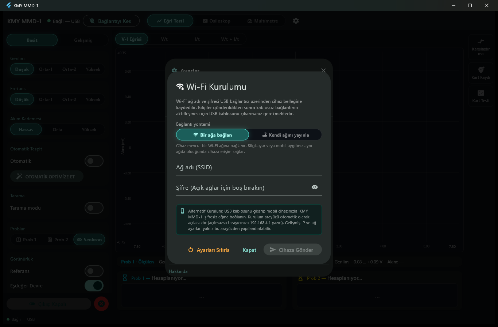

KMY MMD-1 kablosuz ağ bağlantısını iki farklı modda destekler: [37]

1. **İstasyon Modu (Station):** Atölyenizde veya ofisinizde aktif bir Wi-Fi ağı varsa cihaz bu ağa katılır. Böylece bilgisayarınız veya telefonunuz mevcut ağ üzerinden cihaza erişebilir. [37]
2. **Erişim Noktası Modu (Access Point - AP):** Sahada çalışıyorsanız veya ortamda bir Wi-Fi ağı yoksa cihaz kendi kablosuz ağını yayınlar. Bilgisayarınızı veya telefonunuzu doğrudan cihaza bağlayabilirsiniz. [37]

#### Uygulama Üzerinden Wi-Fi Kurulumu:
Cihaz USB ile bağlıyken **Ayarlar → Wi-Fi Kurulumu** menüsünü açın. İstediğiniz bağlantı modunu seçip ağ adını (SSID) ve şifresini yazarak cihaza gönderin. [37]

#### Tarayıcı Üzerinden Wi-Fi Kurulumu (Web Arayüzü):
Cihazın USB kablosunu çıkarın. KMY MMD-1, kutusundan ilk çıktığında şifresiz ve **KMY MMD-1** isimli bir Wi-Fi ağı yayınlar. Telefonunuzdan ya da bilgisayarınızdan bu ağa bağlandığınızda kurulum sayfası otomatik olarak açılacaktır. Eğer sayfa açılmazsa, internet tarayıcınızın adres çubuğuna **192.168.4.1** yazarak arayüze manuel olarak erişebilirsiniz. Sabit IP tanımlama gibi gelişmiş ağ yapılandırma seçenekleri yalnızca bu web arayüzünde yer almaktadır. [38]

#### Cihaz Ağda Görünmüyorsa (Manuel Bağlantı):
Cihazın ağa bağlı olduğundan emin olmanıza rağmen yazılım listesinde göremiyorsanız, Wi-Fi seçim butonunun hemen yanındaki küçük **"Cihaz adresini elle gir"** simgesine tıklayarak cihazın IP adresini manuel yazabilirsiniz. Bu durum bazı modemlerin güvenlik nedeniyle cihazların saniyede bir gönderdiği "keşif paketlerini (broadcast)" diğer kablosuz istemcilere iletmemesinden kaynaklanır. Cihazın IP adresini modeminizin arayüzündeki bağlı cihazlar listesinden veya cihazın kendi web kurulum sayfasından öğrenebilirsiniz. Aynı manuel IP giriş seçeneği Android mobil uygulamasında da bağlantı ekranının hemen altında yer alır. [38]

*Bilmeniz Gereken Önemli Detaylar:* [39]
* KMY MMD-1 donanımı aynı anda yalnızca tek bir aktif bağlantıyı destekler. Başka bir bilgisayar veya telefon tarafından kontrol edilen cihazlar listede **MEŞGUL** durumunda görünür.
* Menüdeki **Ağ Ayarlarını Sıfırla** seçeneğini kullanarak kablosuz ağ yapılandırmasını dilediğiniz an fabrika ayarlarına döndürebilirsiniz.

### 19. Mobil Cihazlarda (Telefon/Tablet) Kullanım

Masaüstü Windows yazılımının sunduğu tüm ölçüm ve analiz yetenekleri birebir Android mobil uygulamasında da mevcuttur. Sadece dikey ve dar mobil ekranlar için arayüz yerleşimi optimize edilmiştir. Mobil ekranda, grafik alanının üstünde ve altında her zaman aktif duran iki fonksiyonel kontrol şeridi bulunur: [39]

* **Üst Durum Şeridi (Aşağı Çekilebilir):** Bu şeride dokunduğunuzda veya aşağı doğru kaydırdığınızda genel durum paneli açılır. Burada anlık bağlantı kalitesi, varsa hata mesajları veya kilit sebepleri gösterilir. Ayrıca panel içerisinde **Araçlar**, **Ayarlar** ve **Bağlan/Bağlantıyı Kes** şeklinde üç hızlı erişim kutusu bulunur. Cihazda kritik bir uyarı veya çalışma hatası oluştuğunda bu durum paneli kendiliğinden otomatik olarak açılır. [39]
* **Alt Kontrol Şeridi (Yukarı Çekilebilir):** Bu şeride dokunup yukarı kaydırdığınızda gelişmiş kontrol paneli açılır. Bu panel parmağınızı çektiğiniz yükseklikte sabit kalır; tamamen açık veya kapalı olmak zorunda değildir. İçerisinde masaüstü sürümdeki tüm parametre ayarları yer alır. Şerit üzerinde her zaman Eğri Testi, Osiloskop ve Multimetre geçiş butonları ile hızlı Gerilim, Frekans ve Akım Kademesi kısayolları bulunur.

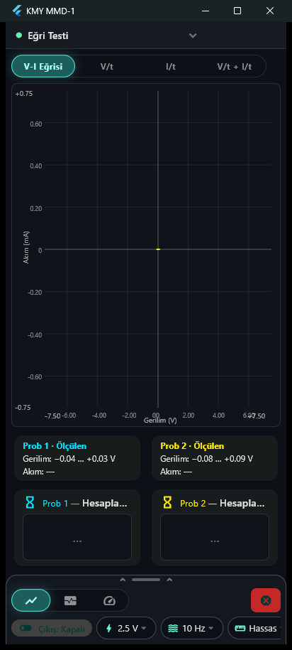

 [40]

#### Fonksiyonlara Erişim: [40]
* **Karşılaştırma, Kart Kaydı ve Kart Testi** araçlarına üst paneldeki *Araçlar* kutusundan,
* **Genel Ayarlar ve Cihaz Kalibrasyonu** seçeneklerine ise *Ayarlar* kutusundan erişebilirsiniz. Arayüzler masaüstü sürümle tamamen aynı mantıkta tasarlanmış olup sadece mobil ekranlar için ölçeklendirilmiştir.
* **Bağlantı Paneli** ise ağdaki cihazları otomatik tarayan bir keşif listesi, cihazın varsayılan ağına doğrudan bağlanmayı deneyen hızlı bir yedek buton ve manuel IP giriş alanı sunar.

*Mobil Güncelleme Kısıtı:* Cihazın donanım yazılımı (firmware) güvenli USB yazma protokolü gerektirdiğinden mobil cihazlar üzerinden güncellenemez. Ancak mobil uygulamanın kendi güncellemelerini telefon üzerinden kolayca yapabilirsiniz. **Güncelle** butonuna bastığınızda uygulama yeni sürüm yükleme paketini arka planda indirir, dijital imzasını doğrular ve doğrudan Android sisteminin kendi güncelleme ekranını açar. Tarayıcı veya harici sitelerle uğraşmadan tek dokunuşla uygulamanızı güncelleyebilirsiniz. [41]

### 20. Yazılım Güncellemeleri

**Ayarlar → Güncelle** adımlarını takip ederek hem kontrol yazılımını hem de KMY MMD-1 donanım yazılımını (firmware) tek tıkla denetleyip en güncel kararlı sürüme yükseltebilirsiniz. Güncelleme işlemleri cihazın belleğindeki mevcut kalibrasyon verilerine kesinlikle zarar vermez. [41]

Yazılım güncellemesi başladığında ekranda *“Kurulum başlatılıyor, uygulama şimdi kapatılacak ve yeni sürümle otomatik olarak yeniden açılacaktır.”* uyarısı görüntülenir. Pencerenin aniden kapanması ve birkaç saniye sonra tekrar gelmesi normal bir süreçtir; yazılımın çöktüğünü düşünmeyin. [41]

*Güncelleme Detayları:* [42]
* Uygulama güncellemelerini denetlemek ve kurmak için cihazın bilgisayara bağlı olması gerekmez.
* Cihaz donanım yazılımı (firmware) güncellemeleri yalnızca fiziksel **USB kablosu bağlantısı** aktifken yapılabilir. Kablosuz (Wi-Fi) ağ üzerinden veya telefon aracılığıyla firmware güncellemesi yapılamaz. Güncelleme dosyaları internetten ayrıca indirilmez; bilgisayara kurduğunuz güncel masaüstü yazılım paketinin içerisinde gömülü olarak gelir.
* Güncelleme kontrolü sırasında bilgisayarınızda internet bağlantısı yoksa sistem bunu kullanıcıya bildirir; mevcut çalışan yapıda hiçbir veri kaybı veya bozulma yaşanmaz.

---

## Bölüm G — Referans Bilgiler

### 21. Teknik Sınırlar ve Parametreler

| Parametre | Teknik Sınır ve Değer |
| :--- | :--- |
| **Test Gerilimi** | $\pm 15\text{ V}$ Tepe (Peak) |
| **Test Frekansı** | $1\text{ Hz} - 1000\text{ Hz}$ |
| **Osiloskop / Voltmetre Giriş Sınırı** | Maksimum $50\text{ V}$ |
| **Osiloskop Örnekleme Hızı** | $5,5\text{ kS/s}$ (Donanımsal sabit) |
| **Osiloskop Derinlik Kaydı** | Son $20\text{ saniye}$ kesintisiz |
| **Besleme Kaynağı** | USB Portu üzerinden |

* **Temel Güvenlik ve Çalışma Kuralları:** [43]
  * Test edilecek kartların enerjisini mutlaka kesin ve üzerlerindeki tüm yüksek kapasiteli kondansatörlerin boşaldığından emin olun.
  * KMY MMD-1 yalnızca **Eğri Testi** modunda aktif test sinyali üretir. Osiloskop ve Multimetre modlarında sinyal üreteci tamamen kapalıdır ve problar sadece pasif dinleme modundadır.
  * Yazılım ekranında bulunan **kırmızı acil durdurma (Emergency Stop)** butonu, cihazın çıkış gerilimini anında keser. Bu buton, kalibrasyon dosyası eksik veya hatalı olsa dahi cihaz bilgisayara bağlı olduğu sürece her zaman aktif olarak çalışır.
  * Cihaz ilk açılış hazırlık sürecini tamamlamadan ve hafızasında geçerli bir kalibrasyon profili olduğunu doğrulamadan test çıkışlarını kesinlikle aktif hale getirmez.
  * ⚠️ **Önemli Şebeke Uyarısı:** Cihazın hiçbir donanımı şebeke voltajı ($220\text{ V AC}$) altında çalışmak üzere tasarlanmamıştır. Probları şebeke prizlerine veya yüksek gerilimli hatlara kesinlikle değdirmeyiniz.

### 22. Sık Karşılaşılan Sorunlar ve Çözümleri

* **Cihaz listede görüntülenemiyor:** [43]
  Fiziksel USB bağlantı kablonuzu ve bilgisayarınızın USB portunu kontrol edin. Eğer cihaz kablosuz ağda ise ve yine de listede çıkmıyorsa, [Manuel IP Girişi](#18-kablosuz-kullanım-ve-wi-fi-kurulumu) yöntemini deneyin.
* **Bağlandıktan hemen sonra tüm ekran kontrolleri kilitleniyor:** [44]
  Bu durum bir hata değildir. Cihaz ilk açılışta dahili donanımı dengelemek için öz-kalibrasyon yapmaktadır. Yaklaşık 13-15 saniye sonra sistem kendiliğinden açılacaktır.
* **Test çıkışı aktif hale getirilemiyor (Çıkış açılmıyor):** [44]
  Cihaz henüz başlangıç rutinini bitirmemiş olabilir ya da cihazın dahili belleğinde geçerli bir kalibrasyon tablosu bulunmamaktadır. **Ayarlar → Kalibrasyon** sekmesini açarak cihazın kalibrasyon durumunu kontrol edin.
* **Eğri ekranı tamamen yatay ve düz bir çizgi:** [44]
  Problar bileşene temas etmiyor olabilir (açık devre durumu) ya da uygulanan test gerilimi yarı iletken bileşenin iletim eşiğini aşmaya yetmiyordur. Test gerilimi bir kademe yükseltin veya daha hassas bir akım kademesine geçin.
* **Senkron modda ekranda sarı renkli uyarı satırı beliriyor:** [44]
  İki probun uçlarındaki elektriksel yükler birbirinden çok farklıdır veya problardan biri boşta kalmıştır. Ölçüm hassasiyetinden emin olmak için tek prob moduna geçiş yapın (detaylar Bölüm 11'de).
* **Karşılaştırma ekranı sürekli olarak "ÖLÇÜM YOK" uyarısı veriyor:** [45]
  Problardan hiçbir akım çekilmediğini gösterir. Prob uçlarının bileşene fiziksel temasını kontrol edin; eğer bileşen çok yüksek empedanslı (yüksek değerli direnç vb.) ise akım kademesini **Hassas** konumuna getirin.
* **Cihaz durum listesinde "MEŞGUL" olarak görünüyor:** [45]
  Cihaza o anda başka bir telefon, tablet veya bilgisayar kablosuz olarak bağlıdır. KMY MMD-1 tekil bağlantı desteklediğinden, diğer kontrol cihazındaki uygulamayı kapatmanız gerekir.
* **Ölçüm değerlerinde ve grafiklerde kayma hissediliyor:** [45]
  Cihazı kapatıp tekrar açın; açılıştaki otomatik öz-kalibrasyon ufak tefek kaymaları kendiliğinden düzeltecektir. Eğer yazılım arayüzünde "referans taban kayması" uyarısı görüyorsanız, donanımı yeniden kalibre etmeniz gerekir.
* **Osiloskop modunda dalga formu kırık veya bozuk görünüyor:** [45]
  Girişteki sinyalin frekansını kontrol edin. Cihazın örnekleme hızı donanımsal olarak 5,5 kS/s ile sınırlı olduğundan, 1 kHz üzerindeki sinyallerin dalga yapısını osiloskop ekranında net olarak seçmeniz mümkün olmayacaktır.
* **Mobil uygulama cihazı kablosuz ağda bulamıyor:** [46]
  Telefonunuz ile cihazın aynı Wi-Fi ağına bağlı olduğundan emin olun. Cihaz kendi ağını yayınlıyorsa (Access Point modu), telefonunuzun Wi-Fi ayarlarından doğrudan **KMY MMD-1** ağına bağlandığınızı teyit edin.

### 23. Teknik Destek ve İletişim

KMY MMD-1 ile ilgili tüm teknik soru ve talepleriniz için resmi GitHub sayfamızı ziyaret edebilirsiniz: [46]
[https://github.com/kmyelectronicseu-png/kmy-mmd1](https://github.com/kmyelectronicseu-png/kmy-mmd1)

Destek ekibimizle iletişime geçmeden önce sorununuza hızlı çözüm sunabilmemiz adına cihaz numaranızı not etmeniz işimizi kolaylaştıracaktır. Cihaz numaranıza yazılım üzerinden **Ayarlar → Cihaz → Cihaz No** adımlarını izleyerek ulaşabilirsiniz. [46]
