# KMY MMD-100 Devre Analiz ve Arıza Tespit Cihazı — Kullanım Kılavuzu

KMY MMD-100, elektronik kartları enerjisiz incelemek için akım-gerilim eğrisi analizi ve referans ölçümlerle karşılaştırma sağlar. İki kanallı alçak frekans osiloskobu ve gerilim ölçümü işlevleri, sinyal inceleme ve gerilim ölçümlerini aynı cihazda bir araya getirir.

Bu kılavuz, Windows ve Android uygulamalarının kurulumunu, ölçüm ayarlarını, kart kaydı ve test işlemlerini, bağlantı seçeneklerini ve sorun çözme adımlarını açıklar.

## Bölüm A — Tanıtım

### 1. Cihazın kullanım amacı

KMY MMD-100, karta besleme gerilimi uygulamadan bileşenlerin elektriksel davranışını incelemek ve şüpheli test noktalarını belirlemek için kullanılır. Eğri testi, referans karşılaştırması ve gerilim ölçümü farklı çalışma modlarında yürütülür.

* **Eğri testi (V-I analizi):** Düşük seviyeli test sinyaliyle akım-gerilim eğrisi oluşturur; direnç, kondansatör, bobin, diyot ve zener gibi bileşenlerin türünü ve değerini değerlendirmeye yardımcı olur.
* **Kart kaydı ve kart testi:** Sağlam karttan kaydedilen referansları, aynı modeldeki diğer kartların ölçümleriyle nokta bazında karşılaştırır. Bakım, onarım ve üretim doğrulamasında kullanılabilir.
* **Osiloskop ve multimetre:** Enerjili devrelerde, cihazın giriş sınırları içinde sinyal inceleme ve gerilim ölçümü sağlar. Eğri testi bu ölçümlerden farklı olarak yalnız enerjisiz kartlarda yapılır.

### 2. Cihaz ve bağlantılar

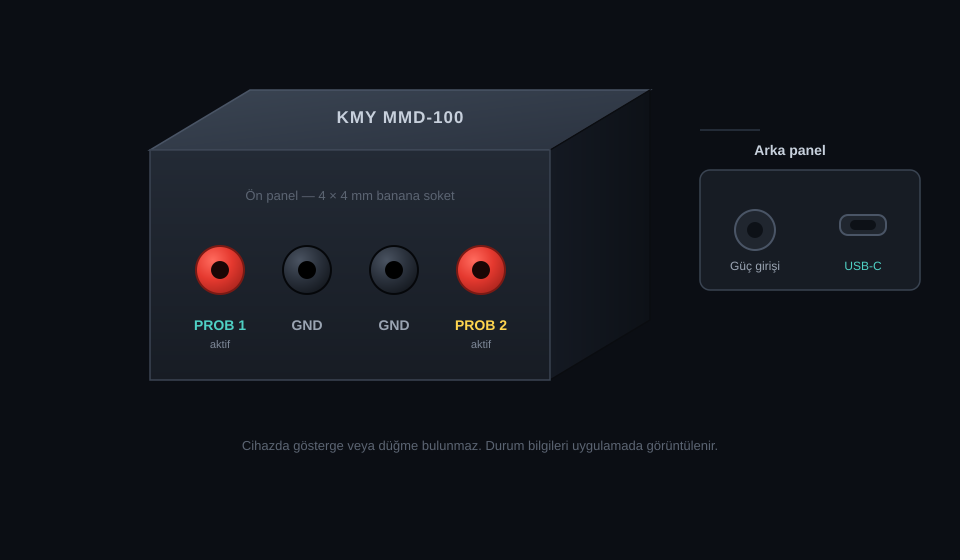

Ön panelde dört adet 4 mm muz soket bulunur. Dıştaki iki soket **Prob 1** ve **Prob 2** aktif girişleridir; ortadaki iki soket **şasi (GND)** bağlantısıdır. Bileşenin bir ucunu aktif proba, diğer ucunu yanındaki GND soketine bağlayın.

Arka panelde sağdaki **USB-C** portu bilgisayar bağlantısı, veri aktarımı ve cihaz beslemesi için kullanılır. Soldaki **harici güç girişi**, ayrı besleme gereksinimi için ayrılmıştır.

Cihaz üzerinde düğme veya LED bulunmaz. Besleme, bağlantı ve çalışma modu bilgilerini bilgisayar veya mobil uygulama üzerinden izleyin.

### 3. Sistem gereksinimleri ve hazırlık

Bilgisayarda kullanım için bir USB kablosu ve 64-bit Windows 10 veya Windows 11 gerekir. Kablosuz mobil kullanım için Android 7.0 veya üzeri sürüm ve 64-bit ARM işlemcili telefon ya da tablet gerekir. Windows kurulumu yönetici yetkisi gerektirmez.

> **Eğri testinden önce kartın enerjisini kesin ve kondansatörlerin boşaldığından emin olun.** Cihaz bu modda kendi test sinyalini uygular. Enerjili bir devre ölçümü bozabilir ve karta veya cihaza kalıcı zarar verebilir.

## Bölüm B — Kurulum ve İlk Bağlantı

### 4. Yazılımın kurulumu

#### Windows kurulumu

1. [En güncel sürüm sayfasını](https://github.com/kmyelectronicseu-png/kmy-mmd1/releases/latest) açın.
2. **KMY-MMD-100-Kurulum.exe** dosyasını indirin ve çalıştırın.
3. Kurulum dilini seçin. Bu seçim yalnız kurulum ekranlarını etkiler; uygulama dilini **Ayarlar** bölümünden değiştirebilirsiniz.
4. Kurulum adımlarını tamamlayın. Uygulama `%LocalAppData%\Programs\KMY MMD-100` kullanıcı klasörüne yüklenir.

Sürüm sayfasındaki diğer dosyalar uygulamanın otomatik güncellemesi içindir; ayrıca indirmeniz gerekmez. Uygulama kaldırıldığında kart projeleri ve dışa aktarılan raporlar **Belgeler** klasöründe korunur; dil seçimi gibi tercihler sıfırlanır.

#### Android kurulumu

1. Aynı sürüm sayfasından **KMY-MMD-100-Mobil.apk** dosyasını indirin ve açın.
2. Android izin ekranında “Bu kaynağa izin ver” seçeneğini etkinleştirin ve kurulumu tamamlayın.
3. Uygulamayı Android 7.0 veya üzeri sürüme ve 64-bit ARM işlemciye sahip cihazda çalıştırın.

Mobil uygulama yalnız Wi-Fi üzerinden bağlanır. Ölçüm, analiz ve test işlevleri masaüstü sürümle aynıdır. Cihaz yazılımı telefondan güncellenemez; güncelleme için bilgisayar ve USB bağlantısı gerekir.

### 5. Cihaza ilk bağlanma

USB kablosunu bilgisayara bağlayın ve **KMY MMD-100** uygulamasını açın. Üst bölümdeki cihaz listesinden cihazı seçip **Bağlan** düğmesine basın.

Cihazın açılış hazırlığı yaklaşık **13-15 saniye** sürer. Bu sırada test çıkışı ve çalışma modu kontrolleri kullanılamaz. Bağlantı göstergesi yeşile döndüğünde cihaz ölçüme hazırdır.

Kabloyu taktıktan hemen sonra bağlantı hatası oluşursa birkaç saniye bekleyip yeniden deneyin. Sorun sürerse cihazı kapatıp açın ve KMY Electronics destek ekibiyle iletişime geçin.

### 6. İlk ölçüm

İlk ölçüm için değerini bildiğiniz, **100 Ω ile 10 kΩ arasında** bir direnç kullanın.

1. Direncin bir ucunu **Prob 1**, diğer ucunu yanındaki **GND** soketine bağlayın.
2. **Gerilim: Düşük** ve **Akım Kademesi: Orta** seçin.
3. **Çıkış: Kapalı** düğmesine basarak **Çıkış: Açık** durumuna geçin.
4. Grafikteki eğik doğruyu ve altındaki sonuç kartında hesaplanan direnç değerini inceleyin.
5. Ölçümü sonlandırmak için **Çıkış** düğmesine yeniden basın veya direnci çıkarın.

Diğer bileşenlerin karakteristik eğrileri, bileşen imzaları bölümünde açıklanır.

## Bölüm C — Eğri Testi ve V-I Analizi

### 7. Eğri testinin çalışma mantığı

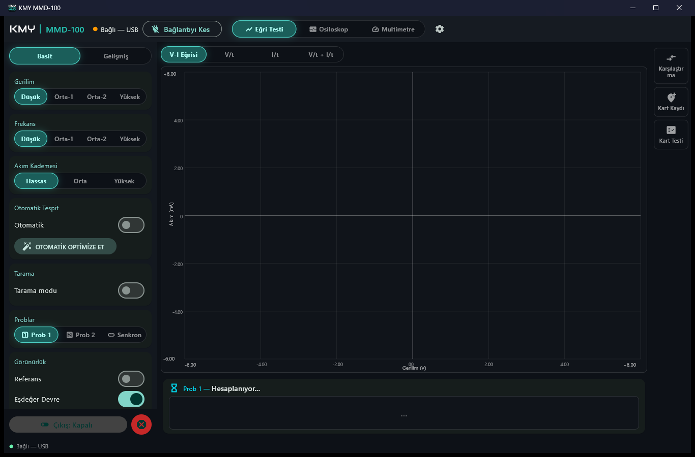

Sol panel ölçüm ayarlarını, orta alan grafiği, sağ panel ise **Karşılaştırma**, **Kart Kaydı** ve **Kart Testi** sekmelerini içerir.

Sinüs testinde cihaz bileşene AC gerilim uygular ve eş zamanlı ölçülen akımı gerilime karşı çizerek V-I eğrisini oluşturur. Direnç eğik bir doğru, kondansatör elips, diyot ise iletim bölgesinde belirgin bir kırılma oluşturur.

Eğri, ölçülen iki uç arasındaki elektriksel davranışı temsil eder. İki bağımsız prob, tek prob veya **Senkron** modda kullanılabilir.

### 8. Temel ölçüm ayarları

**Basit** görünümde gerilim, frekans ve akım kademesi seçilir. Gerilim ve frekans için **Düşük, Orta-1, Orta-2, Yüksek** seçenekleri bulunur.

| Kademe Adı | Gerilim (tepe değeri) | Frekans |
| :--- | :---: | :---: |
| **Düşük** | 2,5 V | 10 Hz |
| **Orta-1** | 5 V | 50 Hz |
| **Orta-2** | 10 V | 100 Hz |
| **Yüksek** | 15 V | 1000 Hz |

* **Gerilim:** Test sinyalinin tepe değeridir. Özelliği bilinmeyen bileşenlerde en düşük kademeden başlayın. Yarı iletken eklemin iletime geçmesi için gerekli eşik sağlanmıyorsa gerilimi kademeli artırın.
* **Frekans:** Reaktif bileşenlerin davranışını incelemeye yardımcı olur. İdeal bir direncin eğimi frekansla değişmez. Örneğin 100 nF kondansatörde 10 Hz'de dar görülen eğri, 1000 Hz'de daha belirgin bir elipse dönüşür.
* **Akım Kademesi:** Akım ölçüm hassasiyetini belirler.

| Kademe | Nerede kullanılır |
| :--- | :--- |
| **Hassas** | Kondansatörler, yüksek değerli dirençler ve çok az akım çeken hassas bileşenler. |
| **Orta** | Bilmediğiniz bir parçada güvenli başlangıç. |
| **Yüksek** | Düşük değerli dirençler, iletimdeki diyotlar ve yüksek akım çeken dayanıklı parçalar. |

Eğri tepesi kesiliyorsa veya sinyal sınırı uyarısı görülüyorsa test gerilimini düşürün ya da daha yüksek akım kademesi seçin. Çok düşük akımlı bileşenlerde **Yüksek** kademesi yatay bir eğri oluşturabilir; **Hassas** kademesine geçerek ölçümü tekrarlayın. Tek başına yatay eğri, bileşenin arızalı olduğunu göstermez.

### 9. Eğriyi okumak: bileşen imzaları galerisi

Sonuç kartı, ölçümden belirlenen bileşen türünü, hesaplanan değeri ve tespitin güven düzeyini gösterir. Aşağıdaki 12 örnek, eğrilerin yorumlanmasına yardımcı olur.

**Beklenen sapma**, mevcut ölçüm koşulunda referans multimetreye göre beklenen farkı gösterir; örneğin **Beklenen sapma +%2,19…+%3,01**. Gösterim, akım kademesi ve bileşen değerine bağlıdır. Koşullar desteklenen kapsamın dışındaysa, sürüş sinüs/AC değilse, iki probun yükleri çok farklıysa veya cihaz ölçüme hazır değilse sayısal değer yerine açıklama gösterilir. “Referans sınırının altında” ifadesi, farkın referans ölçümün tolerans sınırından küçük olduğunu belirtir.

KMY MMD-100 iki uç arasını ölçer. Transistör veya MOSFET gibi üç uçlu bileşenleri tek başına sınıflandırmaz; hangi uçların ölçüldüğünü kullanıcı belirlemelidir. Sonuç, seçilen iki uç arasındaki davranışı açıklar.

#### Direnç
Merkezden geçen eğik doğru oluşturur. Direnç azaldıkça eğim artar; arttıkça eğim azalır. İdeal dirençte eğim frekanstan bağımsızdır.

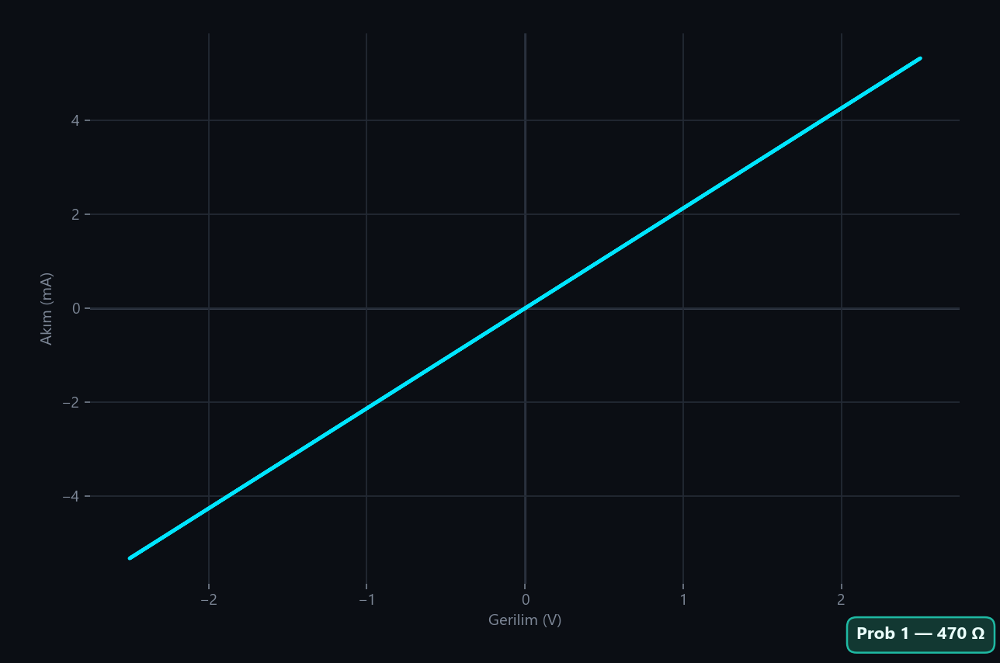

#### Kondansatör
Elips biçiminde eğri oluşturur. Frekans yükseldikçe elips genişler; düştükçe daralır.

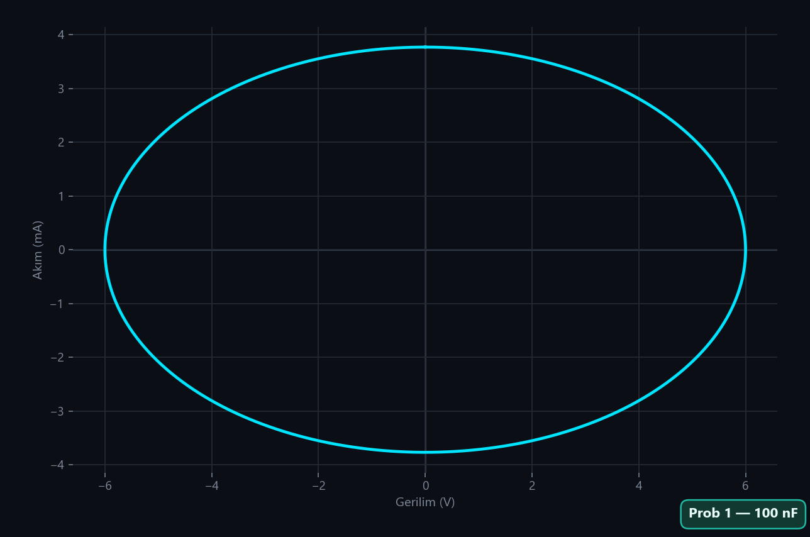

#### Bobin
Elips biçiminde eğri oluşturur. Kondansatörden farklı olarak frekans yükseldikçe elips daralır, düştükçe genişler.

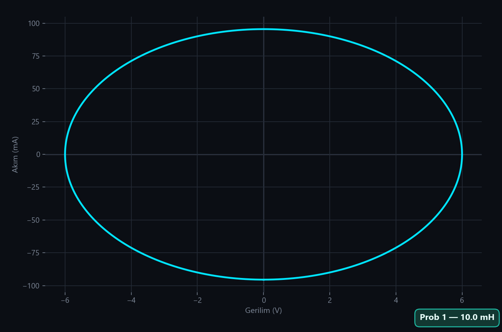

#### Kondansatör ve ESR
Seri direnç, kondansatörün elipsini eğimli hâle getirir. Sonuç kartı kapasite ile paralel ve seri direnç değerlerini ayrı gösterir.

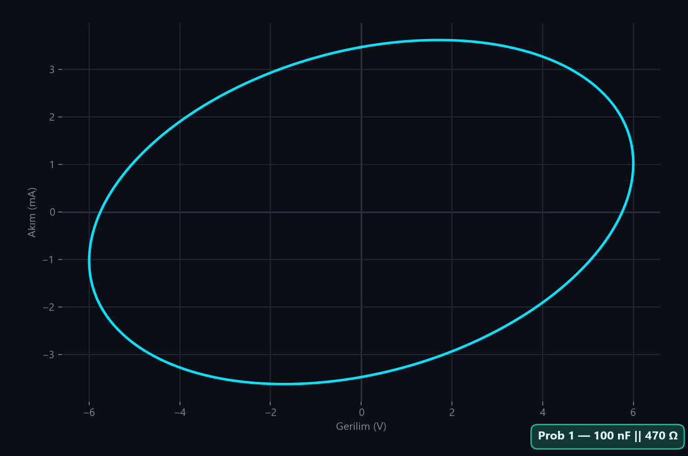

#### Diyot
Kesim bölgesi düz çizgi, iletim bölgesi belirgin bir kırılma oluşturur. Silisyum diyotta iletim eşiği yaklaşık 0,6 V - 0,7 V'tur. Schottky diyotlarda daha düşük, LED'lerde daha yüksek olabilir.

#### Zener diyot
İleri yönde iletim eşiği, ters yönde zener kırılma gerilimi görülür. Test gerilimi 15 V olduğundan bu sınırın üzerindeki kırılma gerilimleri gözlenemez.

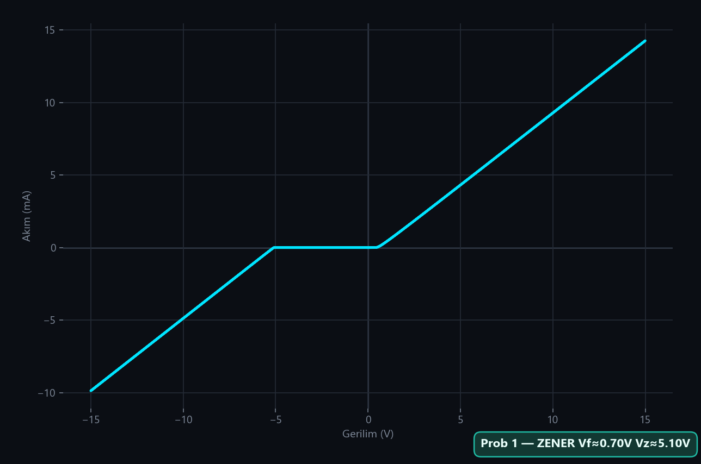

#### TVS diyot
Tek yönlü TVS'nin davranışı zener diyoda benzer ve sonuç kartında **ZENER** gösterilebilir. Çift yönlü TVS'nin simetrik kırılma davranışı için **|Z|** veya **Tanımsız** görülebilir; ayrı bir TVS sınıfı bulunmaz.

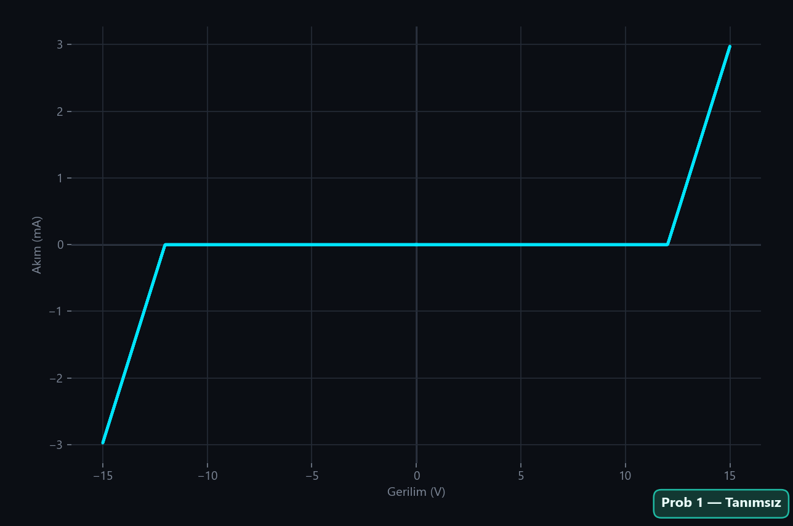

#### MOSFET gate-source uçları
Gate yalıtımı nedeniyle çok düşük akım oluşur. Küçük sinyal MOSFET'lerinde birkaç pikofaradlık kapasite ölçüm sınırının altında kalabilir ve **AÇIK DEVRE** gösterilebilir. Güç MOSFET'lerinde birkaç nanofaradlık kapasite, ince bir kondansatör eğrisi oluşturabilir. Açık devre sonucu tek başına arıza değildir.

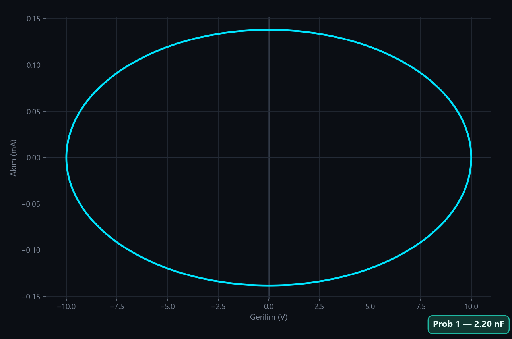

#### MOSFET drain-source uçları
Gate-source kısa devre edildiğinde veya gate boşta bırakıldığında gövde diyodunun davranışı gözlenebilir; sonuç kartında **DİYOT** gösterilir. İleri yön gerilimi sinyal diyodundan biraz yüksek olabilir.

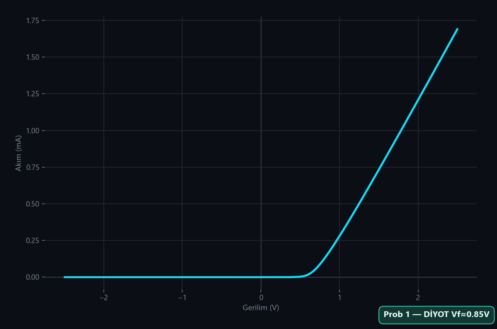

#### Transistör baz-emiter eklemi
Diyot davranışı gösterir ve **DİYOT** olarak tanımlanır. İleri yön gerilimi tipik olarak 0,65 V - 0,70 V aralığındadır.

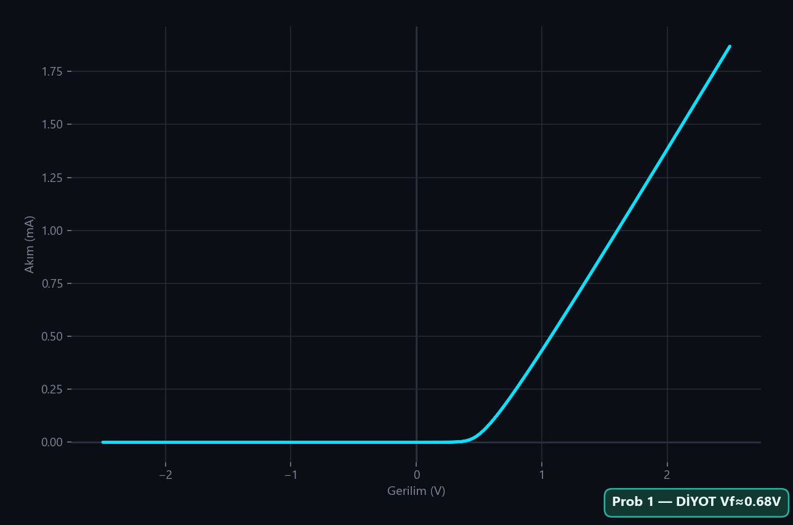

#### Transistör baz-kolektör eklemi
Diyot davranışı gösterir. İletim eşiği baz-emiter ekleminden biraz düşük olabilir; sonuç kartında **DİYOT** gösterilir.

#### Transistör kolektör-emiter uçları
Baz boşta olduğunda **AÇIK DEVRE** gösterilebilir. Baz sürüşü bulunmadığından bu sonuç tek başına arıza göstergesi değildir.

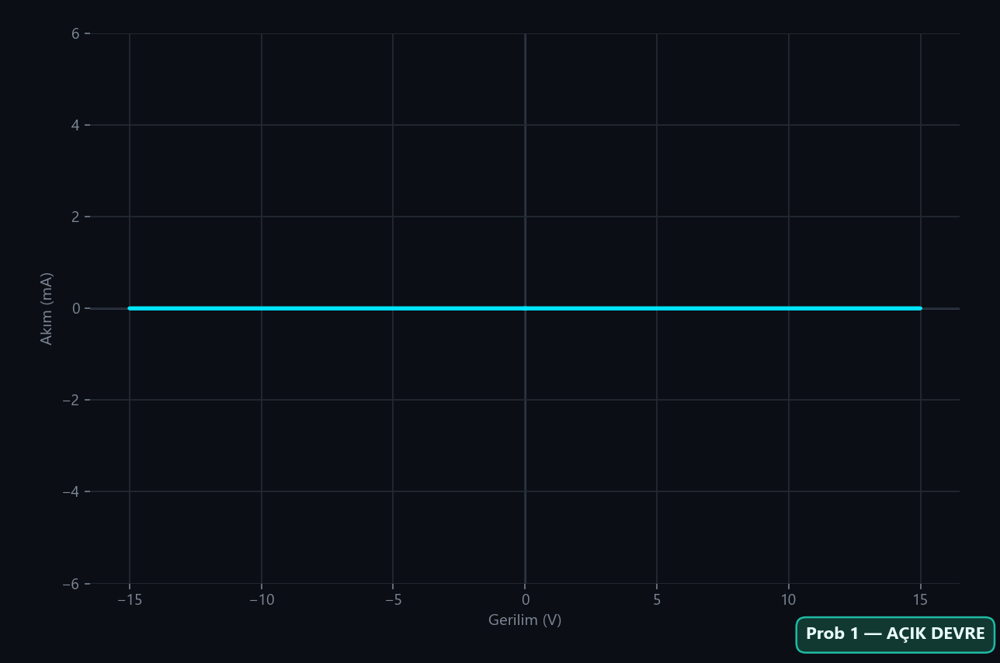

Devre üzerinde yapılan ölçüm, bileşene paralel yolların ortak etkisini içerir. Sonuç belirsizse bileşenin bir ucunu devreden ayırıp ölçümü tekrarlayın.

### 10. Gelişmiş ölçüm ayarları

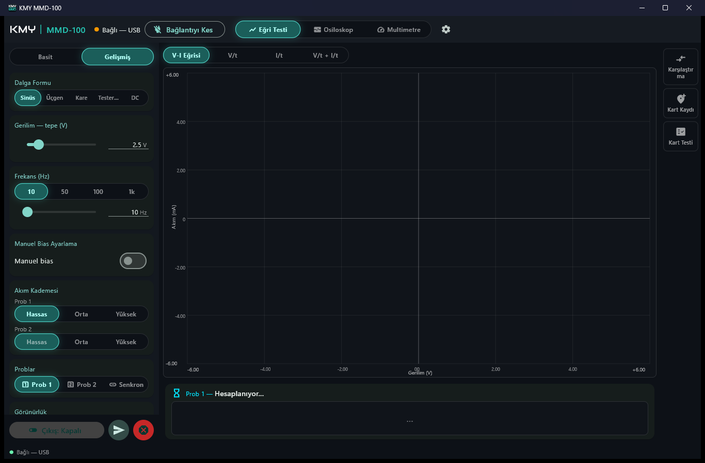

**Gelişmiş** görünümde gerilim 0,1 - 15 V, frekans 1 - 1000 Hz aralığında ayarlanabilir.

* **Dalga Formu:** Sinüs, Üçgen, Kare, Testere Dişi ve DC seçenekleri bulunur. Eğri analizi sinüs sinyaliyle yapılır; DC, sabit gerilim uygular.
* **Manuel Bias:** Test sinyalinin merkezini sıfırın üzerine veya altına kaydırır. Yön düğmesini basılı tutarak değeri değiştirebilir, adımı 0.010 V, 0.100 V veya 1.000 V seçebilirsiniz. **Sıfırla**, merkezi sıfıra döndürür. Bu işlev varsayılan olarak kapalıdır; özel bir test gerektirmedikçe kapalı tutun.
* **Akım Kademesi:** Prob 1 ve Prob 2 için bağımsız ayarlanır. Karşılaştırmada aynı kademeyi kullanın; farklı kademeler eğrilerin örtüşmesini etkiler.

Değişiklikler kontrol bırakıldığında cihaza aktarılır. **Uygula**, ayarları beklemeden gönderir.

* **Otomatik Tespit:** Bileşen tespitine göre gerilim, frekans ve akım kademesini otomatik seçer. Ayar değişikliği için en az üç ardışık aynı sonuç beklenir.
* **Otomatik Optimize Et (Auto-Optimize):** Uygun ayarları bir kez arar. Uygun sonuç bulunursa uygular; bulunmazsa mevcut ayarları korur.
* **Tarama Modu (Sweep):** Seçilen gerilim, frekans veya akım kademesini belirlenen aralıkta değiştirirken diğer ikisini sabit tutar. Frekansla değişen eğriler reaktif, değişmeyen eğriler direnç ağırlıklı davranışı değerlendirmeye yardımcı olur.

**Görünürlük sekmesi** içindeki **Referans**, kayıtlı eğriyi canlı ölçümle birlikte gösterir. **Eşdeğer Devre**, ölçümden çıkarılan basit devreyi çizer. **Dondur**, eğriyi ekranda sabitler.

### 11. Çift prob kullanımı ve senkron mod

**Prob 1** ve **Prob 2** modlarında test sinyali seçilen tek proba uygulanır. **Senkron** modda iki prob aynı test kaynağından eş zamanlı beslenir.

Prob yükleri belirgin biçimde farklıysa durum çubuğunda veya mobil bildirim panelinde sarı uyarı gösterilir. Bir prob boşta olduğunda diğer probun okumasında yaklaşık **%1** sapma oluşabileceği belirtilir. Uyarı, sonucu doğrudan geçersiz kılmaz; yük dengesinin değerlendirilmesi gerektiğini gösterir.

Hassas karşılaştırmalarda **Prob 1** veya **Prob 2** tek prob moduna geçerek ölçümü tamamlayın.

## Bölüm D — Karşılaştırma ve Kart Testi

### 12. Karşılaştırma fonksiyonları

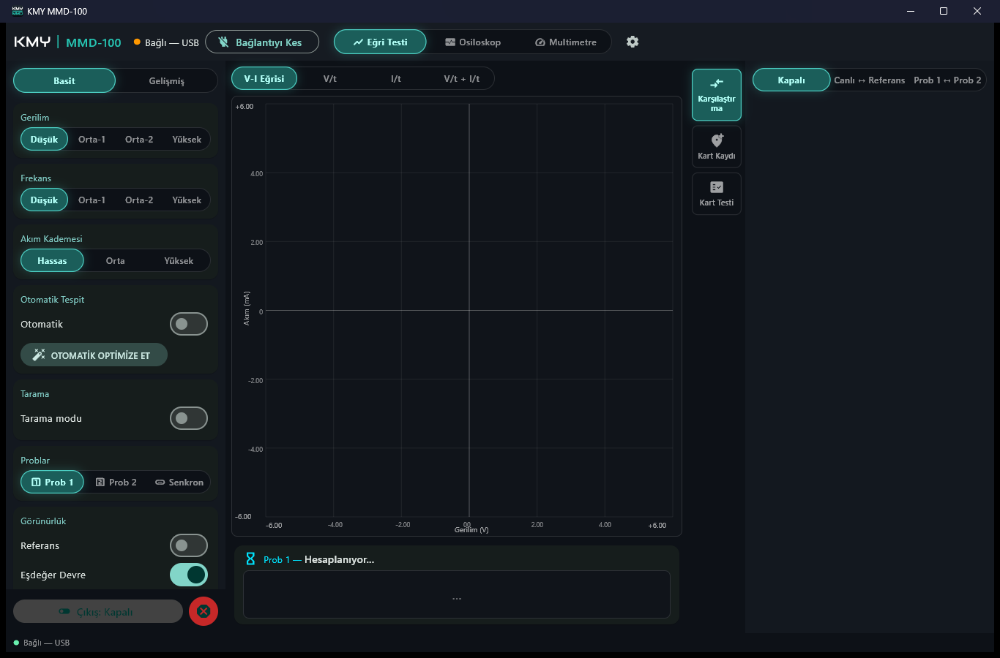

**Karşılaştırma** paneli üç çalışma seçeneği sunar:

* **Kapalı:** Karşılaştırmayı devre dışı bırakır.
* **Canlı ↔ Referans:** Canlı eğriyi kayıtlı referansla karşılaştırır. **Referansı Yakala**, mevcut eğriyi referans olarak alır. Referansı dosyaya kaydedebilir ve yeniden yükleyebilirsiniz.
* **Prob 1 ↔ Prob 2:** Sağlamlığı bilinen bileşen ile şüpheli bileşenin ölçümlerini doğrudan karşılaştırır. Eş zamanlı ölçüm, zaman ve ortam koşullarındaki değişimlerin etkisini azaltır.

Benzerlik oranı seçilen eşikle karşılaştırılır. Eşiğin üzerindeki sonuç **EŞLEŞTİ**, altındaki sonuç **EŞLEŞMEDİ** olarak gösterilir. Varsayılan eşik **%90**'dır. **Kritik Bölge Hassasiyeti** seçenekleri Kapalı, Normal ve Yüksek'tir; eğrinin kırılma bölgelerindeki farkları daha ayrıntılı değerlendirir.

Ölçülebilir akım yoksa **ÖLÇÜM YOK** gösterilir. Prob temasını ve akım kademesini kontrol edin. **Sesli Uyarı**, sonuç eşleşmeden eşleşmemeye veya tersine değiştiğinde ses verir.

Eşleşmeme sonucu, test noktasının referanstan farklı olduğunu gösterir. Arıza değerlendirmesini devre yapısı ve diğer ölçümlerle birlikte yapın.

### 13. Kart kaydı ve kart testi sistemi

Kart kaydı, aynı model kartların onarım ve üretim kontrollerinde kullanılacak referans test planını oluşturur.

#### Kart referansını kaydetme

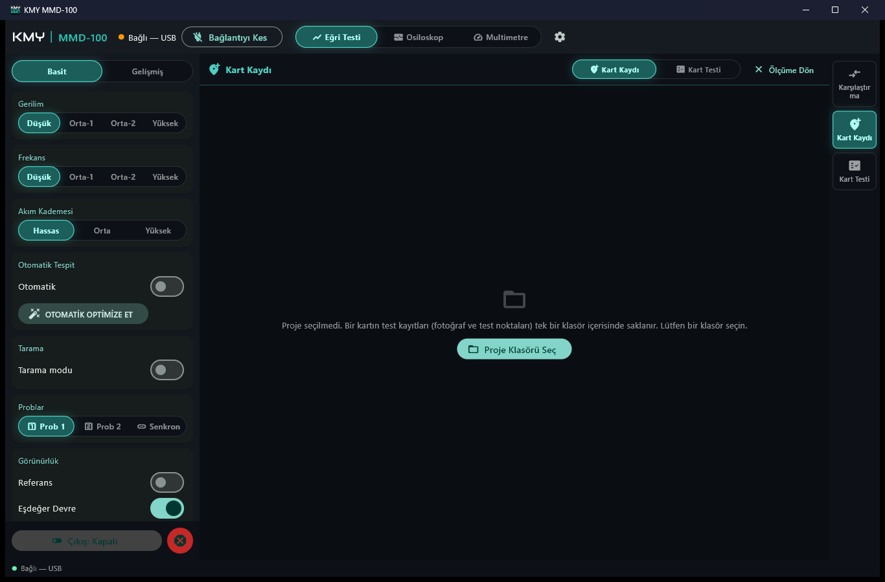

1. **Proje klasörü oluşturun.** Kart fotoğrafı ve test noktaları aynı klasörde saklanır. Klasörü başka bilgisayara kopyalayarak projeyi açabilirsiniz.
2. **Kart görseli ekleyin.** Üstten çekilmiş, net ve gölgesiz fotoğraf kullanın.
3. **Noktaları tanımlayın.** Probu test noktasına temas ettirin, fotoğraftaki karşılığını seçin ve R14, C7 veya U3-1 gibi bir ad verin. **Noktayı Kaydet** düğmesine basın.
4. **Sırayı düzenleyin.** Noktaları sürükleyip bırakarak test sırasını belirleyin.

**Çok Kademeli İmza (Multi-Stage Signature)**, her noktayı 3 veya 4 farklı gerilim ve frekans kademesinde kaydeder. Kayıt süresi uzar; karşılaştırma farklı test koşullarını kapsar.

#### Kayıtlı kartı test etme

**Testi Başlat** düğmesine basın ve probları sırasıyla noktalara temas ettirin. Her ölçüm referansla karşılaştırılarak “Geçti” veya “Kaldı” olarak işaretlenir. Uyumsuz noktalar fotoğraf üzerinde **kırmızı işaretçilerle** gösterilir.

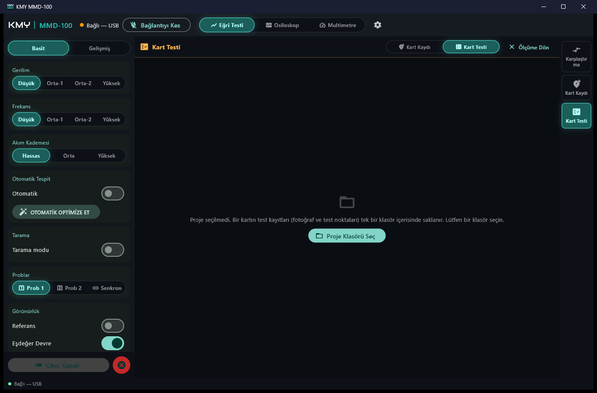

Testi duraklatabilir veya nokta atlayabilirsiniz. **Kalanları Test Et**, ölçülmemiş noktaları tamamlar. **Oto Mod (otomatik ilerleme)**, eşleşen noktadan sonra bir sonraki noktaya geçer.

**Excel raporu**, üç çalışma sayfasında nokta bazında ölçüm ayrıntılarını, özet tabloyu ve geçti/kaldı haritasını bir araya getirir.

## Bölüm E — Osiloskop ve Multimetre

### 14. Osiloskop modu

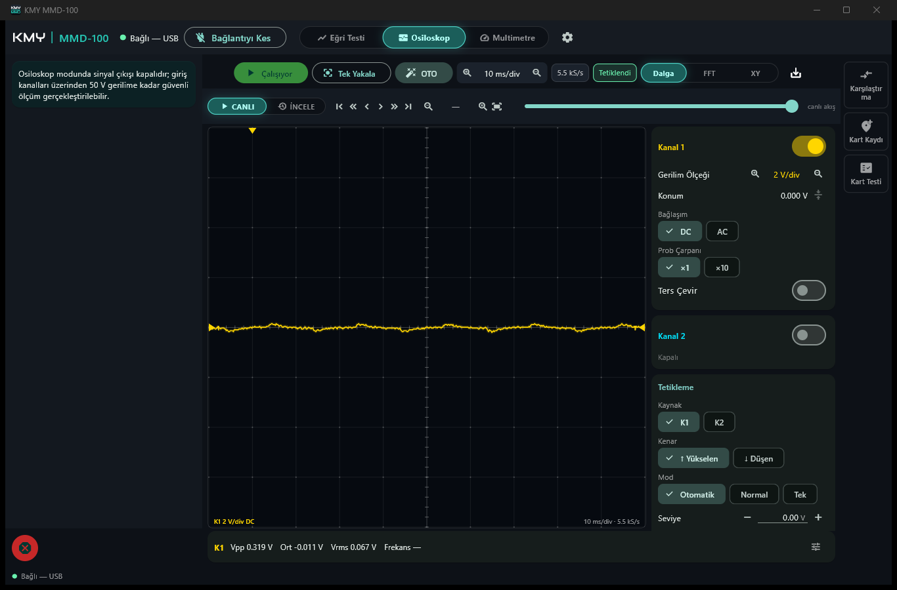

Osiloskop modunda test sinyali üreteci kapanır; problar dışarıdan gelen sinyali ölçer. Giriş sınırı **50 V**'tur. Kanal 1 **sarı**, Kanal 2 **camgöbeği** renktedir. Eğri testinde Prob 1 camgöbeği, Prob 2 sarıdır.

Örnekleme hızı **5,5 kS/s**, yani saniyede 5500 örnektir ve sabittir. Zaman tabanı yalnız görüntülenen zaman aralığını değiştirir. Cihaz **alçak frekans osiloskobu** olarak kullanılmalıdır; 1 kHz üzerindeki sinyallerde dalga şekli doğruluğu güvenilir değildir. Güç kaynağı dalgalanması ve uygun frekanstaki motor sürücü çıkışları bu sınırlar içinde incelenebilir.

* **OTO (otomatik kurulum):** Zaman tabanı, gerilim ölçeği ve tetikleme eşiğini sinyale göre ayarlar. Anlamlı sinyal bulunmazsa mevcut ayarları korur.
* **Otomatik (Auto):** Tetikleme olmasa da ekranı yeniler.
* **Normal:** Yalnız tetikleme koşulu oluştuğunda ekranı yeniler.
* **Tek (Single):** Sinyali bir kez yakalar ve görüntüyü sabitler.

Taban çizgisi ve tetikleme göstergelerini fareyle sürükleyebilirsiniz. **İncele**, akışı durdurarak arka planda sürekli kaydedilen **son 20 saniyeyi** incelemenizi sağlar.

Alt çubukta **Vpp**, **Ort**, **Vrms** ve **Frekans** gösterilir. Toplam **11 ölçüm parametresi** arasından görünür değerleri seçebilirsiniz. Gerilimler volt cinsinden, noktadan sonra üç haneyle gösterilir.

### 15. Multimetre modu

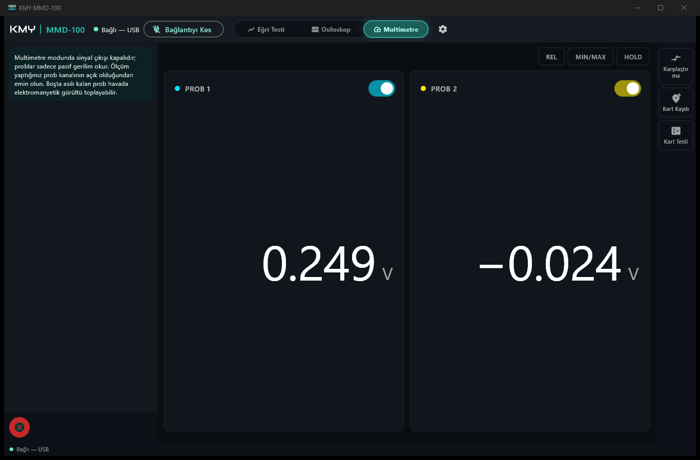

İki prob birbirinden bağımsız ve eş zamanlı gerilim ölçer. KMY MMD-100, AC/DC türünü ve ölçüm kademesini otomatik belirler. Değerler volt (V) cinsinden üç ondalık haneyle gösterilir; örneğin **0.068 V**. Prob kartının sağ üstündeki anahtar ilgili kanalı açar veya kapatır.

* **REL (bağıl ölçüm):** Seçildiği andaki değeri referans sıfır kabul ederek sonraki farkları gösterir.
* **MIN/MAX:** Ölçümün en düşük ve en yüksek değerlerini izler.
* **HOLD:** Görüntülenen değeri sabitler.

Bu modda test sinyali çıkışı kapalıdır. Ölçülecek kanalı açın. Boşta kalan probun gösterdiği değer, ortamdan alınan elektromanyetik gürültü olabilir.

## Bölüm F — Sistem Ayarları ve Bağlantı

### 16. Sistem ayarları

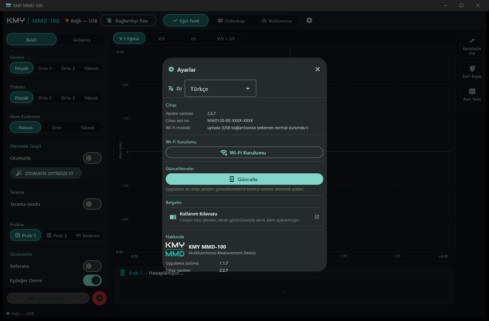

Üst çubuktaki dişli simgesinden **Ayarlar** panelini açın. Türkçe, İngilizce, Almanca, İspanyolca ve Fransızca dil seçenekleri bulunur.

Panelde cihazın yazılım sürümü ve seri numarası, Wi-Fi araçları ve bu kılavuzun bağlantısı yer alır. Uygulama sürümünü **Hakkında** bölümünde görüntüleyebilirsiniz. **Güncelle**, uygulama ve cihaz yazılımı sürümlerini denetler. Cihaz yazılımı güncellemesi için USB bağlantısı gerekir.

### 17. Kablosuz kullanım ve Wi-Fi kurulumu

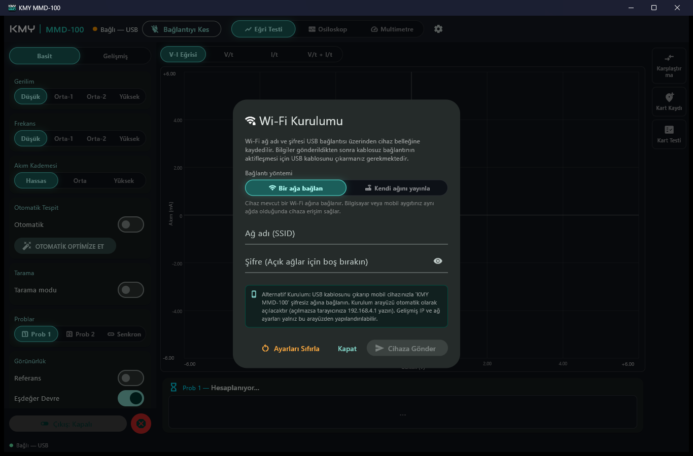

Wi-Fi için iki bağlantı seçeneği bulunur:

1. **İstasyon modu (Station):** Cihaz mevcut ağa katılır. Bilgisayar veya mobil cihaz aynı ağ üzerinden bağlanır.
2. **Erişim noktası modu (Access Point - AP):** Cihaz kendi ağını oluşturur. Bilgisayar veya mobil cihaz doğrudan bu ağa bağlanır.

#### Uygulamadan Wi-Fi kurulumu

USB bağlantısı açıkken **Ayarlar → Wi-Fi Kurulumu** bölümünü açın. Modu seçin, SSID ve parolayı girin, ayarları cihaza gönderin.

#### Tarayıcıdan Wi-Fi kurulumu

Varsayılan erişim noktası **KMY MMD-100** adlı ağı yayınlar. Telefon veya bilgisayarla bu ağa bağlanın. Kurulum sayfası otomatik açılmazsa tarayıcıya **192.168.4.1** yazın. Sabit IP gibi gelişmiş ağ ayarları yalnız web arayüzünde bulunur. Kablosuz bağlantı sırasında cihaz beslemesinin devam etmesi gerekir.

#### Cihaz ağda görünmüyorsa

**Cihaz adresini elle gir** simgesinden IP adresini yazın. Bazı yönlendiriciler ağdaki cihazların birbirini bulmasını engelleyebilir. IP adresini yönlendiricinin cihaz listesinden veya cihazın web arayüzünden öğrenebilirsiniz. Android'de elle IP girişi bağlantı ekranının altındadır.

Cihaz aynı anda tek bağlantı kabul eder; başka istemci bağlıysa **MEŞGUL** görünür. **Ağ Ayarlarını Sıfırla**, kablosuz ayarları varsayılanlara döndürür.

### 18. Mobil cihazlarda (telefon/tablet) kullanım

Android uygulaması, Windows sürümünün ölçüm, analiz ve test işlevlerini mobil yerleşimle sunar.

* **Üst durum şeridi:** Dokunarak veya aşağı kaydırarak açılır. Bağlantı kalitesi, uyarılar ve kontrol kilitlerinin nedenlerini gösterir. **Araçlar**, **Ayarlar** ve **Bağlan/Bağlantıyı Kes** kısayollarını içerir; kritik uyarıda otomatik açılır.
* **Alt kontrol şeridi:** Dokunarak veya yukarı kaydırarak açılır ve bırakılan yükseklikte kalır. Ölçüm ayarları ile Eğri Testi, Osiloskop, Multimetre ve Gerilim, Frekans, Akım Kademesi kısayollarını içerir.

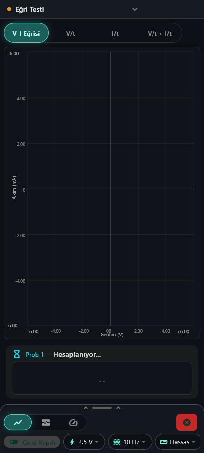

**Karşılaştırma**, **Kart Kaydı** ve **Kart Testi**, **Araçlar** altında; genel ayarlar **Ayarlar** altında bulunur. **Bağlantı Paneli**, ağ taraması, cihazın kendi ağına bağlantı ve elle IP girişi sunar.

Mobilde cihaz yazılımı güncellenmez. **Güncelle**, mobil uygulamanın yeni sürümünü indirir ve Android kurulum ekranını açar.

### 19. Yazılım güncellemeleri

**Ayarlar → Güncelle**, uygulama ve KMY MMD-100 cihaz yazılımı sürümlerini kontrol eder. Uygulama güncellemesi sırasında kurulum başlatılır; uygulamanın kapanıp güncel sürümle yeniden açılması normaldir.

* Uygulama güncellemesi için cihaz bağlantısı gerekmez.
* Cihaz yazılımı güncellemesi yalnız bilgisayardan, fiziksel **USB kablosu** bağlıyken yapılır. Wi-Fi veya mobil uygulama üzerinden yapılamaz.
* Güncelleme denetimi için internet bağlantısı gerekir. Bağlantı yoksa uygulama bilgi verir ve mevcut kurulum korunur.

## Bölüm G — Referans Bilgiler

### 20. Teknik sınırlar ve parametreler

| Parametre | Değer |
| :--- | :--- |
| **Test gerilimi** | $\pm 15\text{ V}$ tepe (peak) |
| **Test frekansı** | $1\text{ Hz} - 1000\text{ Hz}$ |
| **Osiloskop / voltmetre giriş sınırı** | En çok $50\text{ V}$ |
| **Osiloskop örnekleme hızı** | $5,5\text{ kS/s}$ (donanımda sabit) |
| **Osiloskop kayıt derinliği** | Son $20\text{ saniye}$, kesintisiz |
| **Besleme** | USB portundan |

**Güvenlik ve çalışma kuralları**

* Eğri testinde kartın enerjisini kesin ve yüksek kapasiteli kondansatörlerin boşalmasını bekleyin.
* Test sinyali yalnız **Eğri Testi** modunda üretilir. Osiloskop ve Multimetre modlarında çıkış üreteci kapalıdır.
* Ekrandaki **kırmızı acil durdurma (Emergency Stop)**, bağlantı açıkken test çıkış gerilimini derhâl keser.
* Açılış hazırlığı tamamlanmadan test çıkışı açılamaz.
* Cihaz **220 V AC şebeke gerilimi** için tasarlanmamıştır. Probları prize veya yüksek gerilim hatlarına bağlamayın.

### 21. Sık karşılaşılan sorunlar ve çözümleri

* **Cihaz listede görünmüyor:** USB kablosunu ve bilgisayar portunu kontrol edin. Wi-Fi kullanımında aynı ağı doğrulayın ve gerekirse IP adresini elle girin.
* **Bağlantı sonrası kontroller kilitli:** Açılış hazırlığının tamamlanması için 13-15 saniye bekleyin.
* **Test çıkışı açılmıyor:** Açılış hazırlığını bekleyin. Cihazı kapatıp açın; sorun sürerse KMY Electronics destek ekibiyle iletişime geçin.
* **Eğri yatay çizgi gösteriyor:** Prob temasını, test gerilimini ve akım kademesini kontrol edin. Gerekirse gerilimi bir kademe artırın veya daha hassas akım kademesi seçin.
* **Senkron modda sarı uyarı:** Prob yükleri farklı veya bir prob boşta olabilir. Hassas ölçüm için tek prob moduna geçin.
* **ÖLÇÜM YOK:** Teması kontrol edin. Yüksek empedanslı bileşenlerde **Hassas** kademesini deneyin.
* **MEŞGUL:** Başka istemci bağlıdır. Diğer bilgisayar veya mobil cihazdaki bağlantıyı kapatın.
* **Ölçümlerde kayma:** Cihazı kapatıp açın. Kayma veya uyarı sürerse KMY Electronics destek ekibiyle iletişime geçin.
* **Osiloskopta bozuk dalga şekli:** Sinyal frekansını kontrol edin. 5,5 kS/s örnekleme hızında 1 kHz üzerindeki dalga şekilleri güvenilir biçimde incelenemez.
* **Mobilde cihaz bulunamıyor:** Telefon ve cihazın aynı ağda olduğunu doğrulayın. AP modunda telefonun **KMY MMD-100** ağına bağlı olması gerekir.

### 22. Teknik destek ve iletişim

Teknik sorular ve destek talepleri için KMY Electronics ile iletişime geçin:

* [GitHub ürün sayfası](https://github.com/kmyelectronicseu-png/kmy-mmd1)
* [kmyelectronics.eu@gmail.com](mailto:kmyelectronics.eu@gmail.com)

Başvurunuzda cihaz numarasını, uygulama sürümünü ve sorunun açıklamasını paylaşın. Cihaz numarası **Ayarlar** panelindeki **Cihaz seri no** satırındadır.
